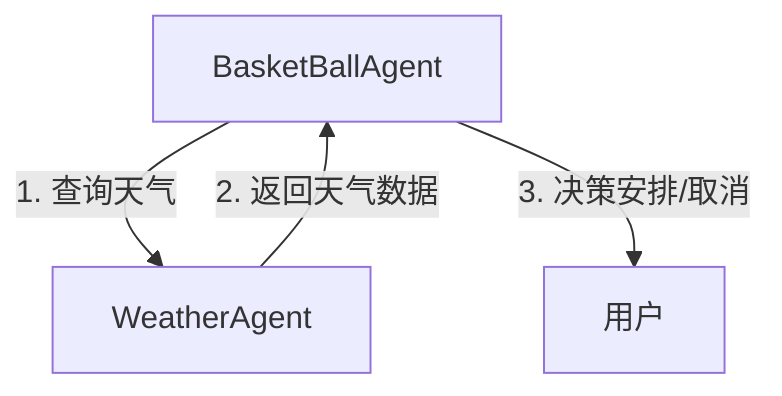

'''
程序说明：
## 1. 本文档详细介绍了WeatherAgent.py和BasketBallAgent.py两个智能体的功能、接口、交互流程及使用示例。
## 2. 适用于理解A2A智能体间调用、天气查询与篮球活动决策的实现方式。
'''

# WeatherAgent.py & BasketBallAgent.py 说明文档

---

## 一、WeatherAgent.py 说明

### 1. 功能简介
WeatherAgent 是一个基于 FastAPI 实现的天气智能体，支持通过标准A2A协议查询指定日期的天气信息。当前仅支持“北京”地区的天气数据。

### 2. 主要接口说明
- `/.well-known/agent.json`：GET，返回智能体能力描述（Agent Card），包括支持的接口、输入参数、认证方式等。
- `/api/tasks/weather`：POST，接收天气查询任务请求，返回指定日期的天气信息。

### 3. 关键类与数据结构
- `WeatherTaskRequest`：Pydantic模型，描述任务请求体，包括`task_id`和`params`（参数字典）。
- `weather_db`：模拟天气数据库，存储日期与天气信息的映射。

### 4. 主要流程
1. 客户端通过POST `/api/tasks/weather`提交查询任务，参数包括日期（date）和地点（location，当前仅支持“北京”）。
2. 服务端校验参数，查找对应天气数据，返回结果。
3. 若日期无效或不在数据库中，返回400错误。

### 5. 示例请求
```json
POST /api/tasks/weather
{
  "task_id": "123456",
  "params": {
    "date": "2025-05-08",
    "location": "北京"
  }
}
```

### 6. 示例响应
```json
{
  "task_id": "123456",
  "status": "completed",
  "artifact": {
    "date": "2025-05-08",
    "weather": {
      "temperature": "25℃",
      "condition": "雷阵雨"
    }
  }
}
```

---

## 二、BasketBallAgent.py 说明

### 1. 功能简介
BasketBallAgent 是一个用于决策篮球活动安排的智能体。它通过A2A协议调用WeatherAgent，判断指定日期是否适合进行篮球活动。

### 2. 主要类与方法
- `BasketBallAgent`：主类，包含如下方法：
  - `__init__`：初始化，设置WeatherAgent服务地址和API Key。
  - `_create_task(target_date)`：构造A2A标准任务对象。
  - `check_weather(target_date)`：通过A2A协议调用WeatherAgent，获取天气信息。
  - `schedule_meeting(date)`：综合决策逻辑，根据天气情况决定是否安排篮球活动。

### 3. 交互流程
1. 调用`schedule_meeting(date)`，内部先通过`check_weather(date)`向WeatherAgent发起天气查询。
2. WeatherAgent返回指定日期的天气信息。
3. 若天气状况不含“雨”或“雪”，则返回“confirmed”，否则返回“cancelled”。
4. 若查询失败，返回“error”及详细信息。

### 4. 使用示例
```python
if __name__ == "__main__":
    meeting_agent = BasketBallAgent()
    match_date = "2025-05-11"
    result = meeting_agent.schedule_meeting(match_date)
    print(match_date, "篮球安排结果:", result)
```

### 5. 典型输出
```
2025-05-11 篮球安排结果: {'status': 'error', 'detail': '天气查询失败: {"detail":"无效日期参数"}'}
```

---

## 三、A2A智能体交互流程图



---

## 四、注意事项
- WeatherAgent 仅支持预设的日期和“北京”地区。
- 需保证WeatherAgent服务已启动并监听8000端口。
- API Key需与WeatherAgent配置一致。
- 若需扩展支持更多城市或日期，请完善weather_db。

---

## 五、版本与扩展建议
- 当前为1.0.0版本，适合A2A协议与智能体交互的基础演示。
- 可扩展支持更多天气数据源、城市、认证方式等。 