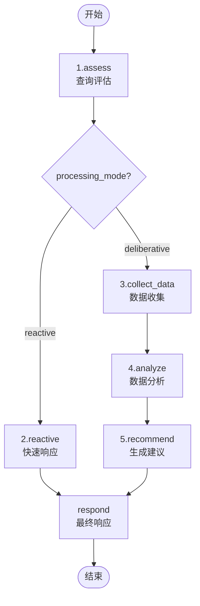
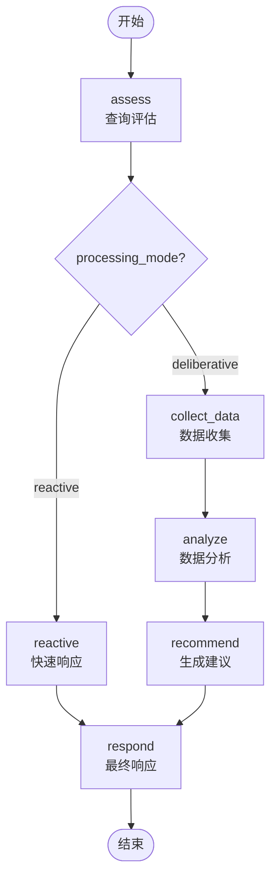

# 5个函数的调用关系图

# 5个function的横向比较。

```python
# 第一阶段：情境评估 - 确定查询类型和处理模式
def assess_query(state: WealthAdvisorState) -> WealthAdvisorState:
    print("[DEBUG] 进入节点: assess_query")
    """评估用户查询，确定类型和处理模式"""
    
    try:
        # 准备提示
        prompt = ChatPromptTemplate.from_template(ASSESSMENT_PROMPT)
        
        # 构建输入
        input_data = {
            "user_query": state["user_query"],
        }
        
        # 调用LLM
        chain = prompt | llm | JsonOutputParser()
        result = chain.invoke(input_data)
        print("[DEBUG] LLM评估输出:", result)
        print(f"[DEBUG] 分支判断: processing_mode={result.get('processing_mode', '未知')}, query_type={result.get('query_type', '未知')}")
        # 获取处理模式，确保有值
        processing_mode = result.get("processing_mode", "reactive")
        if processing_mode not in ["reactive", "deliberative"]:
            processing_mode = "reactive"  # 默认使用反应式处理
        # 获取查询类型，确保有值
        query_type = result.get("query_type", "emergency")
        if query_type not in ["emergency", "informational", "analytical"]:
            query_type = "emergency"  # 默认为紧急查询
        # ==========================
        # 更新状态
        updated_state = {
            **state,
            "query_type": query_type,
            "processing_mode": processing_mode,
        }
        return updated_state
    except Exception as e:
        return {
            **state,
            "error": f"评估阶段出错: {str(e)}",
            "final_response": "评估查询时发生错误，无法处理您的请求。"
        }

# 反应式处理 - 快速响应简单查询
def reactive_processing(state: WealthAdvisorState) -> WealthAdvisorState:
    print("[DEBUG] 进入节点: reactive_processing")
    """反应式处理模式，提供快速响应，支持工具调用"""
    try:
        # 定义工具列表
        tools = [
            Tool(
                name="上证指数查询",
                func=query_shanghai_index,
                description="用于查询上证指数的最新行情，输入内容可为空或任意字符串"
            ),
        ]
        # 可扩展：此处可继续添加其他反应式工具

        # 构建Agent提示模板
        class SimplePromptTemplate(StringPromptTemplate):
            def format(self, **kwargs):
                return f"用户问题: {kwargs['input']}\n请根据需要调用工具，直接给出答案。"

        prompt = SimplePromptTemplate(input_variables=["input", "intermediate_steps"])
        llm_chain = LLMChain(llm=llm, prompt=prompt)
        tool_names = [tool.name for tool in tools]

        # 修正：继承AgentOutputParser，确保兼容性
        class SimpleOutputParser(AgentOutputParser):
            def parse(self, text):
                # 直接将LLM输出作为最终答案
                return AgentFinish(return_values={"output": text.strip()}, log=text)

        output_parser = SimpleOutputParser()
        agent = LLMSingleActionAgent(
            llm_chain=llm_chain,
            output_parser=output_parser,
            stop=["\nObservation:"],
            allowed_tools=tool_names,
        )
        agent_executor = AgentExecutor.from_agent_and_tools(
            agent=agent, tools=tools, verbose=False
        )
        # 运行Agent
        user_query = state["user_query"]
        result = agent_executor.run(user_query)
        return {
            **state,
            "final_response": result
        }
    except Exception as e:
        return {
            **state,
            "error": f"反应式处理出错: {str(e)}",
            "final_response": "处理您的查询时发生错误，无法提供响应。"
        }

# 数据收集 - 收集进行深度分析所需的数据
def collect_data(state: WealthAdvisorState) -> WealthAdvisorState:
    print("[DEBUG] 进入节点: collect_data")
    """收集市场数据和客户信息进行深入分析"""
    
    try:
        # 准备提示
        prompt = ChatPromptTemplate.from_template(DATA_COLLECTION_PROMPT)
        
        # 构建输入
        input_data = {
            "user_query": state["user_query"],
            "customer_profile": json.dumps(state.get("customer_profile", {}), ensure_ascii=False, indent=2)
        }
        
        # 调用LLM
        chain = prompt | llm | JsonOutputParser()
        result = chain.invoke(input_data)
        
        # 更新状态
        return {
            **state,
            "market_data": result.get("collected_data", {}),
            "current_phase": "analyze"
        }
    except Exception as e:
        return {
            **state,
            "error": f"数据收集阶段出错: {str(e)}",
            "current_phase": "collect_data"  # 保持在当前阶段
        }

# 深度分析 - 分析数据和客户情况
def analyze_data(state: WealthAdvisorState) -> WealthAdvisorState:
    print("[DEBUG] 进入节点: analyze_data")
    """进行深度投资分析"""
    
    try:
        # 确保必要数据已收集
        if not state.get("market_data"):
            return {
                **state,
                "error": "分析阶段缺少市场数据",
                "current_phase": "collect_data"  # 回到数据收集阶段
            }
        
        # 准备提示
        prompt = ChatPromptTemplate.from_template(ANALYSIS_PROMPT)
        
        # 构建输入
        input_data = {
            "user_query": state["user_query"],
            "customer_profile": json.dumps(state.get("customer_profile", {}), ensure_ascii=False, indent=2),
            "market_data": json.dumps(state.get("market_data", {}), ensure_ascii=False, indent=2)
        }
        
        # 调用LLM
        chain = prompt | llm | JsonOutputParser()
        result = chain.invoke(input_data)
        
        # 更新状态
        return {
            **state,
            "analysis_results": result,
            "current_phase": "recommend"
        }
    except Exception as e:
        return {
            **state,
            "error": f"分析阶段出错: {str(e)}",
            "current_phase": "analyze"  # 保持在当前阶段
        }

# 生成建议 - 根据分析结果提供投资建议
def generate_recommendations(state: WealthAdvisorState) -> WealthAdvisorState:
    print("[DEBUG] 进入节点: generate_recommendations")
    """生成投资建议和行动计划"""
    
    try:
        # 确保分析结果已存在
        if not state.get("analysis_results"):
            return {
                **state,
                "error": "建议生成阶段缺少分析结果",
                "current_phase": "analyze"  # 回到分析阶段
            }
        
        # 准备提示
        prompt = ChatPromptTemplate.from_template(RECOMMENDATION_PROMPT)
        
        # 构建输入
        input_data = {
            "user_query": state["user_query"],
            "customer_profile": json.dumps(state.get("customer_profile", {}), ensure_ascii=False, indent=2),
            "analysis_results": json.dumps(state.get("analysis_results", {}), ensure_ascii=False, indent=2)
        }
        
        # 调用LLM
        chain = prompt | llm | StrOutputParser()
        result = chain.invoke(input_data)
        
        # 更新状态
        return {
            **state,
            "final_response": result,
            "current_phase": "respond"
        }
    except Exception as e:
        return {
            **state,
            "error": f"建议生成阶段出错: {str(e)}",
            "current_phase": "recommend"  # 保持在当前阶段
        }
```

以下是代码中不同函数的横向比较表格：

| 功能/特性         | assess_query (情境评估)                            | reactive_processing (反应式处理)              | collect_data (数据收集)              | analyze_data (深度分析)                       | generate_recommendations (生成建议)                |
| ----------------- | -------------------------------------------------- | --------------------------------------------- | ------------------------------------ | --------------------------------------------- | -------------------------------------------------- |
| **主要目的**      | 确定查询类型和处理模式                             | 快速响应简单查询（支持工具调用）              | 收集市场数据和客户信息               | 分析数据和客户情况                            | 根据分析结果提供投资建议                           |
| **输入依赖**      | 用户查询(user_query)                               | 用户查询(user_query)                          | 用户查询和客户资料(customer_profile) | 用户查询、客户资料和市场数据(market_data)     | 用户查询、客户资料和分析结果(analysis_results)     |
| **处理模式**      | 纯LLM链式调用（ChatPromptTemplate）                | 工具增强型Agent（LLMSingleActionAgent）       | 纯LLM链式调用（ChatPromptTemplate）  | 纯LLM链式调用（ChatPromptTemplate）           | 纯LLM链式调用（ChatPromptTemplate）                |
| **工具/模板**     | ASSESSMENT_PROMPT                                  | 自定义SimplePromptTemplate + 上证指数查询工具 | DATA_COLLECTION_PROMPT               | ANALYSIS_PROMPT                               | RECOMMENDATION_PROMPT                              |
| **Chain定义方式** | prompt \| llm \| JsonOutputParser()                | AgentExecutor工具调用                         | prompt \| llm \| JsonOutputParser()  | prompt \| llm \| JsonOutputParser()           | prompt \| llm \| StrOutputParser()                 |
| **LLM调用方式**   | chain.invoke(input_data)                           | agent_executor.run(user_query)                | chain.invoke(input_data)             | chain.invoke(input_data)                      | chain.invoke(input_data)                           |
| **输出解析器**    | JsonOutputParser                                   | AgentFinish（直接返回文本）                   | JsonOutputParser                     | JsonOutputParser                              | StrOutputParser                                    |
| **关键输出**      | query_type, processing_mode                        | final_response（直接响应文本）                | market_data                          | analysis_results                              | final_response                                     |
| **错误处理**      | 设置默认值(reactive/emergency)                     | 返回错误消息和默认响应                        | 保持在当前阶段(current_phase)        | 返回数据收集阶段                              | 返回分析阶段                                       |
| **状态更新字段**  | query_type, processing_mode                        | final_response, error                         | market_data, current_phase           | analysis_results, current_phase               | final_response, current_phase                      |
| **阶段控制**      | 无                                                 | 无（直接结束流程）                            | 设置下一阶段为"analyze"              | 设置下一阶段为"recommend"                     | 设置下一阶段为"respond"                            |
| **数据验证**      | 验证processing_mode和query_type的合法性            | 无                                            | 无                                   | 检查market_data是否存在                       | 检查analysis_results是否存在                       |
| **JSON处理**      | 无                                                 | 无                                            | 对customer_profile进行JSON序列化     | 对customer_profile和market_data进行JSON序列化 | 对customer_profile和analysis_results进行JSON序列化 |
| **调试信息**      | 输出processing_mode和query_type                    | 输出节点进入日志                              | 输出节点进入日志                     | 无                                            | 无                                                 |
| **默认值设置**    | processing_mode="reactive", query_type="emergency" | 无                                            | 无                                   | 无                                            | 无                                                 |
| **扩展性**        | 需修改提示模板                                     | 可通过tools列表添加更多工具                   | 需修改提示模板                       | 需修改提示模板                                | 需修改提示模板                                     |


补充说明：
1. 所有函数都遵循相似的结构：准备提示→构建输入→调用LLM→处理结果→更新状态
2. 错误处理方面，所有函数都捕获异常并返回包含错误信息的状态更新
3. 阶段控制方面，除assess_query外，其他函数都通过current_phase控制流程走向
4. 数据验证方面，analyze_data和generate_recommendations会检查前置数据是否存在


## reactive_processing 和其他函数的关键区别
```python
# reactive_processing 工具调用核心：agent = LLMSingleActionAgen()
# 定义工具列表
tools = [
    Tool(
        name="上证指数查询",
        func=query_shanghai_index,
        description="用于查询上证指数的最新行情，输入内容可为空或任意字符串"
    ),
]
# 可扩展：此处可继续添加其他反应式工具

# 构建Agent提示模板
class SimplePromptTemplate(StringPromptTemplate):
    def format(self, **kwargs):
        return f"用户问题: {kwargs['input']}\n请根据需要调用工具，直接给出答案。"

prompt = SimplePromptTemplate(input_variables=["input", "intermediate_steps"])
llm_chain = LLMChain(llm=llm, prompt=prompt)
tool_names = [tool.name for tool in tools]
# 修正：继承AgentOutputParser，确保兼容性
class SimpleOutputParser(AgentOutputParser):
    def parse(self, text):
        # 直接将LLM输出作为最终答案
        return AgentFinish(return_values={"output": text.strip()}, log=text)

output_parser = SimpleOutputParser()
agent = LLMSingleActionAgent(
    llm_chain=llm_chain,
    output_parser=output_parser,
    stop=["\nObservation:"],
    allowed_tools=tool_names,
)
agent_executor = AgentExecutor.from_agent_and_tools(agent=agent, tools=tools)
result = agent_executor.run(user_query)  # 动态工具调度

```

```python
# collect_data 数据收集核心
prompt = ChatPromptTemplate.from_template(XXX_PROMPT)
chain = prompt | llm | JsonOutputParser()  # 结构化输出
result = chain.invoke(input_data)  # 静态模板处理
```


# 以下智能体工作流分析

```python
# 创建智能体工作流
def create_wealth_advisor_workflow() -> StateGraph:
    """创建财富顾问混合智能体工作流"""
    
    # 创建状态图
    workflow = StateGraph(WealthAdvisorState)
    
    # 添加节点，每个节点都确保返回完整的状态
    workflow.add_node("assess", assess_query)
    workflow.add_node("reactive", reactive_processing)
    workflow.add_node("collect_data", collect_data)
    workflow.add_node("analyze", analyze_data)
    workflow.add_node("recommend", generate_recommendations)
    
    # 定义一个显式的响应节点函数
    def respond_function(state: WealthAdvisorState) -> WealthAdvisorState:
        """最终响应生成节点，原样返回状态"""
        # 确保final_response字段有值
        if not state.get("final_response"):
            state = {
                **state,
                "final_response": "无法生成响应。请检查处理流程。",
                "error": state.get("error", "未知错误")
            }
        return state
    
    workflow.add_node("respond", respond_function)
    
    # 设置入口点
    workflow.set_entry_point("assess")
    
    # 添加分支路由
    workflow.add_conditional_edges(
        "assess",
        lambda x: "reactive" if x.get("processing_mode") == "reactive" else "collect_data",
        {
            "reactive": "reactive",
            "collect_data": "collect_data"
        }
    )
    
    # 添加固定路径边
    workflow.add_edge("reactive", "respond")
    workflow.add_edge("collect_data", "analyze")
    workflow.add_edge("analyze", "recommend")
    workflow.add_edge("recommend", "respond")
    workflow.add_edge("respond", END)
    
    # 编译工作流
    return workflow.compile()
```

#### 代码功能说明
这段代码实现了一个**财富顾问智能体工作流**，使用状态机模式（`StateGraph`）管理不同处理阶段。核心流程如下：

1. **节点定义**  
   - `assess`: 初始评估查询类型（`reactive`/`deliberative`模式）
   - `reactive`: 快速响应简单查询
   - `collect_data`: 收集市场数据
   - `analyze`: 深度数据分析
   - `recommend`: 生成投资建议
   - `respond`: 最终响应节点（含错误处理）

2. **流程控制**  
   - 通过`add_conditional_edges`实现分支路由（根据`processing_mode`跳转）
   - 固定路径通过`add_edge`连接节点

3. **状态传递**  
   - 所有节点接收和返回`WealthAdvisorState`字典，包含`user_query`、`analysis_results`等字段

---

#### Mermaid调用关系图


#### 关键逻辑说明
1. **分支条件**  
   ```python
   workflow.add_conditional_edges(
       "assess",
       lambda x: "reactive" if x.get("processing_mode") == "reactive" else "collect_data",
       {"reactive": "reactive", "collect_data": "collect_data"}
   )
   ```
   - 根据`processing_mode`决定走快速响应或深度分析路径

2. **错误处理**  
   ```python
   def respond_function(state):
       if not state.get("final_response"):
           state["final_response"] = "无法生成响应"  # 默认错误消息
       return state
   ```
   - 确保最终响应必有有效输出

3. **编译执行**  
   ```python
   return workflow.compile()  # 生成可执行的工作流对象
   ```

#### 状态机特性
| 特性         | 实现方式                 |
| ------------ | ------------------------ |
| **节点隔离** | 每个节点独立处理`state`  |
| **条件分支** | `add_conditional_edges`  |
| **线性流程** | `add_edge`连接固定节点   |
| **错误传递** | 通过`state["error"]`字段 |

此设计适合需要**混合处理模式**（快速响应+深度分析）的AI智能体场景。


# hybrid_wealth_advisor_langgraph.py中的reactive_processing 函数没有正确调用工具query_shanghai_index 的问题

测试下来，在用户询问有关上证指数的时候，hybrid_wealth_advisor_langgraph.py中的reactive_processing 函数没有正确调用工具query_shanghai_index，这是结果。


我尝试让cursor模仿 fund_qa_langgraph.py 的ReAct风格，重写了 hybrid_wealth_advisor_langgraph.py 文件

中的 reactive_processing 函数及其相关Prompt和Parser，现在在用户询问有关上证指数的时候，

它会调用工具query_shanghai_index了。


