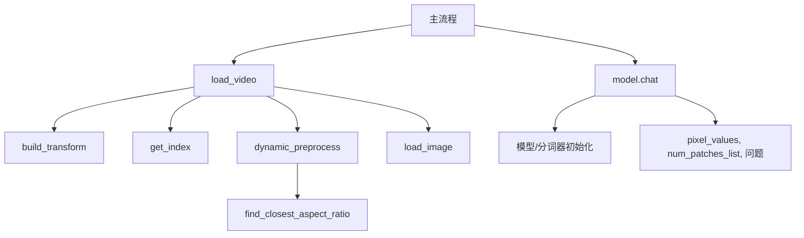

'''
程序说明：
## 1. 本文档为 video-understand.py 的详细说明，涵盖功能、依赖、流程、输入输出及注意事项。
## 2. 适用于 InternVL 2.5 系列视频理解与多模态对话任务。
'''

# video-understand.py 使用说明

## 一、程序功能

本程序基于 InternVL 2.5（OpenGVLab/InternVideo2_5_Chat_8B）大模型，实现对视频内容的自动分析、详细描述、视觉问答及多轮多模态对话。支持对视频中的场景、事件、对象等进行智能理解和问答。

## 二、主要依赖

- Python 3.8 及以上
- torch
- torchvision
- numpy
- decord
- PIL (Pillow)
- modelscope

安装依赖可参考 requirements.txt 文件。

## 三、核心流程

1. **模型下载与加载**
   - 使用 modelscope 下载并加载 InternVideo2_5_Chat_8B 大模型。
2. **视频帧预处理**
   - 通过 decord 读取视频，按设定分段抽帧。
   - 对每帧进行动态分块、缩放、归一化等处理。
3. **多模态推理与对话**
   - 支持英文和中文的单轮/多轮视觉问答。
   - 可输出视频详细描述、人数统计、损伤部位等多种问答结果。

## 四、输入输出说明

- **输入**：
  - 视频文件（如 car.mp4），路径可在 `video_path` 变量中指定。
  - 问题（英文或中文），可自定义。
- **输出**：
  - 控制台输出视频内容的详细描述、问答结果等。

## 五、主要函数说明

- `build_transform(input_size)`：构建图像预处理流程。
- `dynamic_preprocess(image, ...)`：根据宽高比动态分块处理图像。
- `load_video(video_path, ...)`：加载视频并抽帧、预处理。
- `model.chat(...)`：与大模型进行多轮视觉对话。

### 详细函数说明

#### 1. build_transform(input_size)
**功能**：
构建用于图像归一化、缩放、转为张量等的预处理流程，适配模型输入。

**参数**：
- `input_size`：输入图像的目标边长（int）。

**返回值**：
- `transform`：torchvision.transforms 组成的预处理流水线。

**典型用法**：
```python
transform = build_transform(448)
img_tensor = transform(PIL.Image.open('xxx.jpg'))
```

#### 2. dynamic_preprocess(image, min_num=1, max_num=6, image_size=448, use_thumbnail=False)
**功能**：
根据输入图像的宽高比，动态将图像分割为多个块，适配模型多块输入需求。

**参数**：
- `image`：PIL.Image 对象，原始图像。
- `min_num`：最小分块数（int，默认1）。
- `max_num`：最大分块数（int，默认6）。
- `image_size`：每块的目标边长（int，默认448）。
- `use_thumbnail`：是否附加缩略图（bool，默认False）。

**返回值**：
- `processed_images`：分块后图像的 PIL.Image 列表。

**典型用法**：
```python
blocks = dynamic_preprocess(img, max_num=4, image_size=224)
```

#### 3. load_video(video_path, bound=None, input_size=448, max_num=1, num_segments=32, get_frame_by_duration=False)
**功能**：
加载视频文件，按设定分段抽取帧，并对每帧进行分块和预处理，最终输出模型可用的张量。

**参数**：
- `video_path`：视频文件路径（str）。
- `bound`：帧抽取的时间边界（[start, end]，单位秒，可选）。
- `input_size`：每块的目标边长（int，默认448）。
- `max_num`：每帧最大分块数（int，默认1）。
- `num_segments`：抽帧数量（int，默认32）。
- `get_frame_by_duration`：是否根据视频时长自适应帧数（bool，默认False）。

**返回值**：
- `pixel_values`：所有帧分块后拼接的 torch.Tensor。
- `num_patches_list`：每帧分块数的列表。

**典型用法**：
```python
pixel_values, num_patches_list = load_video('car.mp4', num_segments=32)
```

#### 4. model.chat(tokenizer, pixel_values, question, generation_config, num_patches_list=None, history=None, return_history=True)
**功能**：
与大模型进行多轮视觉对话，支持输入视频帧张量和自然语言问题，返回模型生成的答案。

**参数**：
- `tokenizer`：分词器对象。
- `pixel_values`：视频帧分块后的张量（torch.Tensor）。
- `question`：输入问题（str），可拼接帧前缀。
- `generation_config`：生成配置（dict）。
- `num_patches_list`：每帧分块数列表（list，可选）。
- `history`：历史对话内容（可选）。
- `return_history`：是否返回对话历史（bool，默认True）。

**返回值**：
- `output`：模型生成的文本答案。
- `chat_history`：对话历史（如 return_history=True）。

**典型用法**：
```python
output, chat_history = model.chat(tokenizer, pixel_values, question, generation_config, num_patches_list=num_patches_list, history=None, return_history=True)
```

#### 5. 其他辅助函数
- `find_closest_aspect_ratio(...)`：用于动态分块时寻找最接近原图宽高比的目标比例。
- `get_index(...)`：根据时间边界和帧率计算抽帧索引。
- `get_num_frames_by_duration(duration)`：根据视频时长自适应计算抽帧数量。
- `load_image(...)`：对单张图片进行分块和预处理，返回张量。

上述辅助函数均有详细注释，便于理解和扩展。

## 六、常见问题与注意事项

1. **显存需求高**：模型推理需较大显存（建议 16GB 及以上显卡）。
2. **首次运行需下载大模型**，速度受网络影响。
3. **视频过大时建议调小 num_segments**，以减少内存消耗。
4. **调试模式建议减少帧数和分块数**，加快运行速度。
5. **如遇中文乱码**，请确保终端/IDE 使用 UTF-8 编码。
6. **如需自定义问题**，可修改 `question1`、`question2` 等变量。

## 七、性能与调试建议

- 调试阶段可将 `num_segments` 设为较小值（如 16/32），正式运行时可适当增大。
- 长时间无输出时请耐心等待，尤其是首次模型加载和大视频处理。

## 八、参考与致谢

- InternVL 官方文档与 ModelScope 平台
- OpenGVLab/InternVideo2_5_Chat_8B

## 九、主要函数调用关系

本节说明 video-understand.py 中各主要函数的调用关系，帮助理解整体处理流程。

### 1. 文字说明

- 程序主流程首先调用 `load_video` 加载和预处理视频：
  - `load_video` 内部依次调用 `build_transform`（构建预处理流程）、`dynamic_preprocess`（对每帧分块）、`get_index`（计算帧索引）、`find_closest_aspect_ratio`（辅助分块）、`load_image`（如处理单帧）。
- 预处理后的视频帧张量 `pixel_values` 及分块信息 `num_patches_list` 作为输入，传递给 `model.chat`，结合用户问题进行多轮视觉对话。
- `model.chat` 依赖于模型和分词器的初始化。

### 2. 调用关系流程图



### 3. 简要流程

1. 初始化模型与分词器
2. `load_video` 读取视频并预处理所有帧
3. 处理结果输入 `model.chat`，结合问题进行推理
4. 输出视频理解与问答结果

---

如有问题请查阅代码注释或联系维护者。 