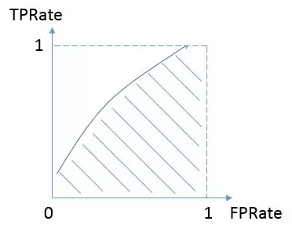

## Description，问题描述

我们有员工的各种统计信息，以及该员工是否已经离职，统计的信息包括了（工资、出差、工作环境满意度、工作投入度、是否加班、是否升职、工资提升比例等）
现在需要你来通过训练数据得出 员工离职预测，并给出你在测试集上的预测结果。 我们将给出课程上公开的榜单

## 数据说明

训练数据和测试数据，保存在train.csv和test.csv文件中

训练集包括1176条记录，31个字段，字段说明如下：

字段	说明
Age	员工年龄
Attrition	员工是否已经离职，Yes表示离职，No表示未离职
BusinessTravel	商务差旅频率，Non-Travel不出差，Travel_Rarely不经常出差，Travel_Frequently经常出差
DailyRate	平均每日工资
Department	员工所在部门，Sales销售部，Research & Development研发部，Human
Resources人力资源部
DistanceFromHome	公司跟家庭住址的距离，从1到29，1表示最近，29表示最远
Education	员工的教育程度，从1到5，5表示教育程度最高
EducationField	员工所学习的专业领域，Life Sciences表示生命科学，Medical表示医疗，Marketing表示市场营销，Technical Degree表示技术学位，Human Resources表示人力资源，Other表示其他
EmployeeNumber	员工号码
EnvironmentSatisfaction	员工对于工作环境的满意程度，从1到4，1的满意程度最低，4的满意程度最高
Gender	员工性别，Male表示男性，Female表示女性
JobInvolvement	员工工作投入度，从1到4，1为投入度最低，4为投入度最高
JobLevel	职业级别，从1到5，1为最低级别，5为最高级别
JobRole	工作角色：Sales Executive销售主管，Research Scientist科学研究员，Laboratory Technician实验室技术员，Manufacturing Director制造总监，Healthcare Representative医疗代表，Manager经理，Sales Representative销售代表，Research Director研究总监，Human Resources人力资源
JobSatisfaction	工作满意度，从1到4，1代表满意度最低，4代表最高
MaritalStatus	员工婚姻状况，Single单身，Married已婚，Divorced离婚
MonthlyIncome	员工月收入，范围在1009到19999之间
NumCompaniesWorked	员工曾经工作过的公司数
Over18	年龄是否超过18岁
OverTime	是否加班，Yes表示加班，No表示不加班
PercentSalaryHike	工资提高的百分比
PerformanceRating	绩效评估
RelationshipSatisfaction	关系满意度，从1到4，1表示满意度最低，4表示满意度最高
StandardHours	标准工时
StockOptionLevel	股票期权水平
TotalWorkingYears	总工龄
TrainingTimesLastYear	上一年的培训时长，从0到6，0表示没有培训，6表示培训时间最长
WorkLifeBalance	工作与生活平衡程度，从1到4，1表示平衡程度最低，4表示平衡程度最高
YearsAtCompany	在目前公司工作年数
YearsInCurrentRole	在目前工作职责的工作年数
YearsSinceLastPromotion	距离上次升职时长
YearsWithCurrManager	跟目前的管理者共事年数
测试数据主要包括294条记录，30个字段，不包括员工是否已经离职的记录，需要通过由训练数据所建立的模型以及所给的测试数据，得出相应的员工是否已经离职的预测。

## 评分标准：AUC

## Acknowledgements

数据来自IBM Watson Analytics分析平台分享的样例数据，选取了部分作为训练和测试集

## Evaluation

评价指标：[AUC](http://en.wikipedia.org/wiki/Receiver_operating_characteristic)，即ROC曲线下面的面积

## 提交文件格式

提交文件包括了两列: user_id 和 Attrition

user_id,Attrition
442,0.161699
1091,0.047432
981,0.236299
785,0.008719
1332,0.059855

etc.
