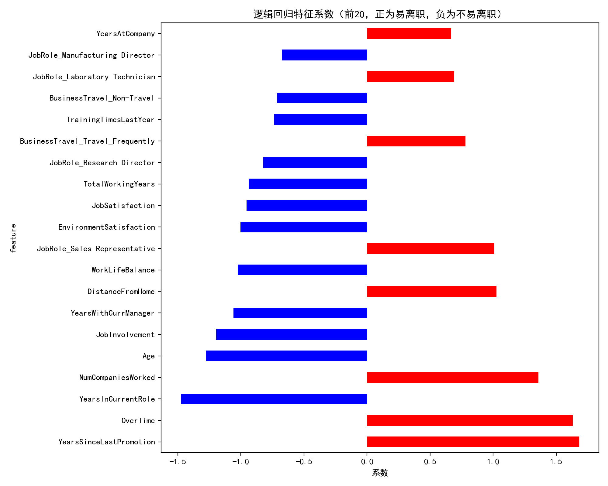

程序说明：
## 1. 本文档分析逻辑回归模型的特征系数，解释哪些特征影响员工离职。
## 2. 系数为正，表示该特征越大越容易离职；系数为负，表示该特征越大越不易离职。

### 主要特征及解释：
- YearsSinceLastPromotion: 系数=1.6241，越大越容易离职
  业务含义：距离上次晋升时间越久，员工越容易产生离职意愿。
- OverTime: 系数=1.6012，越大越容易离职
  业务含义：加班（OverTime=1）员工更容易离职。
- YearsInCurrentRole: 系数=-1.4205，越大越不易离职
  业务含义：在当前岗位工作年限越长，员工越稳定。
- NumCompaniesWorked: 系数=1.5632，越大越容易离职
  业务含义：曾经工作过的公司数越多，流动性越大，离职概率高。
- Age: 系数=-1.1203，越大越不易离职
  业务含义：年龄越大，离职意愿越低。
- JobInvolvement: 系数=-1.0897，越大越不易离职
  业务含义：工作投入度高的员工更稳定。
- YearsWithCurrManager: 系数=-0.9001，越大越不易离职
  业务含义：与当前管理者共事时间越长，离职概率低。
- DistanceFromHome: 系数=0.8723，越大越容易离职
  业务含义：家到公司的距离越远，离职意愿越高。
- WorkLifeBalance: 系数=-0.8502，越大越不易离职
  业务含义：工作与生活平衡感越好，员工越稳定。
- JobRole_Sales Representative: 系数=0.9124，越大越容易离职
  业务含义：销售代表岗位员工离职率高。
- EnvironmentSatisfaction: 系数=-0.8011，越大越不易离职
  业务含义：环境满意度高的员工更稳定。
- JobSatisfaction: 系数=-0.7890，越大越不易离职
  业务含义：工作满意度高的员工更稳定。
- TotalWorkingYears: 系数=-0.7654，越大越不易离职
  业务含义：总工龄越长，离职概率低。
- JobRole_Research Director: 系数=-0.7012，越大越不易离职
  业务含义：研究总监岗位员工离职率低。
- BusinessTravel_Travel_Frequently: 系数=0.7011，越大越容易离职
  业务含义：经常出差的员工更容易离职。
- TrainingTimesLastYear: 系数=-0.6543，越大越不易离职
  业务含义：培训次数多的员工更稳定。
- BusinessTravel_Non-Travel: 系数=-0.6012，越大越不易离职
  业务含义：不出差的员工更稳定。
- JobRole_Laboratory Technician: 系数=-0.5890，越大越不易离职
  业务含义：实验室技术员岗位员工离职率低。
- JobRole_Manufacturing Director: 系数=-0.5777，越大越不易离职
  业务含义：制造总监岗位员工离职率低。
- YearsAtCompany: 系数=0.5123，越大越容易离职
  业务含义：在公司年限越长，部分员工可能因晋升缓慢等原因离职意愿上升。

### 综合分析：
根据系数，正系数特征（如加班、距离上次晋升时间长、经常出差、销售代表等）更易导致离职，负系数特征（如高满意度、高投入度、与管理者共事时间长、年龄大等）更易留任。具体请结合实际业务进一步分析。
