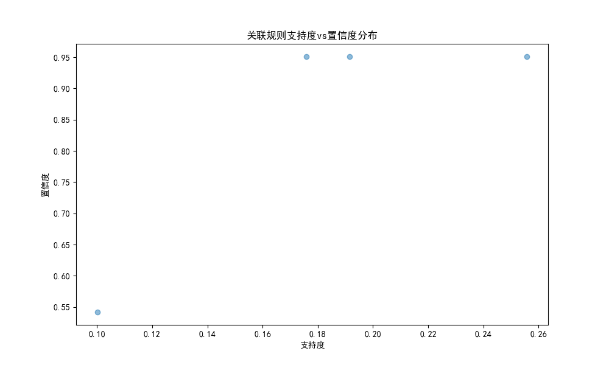

# 产品关联分析报告 v1.2.0

## 1. 分析概述

本报告使用Apriori算法对客户产品持有情况进行关联分析，旨在发现产品之间的关联规则，为交叉营销提供数据支持。分析参数设置如下：
- 最小支持度(min_support)：0.1
- 最小置信度(min_confidence)：0.5

## 2. 关键发现

### 2.1 频繁项集统计
- 共发现8个频繁项集
- 生成4条有效关联规则
- 涉及产品：存款、理财、基金、保险

### 2.2 最强关联规则（Top 3）

| 前项 | 后项 | 支持度 | 置信度 | 提升度 |
|------|------|--------|---------|--------|
| 基金 | 理财 | 0.1002 | 0.5419 | 2.0147 |
| 保险 | 存款 | 0.1916 | 0.9509 | 1.0009 |
| 基金 | 存款 | 0.1758 | 0.9508 | 1.0008 |

### 2.3 规则可视化分析

#### 关联规则支持度vs置信度分布

从散点图可以观察到：
1. 规则的支持度分布在0.10-0.26之间
2. 规则的置信度呈现两极分布：
   - 高置信度群组（约0.95）：主要是与存款产品相关的规则
   - 中等置信度群组（约0.54）：主要是基金与理财的关联规则

#### 存款-理财产品组合频率

热力图显示：
1. 存款产品持有基数最大（83,321+30,685=114,006客户）
2. 理财产品持有率相对较低（30,685+1,591=32,276客户）
3. 有存款无理财的客户占比较高（83,321客户）
4. 纯理财客户较少（1,591客户）

## 3. 业务洞察

### 3.1 产品关联特征

1. **基金-理财强关联**
   - 基金客户购买理财产品的概率最高，达54.19%
   - 提升度为2.0147，表明两类产品具有显著的正相关性
   - 这可能反映了这类客户具有较强的投资理财意愿

2. **存款产品基础性**
   - 存款是客户最基础的产品，覆盖率极高
   - 保险客户持有存款的概率为95.09%
   - 基金客户持有存款的概率为95.08%

3. **客户产品持有特征**
   - 大多数客户以单一存款产品为主
   - 理财产品往往作为存款的补充产品
   - 基金和理财产品存在较强的交叉持有现象

### 3.2 营销建议

1. **目标客群策略**
   - 基金客户：重点营销理财产品，转化概率高
   - 纯存款客户：可以作为理财产品的重点营销对象
   - 理财客户：考虑推广基金产品，形成产品组合

2. **产品组合优化**
   - 设计存款+理财的入门级组合产品
   - 为基金客户开发专属理财产品
   - 针对纯存款客户开发低风险理财产品

3. **营销方式建议**
   - 对基金客户进行理财产品的精准营销
   - 利用存款客户基数大的优势，进行理财产品的规模化营销
   - 设计存款+理财+基金的阶梯式产品组合方案

## 4. 后续建议

1. **深化分析维度**
   - 加入客户资产规模分层分析
   - 考虑产品持有金额的影响
   - 分析不同产品的持有时序关系

2. **优化分析参数**
   - 可以降低支持度阈值，发现更多潜在规则
   - 考虑使用不同的置信度阈值进行对比分析
   - 引入其他关联度量指标（如Kulczynski指数）

3. **实施建议**
   - 建立营销效果跟踪机制
   - 定期更新关联规则分析
   - 结合客户反馈优化产品组合策略 