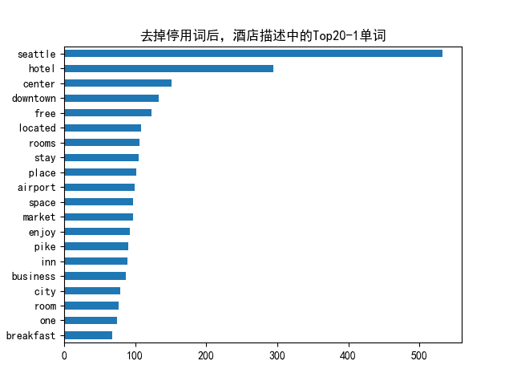
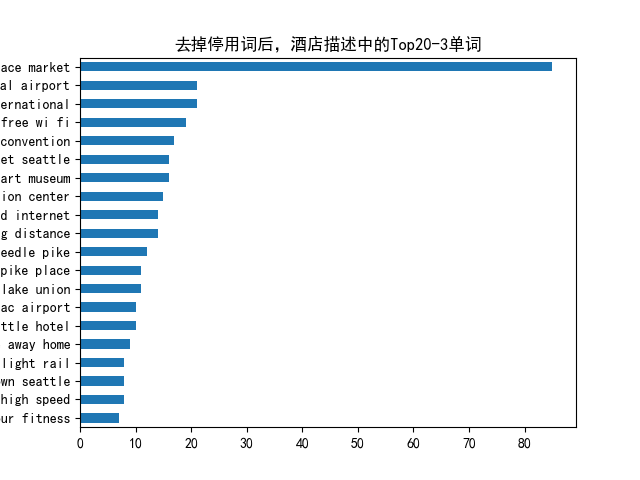

[toc]

# 1. N-Gram和TF-IDF：通俗易懂的解析

## 1.1 N-Gram：让AI学会"猜词"的技术

### 1.1.1 基本概念
N-Gram是一种让计算机理解语言规律的基础方法，主要用于预测文本中下一个可能出现的词。它的核心思想很简单：假设一个词的出现只和前面的几个词有关。

举个例子：
- "我想吃"后面接"苹果"的概率，可能比接"游泳"更高
- 输入法在你打出"dddd"时推荐"带带弟弟"就是基于这种原理

### 1.1.2 工作原理
1. **分段统计**：把文本拆成连续的词组合（比如2个词的"我吃"，3个词的"我想吃"），统计每个组合出现的次数
2. **计算概率**：用"下一个词出现的次数除以当前组合出现的总次数"得到条件概率
3. **处理零概率**：给从未出现过的组合分配很小的概率，避免完全排除可能性

### 1.1.3 常见类型
- **Unigram（一元组）**：单个词为一组（如"我"、"喜欢"）
- **Bigram（二元组）**：两个连续词为一组（如"我喜欢"、"喜欢学习"）
- **Trigram（三元组）**：三个连续词为一组（如"我喜欢学习"）

### 1.1.4 应用场景
- 手机输入法候选词预测
- 文本生成（如自动补全句子）
- 拼写检查（判断词语组合是否合理）
- 搜索引擎查询扩展

### 1.1.5 优缺点
✅ 优点：
- 简单易实现，计算效率高
- 可解释性强，易于调试

❌ 缺点：
- 只能记住有限上下文（长句子容易出错）
- 需要大量数据训练
- 对未见过的新词组合预测能力差

---

## 1.2 TF-IDF：衡量词语重要性的尺子

### 1.2.1 基本概念
TF-IDF（词频-逆文档频率）是一种评估词语重要性的方法，它考虑两个因素：
1. **词频（TF）**：词在文档中出现的频率
2. **逆文档频率（IDF）**：词在整个文档集合中的罕见程度

简单说：一个词在本文中出现越多（TF高），同时在别的文章中出现越少（IDF高），就越重要。

### 1.2.2 计算公式
```
TF-IDF = TF × IDF
```
其中：
- TF = 词在文档中的出现次数 / 文档总词数
- IDF = log(文档总数 / 包含该词的文档数)

### 1.2.3 为什么需要TF-IDF？
直接统计词频会有一个问题：像"的"、"是"这种词虽然出现很多，但对理解内容没帮助。TF-IDF通过IDF降低了这类词的权重。

### 1.2.4 应用场景
- 搜索引擎排序（找出文档真正重要的词）
- 文本分类（如新闻分类）
- 关键词自动提取
- 推荐系统（分析用户兴趣）

### 1.2.5 实际案例
如果分析专利文档：
- "中国"可能词频高但IDF低（很多文档都提到）
- "专利"词频适中但IDF高（较少文档提到）
→ "专利"的TF-IDF值会更高，更能代表主题

### 1.2.6 优缺点
✅ 优点：
- 简单有效，易于计算
- 能自动过滤常见无意义词

❌ 缺点：
- 不考虑词语顺序和语义关系
- 对同义词处理不好（如"电脑"和"计算机"）

---

## 1.3 总结对比

| 特性        | N-Gram                          | TF-IDF                          |
|------------|--------------------------------|--------------------------------|
| **主要用途** | 预测下一个词/生成文本          | 评估词语重要性/文档特征提取     |
| **核心思想** | 词语出现的概率依赖前几个词     | 重要=在本文档多见+在其它文档少见 |
| **典型应用** | 输入法、机器翻译、拼写检查     | 搜索引擎、文本分类、关键词提取  |
| **优势**    | 保持语言连贯性                 | 识别文档关键主题词             |
| **局限**    | 长距离依赖差、需要大量训练数据 | 忽略词语顺序和语义关系         |

两者常结合使用，比如先用TF-IDF提取重要词，再用N-Gram分析这些词的关系。

## 简单示例
```python
from sklearn.feature_extraction.text import TfidfVectorizer
from sklearn.metrics.pairwise import cosine_similarity
import numpy as np

# 示例词库
words = [
    "苹果", "香蕉", "橙子", "葡萄", "菠萝", 
    "芒果", "西瓜", "草莓", "蓝莓", "樱桃",
    "苹果手机", "苹果电脑", "苹果汁", "红苹果", "青苹果"
]

# 定义n-gram函数（这里使用2-gram）
def get_ngrams(word, n=2):
    return [word[i:i+n] for i in range(len(word)-n+1)]

# 为每个词生成n-gram特征
word_ngrams = [" ".join(get_ngrams(word)) for word in words]
print("词语的2-gram表示示例:")
for word, ngram in zip(words[:5], word_ngrams[:5]):
    print(f"{word} → {ngram}")

# 使用TF-IDF向量化
vectorizer = TfidfVectorizer(tokenizer=lambda x: x.split())
tfidf_matrix = vectorizer.fit_transform(word_ngrams)

# 定义查找相似词的函数
def find_similar_words(target_word, top_n=5):
    # 生成目标词的n-gram
    target_ngram = " ".join(get_ngrams(target_word))
    # 转换为TF-IDF向量
    target_vec = vectorizer.transform([target_ngram])
    # 计算余弦相似度
    similarities = cosine_similarity(target_vec, tfidf_matrix)
    # 获取最相似的词
    similar_indices = np.argsort(similarities[0])[::-1][1:top_n+1]  # 排除自己
    print(f"\n与'{target_word}'最相似的{top_n}个词:")
    for idx in similar_indices:
        print(f"{words[idx]}: {similarities[0][idx]:.3f}")

# 测试示例
find_similar_words("苹果", top_n=5)
find_similar_words("菠萝", top_n=3)
find_similar_words("苹果手机", top_n=3)
```

# 2. Word Embedding（词嵌入）

### 2.1 🌍 把词语变成"坐标"

想象你是一个外星人，第一次来地球学习人类的语言。你发现：

*   单词 **"猫"** 和 **"狗"** 经常一起出现（因为它们都是宠物）。
*   单词 **"苹果"** 和 **"香蕉"** 也经常一起出现（因为它们都是水果）。
*   但 **"猫"** 和 **"苹果"** 几乎不会同时出现（因为它们属于不同类别）。

于是，你决定给每个单词分配一个 **"坐标"**（比如在三维空间里的位置）：

*   **"猫"** → `[0.8, 0.2, 0.1]`
*   **"狗"** → `[0.7, 0.3, 0.1]`
*   **"苹果"** → `[0.1, 0.9, 0.4]`
*   **"香蕉"** → `[0.2, 0.8, 0.3]`

这样：\
✅ **相似的词**（比如猫和狗）坐标接近。\
❌ **不相似的词**（比如猫和苹果）坐标远离。

***

### 2.2 🔍 Word Embedding 是什么？

Word Embedding 就是通过数学方法，把单词变成 **一串数字（向量）**，让计算机能通过这些数字：

1.  **理解词语的意思**（比如"猫"和"狗"都是动物）。
2.  **计算词语的关系**（比如"国王 - 男 + 女 ≈ 女王"）。

***

### 2.3 💡 为什么要用 Word Embedding？

直接给单词编号（比如"猫=1，狗=2"）会丢失语义信息。而 Word Embedding 能：

*   **压缩信息**：用少数几个数字表示复杂含义。
*   **发现规律**：自动学习"猫→狗"和"苹果→香蕉"的相似关系。
*   **兼容算法**：机器学习模型（如神经网络）只能处理数字，不能直接处理文字。

***

### 2.4 🛠️ 举个实际例子

假设用 3 维向量表示词语：

*   **"科技"** → `[0.9, 0.1, 0.2]`
*   **"手机"** → `[0.8, 0.2, 0.3]`
*   **"水果"** → `[0.1, 0.9, 0.4]`

计算机看到：

*   `"科技"` 和 `"手机"` 的向量接近 → 它们相关。
*   `"科技"` 和 `"水果"` 的向量远离 → 它们无关。

***

### 2.5 📚 常见的 Word Embedding 方法

1.  **Word2Vec**：通过上下文预测词语（比如"猫爱吃\_\_" → 预测"鱼"）。
2.  **GloVe**：统计词语共同出现的频率（比如"猫"和"狗"经常一起出现）。
3.  **BERT**（现代方法）：结合上下文动态调整向量（比如"苹果"在"吃苹果"和"苹果手机"中含义不同）。

***

### 2.6 ❓ 简单总结

Word Embedding 就是 **让计算机通过数字"理解"词语**，像人类一样知道"猫和狗相似，但和苹果无关"。它是自然语言处理（NLP）的基础技术，用于翻译、搜索、聊天机器人等场景。

# 3. Word2Vec

## 3.1 Word2Vec的两种模型

### (1) CBOW (Continuous Bag of Words)

*   **目标**：用上下文词语预测中心词（适合小型数据集）。
*   **例子**：\
    句子：`"我 爱 自然 语言 处理"`\
    假设窗口大小为 2（左右各 2 个词），则：
    *   输入：`["我", "爱", "语言", "处理"]`（上下文）
    *   输出：`"自然"`（中心词）

### (2) Skip-gram

*   **目标**：用中心词预测上下文词语（适合大型数据集）。
*   **例子**：\
    同一句子 `"我 爱 自然 语言 处理"`，窗口大小为 2：
    *   输入：`"自然"`（中心词）
    *   输出：`["我", "爱", "语言", "处理"]`（上下文）

> **CBOW vs Skip-gram**：
>
> *   CBOW 训练更快，适合高频词。
> *   Skip-gram 对低频词效果更好，但需要更多数据。

***

## 3.2 Word2Vec的实现步骤

### Step 1: 数据预处理

*   分词（如用 `jieba` 对中文分词）。
*   构建词汇表（给每个词分配唯一 ID，如 `我=0, 爱=1, 自然=2...`）。

### Step 2: 构建神经网络模型

Word2Vec 本质上是一个 **单隐层神经网络**，结构如下：

    输入层 → 隐藏层（Embedding 层） → 输出层（Softmax）

*   **输入层**：词语的 one-hot 编码（如 `"自然" = [0, 0, 1, 0, 0]`）。
*   **隐藏层**：权重矩阵（即词向量表），维度 = `[词汇表大小, 嵌入维度]`（如 300 维）。
*   **输出层**：预测上下文词的概率（Softmax 归一化）。

### Step 3: 训练模型

*   输入一个词（如 `"自然"` 的 one-hot 向量 `[0, 0, 1, 0, 0]`）。
*   乘以权重矩阵，得到隐藏层的 **词向量**（如 `[0.2, -0.5, 0.7, ...]`）。
*   用 Softmax 计算预测的上下文词概率。
*   通过反向传播（Backpropagation）更新权重，使预测更准。

### Step 4: 提取词向量

训练完成后，**隐藏层的权重矩阵就是词向量表**！

*   例如，`"自然"` 的词向量是权重矩阵的第 3 行（假设 `"自然"` 的 ID=2）。

***

## 3.3 关键优化技术

直接计算 Softmax 对大规模词汇表效率极低，因此 Word2Vec 用两种优化方法：

### (1) 负采样（Negative Sampling）

*   **问题**：Softmax 要计算所有词的概率，计算量太大。
*   **解决**：每次训练只采样少量负样本（随机选非上下文词），优化目标变为：
    *   最大化真实上下文词的概率。
    *   最小化负样本词的概率。

### (2) 层次 Softmax（Hierarchical Softmax）

*   用哈夫曼树（Huffman Tree）编码词汇表，将计算复杂度从 `O(N)` 降到 `O(log N)`。
*   每个词对应树的一个叶子节点，预测时只需计算路径上的节点概率。

***

## 3.4 代码示例（Python）

用 `gensim` 库快速训练 Word2Vec：

```python
from gensim.models import Word2Vec

# 示例数据（已分词的句子）
sentences = [
    ["我", "爱", "自然", "语言", "处理"],
    ["深度", "学习", "真", "有趣"]
]

# 训练模型（Skip-gram + 负采样）
model = Word2Vec(
    sentences,
    vector_size=100,  # 词向量维度
    window=5,         # 上下文窗口大小
    min_count=1,      # 忽略低频词
    sg=1,             # 1=Skip-gram, 0=CBOW
    negative=5,       # 负采样数
    epochs=10         # 训练轮次
)

# 获取词向量
vector = model.wv["自然"]  # "自然"的词向量
print(vector)

# 找相似词
similar_words = model.wv.most_similar("自然", topn=3)
print(similar_words)  # 输出：[('语言', 0.92), ('学习', 0.88), ...]
```

***

## 3.5 总结

*   **核心思想**：用上下文学习词向量（CBOW/Skip-gram）。
*   **关键步骤**：
    1.  分词 → 构建词汇表 → one-hot 编码。
    2.  训练单隐层神经网络，提取隐藏层权重作为词向量。
*   **优化方法**：负采样、层次 Softmax 加速训练。
*   **应用场景**：语义搜索、推荐系统、机器翻译等。

Word2Vec 的优点是简单高效，但缺点是无法处理多义词（如"苹果"在水果和公司语境中含义不同）。后续的 **GloVe**、**BERT** 等模型对此做了改进。

# 4. 实操
## 4.1 用N-Gram和TF-IDF为酒店建立内容推荐系统
### 4.1.1 准备
西雅图酒店数据集：
- 下载地址：https://github.com/susanli2016/Machine-Learning-with-Python/blob/master/Seattle_Hotels.csv
- 字段：name,address,desc
- 目标：基于用户选择的酒店，推荐相似度高的Top10个其他酒店
- 方法：计算当前酒店特征向量与整个酒店特征矩阵的余弦相似度，取相似度最大的Top-k个
  
### 4.1.2 步骤
- Step1，对酒店描述（Desc）进行特征提取
	- N-Gram，提取N个连续字的集合，作为特征
	- TF-IDF，按照(min_df,max_df)提取关键词，并生成TFIDF矩阵
- Step2，计算酒店之间的相似度矩阵
	- 余弦相似度
-  Step3，对于指定的酒店，选择相似度最大的Top-K个酒店进行输出

### 4.1.3 示例代码
```python
import pandas as pd
from sklearn.metrics.pairwise import linear_kernel
from sklearn.feature_extraction.text import CountVectorizer
from sklearn.feature_extraction.text import TfidfVectorizer
import re
pd.options.display.max_columns = 30
import matplotlib.pyplot as plt
# 支持中文
plt.rcParams['font.sans-serif'] = ['SimHei']  # 用来正常显示中文标签
df = pd.read_csv('Seattle_Hotels.csv', encoding="latin-1")
# 数据探索
# print(df.head())
print('数据集中的酒店个数：', len(df))

# 创建英文停用词列表
ENGLISH_STOPWORDS = {
    'i', 'me', 'my', 'myself', 'we', 'our', 'ours', 'ourselves', 'you', "you're", "you've", "you'll", "you'd", 'your', 
    'yours', 'yourself', 'yourselves', 'he', 'him', 'his', 'himself', 'she', "she's", 'her', 'hers', 'herself', 'it', 
    "it's", 'its', 'itself', 'they', 'them', 'their', 'theirs', 'themselves', 'what', 'which', 'who', 'whom', 'this', 
    'that', "that'll", 'these', 'those', 'am', 'is', 'are', 'was', 'were', 'be', 'been', 'being', 'have', 'has', 'had', 
    'having', 'do', 'does', 'did', 'doing', 'a', 'an', 'the', 'and', 'but', 'if', 'or', 'because', 'as', 'until', 'while', 
    'of', 'at', 'by', 'for', 'with', 'about', 'against', 'between', 'into', 'through', 'during', 'before', 'after', 'above', 
    'below', 'to', 'from', 'up', 'down', 'in', 'out', 'on', 'off', 'over', 'under', 'again', 'further', 'then', 'once', 
    'here', 'there', 'when', 'where', 'why', 'how', 'all', 'any', 'both', 'each', 'few', 'more', 'most', 'other', 'some', 
    'such', 'no', 'nor', 'not', 'only', 'own', 'same', 'so', 'than', 'too', 'very', 's', 't', 'can', 'will', 'just', 'don', 
    "don't", 'should', "should've", 'now', 'd', 'll', 'm', 'o', 're', 've', 'y', 'ain', 'aren', "aren't", 'couldn', 
    "couldn't", 'didn', "didn't", 'doesn', "doesn't", 'hadn', "hadn't", 'hasn', "hasn't", 'haven', "haven't", 'isn', 
    "isn't", 'ma', 'mightn', "mightn't", 'mustn', "mustn't", 'needn', "needn't", 'shan', "shan't", 'shouldn', "shouldn't", 
    'wasn', "wasn't", 'weren', "weren't", 'won', "won't", 'wouldn', "wouldn't"
}

def print_description(index):
    example = df[df.index == index][['desc', 'name']].values[0]
    if len(example) > 0:
        print('Name:', example[1])
        print(example[0])
print('第10个酒店的描述：')
print_description(10)

# 得到酒店描述中n-gram特征中的TopK个特征,默认n=1即1-gram,k=None，表示所有的特征)
def get_top_n_words(corpus, n=1, k=None):
    # 统计ngram词频矩阵，使用自定义停用词列表
    vec = CountVectorizer(ngram_range=(n, n), stop_words=list(ENGLISH_STOPWORDS)).fit(corpus)
    bag_of_words = vec.transform(corpus)
    """
    print('feature names:')
    print(vec.get_feature_names())
    print('bag of words:')
    print(bag_of_words.toarray())
    """
    sum_words = bag_of_words.sum(axis=0)
    words_freq = [(word, sum_words[0, idx]) for word, idx in vec.vocabulary_.items()]
    # 按照词频从大到小排序
    words_freq =sorted(words_freq, key = lambda x: x[1], reverse=True)
    return words_freq[:k]
# 生成n=1.k=20的可视图
# n_gram=1
# common_words = get_top_n_words(df['desc'], n=n_gram,k=20)
# # 生成n=3.k=20的可视图
n_gram=3
common_words = get_top_n_words(df['desc'], n=n_gram,k=20)
# common_words = get_top_n_words(df['desc'], 3, 20)
print(f"comon_words are \n {common_words}")
df1 = pd.DataFrame(common_words, columns = ['desc' , 'count'])
df1.groupby('desc').sum()['count'].sort_values().plot(kind='barh', title=f'去掉停用词后，酒店描述中的Top20-{n_gram}单词')
plt.savefig(f'./top20-{n_gram}words.png')
plt.show()


# 文本预处理
REPLACE_BY_SPACE_RE = re.compile(r'[/(){}\[\]\|@,;]')
BAD_SYMBOLS_RE = re.compile('[^0-9a-z #+_]')
# 使用自定义的英文停用词列表替代nltk的stopwords
STOPWORDS = ENGLISH_STOPWORDS
# 对文本进行清洗
def clean_text(text):
    # 全部小写
    text = text.lower()
    # 用空格替代一些特殊符号，如标点
    text = REPLACE_BY_SPACE_RE.sub(' ', text)
    # 移除BAD_SYMBOLS_RE
    text = BAD_SYMBOLS_RE.sub('', text)
    # 从文本中去掉停用词
    text = ' '.join(word for word in text.split() if word not in STOPWORDS)
    return text
# 对desc字段进行清理，apply针对某列
df['desc_clean'] = df['desc'].apply(clean_text)
#print(df['desc_clean'])

# 建模
df.set_index('name', inplace = True)
# 使用TF-IDF提取文本特征，使用自定义停用词列表,min_df=0.01：如果有1000篇文档，只保留至少在10篇文档中出现的词(1000×1%)
tf = TfidfVectorizer(analyzer='word', ngram_range=(1, 3), min_df=0.01, stop_words=list(ENGLISH_STOPWORDS))
# 针对desc_clean提取tfidf
tfidf_matrix = tf.fit_transform(df['desc_clean'])
# print('TFIDF feature names:')
# print(tf.get_feature_names_out())
print('length of feature_names_out:')
print(len(tf.get_feature_names_out()))
# print('tfidf_matrix:')
# print(tfidf_matrix)
print('tfidf_matrix shape=')
print(tfidf_matrix.shape)
# 计算酒店之间的余弦相似度（线性核函数）
cosine_similarities = linear_kernel(tfidf_matrix, tfidf_matrix)
# print(f'cosine_similarities为\n {cosine_similarities}')
print("conine_similarities.shape=")
print(cosine_similarities.shape)
indices = pd.Series(df.index) #df.index是酒店名称

# 基于相似度矩阵和指定的酒店name，推荐TOP10酒店
def recommendations(name, cosine_similarities = cosine_similarities):
    recommended_hotels = []
    # 找到想要查询酒店名称的idx
    idx = indices[indices == name].index[0]
    # print('idx=', idx)
    # 对于idx酒店的余弦相似度向量按照从大到小进行排序
    score_series = pd.Series(cosine_similarities[idx]).sort_values(ascending = False)
    # 取相似度最大的前10个（除了自己以外）
    top_10_indexes = list(score_series.iloc[1:11].index)
    # 放到推荐列表中
    for i in top_10_indexes:
        recommended_hotels.append(list(df.index)[i])
    return recommended_hotels
hotel_name='Hilton Seattle Airport & Conference Center'
recommended=recommendations(hotel_name)
print(f"top 10 similar to {hotel_name} are\n")
for i in range(len(recommended)):
    print (f"top{(i+1):02d}        {recommended[i]}")
# print(recommendations('Hilton Seattle Airport & Conference Center'))
# print(recommendations('The Bacon Mansion Bed and Breakfast'))
# #print(result)

```

### 4.1.4 结果
```bash
数据集中的酒店个数： 152
第10个酒店的描述：
Name: W Seattle
Soak up the vibrant scene in the Living Room Bar and get in the mix with our live music and DJ series before heading to a memorable dinner at TRACE. Offering inspired seasonal fare in an award-winning atmosphere, it's a not-to-be-missed culinary experience in downtown Seattle. Work it all off the next morning at FIT®, our state-of-the-art fitness center before wandering out to explore many of the area's nearby attractions, including Pike Place Market, Pioneer Square and the Seattle Art Museum. As always, we've got you covered during your time at W Seattle with our signature Whatever/Whenever® service - your wish is truly our command.
comon_words are 
 [('pike place market', 85), ('seattle tacoma international', 21), ('tacoma international airport', 21), ('free wi fi', 19), ('washington state convention', 17), ('seattle art museum', 16), ('place market seattle', 16), ('state convention center', 15), ('within walking distance', 14), ('high speed internet', 14), ('space needle pike', 12), ('needle pike place', 11), ('south lake union', 11), ('downtown seattle hotel', 10), ('sea tac airport', 10), ('home away home', 9), ('heart downtown seattle', 8), ('link light rail', 8), ('free high speed', 8), ('24 hour fitness', 7)]
length of feature_names_out:
3347
tfidf_matrix shape=
(152, 3347)
conine_similarities.shape=
(152, 152)
top 10 similar to Hilton Seattle Airport & Conference Center are

top01        Embassy Suites by Hilton Seattle Tacoma International Airport
top02        DoubleTree by Hilton Hotel Seattle Airport
top03        Seattle Airport Marriott
top04        Four Points by Sheraton Downtown Seattle Center
top05        Motel 6 Seattle Sea-Tac Airport South
top06        Hampton Inn Seattle/Southcenter
top07        Radisson Hotel Seattle Airport
top08        Knights Inn Tukwila
top09        Hotel Hotel
top10        Home2 Suites by Hilton Seattle Airport
```


## 4.2 用Word Embedding为三国演义找相似词
### 4.2.1 准备
- 准备三国演义的txt文件
### 4.2.2 步骤
- Step1，先对文件进行分词（用jieba包）
- Step2，设置模型参数进行训练
-  Step3，计算两个词的相似度、找出一个词或几个词加减后的最相近词。
### 4.2.3 示例代码
- word_seg.py
```python
# -*-coding: utf-8 -*-
# 对txt文件进行中文分词
import jieba
import os
from utils import files_processing

# 源文件所在目录
source_folder = './three_kingdoms/source'
segment_folder = './three_kingdoms/segment'
# 字词分割，对整个文件内容进行字词分割
def segment_lines(file_list,segment_out_dir,stopwords=[]):
    for i,file in enumerate(file_list):
        segment_out_name=os.path.join(segment_out_dir,'segment_{}.txt'.format(i))
        with open(file, 'rb') as f:
            document = f.read()
            document_cut = jieba.cut(document)
            sentence_segment=[]
            for word in document_cut:
                if word not in stopwords:
                    sentence_segment.append(word)
            result = ' '.join(sentence_segment)
            result = result.encode('utf-8')
            with open(segment_out_name, 'wb') as f2:
                f2.write(result)

# 对source中的txt文件进行分词，输出到segment目录中
file_list=files_processing.get_files_list(source_folder, postfix='*.txt')
segment_lines(file_list, segment_folder)
```

- word_similarity_three_kingdoms.py

```python
# -*-coding: utf-8 -*-
# 先运行 word_seg进行中文分词，然后再进行word_similarity计算
# 将Word转换成Vec，然后计算相似度 
from gensim.models import word2vec
import multiprocessing

# 如果目录中有多个文件，可以使用PathLineSentences
segment_folder = './three_kingdoms/segment'
# 切分之后的句子合集
sentences = word2vec.PathLineSentences(segment_folder)
#=============== 设置模型参数，进行训练
model = word2vec.Word2Vec(sentences, vector_size=100, window=3, min_count=1)
model.save('./three_kingdoms/model/word2Vec.model')
print(model.wv.similarity('曹操', '刘备'))
print(model.wv.similarity('曹操', '张飞'))
query_name = "曹操"
similar_words = model.wv.most_similar(query_name, topn=5)
print(f"与{query_name}最相似的5个词:")
for word, similarity in similar_words:
    print(f"{word}: {similarity:.3f}")
print("曹操+刘备-张飞=?")
similar_words = model.wv.most_similar(positive=['曹操', '刘备'], negative=['张飞'], topn=5)
for word, similarity in similar_words:
    print(f"{word}: {similarity:.3f}")
#================= 设置模型参数，进行训练
model2 = word2vec.Word2Vec(sentences, vector_size=128, window=5, min_count=5, workers=multiprocessing.cpu_count())
# 保存模型
model2.save('./three_kingdoms/model/word2Vec.model2')
print(model2.wv.similarity('曹操', '刘备'))
print(model2.wv.similarity('曹操', '张飞'))

query_name = "曹操"
similar_words = model2.wv.most_similar(query_name, topn=5)
print(f"与{query_name}最相似的5个词:")
for word, similarity in similar_words:
    print(f"{word}: {similarity:.3f}")
print("曹操+刘备-张飞=?")
similar_words = model2.wv.most_similar(positive=['曹操', '刘备'], negative=['张飞'], topn=5)
for word, similarity in similar_words:
    print(f"{word}: {similarity:.3f}")
```

### 4.2.4 结果
```bash
0.9805809
0.9755627
与曹操最相似的5个词:
孙权: 0.988
司马懿: 0.987
已: 0.986
孔明: 0.986
沮授: 0.986
曹操+刘备-张飞=?
某: 0.992
丞相: 0.991
臣: 0.990
既: 0.989
大叫: 0.989
0.82772493
0.7733702
与曹操最相似的5个词:
孙权: 0.959
喝: 0.953
回报: 0.953
大叫: 0.952
其事: 0.950
曹操+刘备-张飞=?
臣: 0.976
何为: 0.964
丞相: 0.962
朕: 0.960
主公: 0.959

Process finished with exit code 0
```