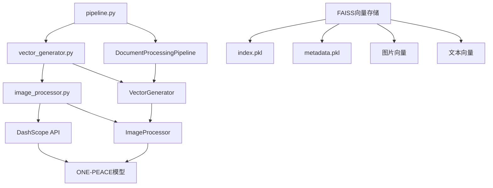

# V501_2_向量数据库生成技术实现深度剖析

## 📋 概述

本文档基于`pipeline.py`第260-274行的向量数据库生成实现，深入分析RAG系统中向量数据库生成模块的技术架构、实现原理和调用关系。

## 🎯 核心代码分析

### 关键代码段（pipeline.py 260-274行）

```python
# 步骤4: 生成向量数据库
logger.info("步骤4: 开始生成向量数据库...")
vector_store = self.vector_generator.create_vector_store(chunks, vector_db_path)
if vector_store:
    self.processing_status['vector_generation'] = True
    result['steps']['vector_generation'] = {
        'status': 'success',
        'vector_store_path': vector_db_path,
        'total_chunks': len(chunks)
    }
    logger.info("向量数据库生成完成")
else:
    result['errors'].append("向量数据库生成失败")
    logger.error("向量数据库生成失败")
    return result
```

## 🏗️ 架构设计

### 1. 分层架构

```
Pipeline层 (pipeline.py)
    ↓ 调用
VectorGenerator层 (vector_generator.py)
    ↓ 调用
ImageProcessor层 (image_processor.py)
    ↓ 调用
DashScope API (ONE-PEACE模型)
```

### 2. 核心组件关系图



## 📁 文件功能分析

### 1. pipeline.py - 管道协调层

**功能描述：**
- 作为整个文档处理流程的协调器
- 负责调用向量生成器并管理处理状态
- 提供统一的错误处理和结果统计

**关键方法：**
```python
def _process_from_markdown_files(self, md_files: List[str], vector_db_path: str)
```

**技术实现：**
- 使用状态管理机制跟踪向量生成进度
- 采用统一的返回格式包含成功状态、统计信息和错误列表
- 实现分步骤的错误处理和回滚机制

### 2. vector_generator.py - 向量生成核心层

**功能描述：**
- 负责创建和管理FAISS向量存储
- 处理文本和图片的向量化
- 解决向量存储ID映射问题

**核心类：**

#### VectorGenerator
```python
class VectorGenerator:
    def create_vector_store(self, documents: List[Document], save_path: str) -> Optional[FAISS]
    def add_images_to_store(self, vector_store: FAISS, image_files: List[Dict[str, Any]], save_path: str) -> bool
```

**技术实现：**
- **API密钥管理**：从配置中获取DashScope API密钥
- **嵌入模型初始化**：使用DashScopeEmbeddings模型
- **向量存储创建**：使用FAISS.from_texts方法创建向量存储
- **ID映射修复**：解决索引和文档存储的ID映射不一致问题
- **元数据保存**：保存完整的元数据信息到metadata.pkl文件

#### 关键方法分析

**create_vector_store方法：**
```python
def create_vector_store(self, documents: List[Document], save_path: str) -> Optional[FAISS]:
    # 1. 提取文本和元数据
    texts = []
    metadatas = []
    
    for doc in documents:
        texts.append(doc.page_content)
        metadata = doc.metadata.copy() if doc.metadata else {}
        # 确保元数据包含必要信息
        if 'page_number' not in metadata:
            metadata['page_number'] = metadata.get('page', 1)
        if 'document_name' not in metadata:
            metadata['document_name'] = metadata.get('source', 'unknown')
        if 'chunk_type' not in metadata:
            metadata['chunk_type'] = 'text'
        metadatas.append(metadata)
    
    # 2. 创建向量存储
    vector_store = FAISS.from_texts(
        texts=texts,
        embedding=self.embeddings,
        metadatas=metadatas
    )
    
    # 3. 修复ID映射问题
    self._fix_index_mapping(vector_store)
    
    # 4. 保存向量存储
    self._save_vector_store_with_metadata(vector_store, save_path)
```

**add_images_to_store方法：**
```python
def add_images_to_store(self, vector_store: FAISS, image_files: List[Dict[str, Any]], save_path: str) -> bool:
    # 1. 处理每张图片
    for image_info in image_files:
        result = self.image_processor.process_image_for_vector_store(
            image_path=image_path,
            image_id=image_info.get('image_hash', 'unknown'),
            document_name=image_info.get('document_name', '未知文档'),
            page_number=image_info.get('page_number', 1),
            img_caption=image_info.get('img_caption', []),
            img_footnote=image_info.get('img_footnote', [])
        )
    
    # 2. 构建图片描述和元数据
    text_embeddings = []
    metadatas = []
    
    # 3. 添加到向量存储
    vector_store.add_embeddings(text_embeddings, metadatas)
```

### 3. image_processor.py - 图片处理层

**功能描述：**
- 专门处理图片的向量化
- 使用DashScope的ONE-PEACE多模态embedding模型
- 支持本地图片文件和URL图片的处理

**核心类：**

#### ImageProcessor
```python
class ImageProcessor:
    def process_image_for_vector_store(self, image_path: str, image_id: str = None, document_name: str = None, page_number: int = None, img_caption: List[str] = None, img_footnote: List[str] = None) -> Optional[Dict[str, Any]]
    def generate_image_embedding(self, image_path: str = None, image_url: str = None) -> List[float]
```

**技术实现：**
- **图片编码**：将本地图片文件编码为base64字符串
- **API调用**：使用DashScope MultiModalEmbedding API
- **重试机制**：实现指数退避和随机抖动的重试策略
- **增强描述**：结合图片标题和脚注生成增强描述

#### 关键方法分析

**generate_image_embedding方法：**
```python
def generate_image_embedding(self, image_path: str = None, image_url: str = None) -> List[float]:
    # 1. 构建输入参数
    input_data = []
    if image_path:
        image_base64 = self.encode_image_to_base64(image_path)
        input_data.append({'image': f"data:image/jpeg;base64,{image_base64}"})
    
    # 2. 调用DashScope API
    result = MultiModalEmbedding.call(
        model=MultiModalEmbedding.Models.multimodal_embedding_one_peace_v1,
        input=input_data,
        auto_truncation=True
    )
    
    # 3. 返回embedding向量
    return result.output["embedding"]
```

**process_image_for_vector_store方法：**
```python
def process_image_for_vector_store(self, image_path: str, image_id: str = None, document_name: str = None, page_number: int = None, img_caption: List[str] = None, img_footnote: List[str] = None) -> Optional[Dict[str, Any]]:
    # 1. 生成图片embedding
    embedding = self.generate_image_embedding(image_path=image_path)
    
    # 2. 生成增强描述
    enhanced_description = self._generate_enhanced_image_description(
        image_path, img_caption, img_footnote
    )
    
    # 3. 返回完整结果
    return {
        'image_id': image_id,
        'image_path': image_path,
        'embedding': embedding,
        'document_name': document_name or '未知文档',
        'page_number': page_number or 1,
        'img_caption': img_caption or [],
        'img_footnote': img_footnote or [],
        'enhanced_description': enhanced_description,
        'image_type': self._detect_image_type(image_path),
        'semantic_features': self._extract_semantic_features(embedding)
    }
```

## 🔄 调用流程分析

### 1. 主调用链

```python
# pipeline.py 第262行
vector_store = self.vector_generator.create_vector_store(chunks, vector_db_path)

# vector_generator.py 第60行
def create_vector_store(self, documents: List[Document], save_path: str) -> Optional[FAISS]:
    # 提取文本和元数据
    texts = []
    metadatas = []
    
    # 创建向量存储
    vector_store = FAISS.from_texts(texts=texts, embedding=self.embeddings, metadatas=metadatas)
    
    # 修复ID映射
    self._fix_index_mapping(vector_store)
    
    # 保存向量存储
    self._save_vector_store_with_metadata(vector_store, save_path)
```

### 2. 详细执行流程

#### 步骤1：文档准备
```python
# 从Document对象中提取文本和元数据
for doc in documents:
    texts.append(doc.page_content)
    metadata = doc.metadata.copy() if doc.metadata else {}
    # 确保元数据完整性
    if 'page_number' not in metadata:
        metadata['page_number'] = metadata.get('page', 1)
    metadatas.append(metadata)
```

#### 步骤2：向量存储创建
```python
# 使用LangChain的FAISS.from_texts方法
vector_store = FAISS.from_texts(
    texts=texts,
    embedding=self.embeddings,
    metadatas=metadatas
)
```

#### 步骤3：ID映射修复
```python
# 检查索引和文档存储的一致性
index_total = vector_store.index.ntotal
docstore_ids = list(vector_store.docstore._dict.keys())

if len(docstore_ids) != index_total:
    # 重建索引映射
    new_index_to_docstore_id = {}
    for i, doc_id in enumerate(docstore_ids):
        if i < index_total:
            new_index_to_docstore_id[i] = str(doc_id)
    vector_store.index_to_docstore_id = new_index_to_docstore_id
```

#### 步骤4：向量存储保存
```python
# 保存FAISS索引
vector_store.save_local(save_path)

# 保存元数据
metadata_path = save_path_obj / "metadata.pkl"
with open(metadata_path, "wb") as f:
    pickle.dump(vector_store.metadata, f)
```

#### 步骤5：图片向量添加（可选）
```python
# 处理每张图片
for image_info in image_files:
    result = self.image_processor.process_image_for_vector_store(
        image_path=image_path,
        image_id=image_info.get('image_hash', 'unknown'),
        document_name=image_info.get('document_name', '未知文档'),
        page_number=image_info.get('page_number', 1),
        img_caption=image_info.get('img_caption', []),
        img_footnote=image_info.get('img_footnote', [])
    )
    
    # 添加到向量存储
    text_embedding_pair = (image_description, result["embedding"])
    vector_store.add_embeddings([text_embedding_pair], [metadata])
```

## 🛠️ 技术实现细节

### 1. 向量化技术

**DashScope Embeddings配置：**
```python
self.embeddings = DashScopeEmbeddings(dashscope_api_key=self.api_key, model="text-embedding-v1")
```
- **模型选择**：使用text-embedding-v1模型进行文本向量化
- **API集成**：通过DashScope API进行向量生成
- **错误处理**：完善的API调用错误处理机制

### 2. 图片向量化技术

**ONE-PEACE多模态模型：**
```python
result = MultiModalEmbedding.call(
    model=MultiModalEmbedding.Models.multimodal_embedding_one_peace_v1,
    input=input_data,
    auto_truncation=True
)
```
- **模型特点**：支持图片和文本的多模态理解
- **输入格式**：支持base64编码的本地图片和URL图片
- **输出维度**：生成高维度的语义向量表示

### 3. FAISS向量存储技术

**存储结构：**
```python
# FAISS索引文件
index.pkl  # 向量索引
metadata.pkl  # 元数据信息
```
- **索引类型**：使用FAISS的高效向量索引
- **元数据保存**：完整的文档元数据信息
- **ID映射**：解决索引和文档存储的映射问题

### 4. 重试和容错机制

**API调用重试：**
```python
max_retries = 3
retry_delay = 5

for attempt in range(max_retries):
    try:
        result = MultiModalEmbedding.call(...)
        if result.status_code == 200:
            return result.output["embedding"]
        elif result.status_code == 429:
            # 指数退避 + 随机抖动
            delay = retry_delay * (2 ** attempt) + random.uniform(2, 5)
            time.sleep(delay)
    except Exception as e:
        if attempt == max_retries - 1:
            raise e
```
- **指数退避**：避免API频率限制
- **随机抖动**：减少并发冲突
- **错误恢复**：支持部分失败时的恢复

### 5. 元数据管理

**元数据结构：**
```python
metadata = {
    'document_name': '文档名称',
    'page_number': 1,
    'chunk_type': 'text',  # text/table/image
    'chunk_index': 0,
    'table_id': 'table_123',  # 仅表格类型
    'table_type': '数据表格',  # 仅表格类型
    'image_id': 'img_456',  # 仅图片类型
    'img_caption': ['图片标题'],  # 仅图片类型
    'img_footnote': ['图片脚注'],  # 仅图片类型
}
```
- **类型标识**：明确区分文本、表格、图片分块
- **位置信息**：包含页码和分块索引
- **内容描述**：图片的标题和脚注信息

## 📊 性能优化

### 1. 内存管理
- **流式处理**：逐个文档处理，避免一次性加载所有内容
- **及时释放**：处理完成后及时释放临时变量
- **向量缓存**：使用FAISS的高效向量存储

### 2. API调用优化
- **批量处理**：支持批量图片处理
- **重试机制**：智能的重试和退避策略
- **错误恢复**：支持部分失败时的恢复

### 3. 存储优化
- **压缩存储**：FAISS提供高效的向量压缩
- **元数据分离**：将元数据单独存储，便于查询
- **增量更新**：支持向现有向量存储添加新内容

## 🔍 关键特性

### 1. 多模态支持
- **文本向量化**：支持Markdown文本的向量化
- **表格向量化**：专门的表格内容向量化
- **图片向量化**：使用ONE-PEACE模型进行图片理解

### 2. 语义保持
- **上下文保持**：通过元数据保持文档的上下文信息
- **结构保持**：表格和图片的结构化信息得到保持
- **位置保持**：页码和分块索引信息完整保存

### 3. 可扩展性
- **模块化设计**：各模块独立，便于扩展
- **接口标准化**：统一的向量存储接口
- **配置灵活**：支持多种配置参数

## 🎯 总结

向量数据库生成模块采用了分层架构设计，通过Pipeline层、VectorGenerator层和ImageProcessor层的协作，实现了高效、智能的向量化处理。该模块不仅支持传统的文本向量化，还专门针对表格和图片内容进行了优化，为RAG系统提供了高质量的向量数据。

**核心优势：**
1. **多模态向量化**：支持文本、表格、图片的混合向量化
2. **智能重试机制**：完善的API调用重试和容错机制
3. **元数据丰富**：完整的文档元数据信息保存
4. **性能优化**：高效的FAISS向量存储和索引
5. **可扩展性**：模块化设计，便于功能扩展

这个模块为整个RAG系统提供了坚实的向量化基础，确保了后续检索和问答的质量。 