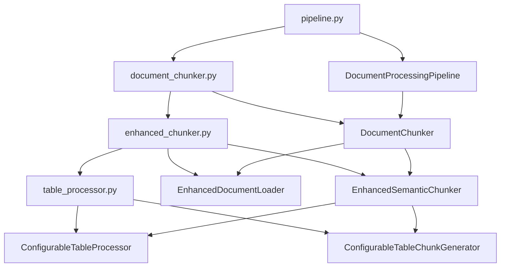

# V501_1_文档分块技术实现深度剖析

## 📋 概述

本文档基于`pipeline.py`第243-258行的文档分块实现，深入分析RAG系统中文档分块模块的技术架构、实现原理和调用关系。

## 🎯 核心代码分析

### 关键代码段（pipeline.py 243-258行）

```python
# 步骤3: 文档分块（文本分块+增强表格处理）
logger.info("步骤3: 开始文档分块处理（文本分块+增强表格处理）...")
chunks = self.document_chunker.process_documents(md_files)
if chunks:
    self.processing_status['document_chunking'] = True
    result['steps']['document_chunking'] = {
        'status': 'success',
        'total_chunks': len(chunks),
        'text_chunks': len([c for c in chunks if c.metadata.get('chunk_type') == 'text']),
        'table_chunks': len([c for c in chunks if c.metadata.get('chunk_type') == 'table'])
    }
    logger.info(f"文档分块完成，生成了 {len(chunks)} 个分块")
else:
    result['errors'].append("文档分块失败")
    logger.error("文档分块失败")
    return result
```

## 🏗️ 架构设计

### 1. 分层架构

```
Pipeline层 (pipeline.py)
    ↓ 调用
DocumentChunker层 (document_chunker.py)
    ↓ 调用
EnhancedChunker层 (enhanced_chunker.py)
    ↓ 调用
TableProcessor层 (table_processor.py)
```

### 2. 核心组件关系图



## 📁 文件功能分析

### 1. pipeline.py - 管道协调层

**功能描述：**
- 作为整个文档处理流程的协调器
- 负责调用各个处理模块并管理处理状态
- 提供统一的错误处理和结果统计

**关键方法：**
```python
def _process_from_markdown_files(self, md_files: List[str], vector_db_path: str)
```

**技术实现：**
- 使用状态管理机制跟踪处理进度
- 采用统一的返回格式包含成功状态、统计信息和错误列表
- 实现分步骤的错误处理和回滚机制

### 2. document_chunker.py - 分块接口层

**功能描述：**
- 提供统一的文档分块接口
- 将内部实现细节封装，对外提供简洁的API
- 负责LangChain Document格式的转换

**关键方法：**
```python
def process_documents(self, md_files: List[str]) -> Optional[List[Document]]
```

**技术实现：**
- 配置参数管理：从config中读取chunk_size和chunk_overlap
- 格式转换：将EnhancedDocumentChunk转换为LangChain Document格式
- 统计信息：提供文本分块和表格分块的详细统计

### 3. enhanced_chunker.py - 增强分块核心层

**功能描述：**
- 实现智能的文档分块算法
- 支持文本和表格的混合处理
- 提供语义感知的分块策略

**核心类：**

#### EnhancedDocumentLoader
```python
class EnhancedDocumentLoader:
    def load_documents(self) -> List[Dict[str, Any]]
```
- **功能**：加载Markdown文件和对应的JSON元数据文件
- **技术实现**：使用Path.glob()遍历文件，自动匹配.md和_1.json文件
- **数据结构**：返回包含文档名称、Markdown内容、JSON数据的字典列表

#### EnhancedSemanticChunker
```python
class EnhancedSemanticChunker:
    def chunk_document(self, document: Dict[str, Any]) -> List[EnhancedDocumentChunk]
```
- **功能**：对单个文档进行语义分块
- **技术实现**：
  - 使用LangChain的RecursiveCharacterTextSplitter进行智能分块
  - 分别处理文本内容和表格内容
  - 维护页码映射关系

#### EnhancedDocumentChunk
```python
@dataclass
class EnhancedDocumentChunk:
    content: str
    document_name: str
    page_number: int
    chunk_index: int
    chunk_type: str = "text"
    table_id: str = None
    table_type: str = None
```
- **功能**：标准化的分块数据结构
- **设计特点**：支持文本和表格两种类型，包含完整的元数据信息

### 4. table_processor.py - 表格处理层

**功能描述：**
- 专门处理文档中的表格内容
- 提供HTML表格解析和结构化转换
- 支持表格分块生成

**核心类：**

#### ConfigurableTableProcessor
```python
class ConfigurableTableProcessor:
    def extract_tables_from_json(self, json_data: List[Dict[str, Any]]) -> List[Dict[str, Any]]
    def parse_html_table(self, html_content: str, table_type: str = "未知表格") -> TableInfo
```
- **功能**：从JSON数据中提取表格信息并解析HTML表格
- **技术实现**：
  - 使用正则表达式解析HTML表格结构
  - 提取表头和数据行
  - 生成表格ID和元数据

#### ConfigurableTableChunkGenerator
```python
class ConfigurableTableChunkGenerator:
    def generate_table_chunks(self, table_info: TableInfo, chunk_size: int = None) -> List[str]
```
- **功能**：将表格内容转换为结构化的文本分块
- **技术实现**：
  - 将表格转换为结构化文本描述
  - 使用LangChain文本分割器进行智能分块
  - 保持表格的语义完整性

## 🔄 调用流程分析

### 1. 主调用链

```python
# pipeline.py 第245行
chunks = self.document_chunker.process_documents(md_files)

# document_chunker.py 第45行
enhanced_chunks = process_documents_with_tables(
    md_dir=md_dir,
    chunk_size=self.chunk_size, 
    chunk_overlap=self.chunk_overlap
)

# enhanced_chunker.py 第312行
def process_documents_with_tables(md_dir, chunk_size, chunk_overlap):
    loader = EnhancedDocumentLoader(md_dir)
    documents = loader.load_documents()
    chunker = EnhancedSemanticChunker(chunk_size, chunk_overlap)
    chunks = chunker.chunk_documents(documents)
```

### 2. 详细执行流程

#### 步骤1：文档加载
```python
# EnhancedDocumentLoader.load_documents()
for md_file in self.md_dir.glob("*.md"):
    doc_name = md_file.stem
    json_file = md_file.with_name(f"{doc_name}_1.json")
    # 读取Markdown和JSON文件
```

#### 步骤2：内容提取
```python
# EnhancedSemanticChunker.chunk_document()
text_content = self._extract_text_content(json_data)
table_content = self._extract_table_content(json_data)
```

#### 步骤3：文本分块
```python
# EnhancedSemanticChunker._process_text_chunks()
text_splitter = RecursiveCharacterTextSplitter(
    separators=["\n\n", "\n", ".", "!", "?", "。", "！", "？", " ", ""],
    chunk_size=self.chunk_size,
    chunk_overlap=self.chunk_overlap
)
text_chunks = text_splitter.split_text(text)
```

#### 步骤4：表格分块
```python
# EnhancedSemanticChunker._process_table_chunks()
table_processor = TableProcessor()
table_info = table_processor.parse_html_table(table_body, "数据表格")
chunk_generator = TableChunkGenerator()
table_chunks = chunk_generator.generate_table_chunks(table_info)
```

#### 步骤5：格式转换
```python
# document_chunker.py 第60-75行
for chunk in enhanced_chunks:
    doc = Document(
        page_content=chunk.content,
        metadata={
            'document_name': chunk.document_name,
            'page_number': chunk.page_number,
            'chunk_index': chunk.chunk_index,
            'chunk_type': chunk.chunk_type,
            'table_id': chunk.table_id,
            'table_type': chunk.table_type
        }
    )
```

## 🛠️ 技术实现细节

### 1. 智能分块策略

**LangChain RecursiveCharacterTextSplitter配置：**
```python
separators=["\n\n", "\n", ".", "!", "?", "。", "！", "？", " ", ""]
```
- **设计理念**：按语义边界进行分割，保持内容的完整性
- **优先级**：段落 > 句子 > 词语 > 字符
- **中文支持**：包含中文标点符号，确保中文文档的正确分块

### 2. 表格处理技术

**HTML表格解析：**
```python
# 正则表达式解析HTML表格
tr_pattern = r'<tr[^>]*>(.*?)</tr>'
cell_pattern = r'<(?:td|th)[^>]*>(.*?)</(?:td|th)>'
```
- **技术特点**：使用正则表达式解析HTML表格结构
- **容错机制**：如果解析失败，回退到简单文本处理
- **结构化输出**：将表格转换为结构化文本描述

### 3. 页码映射算法

**页码分配策略：**
```python
def _find_most_frequent_page(self, chunk: str, full_text: str, page_mapping: Dict[Tuple[int, int], int]) -> int:
    # 统计分块中每个字符位置对应的页码
    # 返回出现次数最多的页码
```
- **算法原理**：基于字符位置统计页码频率
- **应用场景**：为每个分块分配最合适的页码信息
- **优化效果**：提高检索时的位置准确性

### 4. 配置管理

**参数传递链：**
```python
# pipeline.py -> document_chunker.py -> enhanced_chunker.py
self.chunk_size = config.get('chunk_size', 1000)
self.chunk_overlap = config.get('chunk_overlap', 200)
```
- **统一配置**：从顶层配置传递到各个处理模块
- **默认值处理**：提供合理的默认参数
- **灵活性**：支持运行时参数调整

## 📊 性能优化

### 1. 内存管理
- **流式处理**：逐个文档处理，避免一次性加载所有内容
- **及时释放**：处理完成后及时释放临时变量
- **分块缓存**：使用生成器模式减少内存占用

### 2. 错误处理
- **分层容错**：每层都有独立的错误处理机制
- **降级策略**：表格解析失败时回退到文本处理
- **状态恢复**：支持部分失败时的状态恢复

### 3. 并发处理
- **模块化设计**：各模块独立，便于并行处理
- **接口标准化**：统一的输入输出格式
- **可扩展性**：支持添加新的处理模块

## 🔍 关键特性

### 1. 多模态支持
- **文本处理**：支持Markdown文本的智能分块
- **表格处理**：专门的表格解析和分块机制
- **混合处理**：同一文档中文本和表格的混合处理

### 2. 语义保持
- **智能分割**：基于语义边界的智能分块
- **上下文保持**：通过重叠机制保持上下文信息
- **结构保持**：表格的结构化信息得到保持

### 3. 元数据丰富
- **完整追踪**：每个分块都包含完整的元数据
- **类型标识**：明确区分文本和表格分块
- **位置信息**：包含页码和分块索引信息

## 🎯 总结

文档分块模块采用了分层架构设计，通过Pipeline层、DocumentChunker层、EnhancedChunker层和TableProcessor层的协作，实现了高效、智能的文档分块处理。该模块不仅支持传统的文本分块，还专门针对表格内容进行了优化，为RAG系统提供了高质量的分块数据。

**核心优势：**
1. **智能分块**：基于LangChain的语义感知分块
2. **表格优化**：专门的表格处理机制
3. **配置灵活**：支持多种参数配置
4. **错误容错**：完善的错误处理和降级机制
5. **性能优化**：内存友好的流式处理

这个模块为整个RAG系统提供了坚实的分块基础，确保了后续向量化和检索的质量。 