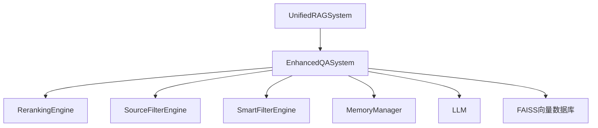

# V501_2_智能问答模块深度剖析

## 📋 概述

本文档基于`enhanced_qa_system.py`及其相关引擎（源过滤、智能过滤、重排序），深入分析RAG系统中智能问答模块的技术架构、实现原理和调用关系。

---

## 🏗️ 架构设计

### 1. 分层架构

```
UnifiedRAGSystem (V501_unified_main.py)
    ↓ 调用
EnhancedQASystem (enhanced_qa_system.py)
    ↓ 调用
RerankingEngine (reranking_engine.py)
SourceFilterEngine (source_filter_engine.py)
SmartFilterEngine (smart_filter_engine.py)
MemoryManager (memory_manager.py)
    ↓ 调用
LLM (Tongyi, DashScope API)
    ↓
向量数据库 (FAISS)
```

### 2. 核心组件关系图



---

## 📁 文件功能分析

### 1. enhanced_qa_system.py - 智能问答主引擎

**功能描述：**

- 负责整个问答流程的调度与集成
- 管理向量检索、过滤、重排序、LLM调用、记忆等
- 统一对外暴露`answer_question`、`answer_with_memory`等接口

**关键方法：**

```python
def answer_question(self, question, k=None)
def answer_with_memory(self, user_id, question, k=None)
```

**技术实现：**

- 初始化时加载向量数据库、LLM、各类引擎
- 支持多模态检索（文本、图片）
- 多层过滤与重排序，提升答案相关性和质量
- 可选记忆管理，支持多轮对话

---

### 2. reranking_engine.py - 重排序引擎

**功能描述：**

- 对候选内容进行多维度重排序（如语义分数、关键词分数、混合策略等）
- 使最相关、最优质的内容排在前面

**关键方法：**

```python
def rerank_results(self, results: List[Dict[str, Any]], question: str) -> List[Dict[str, Any]]
```

**技术实现：**

- 支持多种重排序策略（hybrid/semantic/keyword）
- 综合语义、关键词、内容质量等多维评分
- 动态调整排序权重

---

### 3. source_filter_engine.py - 源过滤引擎

**功能描述：**

- 对检索到的内容进行“源头”级别的过滤
- 过滤掉不可信、无关、重复、低质量的内容

**关键方法：**

```python
def filter_sources(self, results: List[Dict[str, Any]], question: str) -> List[Dict[str, Any]]
```

**技术实现：**

- 相关性分数计算（语义、关键词、质量）
- 支持多样性控制和阈值动态调整
- 结果数量限制

---

### 4. smart_filter_engine.py - 智能过滤引擎

**功能描述：**

- 用更智能的方式（如语义相似度、关键词、内容特征等）过滤候选内容
- 进一步提升检索内容的相关性和质量

**关键方法：**

```python
def filter_results(self, results: List[Dict[str, Any]], question: str) -> List[Dict[str, Any]]
```

**技术实现：**

- 语义相似度过滤
- 关键词匹配过滤
- 内容相关性过滤
- 多样性控制

---

### 5. memory_manager.py - 记忆管理器

**功能描述：**

- 保存用户对话历史
- 基于语义的相关性计算
- 智能的记忆检索机制

**关键方法：**

```python
def get_relevant_memory(self, question: str, user_id: str = "default_user") -> List[Dict[str, Any]]
def add_memory(self, question, answer, user_id)
```

---

## 🔄 调用流程分析

### 1. 主调用链

```python
# UnifiedRAGSystem.ask_question
if use_memory:
    result = self.qa_system.answer_with_memory(user_id, question)
else:
    result = self.qa_system.answer_question(question)
```

### 2. EnhancedQASystem内部处理流程

```python
def answer_question(self, question, k=None):
    docs = self._initial_retrieval(question, k)
    docs = self._apply_smart_filtering(question, docs)
    docs = self._apply_reranking(question, docs)
    answer_dict = self._generate_answer(question, docs)
    sources = self._apply_source_filtering(answer_dict['answer'], docs)
    final_answer = self.append_sources_to_answer(answer_dict['answer'], sources)
    return {'answer': final_answer, 'sources': sources, ...}
```

### 3. 多模态检索与融合

- 文本与图片分别检索，结果融合与平衡
- 动态补充不足的内容类型，保证多模态覆盖

---

## 🛠️ 技术实现细节

### 1. 多层过滤与重排序

- **智能过滤**：语义相似度、关键词、内容相关性
- **重排序**：混合评分算法，动态权重
- **源过滤**：相关性阈值、质量评估、多样性控制

### 2. LLM调用与答案生成

- 上下文构建与prompt设计
- LLM生成答案
- 答案后处理与引用拼接

### 3. 记忆管理与多轮对话

- 相关记忆检索与增强
- 新对话自动存储
- 相关性阈值优化

---

## ⚙️ 配置参数详解

### 1. 问答系统参数

```json
{
  "qa_system": {
    "model_name": "qwen-plus-latest",
    "temperature": 0.5,
    "max_tokens": 1500,
    "enable_sources_filtering": true,
    "min_relevance_score": 0.001,
    "enable_keyword_matching": true,
    "enable_image_id_matching": true,
    "enable_similarity_filtering": true
  }
}
```

### 2. 过滤与重排序参数

```json
{
  "processing": {
    "enable_smart_filtering": true,
    "semantic_similarity_threshold": 0.1,
    "content_relevance_threshold": 0.01,
    "max_filtered_results": 5
  },
  "vector_store": {
    "enable_reranking": true,
    "reranking_method": "hybrid",
    "semantic_weight": 0.7,
    "keyword_weight": 0.3,
    "min_similarity_threshold": 0.001
  }
}
```

---

## 📊 性能优化

### 1. 检索与过滤优化

- 向量检索采用FAISS高效索引
- 多层过滤减少无关内容
- 阈值与权重可调，支持动态调优

### 2. LLM生成优化

- Prompt优化与上下文压缩
- 支持异步处理与模型缓存

### 3. 记忆与多轮对话优化

- 相关性阈值调优
- 记忆条数限制与排序

---

## 🔍 关键特性

1. **多引擎协作**：过滤、重排序、记忆等多引擎协作
2. **多模态支持**：文本、图片内容的智能处理与融合
3. **高度可配置**：参数化配置，便于调优
4. **错误恢复**：完善的错误处理和降级机制
5. **扩展性强**：模块化设计，便于扩展和维护

---

## 🎯 总结

智能问答模块是RAG系统的核心业务层，采用分层架构和多引擎协作机制，实现了从用户查询到答案生成的完整智能链路。其多模态检索、智能过滤、重排序、记忆管理等机制，极大提升了问答的相关性、准确性和用户体验。模块化设计和参数化配置为系统的扩展和优化提供了坚实基础。


# 五个步骤实现精准检索的原理与实现方法

## 总体流程

在增强版RAG问答系统中，`answer_question` 方法通过五个关键步骤，逐步优化检索结果，提升问答的相关性和准确性。这五步分别是：

1. **初始检索**
2. **重排序优化**
3. **智能过滤**
4. **生成回答**
5. **源过滤优化**

下面逐步详细说明每一步的原理和实现。

---

## 1. 初始检索

### 原理

- 首先根据用户问题（question），在向量数据库中检索与问题最相关的文档片段。
- 采用**语义相似度检索**，即将问题向量化，与所有文档片段的向量做相似度计算，选出最相关的若干个文档。

### 实现方法

- 调用 `self._initial_retrieval(question, k)`，其中 `k` 是检索的文档数量。
- 该方法会遍历所有文档来源，确保每个文档都能被公平检索（防止只从某一个文档中检索）。
- 如果有剩余配额，再全局补充相似度最高的文档，保证检索结果的多样性和覆盖面。
- 代码片段：
  ```python
  initial_docs = self._initial_retrieval(question, k)
  ```

---

## 2. 重排序优化

### 原理

- 初始检索得到的文档虽然相关，但顺序未必最优。
- 通过**重排序引擎**，对初始检索结果再次排序，使得最相关、最有用的文档排在前面。

### 实现方法

- 调用 `self._apply_reranking(question, initial_docs)`。
- 该方法会将初始检索的文档传递给重排序引擎（如基于语义分数、混合特征等），重新计算每个文档与问题的相关性分数，并按分数排序。
- 代码片段：
  ```python
  reranked_docs = self._apply_reranking(question, initial_docs)
  ```

---

## 3. 智能过滤

### 原理

- 有些文档虽然相关，但可能是噪音或冗余信息。
- 通过**智能过滤引擎**，进一步筛选出最有价值的文档，去除无关或重复内容。

### 实现方法

- 调用 `self._apply_smart_filtering(question, reranked_docs)`。
- 智能过滤可以基于多种特征（如内容去重、上下文相关性、特定领域规则等）进行筛选。
- 代码片段：
  ```python
  filtered_docs = self._apply_smart_filtering(question, reranked_docs)
  ```

---

## 4. 生成回答

### 原理

- 利用经过多轮优化后的文档片段，结合大语言模型（LLM），生成针对用户问题的精准回答。
- 只用最相关的文档作为上下文，提升回答的针对性和准确性。

### 实现方法

- 调用 `self._generate_answer(question, filtered_docs)`。
- 该方法会将筛选后的文档和问题一起传递给 LLM，生成最终的自然语言回答。
- 代码片段：
  ```python
  answer_result = self._generate_answer(question, filtered_docs)
  ```

---

## 5. 源过滤优化

### 原理

- 回答生成后，进一步对文档源进行优化，确保最终引用的文档来源最为权威、相关。
- 可以去除与最终答案无关的文档，提升溯源的准确性。

### 实现方法

- 调用 `self._apply_source_filtering(answer_result['answer'], filtered_docs)`。
- 该方法会根据 LLM 生成的答案内容，筛选出真正为答案提供支撑的文档源。
- 代码片段：
  ```python
  final_sources = self._apply_source_filtering(answer_result['answer'], filtered_docs)
  ```

---

# 总结

这五步层层递进，**从粗到精**，实现了高质量的精准检索：

1. **初始检索**：保证召回率和多样性。
2. **重排序**：提升相关性和优先级。
3. **智能过滤**：去除冗余和噪音。
4. **生成回答**：用最优上下文生成高质量答案。
5. **源过滤**：确保答案的可追溯性和权威性。

每一步都在为最终的问答质量把关，确保用户得到**准确、权威、可解释**的答案。

---

# 1. 初始检索：`self._initial_retrieval(question, k)`

### 作用
- 在所有文档中，**初步召回**与问题最相关的文档片段，为后续优化打基础。

### 关键参数
- `question`：用户问题（可能包含历史上下文）。
- `k`：需要检索的文档数量。

### 核心逻辑
- 遍历所有文档来源（如不同报告、不同文件），为每个文档分配检索配额，保证召回的多样性。
- 对每个文档，调用 `self.vector_store.similarity_search(question, k=base_k_per_doc, filter={"document_name": doc_name})`，检索与问题最相关的片段。
- 如果还有剩余配额，再全局检索补充最相关的文档，避免遗漏高相关内容。
- 最终返回前 `k` 个最相关的文档片段。

### 代码片段
```python
def _initial_retrieval(self, question, k):
    # ...省略部分...
    for doc_name in doc_names:
        docs = self.vector_store.similarity_search(
            question, 
            k=base_k_per_doc,
            filter={"document_name": doc_name}
        )
        all_docs.extend(docs)
    # 补充检索
    if remaining_k > 0:
        all_available_docs = self.vector_store.similarity_search(question, k=k*2)
        # 过滤去重，补足数量
    # 返回前k个
    return all_docs[:k]
```

### 依赖方法
- `self.vector_store.similarity_search(...)`：底层向量数据库的相似度检索方法，返回与输入问题最相似的文档片段。

---

# 2. 重排序优化：`self._apply_reranking(question, initial_docs)`

### 开关

-   "enable_reranking": true,
-  "reranking_method": "semantic"
- reranking 开启，方法为 semantic,可选三种

### 作用

- 对初始检索结果进行**相关性再排序**，提升最优文档的优先级。

### 关键参数
- `question`：用户问题。
- `initial_docs`：初始检索得到的文档片段列表。

### 核心逻辑
- 将每个文档片段转为字典格式，包含内容、元数据、初始分数等。
- 调用 `self.reranking_engine.rerank_results(question, doc_dicts)`，对所有文档重新打分排序。
- 按新分数排序后，转回 `Document` 对象列表，供后续处理。


### 代码片段
```python
def _apply_reranking(self, question, documents):
    doc_dicts = [{'content': doc.page_content, 'metadata': doc.metadata, 'score': getattr(doc, 'score', 0.0)} for doc in documents]
    reranked_dicts = self.reranking_engine.rerank_results(question, doc_dicts)
    # 转回Document对象
    reranked_docs = [Document(page_content=d['content'], metadata=d['metadata']) for d in reranked_dicts]
    return reranked_docs
```

### 依赖方法
- `self.reranking_engine.rerank_results(question, doc_dicts)`：重排序引擎，通常基于更复杂的语义模型或混合特征对文档相关性进行再评估。

#### 1. 方法入口

```python
def rerank_results(self, query: str, documents: List[Dict[str, Any]]) -> List[Dict[str, Any]]:
    # ...
```

- **query**：用户问题
- **documents**：初步检索得到的文档片段（每个是字典，含content、metadata等）

---

#### 2. 支持三种重排序方式

##### 1）语义重排序（semantic）

- 方法：`self._semantic_rerank(query, documents)`

- **原理**：用 TF-IDF 向量化 query 和所有文档内容，计算 query 与每个文档的**余弦相似度**，分数越高越相关。

- **流程**：

  1. 用 TF-IDF 向量器将 query 和所有文档内容转为向量。
  2. 计算 query 向量与每个文档向量的余弦相似度。
  3. 把相似度分数写入每个文档的 `semantic_score` 和 `rerank_score` 字段。
  4. 按 `rerank_score` 降序排序，返回排序后的文档列表。

- **核心代码**：

  ```python
  doc_texts = [doc.get('content', '') for doc in documents]
  all_texts = [query] + doc_texts
  tfidf_matrix = self.tfidf_vectorizer.fit_transform(all_texts)
  similarities = cosine_similarity(query_vector, doc_vectors).flatten()
  for i, doc in enumerate(documents):
      doc['semantic_score'] = float(similarities[i])
      doc['rerank_score'] = doc['semantic_score']
  reranked_docs = sorted(documents, key=lambda x: x['rerank_score'], reverse=True)
  ```

---

##### 2）关键词重排序（keyword）

- 方法：`self._keyword_rerank(query, documents)`

- **原理**：提取 query 的关键词，统计每个文档内容中关键词的出现情况，出现越多分数越高。

- **流程**：

  1. 提取 query 的关键词（如分词、去停用词等）。
  2. 对每个文档，计算关键词在内容中出现的频率或覆盖度，作为 `keyword_score`。
  3. 把 `keyword_score` 赋值给 `rerank_score` 字段。
  4. 按 `rerank_score` 降序排序，返回排序后的文档列表。

- **核心代码**：

  ```python
  query_keywords = self._extract_keywords(query)
  for doc in documents:
      keyword_score = self._calculate_keyword_score(query_keywords, doc_content)
      doc['keyword_score'] = keyword_score
      doc['rerank_score'] = keyword_score
  reranked_docs = sorted(documents, key=lambda x: x['rerank_score'], reverse=True)
  ```

---

##### 3）混合重排序（hybrid）

- 方法：`self._hybrid_rerank(query, documents)`

- **原理**：结合语义分数和关键词分数，综合评估文档与 query 的相关性。

- **流程**：

  1. 分别计算语义分数（TF-IDF 余弦相似度）和关键词分数。
  2. 按一定权重（如 0.7*语义分数 + 0.3*关键词分数）合成最终 `rerank_score`。
  3. 按 `rerank_score` 降序排序，返回排序后的文档列表。

- **核心代码**（伪代码，具体权重和实现见实际代码）：

  ```python
  for doc in documents:
      doc['rerank_score'] = 0.7 * doc['semantic_score'] + 0.3 * doc['keyword_score']
  reranked_docs = sorted(documents, key=lambda x: x['rerank_score'], reverse=True)
  ```

---

#### 3. 选择重排序方式

- 由 `self.reranking_method` 决定，支持 `'semantic'`、`'keyword'`、`'hybrid'` 三种。
- 默认推荐用 `'hybrid'`，兼顾语义和关键词的优势。

---

#### 4. 失败兜底

- 如果重排序过程中出错，会 logger.error 并返回原始文档顺序，不影响主流程健壮性。

---

# 3. 智能过滤：`self._apply_smart_filtering(question, reranked_docs)`

### 开关： "enable_smart_filtering": false  表明默认是关的。

### 作用

- 对重排序后的文档进行**进一步筛选**，去除冗余、噪音或低质量内容。

### 关键参数
- `question`：用户问题。
- `reranked_docs`：重排序后的文档片段列表。

### 核心逻辑
- 将文档转为字典格式，便于后续处理。
- 调用 `self.smart_filter_engine.smart_filter(question, doc_dicts)`，根据多种特征（如内容去重、上下文相关性、领域规则等）进行智能筛选。
- 筛选后再转回 `Document` 对象列表。

### 代码片段
```python
def _apply_smart_filtering(self, question, documents):
    doc_dicts = [{'content': doc.page_content, 'metadata': doc.metadata, 'score': getattr(doc, 'score', 0.0)} for doc in documents]
    filtered_dicts = self.smart_filter_engine.smart_filter(question, doc_dicts)
    filtered_docs = [Document(page_content=d['content'], metadata=d['metadata']) for d in filtered_dicts]
    return filtered_docs
```

### 依赖方法
- `self.smart_filter_engine.smart_filter(question, doc_dicts)`：智能过滤引擎，支持多种自定义过滤策略（如去重、领域特定规则等）。

#### 1. 方法入口

```python
def smart_filter(self, query: str, documents: List[Dict[str, Any]], llm_answer: str = None, user_context: Dict[str, Any] = None) -> List[Dict[str, Any]]:
    # ...
```

- **query**：用户问题
- **documents**：待过滤的文档片段（字典格式）
- **llm_answer**：大模型生成的答案（可选）
- **user_context**：用户上下文（可选）

---

#### 2. 主要处理流程

##### 1）分数计算

对每个文档，计算四类相关性分数：

- **内容相关性分数**（content_score）：关键词、短语、实体等匹配度。
- **语义相似度分数**（semantic_score）：query 与文档内容的语义相似度。
- **上下文相关性分数**（context_score）：结合用户上下文、历史对话等信息的相关性。
- **用户意图匹配分数**（intent_score）：query 的意图与文档内容/LLM答案的意图匹配度。

每个分数的计算都调用了专门的子方法（见下文）。

##### 2）综合分数

- 调用 `_calculate_final_score(content_score, semantic_score, context_score, intent_score)`，将上述分数加权合成一个**最终分数**（final_score）。

##### 3）排序与过滤

- 按 final_score 降序排序所有文档。
- 过滤掉分数低于阈值（`self.content_relevance_threshold`）的文档。
- 最多保留 `self.max_filtered_results` 个文档。

---

#### 3. 关键子方法说明

##### 1）内容相关性分数 `_calculate_content_relevance`

- 关键词匹配：提取 query 和文档内容的关键词，计算重叠度。
- 短语匹配：提取 query 和内容的短语，计算相似度。
- 实体匹配：提取命名实体，计算重叠度。
- 综合上述得分，反映 query 与文档在“字面”上的相关性。

##### 2）语义相似度分数 `_calculate_semantic_similarity`

- 通过 SequenceMatcher 计算用户问题和文档内容之间的相似度分数（ratio），反映二者的文本相似性。
- 如果相似度分数低于设定的阈值（self.semantic_similarity_threshold），则分数被置为0，表示语义相关性不足。
- 最终返回的分数越高，说明该文档内容与用户问题在文本层面越接近，更有可能被认为是相关内容。

##### 3）上下文相关性分数 `_calculate_context_relevance`

- 利用用户上下文（如历史对话、用户偏好等），判断文档内容与当前上下文的相关性。
- 例如，如果用户之前一直关注某个主题，则与该主题相关的文档得分更高。

##### 4）用户意图匹配分数 `_calculate_intent_relevance`

- 分析 query 的意图、文档内容的意图、LLM答案的意图，计算它们之间的匹配度。
- 例如，用户问“最新的财报”，则与“时间”相关的文档得分更高。

##### 5）综合分数 `_calculate_final_score`

- 按一定权重（可配置）将上述四类分数合成最终分数。
- 例如：`final_score = 0.4*content + 0.3*semantic + 0.2*context + 0.1*intent`（具体权重见实际实现）。

---

#### 4. 伪代码流程

```python
for doc in documents:
    content_score = self._calculate_content_relevance(query, doc)
    semantic_score = self._calculate_semantic_similarity(query, doc)
    context_score = self._calculate_context_relevance(query, doc, user_context)
    intent_score = self._calculate_intent_relevance(query, doc, llm_answer)
    final_score = self._calculate_final_score(content_score, semantic_score, context_score, intent_score)
    doc['smart_filter_scores'] = {...}
    scored_documents.append(doc)

sorted_documents = sorted(scored_documents, key=lambda x: x['smart_filter_scores']['final_score'], reverse=True)
filtered_documents = [doc for doc in sorted_documents if doc['smart_filter_scores']['final_score'] >= threshold]
final_documents = filtered_documents[:max_results]
```

---

#### 5. 智能过滤的意义

- **多维度相关性评估**，不仅仅依赖关键词或语义，还结合上下文和意图，极大提升了检索的精准度和用户体验。
- **可扩展性强**，可以根据实际业务需求灵活调整各分数的计算方式和权重。

---

# 4. 生成回答：`self._generate_answer(question, filtered_docs)`

### 作用
- 利用筛选后的文档片段，结合大语言模型（LLM），**生成针对用户问题的自然语言回答**。

### 关键参数
- `question`：用户问题。
- `filtered_docs`：最终筛选出的文档片段列表。

### 核心逻辑
- 将文档片段拼接为上下文字符串。
- 调用 `self.qa_chain.invoke({"input_documents": documents, "question": question})`，将上下文和问题一起传递给 LLM。
- 解析 LLM 返回的结果，提取最终回答文本。
- 计算本次问答的 token 成本。

### 代码片段
```python
def _generate_answer(self, question, documents):
    context = "\n\n".join([doc.page_content for doc in documents])
    response = self.qa_chain.invoke({
        "input_documents": documents,
        "question": question
    })
    # 解析response，提取answer
    return {'answer': response, 'cost': cost}
```

### 依赖方法
- `self.qa_chain.invoke(...)`：LangChain 的问答链，底层调用大语言模型（如通义千问、OpenAI等），根据上下文和问题生成自然语言回答。

---

# 5. 源过滤优化：`self._apply_source_filtering(answer_result['answer'], filtered_docs)`

### 开关

源过滤引擎支持多种配置参数：

- enable_sources_filtering：是否启用源过滤

- min_relevance_score：最小相关性分数阈值

- enable_keyword_matching：是否启用关键词匹配

- enable_image_id_matching：是否启用图片ID匹配

- enable_similarity_filtering：是否启用相似度过滤

### 作用

- 对最终回答涉及的文档源进行**进一步筛选**，只保留真正为答案提供支撑的文档，提升可追溯性和权威性。

### 关键参数
- `llm_answer`：大模型生成的最终回答文本。
- `filtered_docs`：参与生成回答的文档片段列表。

### 核心逻辑
- 将文档片段转为源格式（包含内容、元数据、分数等）。
- 调用 `self.source_filter_engine.filter_sources(llm_answer, sources)`，根据答案内容和文档内容的相关性，筛选出最有价值的文档源。
- 返回最终的文档源列表。

### 代码片段
```python
def _apply_source_filtering(self, llm_answer, documents):
    sources = [{'content': doc.page_content, 'metadata': doc.metadata, 'score': getattr(doc, 'score', 0.0)} for doc in documents]
    filtered_sources = self.source_filter_engine.filter_sources(llm_answer, sources)
    return filtered_sources
```

### 依赖方法
- `self.source_filter_engine.filter_sources(llm_answer, sources)`：源过滤引擎，通常基于答案与文档内容的相似度、引用关系等，筛选出最相关的文档源。

#### 1. 方法概述

```python
def _apply_source_filtering(self, llm_answer: str, documents: List[Document]) -> List[Dict[str, Any]]:
```

**作用**：根据大模型生成的答案内容，对参与生成答案的文档源进行进一步筛选，确保最终引用的文档真正为答案提供了支撑。

---

#### 2. 核心实现逻辑

##### 2.1 前置检查

```python
if not self.source_filter_engine or not documents:
    # 转换为源格式
    sources = []
    for doc in documents:
        source = {
            'content': doc.page_content,
            'metadata': doc.metadata,
            'score': getattr(doc, 'score', 0.0)
        }
        sources.append(source)
    return sources
```

**机制**：
- 如果源过滤引擎未初始化或文档列表为空，**跳过源过滤**，直接返回所有文档
- 将 `Document` 对象转换为字典格式，便于后续处理
- 每个源包含：内容、元数据、相似度分数

##### 2.2 正常源过滤流程

```python
try:
    # 转换为源格式
    sources = []
    for doc in documents:
        source = {
            'content': doc.page_content,
            'metadata': doc.metadata,
            'score': getattr(doc, 'score', 0.0)
        }
        sources.append(source)
    
    # 执行源过滤
    filtered_sources = self.source_filter_engine.filter_sources(llm_answer, sources)
    
    return filtered_sources
    
except Exception as e:
    logger.error(f"源过滤失败: {e}")
    return sources
```

**机制**：
- 将文档转换为统一格式
- 调用 `self.source_filter_engine.filter_sources(llm_answer, sources)` 进行源过滤
- 如果过滤失败，返回原始源列表（保证系统健壮性）

---

#### 3. 源过滤的核心思想

##### 3.1 输入参数
- **llm_answer**：大模型生成的最终答案文本
- **documents**：参与生成答案的文档片段列表

##### 3.2 过滤目标
- 根据答案内容，判断哪些文档真正为答案提供了信息支撑
- 去除与答案无关的文档源，提升答案的可追溯性和权威性

##### 3.3 实现策略
源过滤引擎（`self.source_filter_engine`）通常会采用以下策略：

1. **内容相关性分析**：计算答案与每个文档内容的相似度
2. **关键词匹配**：检查答案中的关键信息是否来自特定文档
3. **引用关系分析**：判断答案是否引用了文档中的具体数据或观点
4. **重要性评估**：根据文档在答案中的贡献度进行排序

---

#### 4. 数据格式转换

##### 4.1 输入格式（Document对象）
```python
Document(
    page_content="文档内容...",
    metadata={
        'document_name': '文档名称',
        'page_number': 页码,
        'chunk_type': 'chunk类型',
        # 其他元数据...
    }
)
```

##### 4.2 输出格式（字典列表）
```python
[
    {
        'content': '文档内容...',
        'metadata': {
            'document_name': '文档名称',
            'page_number': 页码,
            # 其他元数据...
        },
        'score': 0.85  # 相似度分数
    },
    # 更多源...
]
```

---

#### 5. 错误处理机制

```python
except Exception as e:
    logger.error(f"源过滤失败: {e}")
    return sources
```

**机制**：
- 捕获源过滤过程中的任何异常
- 记录错误日志，便于调试
- 返回原始源列表，确保系统不会因为源过滤失败而中断

---

#### 6. 在整体流程中的作用

源过滤是RAG系统的**最后一道质量关卡**：

1. **初始检索** → 召回相关文档
2. **重排序** → 提升文档优先级
3. **智能过滤** → 去除冗余内容
4. **生成回答** → 基于筛选后的文档生成答案
5. **源过滤** → **确保答案的可追溯性**

---

#### 7. 实际应用场景

- **学术问答**：确保引用的文献真正支持答案
- **商业报告**：验证数据来源的准确性
- **法律咨询**：确保引用的法条与问题相关
- **技术文档**：保证技术说明的来源可靠性

---

## 总结

源过滤机制通过**答案导向的文档筛选**，确保最终呈现给用户的文档源真正为答案提供了支撑，提升了RAG系统的可信度和可解释性。即使源过滤失败，系统也能正常运行，体现了良好的容错设计。

## 补充：filter_sources 的实现机制


## 1. 方法入口

```python
def filter_sources(self, llm_answer: str, sources: List[Dict[str, Any]]) -> List[Dict[str, Any]]:
```

**作用**：根据大模型生成的答案内容，对检索源进行过滤，只保留真正为答案提供支撑的文档源。

---

## 2. 核心处理流程

### 2.1 前置检查

```python
if not self.enable_sources_filtering or not sources:
    return sources
```

- 如果源过滤功能被禁用或源列表为空，直接返回原始源列表

### 2.2 源过滤主流程

```python
filtered_sources = []

for source in sources:
    relevance_score = self._calculate_source_relevance(llm_answer, source)
    source['relevance_score'] = relevance_score
    
    # 根据相关性分数决定是否保留
    if relevance_score >= self.min_relevance_score:
        filtered_sources.append(source)
```

**机制**：
- 遍历每个源，计算其与LLM答案的相关性分数
- 将相关性分数添加到源的元数据中
- 只保留相关性分数达到阈值（`self.min_relevance_score`）的源

---

## 3. 相关性分数计算

核心方法是 `_calculate_source_relevance`，它综合了三种相关性评估：

### 3.1 关键词匹配分数

```python
if self.enable_keyword_matching:
    keyword_score = self._calculate_keyword_relevance(llm_answer, source)
    scores.append(keyword_score)
```

**实现**：
- 提取LLM答案和源内容的关键词
- 计算关键词的Jaccard相似度（交集/并集）
- 反映答案与源在关键词层面的匹配程度

### 3.2 图片ID匹配分数

```python
if self.enable_image_id_matching:
    image_score = self._calculate_image_relevance(llm_answer, source)
    scores.append(image_score)
```

**实现**：
- 从LLM答案中提取图片ID（如"图1"、"图2"等）
- 从源内容中提取图片ID
- 计算图片ID的重叠度，判断答案是否引用了特定图片

### 3.3 相似度过滤分数

```python
if self.enable_similarity_filtering:
    similarity_score = self._calculate_similarity_relevance(llm_answer, source)
    scores.append(similarity_score)
```

**实现**：
- 使用文本相似度算法（如TF-IDF、余弦相似度等）
- 计算LLM答案与源内容的整体相似度
- 反映答案与源在语义层面的相关性

### 3.4 综合分数计算

```python
if not scores:
    return 0.5

# 返回平均分数
return sum(scores) / len(scores)
```

- 将三种分数取平均值作为最终的相关性分数
- 如果没有启用任何过滤方法，返回默认分数0.5

---

## 4. 具体实现细节

### 4.1 关键词匹配实现

```python
def _calculate_keyword_relevance(self, llm_answer: str, source: Dict[str, Any]) -> float:
    # 提取关键词
    answer_keywords = self._extract_keywords(llm_answer)
    source_keywords = self._extract_keywords(source.get('content', ''))
    
    # 计算Jaccard相似度
    answer_keyword_set = set(answer_keywords)
    source_keyword_set = set(source_keywords)
    
    intersection = answer_keyword_set & source_keyword_set
    union = answer_keyword_set | source_keyword_set
    
    return len(intersection) / len(union) if union else 0.0
```

### 4.2 图片ID匹配实现

```python
def _calculate_image_relevance(self, llm_answer: str, source: Dict[str, Any]) -> float:
    # 提取图片ID
    answer_image_ids = self._extract_image_ids(llm_answer)
    source_image_ids = self._extract_image_ids_from_source(source)
    
    # 计算重叠度
    if not answer_image_ids or not source_image_ids:
        return 0.0
    
    intersection = set(answer_image_ids) & set(source_image_ids)
    return len(intersection) / max(len(answer_image_ids), len(source_image_ids))
```

---

## 5. 配置参数

源过滤引擎支持多种配置参数：

- `enable_sources_filtering`：是否启用源过滤
- `min_relevance_score`：最小相关性分数阈值
- `enable_keyword_matching`：是否启用关键词匹配
- `enable_image_id_matching`：是否启用图片ID匹配
- `enable_similarity_filtering`：是否启用相似度过滤

---

## 6. 错误处理

```python
except Exception as e:
    logger.error(f"源过滤失败: {e}")
    return sources
```

- 捕获源过滤过程中的异常
- 记录错误日志
- 返回原始源列表，确保系统健壮性

---

## 总结

`filter_sources` 通过**多维度相关性评估**（关键词、图片ID、语义相似度），确保最终返回的源真正为LLM答案提供了支撑，提升了RAG系统的可追溯性和可信度。


---

# 总结

每一步的核心方法都承担着**信息筛选、优化和提升相关性的关键作用**，它们通过层层递进的方式，最终实现了高质量、可追溯的精准问答。

如需进一步深入某个方法的内部实现（比如重排序、智能过滤、源过滤的具体算法），可以继续指定，我会为你详细剖析！


