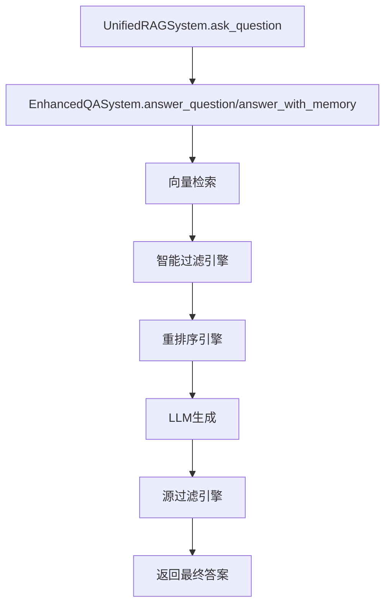

## 1. 智能问答模块整体实现与主流程

### 1.1 入口与主流程

- **主入口**：`V501_unified_main.py` → `UnifiedRAGSystem` 类
- **问答流程**：`UnifiedRAGSystem.ask_question()`  
  - 选择是否用记忆（`use_memory`），调用 `self.qa_system.answer_with_memory()` 或 `self.qa_system.answer_question()`
  - `self.qa_system` 实际为 `EnhancedQASystem` 实例

#### 关键代码片段
```python
def ask_question(self, question: str, user_id: str = "default_user", use_memory: bool = True) -> dict:
    if use_memory:
        result = self.qa_system.answer_with_memory(user_id, question)
    else:
        result = self.qa_system.answer_question(question)
    # 返回answer、sources、cost等
```

### 1.2 EnhancedQASystem 的初始化

- 由 `load_enhanced_qa_system` 工厂函数创建，传入向量库路径、API key、记忆管理器、配置字典
- 内部会初始化四大引擎（重排序、源过滤、智能过滤）和 LLM

---

## 2. 四大核心引擎的实现与作用

### 2.1 增强问答系统（`enhanced_qa_system.py`）

#### 主要职责
- 负责整个问答流程的调度与集成
- 管理向量检索、过滤、重排序、LLM调用、记忆等
- 统一对外暴露 `answer_question`、`answer_with_memory` 等接口

#### 主要流程
1. **向量检索**：根据问题检索相关文档（图片/文本/表格等）
2. **智能过滤**：用智能过滤引擎筛选更相关内容
3. **重排序**：用重排序引擎对候选内容排序
4. **源过滤**：用源过滤引擎进一步过滤不合格内容
5. **LLM生成**：用大模型生成最终答案
6. **记忆管理**：可选地结合历史对话记忆

#### 关键方法
- `answer_question(question, k=None)`
- `answer_with_memory(user_id, question, k=None)`

#### 主要成员
- `self.vector_store`：向量数据库
- `self.llm`：大语言模型
- `self.memory_manager`：记忆管理器
- `self.reranking_engine`：重排序引擎
- `self.source_filter_engine`：源过滤引擎
- `self.smart_filter_engine`：智能过滤引擎

---

### 2.2 源过滤引擎（`source_filter_engine.py`）

#### 主要职责
- 对检索到的内容进行“源头”级别的过滤
- 过滤掉不可信、无关、重复、低质量的内容
- 支持多种过滤策略（如文档类型、来源、置信度等）

#### 典型用法
- 在 EnhancedQASystem 的 `_apply_source_filtering` 阶段调用
- 输入为 LLM 生成的答案和候选文档，输出为过滤后的文档列表

---

### 2.3 智能过滤引擎（`smart_filter_engine.py`）

#### 主要职责
- 用更智能的方式（如语义相似度、关键词、内容特征等）过滤候选内容
- 进一步提升检索内容的相关性和质量

#### 典型用法
- 在 EnhancedQASystem 的 `_apply_smart_filtering` 阶段调用
- 输入为初步检索到的文档，输出为过滤后的文档

---

### 2.4 重排序引擎（`reranking_engine.py`）

#### 主要职责
- 对候选内容进行多维度重排序（如语义分数、关键词分数、混合策略等）
- 使最相关、最优质的内容排在前面

#### 典型用法
- 在 EnhancedQASystem 的 `_apply_reranking` 阶段调用
- 输入为过滤后的文档，输出为排序后的文档

---

## 3. 组件间调用关系与数据流

### 3.1 主流程调用链



### 3.2 代码级调用关系

- `UnifiedRAGSystem.ask_question`  
  → `EnhancedQASystem.answer_question/answer_with_memory`  
    → `_initial_retrieval`（向量检索）  
    → `_apply_smart_filtering`（智能过滤）  
    → `_apply_reranking`（重排序）  
    → `_generate_answer`（LLM生成）  
    → `_apply_source_filtering`（源过滤）  
    → `append_sources_to_answer`（答案拼接引用）

### 3.3 伪代码流程

```python
def answer_question(self, question, k=None):
    docs = self._initial_retrieval(question, k)
    docs = self._apply_smart_filtering(question, docs)
    docs = self._apply_reranking(question, docs)
    answer_dict = self._generate_answer(question, docs)
    sources = self._apply_source_filtering(answer_dict['answer'], docs)
    final_answer = self.append_sources_to_answer(answer_dict['answer'], sources)
    return {'answer': final_answer, 'sources': sources, ...}
```

---

## 4. 各引擎的初始化与配置

- EnhancedQASystem 初始化时会自动创建各引擎实例，并根据 config 配置参数调整行为
- 支持多种重排序/过滤策略（如 hybrid、semantic、keyword 等）

---

## 5. 总结与亮点

- **高度模块化**：每个引擎独立，便于扩展和调优
- **多层过滤与排序**：保证答案相关性和质量
- **参数化配置**：所有策略和模型均可通过 config.json 灵活调整
- **记忆与上下文支持**：可选地结合历史对话，提升多轮问答体验

---

### 如需进一步剖析某个引擎的具体实现细节（如源码级分析、参数说明、典型用法等），请告知具体模块或函数名，我可继续深入分析。