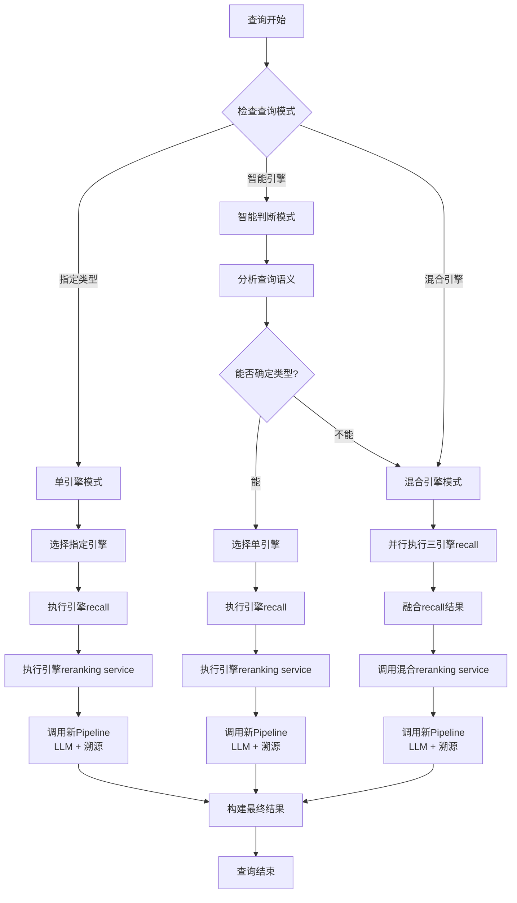

完全正确！现在我完全理解了设计理念。让我重新整理一下：

## 🎯 **HybridEngine 简化改造方案（最终版）**

### **1. 核心设计理念**

- **所有引擎都使用新Pipeline**：LLM + 溯源，没有旧pipeline
- **Reranking Service 统一性**：混合reranking service 和单引擎各自的reranking service 目的和设计理念完全一样
- **流程统一**：recall → reranking → 新pipeline（LLM + 溯源）

### **2. 修正后的详细流程图**



### **3. 简化后的核心功能**

#### **保留的核心功能**
1. **智能路由**：根据查询类型选择单个引擎或混合引擎
2. **智能判断**：通过语义分析选择最合适的单引擎
3. **结果融合**：混合模式下融合三个引擎的recall结果
4. **混合reranking**：专门的混合reranking service
5. **新Pipeline集成**：统一调用新pipeline（LLM + 溯源）

#### **删除的冗余功能**
1. 复杂的意图分析器
2. 庞大的结果融合器
3. 旧的优化管道
4. 智能后处理引擎
5. 复杂的质量评估和排序算法

### **4. 代码结构简化**

```python
class HybridEngine:
    def process_query(self, query: str, **kwargs) -> QueryResult:
        # 1. 路由判断
        # 2. 调用对应处理方法
        
    def _handle_single_engine_query(self, query: str, engine_type: str, **kwargs):
        # 单引擎：recall → reranking → 新pipeline
        
    def _handle_smart_engine_query(self, query: str, **kwargs):
        # 智能判断：语义分析 → 选择引擎 → 单引擎流程
        
    def _handle_hybrid_engine_query(self, query: str, **kwargs):
        # 混合引擎：三引擎recall → 融合 → 混合reranking → 新pipeline
```

### **5. 关键优势**

1. **代码量大幅减少**：从2000+行减少到300-500行
2. **逻辑清晰**：三种模式职责明确，流程统一
3. **维护简单**：没有复杂的融合逻辑，易于调试
4. **性能提升**：减少不必要的处理步骤
5. **扩展性好**：新增引擎类型只需添加对应处理方法

这样的设计既保持了功能的完整性，又大大简化了代码结构，您觉得如何？