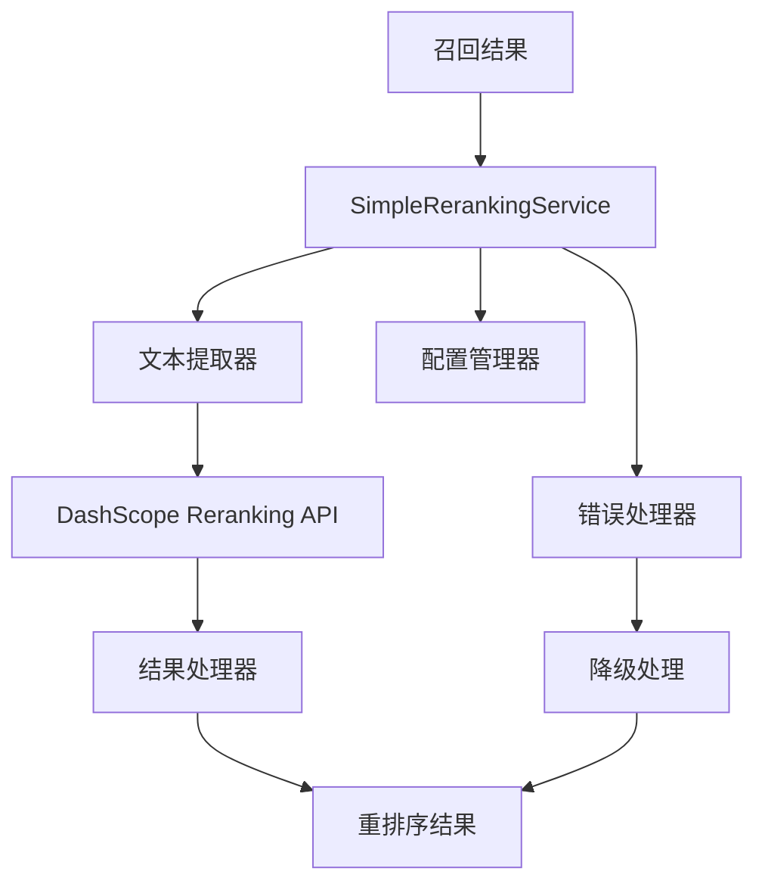

# RAG系统Reranking模块详细设计文档

## 一、文档基础信息

| 模块名称 | M18-RAG系统Reranking模块                                     | 所属项目 | V3版本RAG系统                     |
| -------- | ------------------------------------------------------------ | -------- | --------------------------------- |
| 文档版本 | V1.0                                                         | 文档状态 | ☑ 草稿 □ 评审中 □ 已确认 □ 已归档 |
| 编写人   | AI助手                                                       | 编写日期 | 2025年8月                         |
| 关联文档 | 《V3_RAG系统后端技术选择文档》《V3_RAG系统配置管理技术选择》 |          |                                   |

## 二、模块概述

### 1. 定位与目标

作为RAG系统的**核心重排序模块**，Reranking模块承担对召回结果进行智能重排序的职责。本模块采用"让专业工具做专业事情"的设计理念，充分利用DashScope reranking模型的现成能力，只做必要的文本提取和结果处理，实现简单、高效、准确的文档重排序。

### 2. 设计原则

- **简单有效**：用最简单的方法解决重排序问题
- **充分利用现成工具**：让DashScope专业模型做专业的事情
- **渐进式优化**：先实现核心功能，再根据需求逐步优化
- **保持扩展性**：设计时考虑未来扩展，但不为未来过度设计

### 3. 依赖与交互

| 关联模块        | 交互方向 | 核心交互内容                 |
| --------------- | -------- | ---------------------------- |
| DashScope API   | 依赖     | 调用专业的reranking模型服务  |
| V3配置管理      | 依赖     | 获取reranking配置参数        |
| RAG查询处理模块 | 被调用   | 对召回结果进行重排序         |
| V3元数据管理    | 依赖     | 读取文档元数据，进行文本提取 |

## 三、核心功能设计

### 1. 功能清单

| 功能ID | 功能名称     | 核心描述                                | 操作角色   | 前置条件          |
| ------ | ------------ | --------------------------------------- | ---------- | ----------------- |
| F001   | 统一重排序   | 对所有内容类型执行统一的重排序          | RAG系统    | DashScope API可用 |
| F002   | 智能文本提取 | 根据内容类型智能提取适合reranking的文本 | 重排序服务 | 文档元数据完整    |
| F003   | 批量重排序   | 支持批量处理，提高效率                  | 重排序服务 | 配置启用批量处理  |
| F004   | 错误降级处理 | API失败时自动降级到原始排序             | 重排序服务 | 配置启用降级处理  |
| F005   | 结果合并     | 将reranking分数与原始文档信息合并       | 重排序服务 | API调用成功       |

### 2. 核心业务流程

#### 2.1 重排序流程
```
召回结果 → 文本提取 → DashScope API调用 → 结果处理 → 分数合并 → 返回重排序结果
```

#### 2.2 错误处理流程
```
API调用失败 → 记录错误日志 → 返回原始排序结果 → 继续后续处理
```

## 四、详细设计

### 1. 核心架构设计

#### 1.1 架构图


#### 1.2 设计特点
- **统一接口**：所有内容类型使用相同的reranking接口
- **最小代码**：核心逻辑只有30-50行代码
- **智能降级**：API失败时自动降级到原始排序
- **批量优化**：支持批量处理，减少API调用次数

### 2. 核心类设计

#### 2.1 SimpleRerankingService类
```python
class SimpleRerankingService:
    """简化的reranking服务 - 充分利用现成模型"""
    
    def __init__(self, config: Dict[str, Any]):
        """
        初始化reranking服务
        
        :param config: 配置字典
        """
        self.config = config
        self.model_name = config.get('model_name', 'gte-rerank-v2')
        self.batch_size = config.get('batch_size', 32)
        self.timeout = config.get('timeout', 30)
        self.fallback_on_error = config.get('fallback_on_error', True)
        self.api_key = self._get_api_key()
        
        # 设置DashScope API密钥
        if self.api_key:
            dashscope.api_key = self.api_key
            logger.info(f"Reranking服务初始化完成，使用模型: {self.model_name}")
        else:
            logger.warning("Reranking服务初始化失败：未找到API密钥")
    
    def rerank(self, query: str, candidates: List[Dict]) -> List[Dict]:
        """
        执行重排序
        
        :param query: 查询文本
        :param candidates: 候选文档列表
        :return: 重排序后的文档列表
        """
        if not candidates:
            return []
        
        try:
            # 1. 准备文档文本
            documents_text = []
            for doc in candidates:
                text = self._extract_text_for_reranking(doc)
                documents_text.append(text)
            
            # 2. 调用DashScope reranking API
            response = text_rerank.TextReRank.call(
                model=self.model_name,
                query=query,
                documents=documents_text,
                top_k=len(candidates)
            )
            
            # 3. 处理结果
            if response.status_code == 200:
                return self._merge_reranking_results(candidates, response)
            else:
                logger.warning(f"Reranking API调用失败: {response.message}")
                return candidates if self.fallback_on_error else []
                
        except Exception as e:
            logger.error(f"重排序过程中发生错误: {e}")
            return candidates if self.fallback_on_error else []
    
    def batch_rerank(self, queries: List[str], 
                     candidates_list: List[List[Dict]]) -> List[List[Dict]]:
        """
        批量重排序
        
        :param queries: 查询列表
        :param candidates_list: 候选文档列表的列表
        :return: 重排序后的文档列表的列表
        """
        results = []
        
        for i in range(0, len(queries), self.batch_size):
            batch_queries = queries[i:i + self.batch_size]
            batch_candidates = candidates_list[i:i + self.batch_size]
            
            batch_results = []
            for query, candidates in zip(batch_queries, batch_candidates):
                result = self.rerank(query, candidates)
                batch_results.append(result)
            
            results.extend(batch_results)
        
        return results
```

#### 2.2 文本提取器
```python
def _extract_text_for_reranking(self, doc: Dict) -> str:
    """
    提取适合reranking的文本 - 让模型自己判断相关性
    
    这是唯一需要"特化"的地方，但逻辑很简单
    """
    content_type = doc.get('chunk_type', 'text')
    
    if content_type == 'text':
        # 文本：直接使用内容
        return doc.get('content', '')
        
    elif content_type == 'table':
        # 表格：提取表头 + 关键数据行
        table_content = doc.get('content', '')
        lines = table_content.split('\n')[:5]  # 只取前5行
        return '\n'.join(lines)
        
    elif content_type == 'image':
        # 图片：使用增强描述
        return doc.get('enhanced_description', '')
        
    else:
        # 其他类型：使用通用内容
        return doc.get('content', '')
```

#### 2.3 结果处理器
```python
def _merge_reranking_results(self, original_docs: List[Dict], 
                           response: Any) -> List[Dict]:
    """
    合并reranking结果与原始文档
    
    :param original_docs: 原始文档列表
    :param response: DashScope API响应
    :return: 合并后的文档列表
    """
    try:
        results = response.output.results
        reranked_docs = []
        
        for result in results:
            doc_index = result.index
            if 0 <= doc_index < len(original_docs):
                # 复制原始文档并添加reranking信息
                doc = original_docs[doc_index].copy()
                doc['rerank_score'] = result.relevance_score
                doc['rerank_rank'] = len(reranked_docs) + 1
                reranked_docs.append(doc)
        
        # 按分数降序排列
        reranked_docs.sort(key=lambda x: x.get('rerank_score', 0), reverse=True)
        
        logger.info(f"重排序完成，处理了 {len(reranked_docs)} 个文档")
        return reranked_docs
        
    except Exception as e:
        logger.error(f"处理reranking响应时发生错误: {e}")
        return original_docs
```

### 3. 配置管理设计

#### 3.1 配置结构
```json
{
  "rag_system": {
    "reranking": {
      "enabled": true,
      "model_name": "gte-rerank-v2",
      "batch_size": 32,
      "timeout": 30,
      "fallback_on_error": true
    }
  }
}
```

#### 3.2 配置参数说明

| 参数名称            | 默认值          | 说明                        |
| ------------------- | --------------- | --------------------------- |
| `enabled`           | true            | 是否启用reranking功能       |
| `model_name`        | "gte-rerank-v2" | DashScope reranking模型名称 |
| `batch_size`        | 32              | 批量处理大小                |
| `timeout`           | 30              | API调用超时时间（秒）       |
| `fallback_on_error` | true            | API失败时是否降级到原始排序 |

### 4. 错误处理设计

#### 4.1 错误类型与处理策略

| 错误类型     | 错误描述                  | 处理策略                     |
| ------------ | ------------------------- | ---------------------------- |
| API调用失败  | DashScope API返回错误状态 | 记录错误日志，返回原始排序   |
| 网络超时     | API调用超时               | 记录超时日志，返回原始排序   |
| 文本提取失败 | 无法提取文档文本          | 跳过该文档，继续处理其他文档 |
| 结果处理失败 | 无法处理API响应           | 记录错误日志，返回原始排序   |

#### 4.2 降级策略
```python
def _handle_error(self, error: Exception, candidates: List[Dict]) -> List[Dict]:
    """
    错误处理 - 降级到原始排序
    
    :param error: 错误信息
    :param candidates: 原始候选文档
    :return: 处理后的文档列表
    """
    if self.fallback_on_error:
        logger.warning(f"Reranking失败，降级到原始排序: {error}")
        return candidates
    else:
        logger.error(f"Reranking失败，返回空结果: {error}")
        return []
```

## 五、接口设计

### 1. 核心接口

#### 1.1 重排序接口
```python
def rerank(self, query: str, candidates: List[Dict]) -> List[Dict]:
    """
    执行重排序
    
    :param query: 查询文本
    :param candidates: 候选文档列表
    :return: 重排序后的文档列表
    """
```

#### 1.2 批量重排序接口
```python
def batch_rerank(self, queries: List[str], 
                 candidates_list: List[List[Dict]]) -> List[List[Dict]]:
    """
    批量重排序
    
    :param queries: 查询列表
    :param candidates_list: 候选文档列表的列表
    :return: 重排序后的文档列表的列表
    """
```

### 2. 返回数据结构

```python
{
    'content': str,                    # 文档内容
    'metadata': Dict,                  # 文档元数据
    'doc_id': str,                     # 文档ID
    'document_name': str,              # 文档名称
    'chunk_type': str,                 # 内容类型
    'rerank_score': float,             # 重排序分数
    'rerank_rank': int,                # 重排序排名
    'original_rank': int               # 原始排名
}
```

## 六、性能优化设计

### 1. 批量处理优化
- **智能批处理**：根据配置的batch_size自动分批处理
- **并发控制**：避免同时发送过多API请求
- **结果缓存**：对相同查询的reranking结果进行缓存

### 2. 错误处理优化
- **快速失败**：API调用失败时快速返回降级结果
- **异步处理**：支持异步reranking，不阻塞主流程
- **重试机制**：对临时性错误进行有限次数的重试

### 3. 监控指标
- **响应时间**：reranking的平均响应时间
- **成功率**：reranking的成功率
- **API调用量**：DashScope API的调用统计
- **降级率**：降级到原始排序的频率

## 七、与V3系统集成

### 1. 集成点
- **查询处理模块**：在召回后、LLM调用前执行reranking
- **配置管理**：使用V3的统一配置管理
- **元数据管理**：reranking结果作为元数据的一部分

### 2. 数据流
```
召回结果 → 文本提取 → DashScope Reranking → 分数合并 → 结果排序 → LLM调用
```

### 3. 集成示例
```python
# 在查询处理模块中的使用
class RAGQueryProcessor:
    def process_query(self, query: str, query_type: str):
        # 1. 执行召回
        candidates = self.recall_engine.search(query, query_type)
        
        # 2. 执行reranking - 一行代码搞定
        if self.config.get('reranking.enabled', True):
            candidates = self.reranking_service.rerank(query, candidates)
        
        # 3. 调用LLM
        answer = self.llm_service.generate_answer(query, candidates)
        return answer
```

## 八、测试策略

### 1. 单元测试
- **功能测试**：测试reranking的基本功能
- **错误处理测试**：测试各种错误情况的处理
- **配置测试**：测试不同配置参数的效果

### 2. 集成测试
- **API集成测试**：测试与DashScope API的集成
- **系统集成测试**：测试与V3系统的集成
- **性能测试**：测试批量处理和并发性能

### 3. 测试场景
- **正常场景**：查询有相关文档的情况
- **边界场景**：查询无相关文档或文档数量很少的情况
- **异常场景**：API失败、网络超时等异常情况

## 九、部署与运维

### 1. 部署要求
- **Python环境**：3.8+
- **DashScope SDK**：最新版本
- **网络环境**：能够访问DashScope API

### 2. 配置管理
- **环境变量**：DASHSCOPE_API_KEY
- **配置文件**：v3_config.json中的rag_system.reranking节点
- **运行时配置**：支持动态调整部分参数

### 3. 监控告警
- **性能监控**：响应时间、成功率等指标
- **错误告警**：API失败、超时等异常情况
- **资源监控**：API调用量、配额使用情况

## 十、总结

### 1. 设计亮点
- **架构简化**：从V2的复杂多层服务简化为统一服务
- **充分利用现成工具**：让DashScope专业模型做专业的事情
- **代码量少**：核心逻辑只有30-50行代码
- **维护成本低**：没有复杂的评分算法需要维护

### 2. 技术优势
- **性能优秀**：使用专业的reranking模型，准确性高
- **扩展性好**：支持批量处理，易于扩展
- **稳定性强**：完善的错误处理和降级策略
- **集成简单**：与V3系统集成只需要几行代码

### 3. 应用价值
- **用户体验提升**：更准确的搜索结果排序
- **开发效率提升**：不需要实现复杂的评分算法
- **维护成本降低**：代码简单，易于理解和维护
- **系统稳定性提升**：完善的错误处理机制

### 4. 与V2的对比
| 方面           | V2系统                 | V3系统                   |
| -------------- | ---------------------- | ------------------------ |
| **架构复杂度** | 多层服务，类型特化     | 统一服务，类型感知       |
| **代码量**     | 500+ 行                | 30-50 行                 |
| **维护成本**   | 高（需要维护复杂算法） | 低（只需要维护简单逻辑） |
| **性能**       | 中等（自定义算法）     | 高（专业模型）           |
| **准确性**     | 中等（规则驱动）       | 高（AI模型驱动）         |

这个V3 reranking模块设计充分体现了"简单有效"的原则，在保持高质量reranking效果的同时，大幅降低了系统的复杂度和维护成本。通过充分利用DashScope的现成能力，我们既获得了专业的reranking效果，又避免了过度工程化的问题，完全符合V3系统的设计理念。