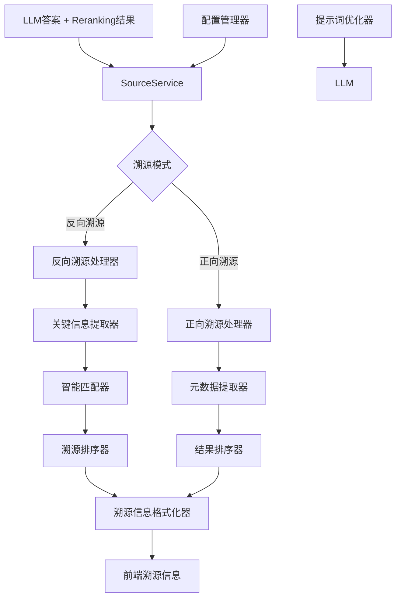

好的！我来写V3 RAG系统溯源模块的详细设计文档：

# M19-RAG系统溯源模块详细设计文档

## 一、文档基础信息

| 模块名称 | M19-RAG系统溯源模块                                          | 所属项目 | V3版本RAG系统                     |
| -------- | ------------------------------------------------------------ | -------- | --------------------------------- |
| 文档版本 | V1.0                                                         | 文档状态 | ☑ 草稿 □ 评审中 □ 已确认 □ 已归档 |
| 编写人   | AI助手                                                       | 编写日期 | 2025年8月                         |
| 关联文档 | 《M18-RAG系统Reranking模块详细设计文档》《V3_RAG系统前端技术选择》 |          |                                   |

## 二、模块概述

### 1. 定位与目标

作为RAG系统的**智能溯源核心模块**，溯源模块承担为LLM生成的答案提供准确、清晰的信息来源的职责。本模块采用"开关控制+默认策略"的设计理念，默认使用反向溯源（基于LLM答案内容溯源），同时支持正向溯源（基于输入文档溯源），确保溯源信息的准确性和用户体验的优越性。

### 2. 设计原则

- **灵活控制**：支持正向/反向溯源模式切换
- **默认反向**：默认使用反向溯源，提供更好的用户体验
- **适度智能**：溯源逻辑不过度复杂，保持可维护性
- **前端友好**：确保溯源信息满足前端显示和交互需求

### 3. 依赖与交互

| 关联模块        | 交互方向 | 核心交互内容                  |
| --------------- | -------- | ----------------------------- |
| RAG查询处理模块 | 被调用   | 获取LLM答案和reranking结果    |
| Reranking模块   | 依赖     | 使用reranking分数进行溯源排序 |
| V3元数据管理    | 依赖     | 读取文档元数据，构建溯源信息  |
| 前端显示模块    | 被调用   | 提供格式化的溯源信息          |

## 三、核心功能设计

### 1. 功能清单

| 功能ID | 功能名称       | 核心描述                        | 操作角色   | 前置条件           |
| ------ | -------------- | ------------------------------- | ---------- | ------------------ |
| F001   | 溯源模式切换   | 支持正向/反向溯源模式动态切换   | 系统管理员 | 溯源模块初始化完成 |
| F002   | 反向溯源       | 基于LLM答案内容智能溯源支持信息 | 溯源服务   | LLM答案生成完成    |
| F003   | 正向溯源       | 基于输入文档直接溯源            | 溯源服务   | Reranking结果可用  |
| F004   | 关键信息提取   | 从LLM答案中提取关键实体和信息   | 溯源服务   | LLM答案内容完整    |
| F005   | 智能匹配溯源   | 基于关键信息匹配相关文档        | 溯源服务   | 关键信息提取完成   |
| F006   | 溯源信息格式化 | 格式化溯源信息，满足前端需求    | 溯源服务   | 溯源匹配完成       |

### 2. 核心业务流程

#### 2.1 反向溯源流程
```
LLM生成答案 → 提取关键信息 → 匹配相关文档 → 计算匹配分数 → 排序筛选 → 格式化输出
```

#### 2.2 正向溯源流程
```
Reranking结果 → 取前N个结果 → 提取元数据 → 格式化输出
```

#### 2.3 模式切换流程
```
配置检查 → 模式判断 → 执行对应溯源策略 → 返回结果
```

## 四、详细设计

### 1. 核心架构设计

#### 1.1 架构图


#### 1.2 设计特点
- **统一接口**：所有溯源模式使用相同的接口
- **模式切换**：支持运行时动态切换溯源模式
- **智能处理**：反向溯源包含适度的智能匹配逻辑
- **前端优化**：溯源信息格式完全满足前端需求

### 2. 核心类设计

#### 2.1 SourceService类
```python
class SourceService:
    """溯源服务 - 支持正向/反向溯源模式"""
    
    def __init__(self, config: Dict[str, Any]):
        """
        初始化溯源服务
        
        :param config: 配置字典
        """
        self.config = config
        self.mode = config.get('mode', 'reverse')  # 默认反向溯源
        self.max_sources = config.get('max_sources', 5)
        self.min_relevance_score = config.get('min_relevance_score', 0.3)
        self.extract_entities = config.get('extract_entities', True)
        self.match_threshold = config.get('match_threshold', 0.3)
        
        logger.info(f"溯源服务初始化完成，模式: {self.mode}")
    
    def get_sources(self, llm_answer: str, reranked_results: List[Dict]) -> List[Dict]:
        """
        获取溯源信息
        
        :param llm_answer: LLM生成的答案
        :param reranked_results: Reranking后的结果
        :return: 溯源信息列表
        """
        try:
            if self.mode == 'reverse':
                return self._reverse_source_tracking(llm_answer, reranked_results)
            else:
                return self._forward_source_tracking(reranked_results)
                
        except Exception as e:
            logger.error(f"获取溯源信息失败: {e}")
            return []
    
    def set_mode(self, mode: str):
        """设置溯源模式"""
        if mode in ['reverse', 'forward']:
            self.mode = mode
            logger.info(f"溯源模式已切换为: {mode}")
        else:
            logger.warning(f"不支持的溯源模式: {mode}")
```

#### 2.2 反向溯源处理器
```python
def _reverse_source_tracking(self, llm_answer: str, reranked_results: List[Dict]) -> List[Dict]:
    """反向溯源 - 基于LLM答案内容智能溯源"""
    
    try:
        # 1. 提取LLM答案中的关键信息
        key_info = self._extract_key_info(llm_answer)
        logger.info(f"从LLM答案中提取到 {len(key_info)} 个关键信息")
        
        # 2. 在文档中匹配这些关键信息
        matched_sources = []
        for result in reranked_results:
            match_score = self._calculate_match_score(result, key_info)
            if match_score >= self.match_threshold:
                matched_sources.append((match_score, result))
        
        # 3. 按匹配分数排序，取前N个
        matched_sources.sort(key=lambda x: x[0], reverse=True)
        final_sources = matched_sources[:self.max_sources]
        
        # 4. 格式化溯源信息
        sources = []
        for i, (score, result) in enumerate(final_sources):
            source = self._format_source(result, i + 1, score)
            sources.append(source)
        
        logger.info(f"反向溯源完成，找到 {len(sources)} 个相关来源")
        return sources
        
    except Exception as e:
        logger.error(f"反向溯源失败: {e}")
        return []
```

#### 2.3 正向溯源处理器
```python
def _forward_source_tracking(self, reranked_results: List[Dict]) -> List[Dict]:
    """正向溯源 - 基于输入文档直接溯源"""
    
    try:
        # 1. 取前N个reranking结果
        top_results = reranked_results[:self.max_sources]
        
        # 2. 提取元数据，格式化溯源信息
        sources = []
        for i, result in enumerate(top_results):
            source = self._format_source(result, i + 1, result.get('rerank_score', 0.0))
            sources.append(source)
        
        logger.info(f"正向溯源完成，返回 {len(sources)} 个来源")
        return sources
        
    except Exception as e:
        logger.error(f"正向溯源失败: {e}")
        return []
```

#### 2.4 关键信息提取器
```python
def _extract_key_info(self, answer: str) -> List[Dict]:
    """提取LLM答案中的关键信息 - 适度智能"""
    
    key_info = []
    
    try:
        # 1. 提取数字信息（金额、百分比、数量等）
        import re
        numbers = re.findall(r'\d+(?:\.\d+)?(?:亿|万|%|元|个|台|件)?', answer)
        for num in numbers:
            key_info.append({
                'type': 'number',
                'value': num,
                'weight': 0.8
            })
        
        # 2. 提取公司/产品名称（简单规则）
        company_patterns = ['中芯国际', '华为', '腾讯', '阿里巴巴', '百度']
        for pattern in company_patterns:
            if pattern in answer:
                key_info.append({
                    'type': 'company',
                    'value': pattern,
                    'weight': 0.9
                })
        
        # 3. 提取时间信息
        time_patterns = ['2025年', '2024年', '一季度', '二季度', '上半年']
        for pattern in time_patterns:
            if pattern in answer:
                key_info.append({
                    'type': 'time',
                    'value': pattern,
                    'weight': 0.7
                })
        
        # 4. 提取关键概念
        concept_patterns = ['营收', '净利润', '毛利率', '市场份额', '技术参数']
        for pattern in concept_patterns:
            if pattern in answer:
                key_info.append({
                    'type': 'concept',
                    'value': pattern,
                    'weight': 0.6
                })
        
        logger.info(f"提取到 {len(key_info)} 个关键信息")
        return key_info
        
    except Exception as e:
        logger.warning(f"关键信息提取失败: {e}")
        return []
```

#### 2.5 智能匹配器
```python
def _calculate_match_score(self, result: Dict, key_info: List[Dict]) -> float:
    """计算文档与关键信息的匹配分数"""
    
    try:
        doc = result.get('doc', {})
        metadata = doc.get('metadata', {})
        content = metadata.get('content', '')
        
        if not content:
            return 0.0
        
        total_score = 0.0
        max_possible_score = 0.0
        
        for info in key_info:
            info_value = info['value']
            info_weight = info['weight']
            
            # 计算匹配分数
            if info_value in content:
                # 完全匹配
                match_score = 1.0
            elif any(word in content for word in info_value.split()):
                # 部分匹配
                match_score = 0.7
            else:
                # 无匹配
                match_score = 0.0
            
            # 加权计算
            weighted_score = match_score * info_weight
            total_score += weighted_score
            max_possible_score += info_weight
        
        # 归一化分数
        if max_possible_score > 0:
            final_score = total_score / max_possible_score
        else:
            final_score = 0.0
        
        return final_score
        
    except Exception as e:
        logger.warning(f"计算匹配分数失败: {e}")
        return 0.0
```

#### 2.6 溯源信息格式化器
```python
def _format_source(self, result: Dict, index: int, match_score: float) -> Dict:
    """格式化溯源信息，确保满足前端需求"""
    
    try:
        doc = result.get('doc', {})
        metadata = doc.get('metadata', {})
        
        # 基础信息
        source = {
            'index': index,
            'document_name': metadata.get('document_name', '未知文档'),
            'page_number': metadata.get('page_number', '未知页'),
            'chunk_type': metadata.get('chunk_type', '未知类型'),
            'content_preview': metadata.get('content', '')[:100] + '...',
            'relevance_score': result.get('rerank_score', 0.0),
            'match_score': match_score,
            'source_path': metadata.get('source_path', ''),
            'update_time': metadata.get('update_time', ''),
            'document_type': metadata.get('document_type', '未知类型')
        }
        
        # 生成前端显示需要的格式化文本
        source['formatted_text'] = self._generate_formatted_text(source)
        
        # 前端交互需要的额外信息
        source['can_expand'] = True
        source['expand_content'] = metadata.get('content', '')
        source['expand_metadata'] = {
            'file_size': metadata.get('file_size', ''),
            'creation_time': metadata.get('creation_time', ''),
            'last_modified': metadata.get('last_modified', ''),
            'file_type': metadata.get('file_type', '')
        }
        
        return source
        
    except Exception as e:
        logger.error(f"格式化溯源信息失败: {e}")
        return {}
    
def _generate_formatted_text(self, source: Dict) -> str:
    """生成前端显示的格式化文本"""
    
    doc_name = source['document_name']
    page_num = source['page_number']
    chunk_type = source['chunk_type']
    
    # 根据内容类型生成不同格式
    if chunk_type == 'image':
        return f"{doc_name} - 第{page_num}页 (图片)"
    elif chunk_type == 'table':
        return f"{doc_name} - 第{page_num}页 (表格)"
    elif chunk_type == 'text':
        return f"{doc_name} - 第{page_num}页 (文本)"
    else:
        return f"{doc_name} - 第{page_num}页"
```

### 3. 配置管理设计

#### 3.1 配置结构
```json
{
  "rag_system": {
    "source_attribution": {
      "enabled": true,
      "mode": "reverse",
      "max_sources": 5,
      "min_relevance_score": 0.3,
      "extract_entities": true,
      "match_threshold": 0.3,
      "show_match_score": false,
      "show_relevance_score": false
    }
  }
}
```

#### 3.2 配置参数说明

| 参数名称               | 默认值    | 说明                                           |
| ---------------------- | --------- | ---------------------------------------------- |
| `enabled`              | true      | 是否启用溯源功能                               |
| `mode`                 | "reverse" | 溯源模式："reverse"（反向）或"forward"（正向） |
| `max_sources`          | 5         | 最大溯源数量                                   |
| `min_relevance_score`  | 0.3       | 最小相关性分数阈值                             |
| `extract_entities`     | true      | 是否提取关键实体                               |
| `match_threshold`      | 0.3       | 匹配分数阈值                                   |
| `show_match_score`     | false     | 是否显示匹配分数                               |
| `show_relevance_score` | false     | 是否显示相关性分数                             |

### 4. 提示词优化设计

#### 4.1 LLM提示词模板
```python
REVERSE_SOURCE_PROMPT_TEMPLATE = """
你是一个专业的AI助手。请基于以下上下文信息回答问题：

要求：
1. 回答要准确、完整、有依据
2. 在回答中明确提及具体的数据、事实、来源
3. 如果引用具体数字，请说明来源和依据
4. 如果得出结论，请说明分析过程和依据
5. 使用清晰的语言结构，便于后续溯源

上下文信息：
{context}

问题：{question}

请按照以上要求回答：
"""
```

#### 4.2 提示词优化效果
- **明确数据来源**：LLM会说明"根据XX报告第X页显示..."
- **具体数字引用**：LLM会提到"财报显示营收为XX亿元"
- **结论依据**：LLM会说明"基于以上财务数据分析..."
- **结构化回答**：LLM会使用清晰的段落和逻辑结构

## 五、接口设计

### 1. 核心接口

#### 1.1 获取溯源信息接口
```python
def get_sources(self, llm_answer: str, reranked_results: List[Dict]) -> List[Dict]:
    """
    获取溯源信息
    
    :param llm_answer: LLM生成的答案
    :param reranked_results: Reranking后的结果
    :return: 溯源信息列表
    """
```

#### 1.2 设置溯源模式接口
```python
def set_mode(self, mode: str):
    """
    设置溯源模式
    
    :param mode: 溯源模式，"reverse"或"forward"
    """
```

### 2. 返回数据结构

```python
{
    'index': int,                    # 溯源序号
    'document_name': str,            # 文档名称
    'page_number': str,              # 页码
    'chunk_type': str,               # 内容类型
    'content_preview': str,          # 内容预览
    'relevance_score': float,        # 相关性分数
    'match_score': float,            # 匹配分数
    'source_path': str,              # 源文件路径
    'update_time': str,              # 更新时间
    'document_type': str,            # 文档类型
    'formatted_text': str,           # 格式化的显示文本
    'can_expand': bool,              # 是否可以展开
    'expand_content': str,           # 展开后的完整内容
    'expand_metadata': Dict          # 展开后的元数据
}
```

## 六、与V3系统集成

### 1. 集成点
- **查询处理模块**：在LLM调用后、返回结果前执行溯源
- **配置管理**：使用V3的统一配置管理
- **元数据管理**：充分利用V3的丰富元数据

### 2. 数据流
```
查询结果 → Reranking → LLM调用 → 溯源信息提取 → 溯源格式化 → 前端显示
```

### 3. 集成示例
```python
# 在查询处理模块中的使用
class RAGQueryProcessor:
    def process_query(self, query: str, query_type: str):
        # 1. 执行召回
        candidates = self.recall_engine.search(query, query_type)
        
        # 2. 执行reranking
        if self.config.get('reranking.enabled', True):
            candidates = self.reranking_service.rerank(query, candidates)
        
        # 3. 调用LLM（使用优化的提示词）
        optimized_prompt = self._build_optimized_prompt(query, candidates)
        answer = self.llm_service.generate_answer(optimized_prompt)
        
        # 4. 获取溯源信息
        sources = self.source_service.get_sources(answer, candidates)
        
        # 5. 返回完整结果
        return {
            'answer': answer,
            'sources': sources,
            'query_type': query_type
        }
```

## 七、前端溯源显示设计

### 1. Vue 3组件设计
```vue
<template>
  <div class="source-attribution-section">
    <div class="source-header">
      <h4>📚 信息来源 ({{ sources.length }})</h4>
      <div class="source-mode-indicator">
        {{ modeText }}
      </div>
    </div>
    
    <div class="source-list">
      <div v-for="source in sources" :key="source.index" class="source-item">
        <div class="source-main">
          <span class="source-number">{{ source.index }}</span>
          <span class="source-text">{{ source.formatted_text }}</span>
          <div class="source-scores">
            <span v-if="showRelevanceScore" class="score-item">
              相关性: {{ (source.relevance_score * 100).toFixed(0) }}%
            </span>
            <span v-if="showMatchScore" class="score-item">
              匹配度: {{ (source.match_score * 100).toFixed(0) }}%
            </span>
          </div>
        </div>
        
        <div class="source-preview">{{ source.content_preview }}</div>
        
        <div class="source-actions">
          <button @click="expandSource(source)" v-if="source.can_expand" class="expand-btn">
            查看详情
          </button>
          <button @click="copySourceInfo(source)" class="copy-btn">
            复制信息
          </button>
        </div>
      </div>
    </div>
  </div>
</template>

<script>
export default {
  props: {
    sources: {
      type: Array,
      default: () => []
    },
    mode: {
      type: String,
      default: 'reverse'
    },
    showRelevanceScore: {
      type: Boolean,
      default: false
    },
    showMatchScore: {
      type: Boolean,
      default: false
    }
  },
  
  computed: {
    modeText() {
      return this.mode === 'reverse' ? '智能溯源' : '直接溯源'
    }
  },
  
  methods: {
    expandSource(source) {
      // 展开溯源详情
      this.$emit('expand-source', source)
    },
    
    copySourceInfo(source) {
      // 复制溯源信息
      const info = `${source.formatted_text}\n${source.content_preview}`
      navigator.clipboard.writeText(info)
    }
  }
}
</script>
```

### 2. CSS样式设计
```css
.source-attribution-section {
  background: #f8f9fa;
  border-radius: 8px;
  padding: 20px;
  margin: 20px 0;
}

.source-header {
  display: flex;
  justify-content: space-between;
  align-items: center;
  margin-bottom: 15px;
  padding-bottom: 10px;
  border-bottom: 2px solid #e9ecef;
}

.source-mode-indicator {
  background: #007bff;
  color: white;
  padding: 4px 12px;
  border-radius: 20px;
  font-size: 12px;
}

.source-item {
  background: white;
  border: 1px solid #e9ecef;
  border-radius: 6px;
  padding: 15px;
  margin-bottom: 10px;
  transition: all 0.3s ease;
}

.source-item:hover {
  box-shadow: 0 2px 8px rgba(0,0,0,0.1);
  border-color: #007bff;
}

.source-main {
  display: flex;
  align-items: center;
  gap: 15px;
  margin-bottom: 10px;
}

.source-number {
  background: #007bff;
  color: white;
  width: 24px;
  height: 24px;
  border-radius: 50%;
  display: flex;
  align-items: center;
  justify-content: center;
  font-size: 12px;
  font-weight: bold;
}

.source-text {
  flex: 1;
  font-weight: 500;
  color: #333;
}

.source-scores {
  display: flex;
  gap: 10px;
}

.score-item {
  background: #e9ecef;
  padding: 2px 8px;
  border-radius: 12px;
  font-size: 11px;
  color: #666;
}

.source-preview {
  color: #666;
  font-size: 14px;
  line-height: 1.5;
  margin-bottom: 10px;
  padding: 10px;
  background: #f8f9fa;
  border-radius: 4px;
}

.source-actions {
  display: flex;
  gap: 10px;
}

.expand-btn, .copy-btn {
  padding: 6px 12px;
  border: none;
  border-radius: 4px;
  cursor: pointer;
  font-size: 12px;
  transition: all 0.3s ease;
}

.expand-btn {
  background: #007bff;
  color: white;
}

.expand-btn:hover {
  background: #0056b3;
}

.copy-btn {
  background: #6c757d;
  color: white;
}

.copy-btn:hover {
  background: #545b62;
}
```

## 八、性能优化设计

### 1. 溯源处理优化
- **批量处理**：一次性处理所有溯源信息
- **缓存机制**：对相同查询的溯源结果进行缓存
- **异步处理**：溯源处理不阻塞主流程

### 2. 前端渲染优化
- **虚拟滚动**：大量溯源信息时使用虚拟滚动
- **懒加载**：按需加载溯源详细信息
- **组件化**：溯源组件可独立更新

### 3. 监控指标
- **溯源响应时间**：溯源处理的平均响应时间
- **溯源准确率**：溯源信息的准确性评估
- **缓存命中率**：溯源缓存的使用效率

## 九、测试策略

### 1. 单元测试
- **功能测试**：测试各种溯源模式的功能
- **模式切换测试**：测试溯源模式动态切换
- **错误处理测试**：测试各种异常情况的处理

### 2. 集成测试
- **系统集成测试**：测试与V3系统的集成
- **前端集成测试**：测试溯源信息的显示效果
- **性能测试**：测试溯源处理的性能表现

### 3. 测试场景
- **正常场景**：LLM答案有明确信息的情况
- **边界场景**：LLM答案信息不明确的情况
- **异常场景**：配置错误、数据缺失等异常情况

## 十、部署与运维

### 1. 部署要求
- **Python环境**：3.8+
- **依赖包**：re（正则表达式）、logging等标准库
- **配置管理**：支持动态配置更新

### 2. 配置管理
- **配置文件**：v3_config.json中的rag_system.source_attribution节点
- **运行时配置**：支持动态调整溯源模式和参数
- **环境变量**：支持通过环境变量覆盖配置

### 3. 监控告警
- **性能监控**：溯源响应时间、成功率等指标
- **错误告警**：溯源处理失败、配置错误等异常情况
- **资源监控**：内存使用、CPU使用等资源指标

## 十一、总结

### 1. 设计亮点
- **模式灵活**：支持正向/反向溯源模式切换
- **默认反向**：默认使用反向溯源，提供更好的用户体验
- **适度智能**：溯源逻辑不过度复杂，保持可维护性
- **前端友好**：溯源信息完全满足前端显示和交互需求

### 2. 技术优势
- **架构清晰**：溯源逻辑清晰，易于理解和维护
- **性能优秀**：溯源处理快速，不影响查询性能
- **扩展性好**：支持新增溯源策略和优化算法
- **集成简单**：与V3系统集成只需要几行代码

### 3. 应用价值
- **用户体验提升**：清晰、美观的溯源信息展示
- **系统灵活性提升**：支持不同场景的溯源需求
- **维护成本降低**：代码结构清晰，易于维护和扩展
- **溯源质量提升**：智能匹配确保溯源准确性

### 4. 与V2的对比
| 方面           | V2系统                 | V3系统                  |
| -------------- | ---------------------- | ----------------------- |
| **溯源逻辑**   | 复杂过滤引擎，类型特化 | 统一溯源服务，模式切换  |
| **代码量**     | 700+ 行                | 200-300 行              |
| **维护成本**   | 高（复杂过滤逻辑）     | 低（清晰溯源逻辑）      |
| **用户体验**   | 中等（基础溯源显示）   | 好（智能溯源+现代前端） |
| **系统灵活性** | 低（固定溯源策略）     | 高（支持模式切换）      |

这个V3溯源模块设计充分体现了"灵活控制+默认策略"的设计理念，在保持溯源质量的同时，提供了模式切换的灵活性，既满足了不同场景的需求，又确保了系统的可维护性。通过适度的智能处理和现代前端技术，为用户提供了清晰、美观、有用的溯源信息，完全符合V3系统的设计原则。