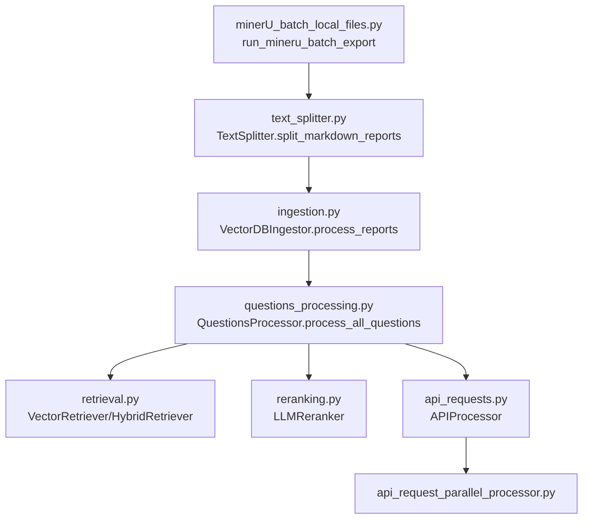

# 项目核心模块与调用关系详细说明

---

## 目录
- [1. minerU_batch_local_files.py](#1-mineru_batch_local_filespy)
- [2. text_splitter.py - TextSplitter.split_markdown_reports](#2-text_splitterpy---textsplittersplit_markdown_reports)
- [3. ingestion.py - VectorDBIngestor.process_reports](#3-ingestionpy---vectordingestorprocess_reports)
- [4. questions_processing.py - QuestionsProcessor.process_all_questions](#4-questions_processingpy---questionsprocessorprocess_all_questions)
- [5. reranking.py](#5-rerankingpy)
- [6. retrieval.py](#6-retrievalpy)
- [7. api_requests.py](#7-api_requestspy)
- [8. api_request_parallel_processor.py](#8-api_request_parallel_processorpy)
- [9. 主要调用链与数据流](#9-主要调用链与数据流)

---

## 1. minerU_batch_local_files.py

### 主要功能
- 实现**PDF批量上传到minerU平台**，自动轮询解析结果，下载并解压出Markdown文件。
- 只保留`.md`文件，重命名为与原PDF前缀一致，输出到指定目录。

### 关键函数
```python
def run_mineru_batch_export(pdf_dir, output_dir, api_key='', language='auto')
```
- **参数**
  - `pdf_dir`：PDF文件目录（必填）
  - `output_dir`：Markdown输出目录（必填）
  - `api_key`：minerU平台API密钥
  - `language`：解析语言
- **输入**：PDF文件夹
- **输出**：每个PDF对应的Markdown文件，存于`output_dir`

### 典型调用
- 被`pipeline.py`主流程通过`export_reports_to_markdown_mineru`方法调用，作为PDF转结构化文本的第一步。

---

## 2. text_splitter.py - TextSplitter.split_markdown_reports

### 主要功能
- **批量处理Markdown文件**，将其按行分块，输出为结构化JSON，便于后续向量化和检索。
- 支持通过`subset.csv`补充公司名、sha1等元数据。

### 关键函数
```python
def split_markdown_reports(self, all_md_dir, output_dir, chunk_size=30, chunk_overlap=5, subset_csv=None)
```
- **参数**
  - `all_md_dir`：Markdown文件目录
  - `output_dir`：输出JSON目录
  - `chunk_size`：每块最大行数
  - `chunk_overlap`：分块重叠行数
  - `subset_csv`：元数据文件（可选）
- **输入**：Markdown目录、subset.csv
- **输出**：每个md分块后生成一个json，含chunks、sha1、company_name等

### 典型调用
- 被`pipeline.py`主流程的`chunk_reports`方法调用，作为文本分块的核心步骤。

---

## 3. ingestion.py - VectorDBIngestor.process_reports

### 主要功能
- **批量处理分块JSON报告**，为每个报告的所有文本块生成向量（embedding），并构建FAISS向量库。
- 每个报告输出一个`.faiss`文件，文件名为sha1。

### 关键函数
```python
def process_reports(self, all_reports_dir: Path, output_dir: Path)
```
- **参数**
  - `all_reports_dir`：分块JSON目录
  - `output_dir`：FAISS向量库输出目录
- **输入**：分块JSON
- **输出**：FAISS向量库（每个报告一个faiss文件）

### 典型调用
- 被`pipeline.py`主流程的`create_vector_dbs`方法调用，作为向量数据库构建的核心步骤。

---

## 4. questions_processing.py - QuestionsProcessor.process_all_questions

### 主要功能
- **批量处理所有问题**，对每个问题进行检索、重排序、RAG上下文构建、LLM推理，输出结构化答案。
- 支持并发处理、断点保存、比赛提交格式等。

### 关键函数
```python
def process_all_questions(self, output_path, team_email, submission_name, submission_file, pipeline_details)
```
- **参数**
  - `output_path`：答案输出文件
  - `team_email`、`submission_name`、`pipeline_details`：比赛提交相关
  - `submission_file`：是否输出为比赛提交格式
- **输入**：问题文件、向量库、分块JSON、元数据
- **输出**：答案文件（如`answers.json`）

### 典型调用
- 被`pipeline.py`主流程的`process_questions`方法调用，作为问答推理的核心步骤。

---

## 5. reranking.py

### 主要功能
- 提供**基于LLM或Jina API的检索结果重排序**功能。
- 支持单条和批量重排，融合向量分数和LLM分数。

### 关键类与方法
- `LLMReranker`：主类，支持`get_rank_for_single_block`、`get_rank_for_multiple_blocks`、`rerank_documents`等方法。
- `JinaReranker`：可选，基于Jina API的重排。

### 典型调用
- 被`retrieval.py`中的`HybridRetriever`调用，用于对初步检索结果进行LLM重排，提升相关性。

---

## 6. retrieval.py

### 主要功能
- 提供**向量检索（VectorRetriever）**、**BM25检索（BM25Retriever）**、**混合检索（HybridRetriever）**等多种检索方式。
- 支持按公司名、问题内容检索相关文本块。

### 关键类与方法
- `VectorRetriever`：基于FAISS向量库检索文本块。
- `BM25Retriever`：基于BM25索引检索文本块。
- `HybridRetriever`：先向量检索，再用LLM重排，提升召回质量。

### 典型调用
- 被`questions_processing.py`中的`QuestionsProcessor`调用，作为RAG检索的底层实现。

---

## 7. api_requests.py

### 主要功能
- **统一封装所有LLM/API请求**，支持OpenAI、DashScope、IBM、Gemini等多种大模型。
- 提供结构化输出、Prompt管理、RAG上下文构建等功能。

### 关键类与方法
- `APIProcessor`：主入口，自动路由到不同API后端。
- `get_answer_from_rag_context`：核心方法，输入问题、RAG上下文、schema，输出结构化答案。
- `_build_rag_context_prompts`：根据schema自动选择Prompt和输出格式。

### 典型调用
- 被`questions_processing.py`、`reranking.py`、`tables_serialization.py`等模块调用，作为所有大模型推理的统一入口。

---

## 8. api_request_parallel_processor.py

### 主要功能
- **并发处理大批量API请求**，支持速率限制、自动重试、错误日志、断点续跑等。
- 适合大规模embedding、LLM推理等任务。

### 关键函数
```python
async def process_api_requests_from_file(requests_filepath, save_filepath, ...)
```
- **参数**
  - `requests_filepath`：待处理请求的jsonl文件
  - `save_filepath`：结果保存路径
  - 其他为API速率、token限制、重试次数等
- **输入**：jsonl格式的API请求
- **输出**：jsonl格式的API响应

### 典型调用
- 被`api_requests.py`中的`AsyncOpenaiProcessor`等异步批量推理场景调用。

---

## 9. 主要调用链与数据流

### 总体调用链路（简化版）



### 数据流说明

1. **PDF → Markdown**  
   - `minerU_batch_local_files.py`：批量上传PDF，下载并解压出Markdown。
2. **Markdown → 分块JSON**  
   - `text_splitter.py`：分块并补充元数据，输出结构化JSON。
3. **分块JSON → 向量库**  
   - `ingestion.py`：为每个报告生成FAISS向量库。
4. **问题 → 检索/推理/答案**  
   - `questions_processing.py`：读取问题，检索相关文本块，构建RAG上下文，调用LLM生成答案。
   - 检索调用`retrieval.py`，重排调用`reranking.py`，LLM推理调用`api_requests.py`。
   - 大批量API请求可通过`api_request_parallel_processor.py`并发处理。

---

## 总结

- 各核心模块职责分明，数据流转清晰。
- 互相调用关系以`pipeline.py`为主线，逐步串联PDF解析、分块、向量化、检索、重排序、问答等环节。
- LLM相关调用均通过`api_requests.py`统一封装，所有批量API请求可用`api_request_parallel_processor.py`高效处理。
- 便于扩展、调试和维护，适合大规模文档智能问答场景。

