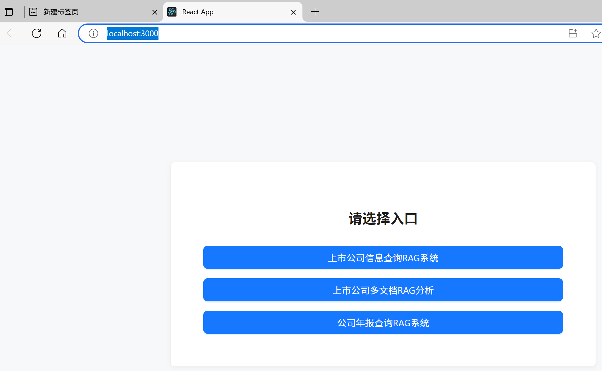

## 本项目有三个子项目，形成三个RAG入口

### 1. 中文上市公司信息查询（实际只能查一个文档）

目录：D:/cursorprj/lecture23/RAG-Challenge-xuwh-step_1

此版为2的前期版本，实际只能从一个文档中retrieve信息，然后给LLM。

### 2. 中文上市公司信息查询（查多个文档）

目录：D:/cursorprj/lecture23/RAG-Challenge-xuwh-step_2

可处理多个文档，从多个文档中retrieve 信息，然后再rerank, 思路是将一个公司的多个文档，先形成多个含meta信息和chunk信息的文档(PDF和Json一对一），然后合并json,最后生成一个faiss数据库
这个项目的数据是中芯国际的多份文档，prompt是中文的

### 3. 英文年报查询

目录：D:\cursorprj\RAG\RAG-Challenge-xuwh-step_2.2

可处理多个文档，思路是将一个公司的多个文档，先形成多个含meta信息和chunk信息的文档(PDF和Json一对一），然后合并json,最后生成一个faiss数据库
这个项目的数据是原始挑战赛的年报的数据, 英文文档,prompt是英文。

## 运行方式

### 1，数据准备和批量回答问题：

回到子项目根目录，例如（D:\cursorprj\RAG\RAG-Challenge-xuwh-step_2.2），然后运行：

```bash
   python -m src.pipeline
```

### 2，前后端分离的方式

#### 架构

- **后端（API Server）**：使用 Python 的 Flask 框架（见 `src/rag_api_server.py`），负责提供 RESTful API 服务。主要功能包括：

  - 提供 `/preset_questions` 和 `/ask` 等接口，供前端调用。
  - 通过 CORS 支持跨域请求，允许前端独立部署和访问。
  - 业务逻辑和数据处理（如调用 Pipeline、读取本地数据、返回结构化答案等）全部在后端完成。
- **前端（Web Client）**：使用 React（见 `rag-client/src/App.js`），通过 axios/fetch 直接请求后端 API。主要特征：

  - 通过 `http://localhost:5000/ask` 等接口与 Flask 后端通信。
  - 前端页面完全静态化，独立于后端运行（如通过 `npm start` 启动）。
  - 只负责 UI 展示和用户交互，所有数据和推理结果都来自后端 API。

#### 运行方式

1. 终端1：回到子项目根目录，如（D:\cursorprj\RAG\RAG-Challenge-xuwh-step_2.2），然后运行：

```bash
   python -m src.rag_api_server
```

2. 终端2： 进入D:\cursorprj\RAG\rag-client\src

```bash
npm start
```

3. 此时会出现三个入口，分别对应三个子项目。

   哪个子项目后端跑着，就选哪个子项目的对应前端：

   
4. 客户端预设问题是在客户端设置的，在此目录下：D:\cursorprj\lecture23\\rag-client\public\questions-xxx.json。

### 注意

1 .要让LLM用英文回答问题，只需找到 src/prompts.py 里的：

```python
class AnswerWithRAGContextSharedPrompt:
    instruction = """
你是一个RAG（检索增强生成）问答系统。
你的任务是仅基于公司年报中RAG检索到的相关页面内容，回答给定问题。
...
"""
```

改为：

```python
class AnswerWithRAGContextSharedPrompt:
    instruction = """
All your answers must be in English.

你是一个RAG（检索增强生成）问答系统。
你的任务是仅基于公司年报中RAG检索到的相关页面内容，回答给定问题。
...
"""
```
