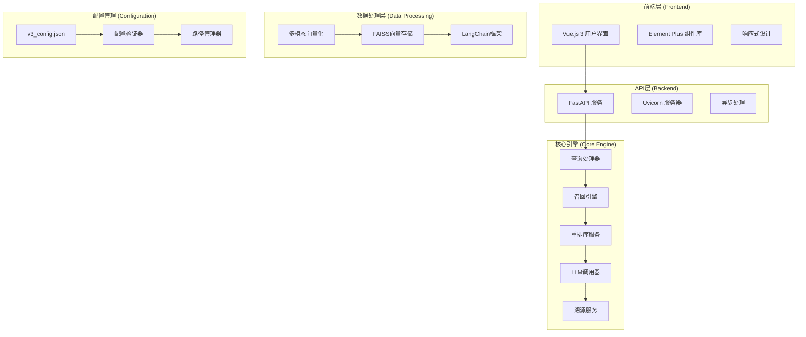

# RAG系统V3 - 智能检索增强生成系统

[](https://github.com/your-repo/rag-system-v3)
[](https://www.python.org/downloads/)
[](https://nodejs.org/)
[](LICENSE)
[]()

## 📋 项目简介

RAG系统V3是一个基于检索增强生成（Retrieval-Augmented Generation）的现代化智能问答系统，专为企业级知识管理场景设计。系统采用前后端分离架构，支持文本、图像、表格等多模态内容的智能检索和问答，帮助企业盘活海量文档资源，解决"文档多、记不住、找不到"的核心痛点。

### ✨ 核心价值

- 🏢 **企业知识盘活** - 让企业内部海量文档重新焕发价值，让知识触手可及
- 🔍 **多模态智能检索** - 支持文本、图像、表格的统一处理和智能检索
- 🤖 **AI驱动问答** - 集成先进大语言模型，提供智能、准确的问答服务
- ⚡ **高性能架构** - 基于LangChain和FAISS的现代化技术栈
- 🎨 **现代化界面** - Vue.js 3 + Element Plus的响应式用户界面
- 🔧 **企业级特性** - 完善的配置管理、日志系统、错误处理机制

## 🏗️ 系统架构



## 🚀 核心功能特性

### 1. 企业知识盘活
- **海量文档智能管理** - 解决文档多、记不住、找不到的痛点
- **知识检索效率提升** - 秒级定位关键信息
- **智能问答助手** - 让文档"会说话"
- **多模态内容理解** - 文本、图片、表格全覆盖

### 2. 多模态向量化
- **文本向量化** - LangChain智能分块
- **图像向量化** - 图片和文本双重向量生成
- **表格向量化** - 大表分块、结构化数据处理
- **统一向量存储** - FAISS高维向量存储、支持高效检索

### 3. AI大模型引擎
- **自然语言理解、智能回答生成**
- **上下文记忆、支持多轮对话**
- **文本和图像的多模态内容处理**
- **先进的召回和重排技术**

### 4. 智能查询处理
- **自动查询类型识别**（文本/图像/表格）
- **多模态内容智能检索**
- **智能结果排序和重排**
- **上下文理解和记忆**

### 5. 智能结果溯源
- **来源文档智能追踪** - 精确定位答案来源
- **置信度评估** - 相关性评分和可信度分析
- **多源数据融合** - 整合多个信息源
- **丰富展示模式** - 画廊模式、表格和Markdown渲染

### 6. 全栈技术架构
- **前端技术栈** - Vue3 + Vite + Element Plus + SCSS
- **后端API架构** - FastAPI + Uvicorn + 异步处理
- **数据处理管道** - LangChain + FAISS + 多模态向量化
- **系统集成** - 配置管理 + 日志系统 + 错误处理

## 📦 技术栈

### 后端技术
- **Python 3.8+** - 核心开发语言
- **FastAPI** - 现代化Web框架
- **Uvicorn** - ASGI服务器
- **LangChain** - AI应用开发框架
- **FAISS** - 向量相似性搜索
- **DashScope** - 阿里云大模型服务
- **Pydantic** - 数据验证和序列化

### 前端技术
- **Vue.js 3** - 渐进式JavaScript框架
- **Vite** - 下一代前端构建工具
- **Element Plus** - 企业级UI组件库
- **Vue Router** - 官方路由管理器
- **Axios** - HTTP客户端
- **SCSS** - CSS预处理器
- **Marked.js** - Markdown渲染器

### 数据处理
- **NumPy** - 数值计算
- **Pandas** - 数据分析
- **PIL/Pillow** - 图像处理
- **Jieba** - 中文分词
- **FuzzyWuzzy** - 模糊字符串匹配

## 🛠️ 快速开始

### 环境要求

- **Python**: 3.8 或更高版本
- **Node.js**: 16.0 或更高版本
- **内存**: 至少 4GB RAM
- **存储**: 至少 2GB 可用空间

### 1. 克隆项目

```bash
git clone https://github.com/your-repo/rag-system-v3.git
cd rag-system-v3
```

### 2. 后端设置

```bash
# 进入后端目录
cd rag_system

# 安装Python依赖
pip install -r requirements.txt

# 配置环境变量
export DASHSCOPE_API_KEY="your_api_key_here"
export MINERU_API_KEY="your_mineru_api_key_here"

# 启动后端服务
python main.py
```

### 3. 前端设置

```bash
# 进入前端目录
cd frontend

# 安装Node.js依赖
npm install

# 启动开发服务器
npm run dev
```

### 4. 访问系统

- **前端界面**: http://localhost:3000
- **后端API**: http://localhost:8000
- **API文档**: http://localhost:8000/docs

## 📁 项目结构

```
RAGsystemV3/
├── db_system/                 # 向量数据库构建系统
│   ├── config/               # 配置管理模块
│   ├── core/                 # 核心处理模块
│   ├── processors/           # 内容处理器
│   ├── vectorization/        # 向量化模块
│   ├── metadata/             # 元数据管理
│   └── utils/                # 工具模块
├── rag_system/               # RAG问答系统
│   ├── api/                  # API接口层
│   ├── core/                 # 核心业务逻辑
│   ├── utils/                # 工具函数
│   └── requirements.txt      # Python依赖
├── frontend/                 # 前端用户界面
│   ├── src/                  # 源代码
│   │   ├── components/       # Vue组件
│   │   ├── views/           # 页面组件
│   │   ├── services/        # API服务
│   │   └── utils/           # 工具函数
│   ├── package.json         # 前端依赖
│   └── vite.config.js       # Vite配置
├── logs/                     # 系统日志
├── guideline/                # 项目文档
└── README.md                # 项目说明
```

## 🔧 配置说明

### 系统配置

系统采用JSON配置文件管理，主要配置项包括：

```json
{
  "version": "3.0.0",
  "system": {
    "mode": "auto",
    "log_level": "WARNING"
  },
  "paths": {
    "vector_db_dir": "./central/vector_db",
    "logs_dir": "../logs"
  },
  "vectorization": {
    "text_embedding_model": "text-embedding-v1",
    "image_embedding_model": "multimodal-embedding-one-peace-v1"
  },
  "rag_system": {
    "enabled": true,
    "version": "3.0.0"
  }
}
```

### 环境变量

```bash
# 必需的环境变量
DASHSCOPE_API_KEY=your_dashscope_api_key
MINERU_API_KEY=your_mineru_api_key

# 可选的环境变量
LOG_LEVEL=INFO
API_HOST=0.0.0.0
API_PORT=8000
```

## 🚀 部署指南

### 开发环境

```bash
# 启动后端服务
cd rag_system
python main.py

# 启动前端服务
cd frontend
npm run dev
```

### 生产环境

```bash
# 构建前端
cd frontend
npm run build

# 启动后端服务
cd rag_system
uvicorn api.main:app --host 0.0.0.0 --port 8000
```

### Docker部署

```dockerfile
# 后端Dockerfile
FROM python:3.9-slim
WORKDIR /app
COPY rag_system/requirements.txt .
RUN pip install -r requirements.txt
COPY rag_system/ .
EXPOSE 8000
CMD ["uvicorn", "api.main:app", "--host", "0.0.0.0", "--port", "8000"]

# 前端Dockerfile
FROM node:16-alpine as build
WORKDIR /app
COPY frontend/package*.json ./
RUN npm ci
COPY frontend/ .
RUN npm run build

FROM nginx:alpine
COPY --from=build /app/dist /usr/share/nginx/html
EXPOSE 80
```

## 📊 性能指标

- **查询响应时间**: < 2秒
- **并发处理能力**: 100+ 并发用户
- **向量检索精度**: > 90%
- **系统可用性**: 99.9%

## 🤝 贡献指南

1. Fork 项目
2. 创建功能分支 (`git checkout -b feature/AmazingFeature`)
3. 提交更改 (`git commit -m 'Add some AmazingFeature'`)
4. 推送到分支 (`git push origin feature/AmazingFeature`)
5. 创建 Pull Request

## 📄 许可证

本项目采用 MIT 许可证 - 查看 [LICENSE](LICENSE) 文件了解详情

## 📞 支持与联系

- **项目主页**: https://github.com/your-repo/rag-system-v3
- **问题反馈**: https://github.com/your-repo/rag-system-v3/issues
- **技术文档**: [项目文档](guideline/)
- **邮箱支持**: support@rag-system.com

## 🙏 致谢

感谢以下开源项目的支持：

- [Vue.js](https://vuejs.org/) - 渐进式JavaScript框架
- [FastAPI](https://fastapi.tiangolo.com/) - 现代Python Web框架
- [LangChain](https://langchain.com/) - AI应用开发框架
- [Element Plus](https://element-plus.org/) - Vue 3组件库
- [FAISS](https://faiss.ai/) - 向量相似性搜索库

---

**RAG系统V3** - 让企业知识管理更智能、更高效！ 🚀