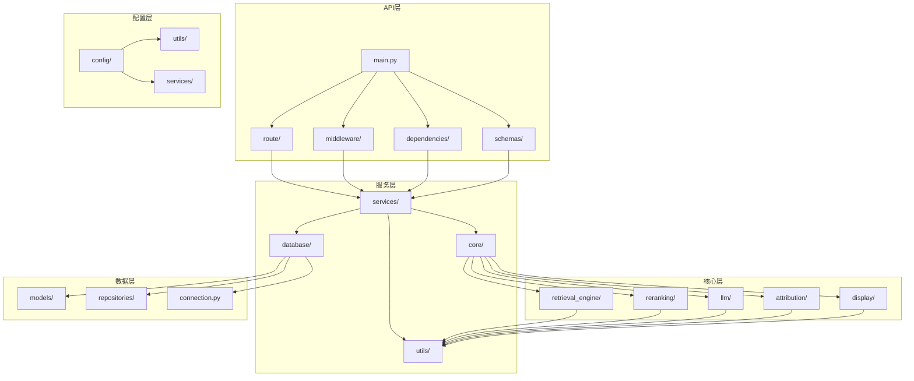

# RAG系统技术规范详细设计文档

## 一、文档基础信息

| 模块名称 | RAG系统技术规范详细设计                                      | 所属项目 | V3版本RAG系统                     |
| -------- | ------------------------------------------------------------ | -------- | --------------------------------- |
| 文档版本 | V3.0                                                         | 文档状态 | ☑ 草稿 □ 评审中 □ 已确认 □ 已归档 |
| 编写人   | AI助手                                                       | 编写日期 | 2025年1月                         |
| 关联文档 | 《1.向量数据库机制详解.md》《2.RAG系统Prompt构建机制详解.md》《3.混合查询流程分析.md》《4.智能查询流程分析.md》《5.RAG系统重排序机制详解.md》《46.RAG系统系统集成与架构设计详细设计文档.md》《47.RAG系统API接口文档.md》 |          |                                   |

## 二、文档说明

本文档详细描述了V3版本RAG系统的技术规范，包括代码组织规范、命名规范、代码风格、模块依赖关系、配置文件规范、日志规范、测试规范、部署规范等。通过统一的技术规范，确保代码的可维护性、可扩展性和团队协作效率。

## 三、代码组织规范

### 1. 模块组织原则

#### **单一职责原则**
- 每个模块只负责一个特定的功能领域
- 模块内部功能紧密相关，外部接口清晰
- 避免模块间的循环依赖

#### **分层架构原则**
- **前端层**：Vue 3.x + Composition API + Element Plus
- **API层**：FastAPI + Pydantic处理HTTP请求和响应
- **服务层**：UnifiedServices实现业务逻辑
- **核心层**：QueryProcessor、RetrievalEngine、MultiModelReranker等核心功能
- **数据层**：LangChain FAISS向量数据库和元数据管理

#### **依赖倒置原则**
- 高层模块不依赖低层模块
- 通过接口和抽象类定义依赖关系
- 使用依赖注入管理模块依赖

### 2. 模块职责划分

#### **核心模块职责**
- **QueryProcessor**：查询类型识别、流程编排、结果整合
- **RetrievalEngine**：多模态内容检索、多策略召回实现
- **MultiModelReranker**：多模型重排序、分数融合、性能优化
- **LLMCaller**：大模型调用、提示词管理、上下文处理
- **AttributionService**：正向溯源、反向溯源、溯源模式切换
- **DisplayModeSelector**：展示模式选择、内容分析、智能推荐

#### **支持模块职责**
- **ConfigIntegration**：配置加载、验证、热更新，与db_system集成
- **VectorDBIntegration**：向量数据库集成、搜索接口封装
- **ContextManager**：上下文管理、内容优化、长度控制
- **PromptManager**：提示词管理、模板处理、动态生成
- **Pydantic模型**：数据定义、验证、序列化
- **异常处理**：异常定义、错误分类、用户友好提示

## 四、前端技术规范

### 1. Vue 3.x技术栈规范

#### **技术栈组成**
- **Vue 3.x**：使用Composition API和现代Vue 3特性
- **Element Plus**：UI组件库，提供统一的界面组件
- **Axios**：HTTP客户端，处理API请求
- **Vite**：构建工具，提供快速的开发体验
- **TypeScript**：类型安全，提高代码质量

#### **组件设计规范**
- **组件分离**：DisplayModeSelector和SmartQAResult组件分离关注点
- **Props定义**：使用TypeScript定义清晰的Props接口
- **事件处理**：使用emit定义组件间通信
- **响应式数据**：使用ref和computed管理组件状态
- **生命周期**：合理使用onMounted等生命周期钩子

#### **代码组织规范**
```
frontend/src/
├── components/          # 可复用组件
│   ├── DisplayModeSelector.vue
│   ├── SmartQAResult.vue
│   └── ...
├── views/              # 页面组件
│   ├── Chat.vue
│   └── Home.vue
├── services/           # API服务
│   └── api.js
├── utils/              # 工具函数
└── assets/             # 静态资源
```

### 2. API服务规范

#### **Axios配置规范**
- **实例创建**：使用axios.create创建专用实例
- **拦截器**：配置请求和响应拦截器
- **错误处理**：统一的错误处理和用户提示
- **超时设置**：合理的请求超时时间
- **环境配置**：支持不同环境的API地址配置

#### **服务类设计规范**
- **单一职责**：每个服务类负责特定的API功能
- **方法命名**：使用清晰的动词+名词命名
- **参数验证**：在发送请求前验证参数
- **错误处理**：捕获和转换API错误
- **类型安全**：使用TypeScript定义接口类型

## 五、命名规范

### 1. 文件命名规范

#### **Python文件命名**
- 使用小写字母和下划线
- 文件名应清晰表达其功能
- 避免使用缩写和数字开头

**正确示例**:
```
query_processor.py
text_retrieval.py
llm_caller.py
source_attribution.py
```

**错误示例**:
```
QueryProcessor.py
textRetrieval.py
LLMCaller.py
src_attr.py
```

#### **配置文件命名**
- 使用小写字母和下划线
- 包含配置类型和版本信息
- 便于识别和管理

**正确示例**:
```
rag_config.json
rag_config_schema.json
rag_config_dev.json
rag_config_prod.json
```

### 2. 类命名规范

#### **类名命名**
- 使用大驼峰命名法（PascalCase）
- 类名应清晰表达其功能和职责
- 避免使用缩写和数字

**正确示例**:
```python
class QueryProcessor:
class TextRetrievalEngine:
class LLMCaller:
class SourceAttributionService:
```

**错误示例**:
```python
class query_processor:
class TextRetrieval:
class LLMCaller:
class SrcAttr:
```

#### **方法名命名**
- 使用小写字母和下划线
- 方法名应清晰表达其功能
- 动词开头，表达动作

**正确示例**:
```python
def process_query(self, query_text: str) -> QueryResult:
def retrieve_text(self, query: str) -> List[TextChunk]:
def generate_answer(self, context: str) -> str:
def get_source_attribution(self, answer: str) -> List[Source]:
```

**错误示例**:
```python
def Query(self, query_text: str) -> QueryResult:
def text_retrieval(self, query: str) -> List[TextChunk]:
def answer(self, context: str) -> str:
def source(self, answer: str) -> List[Source]:
```

### 3. 变量命名规范

#### **变量名命名**
- 使用小写字母和下划线
- 变量名应清晰表达其含义
- 避免使用单字母变量名（除了循环变量）

**正确示例**:
```python
query_text = "中芯国际业绩如何？"
max_results = 10
retrieval_results = []
similarity_threshold = 0.7
```

**错误示例**:
```python
qt = "中芯国际业绩如何？"
mr = 10
rr = []
st = 0.7
```

#### **常量命名**
- 使用大写字母和下划线
- 常量名应清晰表达其含义

**正确示例**:
```python
MAX_QUERY_LENGTH = 5000
DEFAULT_MAX_RESULTS = 10
SIMILARITY_THRESHOLD = 0.7
API_TIMEOUT = 30
```

## 五、代码风格规范

### 1. Python代码风格

#### **PEP 8规范**
- 遵循PEP 8代码风格指南
- 使用4个空格进行缩进
- 行长度不超过120字符
- 使用空行分隔函数和类

#### **导入规范**

**导入原则**：
- 使用完整的包路径导入，避免手动路径设置
- 项目应安装为Python包，确保导入的透明性
- 无论从项目哪个目录执行Python，导入都应该成功

**标准库导入**：
```python
import os
import sys
from typing import List, Dict, Optional
```

**第三方库导入**：
```python
import fastapi
from pydantic import BaseModel
```

**本地模块导入**：
```python
# ✅ 正确：使用完整的包路径
from db_system.config.config_manager import ConfigManager
from db_system.core.vector_store_manager import LangChainVectorStoreManager
from db_system.core.metadata_manager import MetadataManager

# ✅ 正确：包内相对导入
from .models import QueryRequest
from .services import RAGService
from ..utils import validation_utils
```

**❌ 禁止的导入方式**：
```python
# 错误：手动设置路径
import sys
import os
sys.path.append('../db_system')
from config.config_manager import ConfigManager

# 错误：猜测式路径调整
current_dir = os.path.dirname(os.path.abspath(__file__))
db_system_dir = os.path.join(os.path.dirname(current_dir), 'db_system')
sys.path.insert(0, db_system_dir)
```

**项目包安装要求**：
- 项目根目录必须包含`setup.py`文件
- 开发环境执行：`pip install -e .`
- 确保项目在任何子目录下都能正常导入

#### **函数定义规范**
```python
def process_query(
    query_text: str,
    query_type: str = "smart",
    max_results: int = 10,
    **kwargs
) -> QueryResult:
    """
    处理用户查询请求
    
    Args:
        query_text: 查询文本
        query_type: 查询类型
        max_results: 最大结果数
        **kwargs: 其他参数
        
    Returns:
        QueryResult: 查询结果
        
    Raises:
        ValueError: 参数错误
        ProcessingError: 处理错误
    """
    # 参数验证
    if not query_text or len(query_text) > MAX_QUERY_LENGTH:
        raise ValueError("查询文本无效或过长")
    
    # 业务逻辑处理
    try:
        result = _execute_query(query_text, query_type, max_results)
        return QueryResult.from_data(result)
    except Exception as e:
        raise ProcessingError(f"查询处理失败: {str(e)}") from e
```

### 2. 注释规范

#### **文档字符串规范**
- 所有公共函数和类必须有文档字符串
- 使用Google风格的文档字符串格式
- 包含参数说明、返回值说明和异常说明

#### **行内注释规范**
- 复杂逻辑必须添加注释
- 注释应解释"为什么"而不是"是什么"
- 注释应与代码保持同步

**正确示例**:
```python
# 由于DashScope API的限制，我们需要分批处理
batch_size = min(32, len(candidates))
for i in range(0, len(candidates), batch_size):
    batch = candidates[i:i + batch_size]
    # 处理当前批次
    results.extend(self._process_batch(batch))
```

**错误示例**:
```python
# 处理候选列表
for i in range(0, len(candidates), batch_size):
    batch = candidates[i:i + batch_size]
    results.extend(self._process_batch(batch))
```

### 3. 错误处理规范

#### **异常处理原则**
- 使用具体的异常类型而不是通用Exception
- 提供有意义的错误信息
- 记录详细的错误日志
- 向上层抛出有意义的异常

**正确示例**:
```python
try:
    result = self.llm_service.generate_answer(context)
except LLMServiceError as e:
    logger.error(f"LLM服务调用失败: {e}")
    raise QueryProcessingError("答案生成失败，请稍后重试") from e
except ValidationError as e:
    logger.error(f"数据验证失败: {e}")
    raise InvalidInputError(f"输入数据无效: {e}") from e
```

## 六、模块依赖关系

### 1. 依赖关系图



### 2. 依赖管理原则

#### **避免循环依赖**
- 模块间不能形成循环依赖
- 使用依赖注入解耦模块
- 通过接口定义依赖关系

#### **依赖层次**
```
API层 → 服务层 → 核心层 → 数据层
  ↓        ↓        ↓        ↓
配置层 → 工具层 → 外部服务 → 数据库
```

#### **外部依赖管理**
- 使用requirements.txt管理Python包依赖
- 使用虚拟环境隔离依赖
- 定期更新依赖版本

#### **项目包依赖管理**
- 项目必须安装为Python包：`pip install -e .`
- 使用`setup.py`定义项目结构和依赖关系
- 确保所有子模块都能通过包路径正确导入
- 避免在代码中使用`sys.path`操作来调整导入路径

## 七、配置文件规范

### 1. 配置文件结构

#### **RAG系统配置节点**
```json
{
    "rag_system": {
        "enabled": true,
        "version": "3.0.0",
        "models": {
            "llm": {
                "model_name": "qwen-turbo",
                "max_tokens": 2048,
                "temperature": 0.7
            },
            "reranking": {
                "model_name": "gte-rerank-v2",
                "batch_size": 32,
                "similarity_threshold": 0.7
            }
        },
        "query_processing": {
            "max_context_length": 4000,
            "max_results": 10,
            "relevance_threshold": 0.5
        },
        "engines": {
            "text_engine": {
                "enabled": true,
                "max_results": 10,
                "similarity_threshold": 0.7
            },
            "image_engine": {
                "enabled": true,
                "max_results": 20,
                "similarity_threshold": 0.3
            },
            "table_engine": {
                "enabled": true,
                "max_results": 15,
                "similarity_threshold": 0.65
            }
        },
        "performance": {
            "max_concurrent_queries": 10,
            "query_timeout": 60,
            "enable_monitoring": true
        }
    }
}
```

### 2. 配置管理原则

#### **配置分层**
- 系统级配置：环境、版本、日志等
- 应用级配置：功能开关、参数设置等
- 环境级配置：不同环境的特定配置

#### **配置验证**
- 启动时验证配置完整性
- 验证配置值的有效性
- 提供配置错误的详细提示

#### **配置热更新**
- 支持运行时更新部分配置
- 提供配置重载接口
- 记录配置变更日志

## 八、日志规范

### 1. 日志配置

#### **日志级别**
- DEBUG: 详细的调试信息
- INFO: 一般信息
- WARNING: 警告信息
- ERROR: 错误信息
- CRITICAL: 严重错误

#### **日志格式**
```python
import logging

logging.basicConfig(
    level=logging.INFO,
    format='%(asctime)s - %(name)s - %(levelname)s - %(message)s',
    handlers=[
        logging.FileHandler('logs/rag_system.log'),
        logging.StreamHandler()
    ]
)
```

### 2. 日志记录原则

#### **记录内容**
- 系统启动和关闭
- 用户操作和查询
- 错误和异常
- 性能指标
- 配置变更

#### **日志安全**
- 不记录敏感信息（API密钥、用户密码等）
- 记录操作审计信息
- 保护用户隐私

## 九、测试规范

### 1. 测试原则

#### **测试覆盖**
- 单元测试覆盖率 > 80%
- 集成测试覆盖主要功能
- 端到端测试覆盖用户场景

#### **测试数据**
- 使用固定的测试数据
- 测试数据应覆盖各种情况
- 避免测试数据污染

### 2. 测试组织

#### **测试文件命名**
```
test_模块名.py
test_类名.py
test_函数名.py
```

#### **测试类命名**
```python
class TestQueryProcessor:
class TestTextRetrievalEngine:
class TestLLMCaller:
```

#### **测试方法命名**
```python
def test_process_query_success():
def test_process_query_invalid_input():
def test_process_query_timeout():
```

## 十、部署规范

### 1. 环境管理

#### **环境分类**
- 开发环境 (development)
- 测试环境 (testing)
- 预生产环境 (staging)
- 生产环境 (production)

#### **环境配置**
- 不同环境使用不同的配置文件
- 环境变量覆盖配置文件
- 敏感信息通过环境变量传递

#### **Python环境配置**
- 开发环境：执行`pip install -e .`安装项目包
- 测试环境：确保项目包已正确安装
- 生产环境：通过requirements.txt安装所有依赖
- 验证导入：在任何子目录下都能成功导入项目模块

### 2. 部署流程

#### **部署步骤**
1. 代码构建和测试
2. 镜像构建和推送
3. 配置更新
4. 服务部署
5. 健康检查
6. 流量切换

#### **回滚策略**
- 保留多个版本
- 快速回滚机制
- 回滚验证流程

## 十一、代码审查规范

### 1. 审查要点

#### **功能正确性**
- 代码逻辑是否正确
- 边界情况是否处理
- 错误处理是否完善

#### **代码质量**
- 代码风格是否规范
- 命名是否清晰
- 注释是否充分
- 导入语句是否规范（使用完整包路径）
- 是否避免了手动路径设置（sys.path操作）

#### **性能和安全**
- 是否有性能问题
- 是否有安全漏洞
- 是否有资源泄漏

### 2. 审查流程

#### **审查步骤**
1. 代码提交
2. 自动化检查
3. 同行审查
4. 问题修复
5. 再次审查
6. 合并代码

## 十二、总结

### 1. 技术规范优势

**代码质量提升**：
- 统一的代码风格
- 完善的注释文档
- 规范的错误处理

**团队协作效率**：
- 清晰的代码结构
- 统一的开发规范
- 便于代码审查

**系统可维护性**：
- 模块化设计
- 清晰的依赖关系
- 完善的文档说明

### 2. 实施建议

**分阶段实施**：
- 第一阶段：建立基础代码规范
- 第二阶段：实施命名和注释规范
- 第三阶段：完善测试和部署规范
- 第四阶段：优化代码审查流程

**持续改进**：
- 定期审查和更新规范
- 收集团队反馈
- 优化开发流程

这个技术规范文档为V3 RAG系统提供了完整的代码开发指导，通过统一的命名规范、完善的代码风格、清晰的模块依赖和完善的开发流程，确保系统代码的可维护性、可扩展性和团队协作效率，为后续的开发工作奠定了坚实的基础。clear