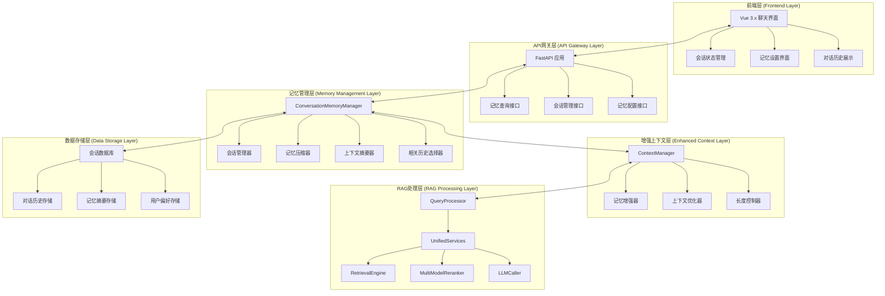

# M23-RAG系统LLM上下文记忆与自由对话功能详细需求文档

## 一、文档基础信息

| 模块名称 | M23-RAG系统LLM上下文记忆与自由对话功能 | 所属项目 | V3版本RAG系统 |
| -------- | -------------------------------------- | -------- | ------------- |
| 文档版本 | V1.0 | 文档状态 | ☑ 草稿 □ 评审中 □ 已确认 □ 已归档 |
| 编写人   | AI助手 | 编写日期 | 2025年1月 |
| 关联文档 | 《33.V3_RAG查询处理模块详细设计文档.md》《35.V3_RAG_LLM调用模块详细设计文档.md》《44.RAG系统前端展示模式选择模块详细设计文档.md》《45.RAG系统前后端交互详细设计文档.md》 | | |

## 二、项目概述

### 1. 项目目标

将现有RAG系统增强为支持**多轮对话和上下文记忆**的智能问答系统，实现：
1. **上下文记忆**：LLM能够记住对话历史，理解上下文关联
2. **自由对话**：支持连续多轮对话，无需重复提供背景信息
3. **智能摘要**：自动生成对话摘要，保持长期记忆
4. **会话管理**：支持多用户、多会话的独立上下文管理

### 2. 核心原则

- **保持原有优秀设计**：基于现有RAG系统架构，最小化改动
- **渐进式增强**：在现有ContextManager基础上增加记忆功能
- **配置化管理**：记忆策略、会话设置等通过配置文件管理
- **性能优化**：智能的记忆压缩和上下文长度控制
- **用户体验优先**：提供直观的对话界面和记忆管理功能

## 三、系统架构设计

### 1. 整体架构图



### 2. 核心模块设计

#### 2.1 会话记忆管理器 (ConversationMemoryManager)
- **职责**：管理对话会话、记忆存储、上下文增强
- **核心功能**：会话创建、历史管理、记忆压缩、摘要生成
- **数据存储**：SQLite数据库存储会话和记忆数据

#### 2.2 增强上下文管理器 (Enhanced ContextManager)
- **职责**：在现有ContextManager基础上增加记忆功能
- **核心功能**：记忆增强、上下文融合、长度控制
- **集成方式**：扩展现有ContextManager类

#### 2.3 记忆配置管理器 (MemoryConfigManager)
- **职责**：管理记忆相关的配置参数
- **核心功能**：记忆策略配置、会话设置、性能参数
- **配置方式**：JSON配置文件 + 环境变量

## 四、核心功能需求

### 1. 会话管理功能

#### 1.1 会话生命周期管理
| 功能ID | 功能名称 | 核心描述 | 操作角色 | 前置条件 |
| ------- | -------- | -------- | -------- | -------- |
| SM01 | 会话创建 | 为新用户或新对话创建会话 | 系统自动 | 用户开始对话 |
| SM02 | 会话恢复 | 恢复已存在的会话 | 用户操作 | 提供会话ID |
| SM03 | 会话切换 | 在不同会话间切换 | 用户操作 | 存在多个会话 |
| SM04 | 会话结束 | 主动结束或超时结束会话 | 用户/系统 | 会话进行中 |
| SM05 | 会话清理 | 清理过期或无效会话 | 系统自动 | 定期执行 |

#### 1.2 会话数据结构
```python
@dataclass
class ConversationSession:
    """对话会话数据结构"""
    session_id: str                    # 会话唯一标识
    user_id: str                       # 用户标识
    start_time: datetime               # 会话开始时间
    last_activity: datetime            # 最后活动时间
    conversation_history: List[Dict]   # 对话历史
    context_summary: str               # 上下文摘要
    memory_tokens: int                 # 记忆Token数量
    is_active: bool                    # 是否活跃
    memory_settings: Dict[str, Any]    # 记忆设置
    conversation_theme: str            # 对话主题
    important_points: List[str]        # 重要信息点
```

### 2. 记忆管理功能

#### 2.1 对话历史管理
| 功能ID | 功能名称 | 核心描述 | 操作角色 | 前置条件 |
| ------- | -------- | -------- | -------- | -------- |
| MM01 | 历史记录 | 记录每轮对话的完整信息 | 系统自动 | 对话进行中 |
| MM02 | 历史检索 | 根据查询检索相关历史 | 系统自动 | 历史记录存在 |
| MM03 | 历史压缩 | 压缩过长的对话历史 | 系统自动 | 历史超过阈值 |
| MM04 | 历史摘要 | 生成对话历史摘要 | 系统自动 | 历史记录存在 |
| MM05 | 重要信息提取 | 提取对话中的重要信息 | 系统自动 | 对话进行中 |

#### 2.2 记忆压缩策略
```python
class MemoryCompressionStrategy:
    """记忆压缩策略"""
    
    def compress_conversation_history(self, history: List[Dict]) -> List[Dict]:
        """压缩对话历史"""
        if len(history) <= 10:
            return history
        
        # 保留前3轮和后3轮
        important_turns = history[:3] + history[-3:]
        
        # 压缩中间部分
        middle_turns = history[3:-3]
        compressed_middle = self._compress_middle_turns(middle_turns)
        
        return important_turns + [compressed_middle]
    
    def _compress_middle_turns(self, turns: List[Dict]) -> Dict:
        """压缩中间轮次"""
        # 提取关键信息
        key_points = []
        for turn in turns:
            if self._is_important_turn(turn):
                key_points.append(turn['assistant_response'][:100])
        
        return {
            'type': 'compressed',
            'original_count': len(turns),
            'key_points': key_points,
            'compression_ratio': len(key_points) / len(turns)
        }
```

### 3. 上下文增强功能

#### 3.1 智能上下文构建
| 功能ID | 功能名称 | 核心描述 | 操作角色 | 前置条件 |
| ------- | -------- | -------- | -------- | -------- |
| CE01 | 对话摘要生成 | 生成当前对话的智能摘要 | 系统自动 | 对话进行中 |
| CE02 | 相关历史选择 | 选择与当前查询相关的历史 | 系统自动 | 历史记录存在 |
| CE03 | 上下文融合 | 融合记忆和检索上下文 | 系统自动 | 上下文数据存在 |
| CE04 | 长度控制 | 控制增强后上下文的长度 | 系统自动 | 上下文超长 |
| CE05 | 质量评估 | 评估增强上下文的质量 | 系统自动 | 上下文构建完成 |

#### 3.2 上下文增强流程
```python
def enhance_context_with_memory(self, session: ConversationSession, 
                               query: str, context_chunks: List[ContextChunk]) -> str:
    """使用记忆增强上下文"""
    
    # 1. 生成对话摘要
    conversation_summary = self._generate_conversation_summary(session)
    
    # 2. 选择相关历史
    relevant_history = self._select_relevant_history(session, query)
    
    # 3. 构建增强上下文
    enhanced_context = self._build_enhanced_context(
        query=query,
        conversation_summary=conversation_summary,
        relevant_history=relevant_history,
        context_chunks=context_chunks
    )
    
    return enhanced_context
```

### 4. 前端交互功能

#### 4.1 聊天界面增强
| 功能ID | 功能名称 | 核心描述 | 操作角色 | 前置条件 |
| ------- | -------- | -------- | -------- | -------- |
| UI01 | 会话状态显示 | 显示当前会话状态和记忆信息 | 用户查看 | 会话进行中 |
| UI02 | 记忆设置界面 | 提供记忆策略配置界面 | 用户操作 | 用户需要配置 |
| UI03 | 对话历史展示 | 展示完整的对话历史 | 用户查看 | 历史记录存在 |
| UI04 | 记忆管理界面 | 提供记忆清理和管理功能 | 用户操作 | 需要管理记忆 |
| UI05 | 会话切换界面 | 提供多会话切换功能 | 用户操作 | 存在多个会话 |

#### 4.2 前端状态管理
```javascript
// 前端会话状态
const conversationState = ref({
  sessionId: null,
  userId: 'default_user',
  conversationHistory: [],
  isMemoryEnabled: true,
  memorySettings: {
    maxHistoryTurns: 10,
    enableContextSummary: true,
    enableRelevantHistory: true,
    compressionThreshold: 20,
    summaryInterval: 5
  },
  activeSessions: [],
  currentSession: null
})
```

## 五、技术实现要求

### 1. 数据存储设计

#### 1.1 数据库表结构
```sql
-- 会话表
CREATE TABLE conversation_sessions (
    session_id TEXT PRIMARY KEY,
    user_id TEXT NOT NULL,
    start_time TIMESTAMP NOT NULL,
    last_activity TIMESTAMP NOT NULL,
    context_summary TEXT,
    memory_tokens INTEGER DEFAULT 0,
    is_active BOOLEAN DEFAULT TRUE,
    memory_settings TEXT,
    conversation_theme TEXT,
    important_points TEXT
);

-- 对话历史表
CREATE TABLE conversation_history (
    id INTEGER PRIMARY KEY AUTOINCREMENT,
    session_id TEXT NOT NULL,
    turn_id INTEGER NOT NULL,
    user_query TEXT NOT NULL,
    assistant_response TEXT NOT NULL,
    sources TEXT,
    timestamp TIMESTAMP NOT NULL,
    relevance_score REAL,
    is_important BOOLEAN DEFAULT FALSE,
    FOREIGN KEY (session_id) REFERENCES conversation_sessions(session_id)
);

-- 记忆摘要表
CREATE TABLE memory_summaries (
    id INTEGER PRIMARY KEY AUTOINCREMENT,
    session_id TEXT NOT NULL,
    summary_type TEXT NOT NULL,
    summary_content TEXT NOT NULL,
    created_time TIMESTAMP NOT NULL,
    token_count INTEGER,
    FOREIGN KEY (session_id) REFERENCES conversation_sessions(session_id)
);
```

#### 1.2 数据访问层
```python
class ConversationDataAccess:
    """对话数据访问层"""
    
    def create_session(self, session: ConversationSession) -> bool:
        """创建会话"""
        pass
    
    def get_session(self, session_id: str) -> Optional[ConversationSession]:
        """获取会话"""
        pass
    
    def add_conversation_turn(self, session_id: str, turn: Dict) -> bool:
        """添加对话轮次"""
        pass
    
    def get_conversation_history(self, session_id: str, limit: int = 50) -> List[Dict]:
        """获取对话历史"""
        pass
    
    def update_context_summary(self, session_id: str, summary: str) -> bool:
        """更新上下文摘要"""
        pass
```

### 2. API接口设计

#### 2.1 记忆查询接口
```python
@app.post("/api/v3/rag/query-with-memory")
async def query_with_memory(request: MemoryQueryRequest):
    """带记忆的查询接口"""
    
    # 请求模型
    class MemoryQueryRequest(BaseModel):
        query: str
        query_type: str = "auto"
        session_id: Optional[str] = None
        user_id: str = "default_user"
        enable_memory: bool = True
        memory_settings: Optional[Dict[str, Any]] = None
        options: Optional[Dict[str, Any]] = None
    
    # 响应模型
    class MemoryQueryResponse(BaseModel):
        success: bool
        answer: str
        sources: List[Dict[str, Any]]
        session_id: str
        conversation_summary: str
        memory_enhanced: bool
        processing_metadata: Dict[str, Any]
        error_message: Optional[str] = None
```

#### 2.2 会话管理接口
```python
@app.post("/api/v3/rag/session/create")
async def create_session(request: CreateSessionRequest):
    """创建新会话"""
    pass

@app.get("/api/v3/rag/session/{session_id}")
async def get_session(session_id: str):
    """获取会话信息"""
    pass

@app.post("/api/v3/rag/session/{session_id}/end")
async def end_session(session_id: str):
    """结束会话"""
    pass

@app.get("/api/v3/rag/session/{session_id}/history")
async def get_conversation_history(session_id: str, limit: int = 50):
    """获取对话历史"""
    pass
```

#### 2.3 记忆管理接口
```python
@app.post("/api/v3/rag/memory/compress")
async def compress_memory(session_id: str):
    """压缩会话记忆"""
    pass

@app.post("/api/v3/rag/memory/summarize")
async def summarize_conversation(session_id: str):
    """生成对话摘要"""
    pass

@app.delete("/api/v3/rag/memory/clear")
async def clear_memory(session_id: str):
    """清空会话记忆"""
    pass
```

### 3. 配置管理设计

#### 3.1 记忆配置结构
```json
{
  "memory_management": {
    "enable_memory": true,
    "max_history_turns": 20,
    "compression_threshold": 15,
    "summary_interval": 5,
    "max_context_length": 8000,
    "memory_retention_days": 30,
    "auto_cleanup": true
  },
  "conversation_settings": {
    "max_sessions_per_user": 10,
    "session_timeout_minutes": 60,
    "enable_session_switching": true,
    "enable_memory_sharing": false
  },
  "context_enhancement": {
    "enable_conversation_summary": true,
    "enable_relevant_history": true,
    "relevance_threshold": 0.3,
    "max_relevant_turns": 5,
    "summary_model": "qwen-turbo"
  },
  "performance": {
    "memory_compression_workers": 2,
    "summary_generation_workers": 1,
    "batch_processing_size": 10,
    "cache_size_mb": 100
  }
}
```

#### 3.2 配置管理类
```python
class MemoryConfigManager:
    """记忆配置管理器"""
    
    def __init__(self, config_integration: ConfigIntegration):
        self.config = config_integration
        self.memory_config = self.config.get_rag_config('memory_management', {})
        self.conversation_config = self.config.get_rag_config('conversation_settings', {})
        self.context_config = self.config.get_rag_config('context_enhancement', {})
    
    def get_memory_settings(self) -> Dict[str, Any]:
        """获取记忆设置"""
        return self.memory_config
    
    def get_conversation_settings(self) -> Dict[str, Any]:
        """获取会话设置"""
        return self.conversation_config
    
    def get_context_enhancement_settings(self) -> Dict[str, Any]:
        """获取上下文增强设置"""
        return self.context_config
```

## 六、性能与质量要求

### 1. 性能指标

#### 1.1 响应时间要求
- **记忆查询响应时间**：≤ 3秒（包含记忆增强）
- **会话创建时间**：≤ 0.5秒
- **记忆压缩时间**：≤ 2秒（20轮对话）
- **摘要生成时间**：≤ 5秒（10轮对话）

#### 1.2 并发性能要求
- **并发会话数**：支持100个活跃会话
- **并发查询数**：支持50个并发记忆查询
- **内存使用**：单会话内存使用 ≤ 50MB
- **存储空间**：单会话存储 ≤ 10MB

#### 1.3 数据一致性要求
- **会话数据一致性**：99.9%
- **记忆数据完整性**：99.9%
- **历史记录准确性**：100%

### 2. 质量保证

#### 2.1 功能测试
- **单元测试**：核心算法测试覆盖率 ≥ 90%
- **集成测试**：端到端对话流程测试
- **性能测试**：并发和压力测试
- **兼容性测试**：与现有RAG系统兼容性测试

#### 2.2 用户体验测试
- **对话连贯性测试**：多轮对话的连贯性
- **记忆准确性测试**：记忆信息的准确性
- **界面友好性测试**：前端界面的易用性
- **响应速度测试**：用户感知的响应速度

## 七、开发计划

### 1. 第一阶段：核心记忆模块（2-3周）

#### 1.1 会话记忆管理器开发
- **Week 1**：ConversationMemoryManager类设计实现
- **Week 2**：会话数据结构和存储层开发
- **Week 3**：记忆压缩和摘要算法实现

#### 1.2 数据存储层开发
- **Week 1**：数据库表结构设计和创建
- **Week 2**：数据访问层实现
- **Week 3**：数据迁移和备份机制

### 2. 第二阶段：上下文增强（2周）

#### 2.1 ContextManager增强
- **Week 1**：扩展现有ContextManager支持记忆
- **Week 2**：上下文融合和优化算法实现

#### 2.2 LLM调用增强
- **Week 1**：LLMCaller支持记忆上下文
- **Week 2**：增强Prompt模板和摘要生成

### 3. 第三阶段：API接口开发（1-2周）

#### 3.1 后端API开发
- **Week 1**：记忆查询接口和会话管理接口
- **Week 2**：记忆管理接口和配置接口

#### 3.2 接口测试和文档
- **Week 1**：API接口测试和调试
- **Week 2**：接口文档编写和示例代码

### 4. 第四阶段：前端集成（2-3周）

#### 4.1 聊天界面增强
- **Week 1**：会话状态管理和记忆设置界面
- **Week 2**：对话历史展示和会话切换功能
- **Week 3**：记忆管理界面和用户交互优化

#### 4.2 前端测试和优化
- **Week 1**：前端功能测试和bug修复
- **Week 2**：用户体验优化和性能调优

### 5. 第五阶段：集成测试和优化（1-2周）

#### 5.1 系统集成测试
- **Week 1**：端到端功能测试和性能测试
- **Week 2**：问题修复和系统优化

#### 5.2 部署和文档
- **Week 1**：生产环境部署和配置
- **Week 2**：用户文档编写和培训材料

## 八、风险评估与应对措施

### 1. 技术风险

| 风险项 | 风险等级 | 影响 | 应对措施 |
| ------ | -------- | ---- | -------- |
| 记忆数据量过大 | 中 | 性能下降 | 1. 实现智能压缩算法；2. 设置记忆上限；3. 定期清理机制 |
| 上下文长度超限 | 中 | LLM调用失败 | 1. 智能截断策略；2. 分层上下文管理；3. 动态长度控制 |
| 会话数据丢失 | 高 | 用户体验差 | 1. 数据备份机制；2. 事务处理；3. 错误恢复机制 |
| 并发性能不足 | 中 | 系统响应慢 | 1. 连接池优化；2. 缓存机制；3. 异步处理 |

### 2. 业务风险

| 风险项 | 风险等级 | 影响 | 应对措施 |
| ------ | -------- | ---- | -------- |
| 记忆准确性不足 | 中 | 用户体验差 | 1. 算法优化；2. 质量评估机制；3. 用户反馈机制 |
| 隐私数据泄露 | 高 | 安全风险 | 1. 数据加密存储；2. 访问控制；3. 数据脱敏 |
| 系统复杂度增加 | 中 | 维护困难 | 1. 模块化设计；2. 详细文档；3. 代码注释 |

### 3. 项目风险

| 风险项 | 风险等级 | 影响 | 应对措施 |
| ------ | -------- | ---- | -------- |
| 开发周期延长 | 中 | 项目延期 | 1. 分阶段开发；2. 优先级管理；3. 资源调配 |
| 需求变更频繁 | 中 | 开发效率低 | 1. 需求冻结；2. 变更控制；3. 版本管理 |
| 测试不充分 | 高 | 质量问题 | 1. 测试计划；2. 自动化测试；3. 用户验收测试 |

## 九、成功标准

### 1. 功能标准
- ✅ 支持多轮连续对话，上下文连贯性 ≥ 90%
- ✅ 记忆信息准确性 ≥ 95%
- ✅ 会话管理功能完整可用
- ✅ 前端界面友好易用

### 2. 性能标准
- ✅ 记忆查询响应时间 ≤ 3秒
- ✅ 支持100个并发会话
- ✅ 系统可用性 ≥ 99.5%
- ✅ 内存使用合理，无内存泄漏

### 3. 质量标准
- ✅ 代码测试覆盖率 ≥ 90%
- ✅ 无严重bug和安全漏洞
- ✅ 用户满意度 ≥ 85%
- ✅ 文档完整准确

## 十、总结

本需求文档详细描述了RAG系统LLM上下文记忆与自由对话功能的完整实现方案。通过基于现有架构的渐进式增强，在保持系统稳定性的同时，为用户提供智能的多轮对话体验。

**核心优势**：
- **最小化改动**：基于现有ContextManager和LLMCaller增强
- **配置化管理**：所有记忆策略通过配置文件管理
- **性能优化**：智能的记忆压缩和上下文长度控制
- **用户体验**：直观的对话界面和记忆管理功能

**技术特色**：
- **智能记忆**：基于相关性的历史选择和摘要生成
- **会话管理**：支持多用户、多会话的独立上下文
- **渐进增强**：在现有系统基础上平滑升级
- **可扩展性**：模块化设计支持功能扩展

通过本方案的实施，RAG系统将具备真正的对话记忆能力，为用户提供更加智能和人性化的问答体验。
