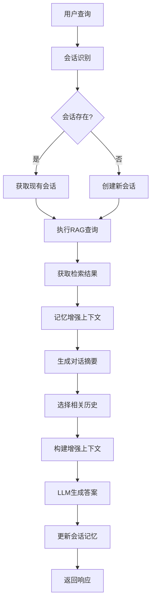
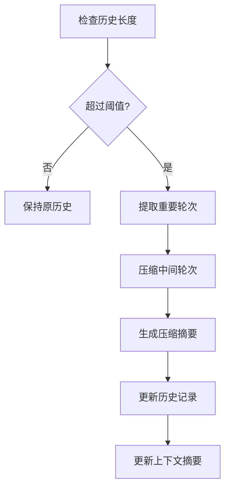
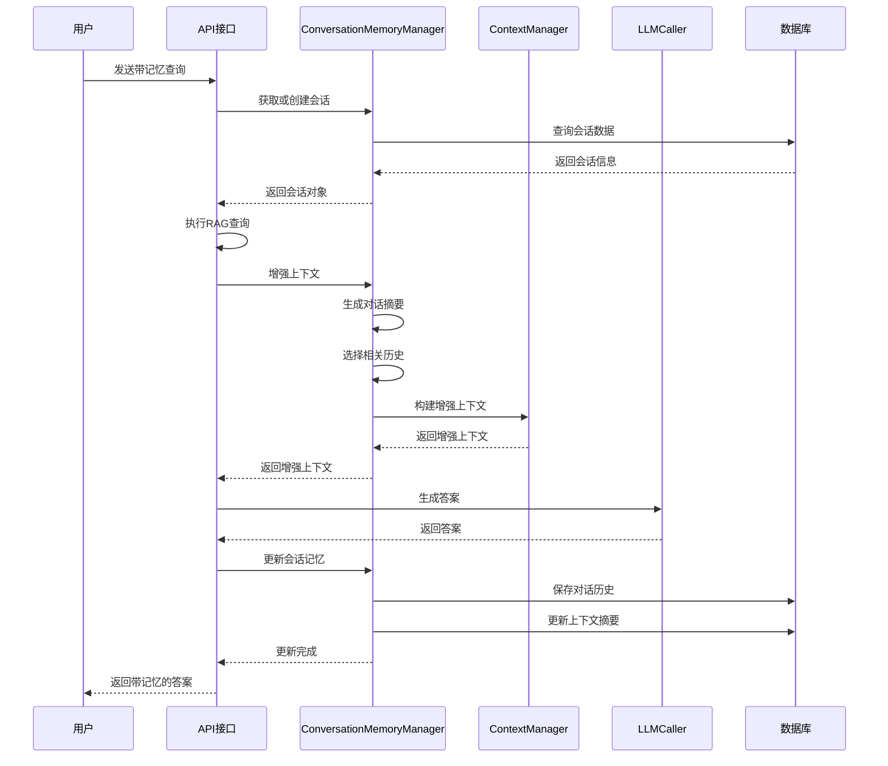

好的！我来在问答区为您生成LLM上下文记忆与自由对话功能的详细设计文档。

# M24-RAG系统LLM上下文记忆与自由对话功能详细设计文档

## 一、文档基础信息

| 模块名称 | M24-RAG系统LLM上下文记忆与自由对话功能                       | 所属项目 | V3版本RAG系统                     |
| -------- | ------------------------------------------------------------ | -------- | --------------------------------- |
| 文档版本 | V1.0                                                         | 文档状态 | ☑ 草稿 □ 评审中 □ 已确认 □ 已归档 |
| 编写人   | AI助手                                                       | 编写日期 | 2025年1月                         |
| 关联文档 | 《47.RAG系统LLM上下文记忆与自由对话功能详细需求文档.md》《33.V3_RAG查询处理模块详细设计文档.md》《35.V3_RAG_LLM调用模块详细设计文档.md》 |          |                                   |

## 二、模块概述

### 1. 定位与目标

作为RAG系统的**上下文记忆与自由对话核心模块**，本模块在现有架构基础上实现智能的多轮对话能力，让LLM能够记住对话历史，理解上下文关联，提供连贯的对话体验。

**核心特性**：
- **会话级记忆管理**：ConversationMemoryManager管理对话会话和记忆
- **智能上下文增强**：基于对话历史的上下文智能增强
- **记忆压缩与摘要**：智能的记忆压缩和对话摘要生成
- **多会话支持**：支持多用户、多会话的独立上下文管理

### 2. 设计原则

- **渐进式增强**：基于现有ContextManager和LLMCaller扩展
- **配置化管理**：记忆策略、会话设置等通过配置文件管理
- **性能优化**：智能的记忆压缩和上下文长度控制
- **数据一致性**：确保会话数据和记忆数据的一致性

### 3. 依赖与交互

| 关联模块           | 交互方向 | 核心交互内容                       |
| ------------------ | -------- | ---------------------------------- |
| ContextManager     | 扩展     | 增加记忆增强功能，保持原有接口兼容 |
| LLMCaller          | 扩展     | 支持记忆上下文，增强Prompt构建     |
| RAGMetadataManager | 扩展     | 增加会话和记忆元数据管理           |
| UnifiedServices    | 调用     | 通过统一服务接口调用记忆功能       |
| 前端聊天界面       | 被调用   | 提供会话管理和记忆设置接口         |

## 三、核心功能设计

### 1. 功能清单

| 功能ID | 功能名称         | 核心描述                         | 操作角色          | 前置条件       |
| ------ | ---------------- | -------------------------------- | ----------------- | -------------- |
| FM01   | 会话生命周期管理 | 创建、恢复、切换、结束对话会话   | 系统自动/用户操作 | 用户开始对话   |
| FM02   | 对话历史记录     | 记录每轮对话的完整信息           | 系统自动          | 对话进行中     |
| FM03   | 智能记忆压缩     | 压缩过长的对话历史，保持重要信息 | 系统自动          | 历史超过阈值   |
| FM04   | 对话摘要生成     | 生成对话历史的智能摘要           | 系统自动          | 对话进行中     |
| FM05   | 相关历史选择     | 根据当前查询选择相关历史         | 系统自动          | 历史记录存在   |
| FM06   | 上下文记忆增强   | 使用记忆增强检索上下文           | 系统自动          | 上下文数据存在 |
| FM07   | 记忆质量评估     | 评估记忆信息的质量和相关性       | 系统自动          | 记忆数据存在   |
| FM08   | 会话状态管理     | 管理会话的活跃状态和超时         | 系统自动          | 会话存在       |
| FM09   | 记忆配置管理     | 管理记忆相关的配置参数           | 系统管理员        | 系统初始化     |
| FM10   | 数据持久化       | 会话和记忆数据的持久化存储       | 系统自动          | 数据变更       |

### 2. 关键功能流程

#### 2.1 带记忆的查询处理流程



#### 2.2 记忆压缩流程



## 四、核心函数设计与调用关系

### 1. 函数清单

| 函数名                                                       | 功能描述         | 输入参数                 | 返回结果     | 所属服务                  |
| ------------------------------------------------------------ | ---------------- | ------------------------ | ------------ | ------------------------- |
| `__init__(config_integration)`                               | 初始化记忆管理器 | 配置集成管理器           | 无           | ConversationMemoryManager |
| `get_or_create_session(user_id, session_id)`                 | 获取或创建会话   | 用户ID、会话ID           | 会话对象     | ConversationMemoryManager |
| `add_conversation_turn(session, user_query, assistant_response)` | 添加对话轮次     | 会话、用户查询、助手响应 | 无           | ConversationMemoryManager |
| `enhance_context_with_memory(session, query, context_chunks)` | 记忆增强上下文   | 会话、查询、上下文块     | 增强上下文   | ConversationMemoryManager |
| `_generate_conversation_summary(session)`                    | 生成对话摘要     | 会话对象                 | 对话摘要     | ConversationMemoryManager |
| `_select_relevant_history(session, query)`                   | 选择相关历史     | 会话、查询               | 相关历史列表 | ConversationMemoryManager |
| `_compress_memory(session)`                                  | 压缩记忆         | 会话对象                 | 无           | ConversationMemoryManager |
| `_calculate_relevance(query, history)`                       | 计算相关性       | 查询、历史               | 相关性分数   | ConversationMemoryManager |
| `get_session_history(session_id, limit)`                     | 获取会话历史     | 会话ID、限制数量         | 历史列表     | ConversationDataAccess    |
| `update_context_summary(session_id, summary)`                | 更新上下文摘要   | 会话ID、摘要             | 无           | ConversationDataAccess    |

### 2. 关键调用流程



## 五、数据结构设计

### 1. 核心数据结构

#### 1.1 对话会话数据结构
```python
@dataclass
class ConversationSession:
    """对话会话数据结构"""
    session_id: str                    # 会话唯一标识
    user_id: str                       # 用户标识
    start_time: datetime               # 会话开始时间
    last_activity: datetime            # 最后活动时间
    conversation_history: List[Dict]   # 对话历史
    context_summary: str               # 上下文摘要
    memory_tokens: int                 # 记忆Token数量
    is_active: bool                    # 是否活跃
    memory_settings: Dict[str, Any]    # 记忆设置
    conversation_theme: str            # 对话主题
    important_points: List[str]        # 重要信息点
    compression_count: int             # 压缩次数
    last_summary_time: datetime        # 最后摘要时间
    
    def to_dict(self) -> Dict[str, Any]:
        """转换为字典格式"""
        return {
            'session_id': self.session_id,
            'user_id': self.user_id,
            'start_time': self.start_time.isoformat(),
            'last_activity': self.last_activity.isoformat(),
            'conversation_history': self.conversation_history,
            'context_summary': self.context_summary,
            'memory_tokens': self.memory_tokens,
            'is_active': self.is_active,
            'memory_settings': self.memory_settings,
            'conversation_theme': self.conversation_theme,
            'important_points': self.important_points,
            'compression_count': self.compression_count,
            'last_summary_time': self.last_summary_time.isoformat()
        }
```

#### 1.2 对话轮次数据结构
```python
@dataclass
class ConversationTurn:
    """对话轮次数据结构"""
    turn_id: int                       # 轮次ID
    session_id: str                    # 会话ID
    user_query: str                    # 用户查询
    assistant_response: str            # 助手响应
    sources: List[Dict[str, Any]]      # 来源信息
    timestamp: datetime                # 时间戳
    relevance_score: float             # 相关性分数
    is_important: bool                 # 是否重要
    query_type: str                    # 查询类型
    processing_time: float             # 处理时间
    memory_enhanced: bool              # 是否记忆增强
    
    def to_dict(self) -> Dict[str, Any]:
        """转换为字典格式"""
        return {
            'turn_id': self.turn_id,
            'session_id': self.session_id,
            'user_query': self.user_query,
            'assistant_response': self.assistant_response,
            'sources': self.sources,
            'timestamp': self.timestamp.isoformat(),
            'relevance_score': self.relevance_score,
            'is_important': self.is_important,
            'query_type': self.query_type,
            'processing_time': self.processing_time,
            'memory_enhanced': self.memory_enhanced
        }
```

#### 1.3 记忆摘要数据结构
```python
@dataclass
class MemorySummary:
    """记忆摘要数据结构"""
    summary_id: str                    # 摘要ID
    session_id: str                    # 会话ID
    summary_type: str                  # 摘要类型
    summary_content: str               # 摘要内容
    created_time: datetime             # 创建时间
    token_count: int                   # Token数量
    compression_ratio: float           # 压缩比例
    important_points: List[str]        # 重要信息点
    conversation_theme: str            # 对话主题
    
    def to_dict(self) -> Dict[str, Any]:
        """转换为字典格式"""
        return {
            'summary_id': self.summary_id,
            'session_id': self.session_id,
            'summary_type': self.summary_type,
            'summary_content': self.summary_content,
            'created_time': self.created_time.isoformat(),
            'token_count': self.token_count,
            'compression_ratio': self.compression_ratio,
            'important_points': self.important_points,
            'conversation_theme': self.conversation_theme
        }
```

### 2. 数据库表结构

#### 2.1 会话表
```sql
CREATE TABLE conversation_sessions (
    session_id TEXT PRIMARY KEY,
    user_id TEXT NOT NULL,
    start_time TIMESTAMP NOT NULL,
    last_activity TIMESTAMP NOT NULL,
    context_summary TEXT,
    memory_tokens INTEGER DEFAULT 0,
    is_active BOOLEAN DEFAULT TRUE,
    memory_settings TEXT,
    conversation_theme TEXT,
    important_points TEXT,
    compression_count INTEGER DEFAULT 0,
    last_summary_time TIMESTAMP,
    created_at TIMESTAMP DEFAULT CURRENT_TIMESTAMP,
    updated_at TIMESTAMP DEFAULT CURRENT_TIMESTAMP
);
```

#### 2.2 对话历史表
```sql
CREATE TABLE conversation_history (
    id INTEGER PRIMARY KEY AUTOINCREMENT,
    session_id TEXT NOT NULL,
    turn_id INTEGER NOT NULL,
    user_query TEXT NOT NULL,
    assistant_response TEXT NOT NULL,
    sources TEXT,
    timestamp TIMESTAMP NOT NULL,
    relevance_score REAL,
    is_important BOOLEAN DEFAULT FALSE,
    query_type TEXT,
    processing_time REAL,
    memory_enhanced BOOLEAN DEFAULT FALSE,
    FOREIGN KEY (session_id) REFERENCES conversation_sessions(session_id)
);
```

#### 2.3 记忆摘要表
```sql
CREATE TABLE memory_summaries (
    id INTEGER PRIMARY KEY AUTOINCREMENT,
    summary_id TEXT UNIQUE NOT NULL,
    session_id TEXT NOT NULL,
    summary_type TEXT NOT NULL,
    summary_content TEXT NOT NULL,
    created_time TIMESTAMP NOT NULL,
    token_count INTEGER,
    compression_ratio REAL,
    important_points TEXT,
    conversation_theme TEXT,
    FOREIGN KEY (session_id) REFERENCES conversation_sessions(session_id)
);
```

## 六、核心实现设计

### 1. ConversationMemoryManager类设计

```python
class ConversationMemoryManager:
    """对话记忆管理器 - 核心记忆管理组件"""
    
    def __init__(self, config_integration: ConfigIntegration):
        """
        初始化对话记忆管理器
        
        :param config_integration: 配置集成管理器实例
        """
        self.config = config_integration
        self.data_access = ConversationDataAccess()
        
        # 获取记忆配置
        self.memory_config = self.config.get_rag_config('memory_management', {})
        self.conversation_config = self.config.get_rag_config('conversation_settings', {})
        self.context_config = self.config.get_rag_config('context_enhancement', {})
        
        # 配置参数
        self.max_history_turns = self.memory_config.get('max_history_turns', 20)
        self.compression_threshold = self.memory_config.get('compression_threshold', 15)
        self.summary_interval = self.memory_config.get('summary_interval', 5)
        self.max_context_length = self.memory_config.get('max_context_length', 8000)
        self.relevance_threshold = self.context_config.get('relevance_threshold', 0.3)
        
        # 初始化LLM调用器用于摘要生成
        self.llm_caller = LLMCaller(config_integration)
        
        logger.info("对话记忆管理器初始化完成")
    
    def get_or_create_session(self, user_id: str, session_id: Optional[str] = None) -> ConversationSession:
        """
        获取或创建对话会话
        
        :param user_id: 用户ID
        :param session_id: 会话ID（可选）
        :return: 会话对象
        """
        try:
            if session_id:
                # 尝试获取现有会话
                session = self.data_access.get_session(session_id)
                if session and session.is_active:
                    # 更新最后活动时间
                    session.last_activity = datetime.now()
                    self.data_access.update_session(session)
                    return session
            
            # 创建新会话
            new_session = ConversationSession(
                session_id=session_id or self._generate_session_id(),
                user_id=user_id,
                start_time=datetime.now(),
                last_activity=datetime.now(),
                conversation_history=[],
                context_summary="",
                memory_tokens=0,
                is_active=True,
                memory_settings=self.memory_config,
                conversation_theme="",
                important_points=[],
                compression_count=0,
                last_summary_time=datetime.now()
            )
            
            # 保存到数据库
            self.data_access.create_session(new_session)
            logger.info(f"创建新会话: {new_session.session_id}")
            return new_session
            
        except Exception as e:
            logger.error(f"获取或创建会话失败: {e}")
            raise
    
    def add_conversation_turn(self, session: ConversationSession, 
                             user_query: str, assistant_response: str,
                             sources: List[Dict] = None, query_type: str = "auto",
                             processing_time: float = 0.0, memory_enhanced: bool = False) -> None:
        """
        添加对话轮次
        
        :param session: 会话对象
        :param user_query: 用户查询
        :param assistant_response: 助手响应
        :param sources: 来源信息
        :param query_type: 查询类型
        :param processing_time: 处理时间
        :param memory_enhanced: 是否记忆增强
        """
        try:
            # 创建对话轮次
            turn = ConversationTurn(
                turn_id=len(session.conversation_history) + 1,
                session_id=session.session_id,
                user_query=user_query,
                assistant_response=assistant_response,
                sources=sources or [],
                timestamp=datetime.now(),
                relevance_score=0.0,
                is_important=False,
                query_type=query_type,
                processing_time=processing_time,
                memory_enhanced=memory_enhanced
            )
            
            # 添加到会话历史
            session.conversation_history.append(turn.to_dict())
            session.last_activity = datetime.now()
            
            # 更新记忆Token数量
            session.memory_tokens += self._estimate_tokens(user_query + assistant_response)
            
            # 检查是否需要压缩记忆
            if len(session.conversation_history) > self.compression_threshold:
                self._compress_memory(session)
            
            # 检查是否需要生成摘要
            if len(session.conversation_history) % self.summary_interval == 0:
                self._generate_conversation_summary(session)
            
            # 保存到数据库
            self.data_access.add_conversation_turn(turn)
            self.data_access.update_session(session)
            
            logger.info(f"添加对话轮次: 会话{session.session_id}, 轮次{turn.turn_id}")
            
        except Exception as e:
            logger.error(f"添加对话轮次失败: {e}")
            raise
    
    def enhance_context_with_memory(self, session: ConversationSession, 
                                   query: str, context_chunks: List[ContextChunk]) -> str:
        """
        使用记忆增强上下文
        
        :param session: 会话对象
        :param query: 查询文本
        :param context_chunks: 上下文块列表
        :return: 增强后的上下文
        """
        try:
            # 1. 生成对话摘要
            conversation_summary = self._generate_conversation_summary(session)
            
            # 2. 选择相关历史
            relevant_history = self._select_relevant_history(session, query)
            
            # 3. 构建增强上下文
            enhanced_context = self._build_enhanced_context(
                query=query,
                conversation_summary=conversation_summary,
                relevant_history=relevant_history,
                context_chunks=context_chunks
            )
            
            logger.info(f"上下文记忆增强完成: 会话{session.session_id}")
            return enhanced_context
            
        except Exception as e:
            logger.error(f"上下文记忆增强失败: {e}")
            # 返回原始上下文
            return "\n\n".join([chunk.content for chunk in context_chunks])
    
    def _generate_conversation_summary(self, session: ConversationSession) -> str:
        """
        生成对话摘要
        
        :param session: 会话对象
        :return: 对话摘要
        """
        try:
            if len(session.conversation_history) < 3:
                return ""
            
            # 检查是否需要更新摘要
            if (datetime.now() - session.last_summary_time).seconds < 300:  # 5分钟内不重复生成
                return session.context_summary
            
            # 选择最近的对话轮次
            recent_turns = session.conversation_history[-5:]
            conversation_text = "\n".join([
                f"用户: {turn['user_query']}\n助手: {turn['assistant_response']}"
                for turn in recent_turns
            ])
            
            # 生成摘要的Prompt
            summary_prompt = f"""
            请为以下对话生成简洁的摘要，突出主要话题和关键信息：
            
            {conversation_text}
            
            摘要要求：
            1. 控制在200字以内
            2. 突出主要话题和关键信息
            3. 保持客观和准确
            4. 使用中文
            
            摘要：
            """
            
            # 调用LLM生成摘要
            summary_response = self.llm_caller.generate_summary(summary_prompt)
            summary = summary_response.answer if summary_response.success else ""
            
            # 更新会话摘要
            session.context_summary = summary
            session.last_summary_time = datetime.now()
            
            # 保存摘要到数据库
            summary_obj = MemorySummary(
                summary_id=self._generate_summary_id(),
                session_id=session.session_id,
                summary_type="conversation",
                summary_content=summary,
                created_time=datetime.now(),
                token_count=self._estimate_tokens(summary),
                compression_ratio=len(summary) / len(conversation_text),
                important_points=self._extract_important_points(conversation_text),
                conversation_theme=self._extract_conversation_theme(conversation_text)
            )
            
            self.data_access.save_memory_summary(summary_obj)
            
            logger.info(f"生成对话摘要: 会话{session.session_id}")
            return summary
            
        except Exception as e:
            logger.error(f"生成对话摘要失败: {e}")
            return session.context_summary
    
    def _select_relevant_history(self, session: ConversationSession, query: str) -> List[Dict]:
        """
        选择相关的对话历史
        
        :param session: 会话对象
        :param query: 查询文本
        :return: 相关历史列表
        """
        try:
            if not session.conversation_history:
                return []
            
            # 计算查询与历史的相关性
            relevant_turns = []
            for turn in session.conversation_history[-10:]:  # 最近10轮
                relevance_score = self._calculate_relevance(query, turn['user_query'])
                if relevance_score > self.relevance_threshold:
                    relevant_turns.append({
                        'turn': turn,
                        'relevance_score': relevance_score
                    })
            
            # 按相关性排序，返回前3个
            relevant_turns.sort(key=lambda x: x['relevance_score'], reverse=True)
            return [turn['turn'] for turn in relevant_turns[:3]]
            
        except Exception as e:
            logger.error(f"选择相关历史失败: {e}")
            return []
    
    def _build_enhanced_context(self, query: str, conversation_summary: str, 
                               relevant_history: List[Dict], context_chunks: List[ContextChunk]) -> str:
        """
        构建增强的上下文
        
        :param query: 查询文本
        :param conversation_summary: 对话摘要
        :param relevant_history: 相关历史
        :param context_chunks: 上下文块
        :return: 增强的上下文
        """
        try:
            context_parts = []
            
            # 1. 对话摘要
            if conversation_summary:
                context_parts.append(f"对话背景：\n{conversation_summary}")
            
            # 2. 相关历史
            if relevant_history:
                history_text = "\n".join([
                    f"用户: {turn['user_query']}\n助手: {turn['assistant_response']}"
                    for turn in relevant_history
                ])
                context_parts.append(f"相关对话历史：\n{history_text}")
            
            # 3. 当前检索上下文
            if context_chunks:
                current_context = "\n\n".join([chunk.content for chunk in context_chunks])
                context_parts.append(f"当前检索信息：\n{current_context}")
            
            # 4. 当前查询
            context_parts.append(f"当前问题：{query}")
            
            enhanced_context = "\n\n".join(context_parts)
            
            # 检查长度限制
            if len(enhanced_context) > self.max_context_length:
                enhanced_context = self._truncate_context(enhanced_context, self.max_context_length)
            
            return enhanced_context
            
        except Exception as e:
            logger.error(f"构建增强上下文失败: {e}")
            return "\n\n".join([chunk.content for chunk in context_chunks])
    
    def _compress_memory(self, session: ConversationSession) -> None:
        """
        压缩记忆
        
        :param session: 会话对象
        """
        try:
            if len(session.conversation_history) <= self.compression_threshold:
                return
            
            # 保留前3轮和后3轮
            important_turns = session.conversation_history[:3] + session.conversation_history[-3:]
            
            # 压缩中间部分
            middle_turns = session.conversation_history[3:-3]
            compressed_middle = self._compress_middle_turns(middle_turns)
            
            # 更新会话历史
            session.conversation_history = important_turns + [compressed_middle]
            session.compression_count += 1
            
            # 重新生成摘要
            self._generate_conversation_summary(session)
            
            logger.info(f"记忆压缩完成: 会话{session.session_id}, 压缩次数{session.compression_count}")
            
        except Exception as e:
            logger.error(f"记忆压缩失败: {e}")
    
    def _calculate_relevance(self, query: str, history: str) -> float:
        """
        计算查询与历史的相关性
        
        :param query: 查询文本
        :param history: 历史文本
        :return: 相关性分数 (0.0-1.0)
        """
        try:
            if not query or not history:
                return 0.0
            
            # 简单的关键词匹配计算
            query_words = set(query.lower().split())
            history_words = set(history.lower().split())
            
            if not query_words or not history_words:
                return 0.0
            
            # 计算Jaccard相似度
            intersection = len(query_words.intersection(history_words))
            union = len(query_words.union(history_words))
            
            if union == 0:
                return 0.0
            
            jaccard_similarity = intersection / union
            
            # 计算词频相似度
            query_freq = {}
            history_freq = {}
            
            for word in query_words:
                query_freq[word] = query.lower().count(word)
            
            for word in history_words:
                history_freq[word] = history.lower().count(word)
            
            # 计算余弦相似度
            common_words = query_words.intersection(history_words)
            if not common_words:
                return jaccard_similarity
            
            numerator = sum(query_freq[word] * history_freq[word] for word in common_words)
            query_norm = sum(query_freq[word] ** 2 for word in query_words) ** 0.5
            history_norm = sum(history_freq[word] ** 2 for word in history_words) ** 0.5
            
            if query_norm == 0 or history_norm == 0:
                return jaccard_similarity
            
            cosine_similarity = numerator / (query_norm * history_norm)
            
            # 综合相似度
            combined_similarity = (jaccard_similarity + cosine_similarity) / 2
            
            return max(0.0, min(1.0, combined_similarity))
            
        except Exception as e:
            logger.error(f"计算相关性失败: {e}")
            return 0.0
```

### 2. 增强的ContextManager设计

```python
class EnhancedContextManager(ContextManager):
    """增强的上下文管理器 - 支持记忆功能"""
    
    def __init__(self, config_integration: ConfigIntegration):
        """
        初始化增强的上下文管理器
        
        :param config_integration: 配置集成管理器实例
        """
        super().__init__(config_integration)
        
        # 初始化记忆管理器
        self.memory_manager = ConversationMemoryManager(config_integration)
        
        # 获取记忆配置
        self.memory_config = config_integration.get_rag_config('memory_management', {})
        self.enable_memory = self.memory_config.get('enable_memory', True)
        
        logger.info("增强的上下文管理器初始化完成")
    
    def optimize_context_with_memory(self, context_chunks: List[ContextChunk], 
                                   query: str, session: Optional[ConversationSession] = None,
                                   max_length: Optional[int] = None) -> str:
        """
        使用记忆优化上下文
        
        :param context_chunks: 上下文块列表
        :param query: 查询文本
        :param session: 会话对象（可选）
        :param max_length: 最大长度限制（可选）
        :return: 优化后的上下文文本
        """
        try:
            # 如果启用记忆且有会话，使用记忆增强
            if self.enable_memory and session:
                return self.memory_manager.enhance_context_with_memory(session, query, context_chunks)
            else:
                # 使用原有的上下文优化
                return self.optimize_context(context_chunks, query, max_length)
                
        except Exception as e:
            logger.error(f"记忆上下文优化失败: {e}")
            # 回退到原有方法
            return self.optimize_context(context_chunks, query, max_length)
    
    def get_memory_enhanced_context(self, session: ConversationSession, 
                                   query: str, context_chunks: List[ContextChunk]) -> str:
        """
        获取记忆增强的上下文
        
        :param session: 会话对象
        :param query: 查询文本
        :param context_chunks: 上下文块列表
        :return: 记忆增强的上下文
        """
        return self.memory_manager.enhance_context_with_memory(session, query, context_chunks)
```

### 3. 数据访问层设计

```python
class ConversationDataAccess:
    """对话数据访问层"""
    
    def __init__(self, db_path: str = "rag_conversation.db"):
        """
        初始化数据访问层
        
        :param db_path: 数据库路径
        """
        self.db_path = db_path
        self._init_database()
    
    def _init_database(self):
        """初始化数据库"""
        try:
            conn = sqlite3.connect(self.db_path)
            cursor = conn.cursor()
            
            # 创建会话表
            cursor.execute('''
                CREATE TABLE IF NOT EXISTS conversation_sessions (
                    session_id TEXT PRIMARY KEY,
                    user_id TEXT NOT NULL,
                    start_time TIMESTAMP NOT NULL,
                    last_activity TIMESTAMP NOT NULL,
                    context_summary TEXT,
                    memory_tokens INTEGER DEFAULT 0,
                    is_active BOOLEAN DEFAULT TRUE,
                    memory_settings TEXT,
                    conversation_theme TEXT,
                    important_points TEXT,
                    compression_count INTEGER DEFAULT 0,
                    last_summary_time TIMESTAMP,
                    created_at TIMESTAMP DEFAULT CURRENT_TIMESTAMP,
                    updated_at TIMESTAMP DEFAULT CURRENT_TIMESTAMP
                )
            ''')
            
            # 创建对话历史表
            cursor.execute('''
                CREATE TABLE IF NOT EXISTS conversation_history (
                    id INTEGER PRIMARY KEY AUTOINCREMENT,
                    session_id TEXT NOT NULL,
                    turn_id INTEGER NOT NULL,
                    user_query TEXT NOT NULL,
                    assistant_response TEXT NOT NULL,
                    sources TEXT,
                    timestamp TIMESTAMP NOT NULL,
                    relevance_score REAL,
                    is_important BOOLEAN DEFAULT FALSE,
                    query_type TEXT,
                    processing_time REAL,
                    memory_enhanced BOOLEAN DEFAULT FALSE,
                    FOREIGN KEY (session_id) REFERENCES conversation_sessions(session_id)
                )
            ''')
            
            # 创建记忆摘要表
            cursor.execute('''
                CREATE TABLE IF NOT EXISTS memory_summaries (
                    id INTEGER PRIMARY KEY AUTOINCREMENT,
                    summary_id TEXT UNIQUE NOT NULL,
                    session_id TEXT NOT NULL,
                    summary_type TEXT NOT NULL,
                    summary_content TEXT NOT NULL,
                    created_time TIMESTAMP NOT NULL,
                    token_count INTEGER,
                    compression_ratio REAL,
                    important_points TEXT,
                    conversation_theme TEXT,
                    FOREIGN KEY (session_id) REFERENCES conversation_sessions(session_id)
                )
            ''')
            
            conn.commit()
            conn.close()
            
            logger.info("对话数据库初始化完成")
            
        except Exception as e:
            logger.error(f"数据库初始化失败: {e}")
            raise
    
    def create_session(self, session: ConversationSession) -> bool:
        """创建会话"""
        try:
            conn = sqlite3.connect(self.db_path)
            cursor = conn.cursor()
            
            cursor.execute('''
                INSERT INTO conversation_sessions 
                (session_id, user_id, start_time, last_activity, context_summary, 
                 memory_tokens, is_active, memory_settings, conversation_theme, 
                 important_points, compression_count, last_summary_time)
                VALUES (?, ?, ?, ?, ?, ?, ?, ?, ?, ?, ?, ?)
            ''', (
                session.session_id,
                session.user_id,
                session.start_time.isoformat(),
                session.last_activity.isoformat(),
                session.context_summary,
                session.memory_tokens,
                session.is_active,
                json.dumps(session.memory_settings),
                session.conversation_theme,
                json.dumps(session.important_points),
                session.compression_count,
                session.last_summary_time.isoformat()
            ))
            
            conn.commit()
            conn.close()
            return True
            
        except Exception as e:
            logger.error(f"创建会话失败: {e}")
            return False
    
    def get_session(self, session_id: str) -> Optional[ConversationSession]:
        """获取会话"""
        try:
            conn = sqlite3.connect(self.db_path)
            cursor = conn.cursor()
            
            cursor.execute('''
                SELECT * FROM conversation_sessions WHERE session_id = ?
            ''', (session_id,))
            
            row = cursor.fetchone()
            conn.close()
            
            if not row:
                return None
            
            return ConversationSession(
                session_id=row[0],
                user_id=row[1],
                start_time=datetime.fromisoformat(row[2]),
                last_activity=datetime.fromisoformat(row[3]),
                context_summary=row[4] or "",
                memory_tokens=row[5],
                is_active=bool(row[6]),
                memory_settings=json.loads(row[7]) if row[7] else {},
                conversation_theme=row[8] or "",
                important_points=json.loads(row[9]) if row[9] else [],
                compression_count=row[10],
                last_summary_time=datetime.fromisoformat(row[11]) if row[11] else datetime.now(),
                conversation_history=self.get_conversation_history(session_id)
            )
            
        except Exception as e:
            logger.error(f"获取会话失败: {e}")
            return None
```

## 七、API接口设计

### 1. 带记忆的查询接口

```python
@app.post("/api/v3/rag/query-with-memory")
async def query_with_memory(request: MemoryQueryRequest):
    """
    带记忆的查询接口
    
    :param request: 记忆查询请求
    :return: 记忆查询响应
    """
    try:
        # 获取或创建会话
        memory_manager = ConversationMemoryManager(config_integration)
        session = memory_manager.get_or_create_session(
            user_id=request.user_id,
            session_id=request.session_id
        )
        
        # 执行RAG查询
        query_processor = QueryProcessor(unified_services)
        rag_result = await query_processor.process_query(
            query=request.query,
            query_type=request.query_type,
            options=request.options or {}
        )
        
        if not rag_result.success:
            return MemoryQueryResponse(
                success=False,
                answer="查询处理失败",
                sources=[],
                session_id=session.session_id,
                conversation_summary="",
                memory_enhanced=False,
                processing_metadata={},
                error_message=rag_result.error_message
            )
        
        # 记忆增强上下文
        enhanced_context = memory_manager.enhance_context_with_memory(
            session=session,
            query=request.query,
            context_chunks=rag_result.context_chunks
        )
        
        # 生成带记忆的答案
        llm_caller = LLMCaller(config_integration)
        memory_response = await llm_caller.generate_answer_with_memory(
            query=request.query,
            enhanced_context=enhanced_context,
            conversation_summary=session.context_summary
        )
        
        # 更新会话记忆
        memory_manager.add_conversation_turn(
            session=session,
            user_query=request.query,
            assistant_response=memory_response.answer,
            sources=rag_result.sources,
            query_type=request.query_type,
            processing_time=memory_response.processing_time,
            memory_enhanced=True
        )
        
        return MemoryQueryResponse(
            success=True,
            answer=memory_response.answer,
            sources=rag_result.sources,
            session_id=session.session_id,
            conversation_summary=session.context_summary,
            memory_enhanced=True,
            processing_metadata={
                'processing_time': memory_response.processing_time,
                'memory_tokens': session.memory_tokens,
                'conversation_turns': len(session.conversation_history),
                'compression_count': session.compression_count
            }
        )
        
    except Exception as e:
        logger.error(f"带记忆查询失败: {e}")
        return MemoryQueryResponse(
            success=False,
            answer="系统错误，请稍后重试",
            sources=[],
            session_id="",
            conversation_summary="",
            memory_enhanced=False,
            processing_metadata={},
            error_message=str(e)
        )
```

### 2. 会话管理接口

```python
@app.post("/api/v3/rag/session/create")
async def create_session(request: CreateSessionRequest):
    """创建新会话"""
    try:
        memory_manager = ConversationMemoryManager(config_integration)
        session = memory_manager.get_or_create_session(
            user_id=request.user_id,
            session_id=request.session_id
        )
        
        return {
            "success": True,
            "session_id": session.session_id,
            "user_id": session.user_id,
            "start_time": session.start_time.isoformat(),
            "memory_settings": session.memory_settings
        }
        
    except Exception as e:
        logger.error(f"创建会话失败: {e}")
        return {
            "success": False,
            "error_message": str(e)
        }

@app.get("/api/v3/rag/session/{session_id}")
async def get_session(session_id: str):
    """获取会话信息"""
    try:
        memory_manager = ConversationMemoryManager(config_integration)
        session = memory_manager.data_access.get_session(session_id)
        
        if not session:
            return {
                "success": False,
                "error_message": "会话不存在"
            }
        
        return {
            "success": True,
            "session": session.to_dict()
        }
        
    except Exception as e:
        logger.error(f"获取会话失败: {e}")
        return {
            "success": False,
            "error_message": str(e)
        }

@app.post("/api/v3/rag/session/{session_id}/end")
async def end_session(session_id: str):
    """结束会话"""
    try:
        memory_manager = ConversationMemoryManager(config_integration)
        session = memory_manager.data_access.get_session(session_id)
        
        if not session:
            return {
                "success": False,
                "error_message": "会话不存在"
            }
        
        # 标记会话为非活跃
        session.is_active = False
        memory_manager.data_access.update_session(session)
        
        return {
            "success": True,
            "message": "会话已结束"
        }
        
    except Exception as e:
        logger.error(f"结束会话失败: {e}")
        return {
            "success": False,
            "error_message": str(e)
        }
```

### 3. 记忆管理接口

```python
@app.post("/api/v3/rag/memory/compress")
async def compress_memory(session_id: str):
    """压缩会话记忆"""
    try:
        memory_manager = ConversationMemoryManager(config_integration)
        session = memory_manager.data_access.get_session(session_id)
        
        if not session:
            return {
                "success": False,
                "error_message": "会话不存在"
            }
        
        # 执行记忆压缩
        memory_manager._compress_memory(session)
        
        return {
            "success": True,
            "message": "记忆压缩完成",
            "compression_count": session.compression_count,
            "remaining_turns": len(session.conversation_history)
        }
        
    except Exception as e:
        logger.error(f"记忆压缩失败: {e}")
        return {
            "success": False,
            "error_message": str(e)
        }

@app.post("/api/v3/rag/memory/summarize")
async def summarize_conversation(session_id: str):
    """生成对话摘要"""
    try:
        memory_manager = ConversationMemoryManager(config_integration)
        session = memory_manager.data_access.get_session(session_id)
        
        if not session:
            return {
                "success": False,
                "error_message": "会话不存在"
            }
        
        # 生成对话摘要
        summary = memory_manager._generate_conversation_summary(session)
        
        return {
            "success": True,
            "summary": summary,
            "token_count": session.memory_tokens,
            "conversation_turns": len(session.conversation_history)
        }
        
    except Exception as e:
        logger.error(f"生成对话摘要失败: {e}")
        return {
            "success": False,
            "error_message": str(e)
        }

@app.delete("/api/v3/rag/memory/clear")
async def clear_memory(session_id: str):
    """清空会话记忆"""
    try:
        memory_manager = ConversationMemoryManager(config_integration)
        session = memory_manager.data_access.get_session(session_id)
        
        if not session:
            return {
                "success": False,
                "error_message": "会话不存在"
            }
        
        # 清空记忆
        session.conversation_history = []
        session.context_summary = ""
        session.memory_tokens = 0
        session.important_points = []
        session.compression_count = 0
        
        memory_manager.data_access.update_session(session)
        
        return {
            "success": True,
            "message": "会话记忆已清空"
        }
        
    except Exception as e:
        logger.error(f"清空记忆失败: {e}")
        return {
            "success": False,
            "error_message": str(e)
        }
```

## 八、配置管理设计

### 1. 记忆配置结构

```json
{
  "memory_management": {
    "enable_memory": true,
    "max_history_turns": 20,
    "compression_threshold": 15,
    "summary_interval": 5,
    "max_context_length": 8000,
    "memory_retention_days": 30,
    "auto_cleanup": true,
    "compression_strategy": "intelligent",
    "summary_model": "qwen-turbo"
  },
  "conversation_settings": {
    "max_sessions_per_user": 10,
    "session_timeout_minutes": 60,
    "enable_session_switching": true,
    "enable_memory_sharing": false,
    "default_user_id": "default_user"
  },
  "context_enhancement": {
    "enable_conversation_summary": true,
    "enable_relevant_history": true,
    "relevance_threshold": 0.3,
    "max_relevant_turns": 5,
    "summary_model": "qwen-turbo",
    "context_fusion_strategy": "hierarchical"
  },
  "performance": {
    "memory_compression_workers": 2,
    "summary_generation_workers": 1,
    "batch_processing_size": 10,
    "cache_size_mb": 100,
    "database_connection_pool": 10
  },
  "llm_settings": {
    "summary_temperature": 0.3,
    "summary_max_tokens": 500,
    "summary_system_prompt": "你是一个专业的对话摘要助手，请为对话生成简洁准确的摘要。",
    "relevance_model": "text-similarity"
  }
}
```

继续完成详细设计文档：

### 2. 配置管理类

```python
class MemoryConfigManager:
    """记忆配置管理器"""
    
    def __init__(self, config_integration: ConfigIntegration):
        """
        初始化记忆配置管理器
        
        :param config_integration: 配置集成管理器实例
        """
        self.config = config_integration
        self.memory_config = self.config.get_rag_config('memory_management', {})
        self.conversation_config = self.config.get_rag_config('conversation_settings', {})
        self.context_config = self.config.get_rag_config('context_enhancement', {})
        self.performance_config = self.config.get_rag_config('performance', {})
        self.llm_config = self.config.get_rag_config('llm_settings', {})
    
    def get_memory_settings(self) -> Dict[str, Any]:
        """获取记忆设置"""
        return self.memory_config
    
    def get_conversation_settings(self) -> Dict[str, Any]:
        """获取会话设置"""
        return self.conversation_config
    
    def get_context_enhancement_settings(self) -> Dict[str, Any]:
        """获取上下文增强设置"""
        return self.context_config
    
    def get_performance_settings(self) -> Dict[str, Any]:
        """获取性能设置"""
        return self.performance_config
    
    def get_llm_settings(self) -> Dict[str, Any]:
        """获取LLM设置"""
        return self.llm_config
    
    def update_memory_settings(self, settings: Dict[str, Any]) -> bool:
        """更新记忆设置"""
        try:
            self.memory_config.update(settings)
            self.config.update_rag_config('memory_management', self.memory_config)
            return True
        except Exception as e:
            logger.error(f"更新记忆设置失败: {e}")
            return False
```

## 九、前端集成设计

### 1. 前端状态管理

```javascript
// 会话状态管理
const conversationState = ref({
  // 当前会话信息
  currentSession: {
    sessionId: null,
    userId: 'default_user',
    isActive: false,
    startTime: null,
    lastActivity: null,
    memoryTokens: 0,
    conversationTurns: 0,
    compressionCount: 0
  },
  
  // 对话历史
  conversationHistory: [],
  
  // 记忆设置
  memorySettings: {
    enableMemory: true,
    maxHistoryTurns: 20,
    compressionThreshold: 15,
    summaryInterval: 5,
    enableContextSummary: true,
    enableRelevantHistory: true,
    relevanceThreshold: 0.3
  },
  
  // 活跃会话列表
  activeSessions: [],
  
  // 记忆状态
  memoryStatus: {
    isCompressing: false,
    isSummarizing: false,
    lastSummaryTime: null,
    compressionRatio: 0
  }
})
```

### 2. 记忆管理组件

```vue
<template>
  <div class="memory-management">
    <!-- 会话信息 -->
    <div class="session-info">
      <h3>当前会话</h3>
      <div v-if="conversationState.currentSession.sessionId">
        <p>会话ID: {{ conversationState.currentSession.sessionId }}</p>
        <p>对话轮次: {{ conversationState.currentSession.conversationTurns }}</p>
        <p>记忆Token: {{ conversationState.currentSession.memoryTokens }}</p>
        <p>压缩次数: {{ conversationState.currentSession.compressionCount }}</p>
      </div>
      <div v-else>
        <p>暂无活跃会话</p>
      </div>
    </div>
    
    <!-- 记忆设置 -->
    <div class="memory-settings">
      <h3>记忆设置</h3>
      <el-form :model="conversationState.memorySettings" label-width="120px">
        <el-form-item label="启用记忆">
          <el-switch v-model="conversationState.memorySettings.enableMemory" />
        </el-form-item>
        <el-form-item label="最大历史轮次">
          <el-input-number 
            v-model="conversationState.memorySettings.maxHistoryTurns" 
            :min="5" :max="50" 
          />
        </el-form-item>
        <el-form-item label="压缩阈值">
          <el-input-number 
            v-model="conversationState.memorySettings.compressionThreshold" 
            :min="10" :max="30" 
          />
        </el-form-item>
        <el-form-item label="摘要间隔">
          <el-input-number 
            v-model="conversationState.memorySettings.summaryInterval" 
            :min="3" :max="10" 
          />
        </el-form-item>
        <el-form-item label="相关性阈值">
          <el-slider 
            v-model="conversationState.memorySettings.relevanceThreshold" 
            :min="0.1" :max="0.8" :step="0.1" 
          />
        </el-form-item>
      </el-form>
    </div>
    
    <!-- 记忆操作 -->
    <div class="memory-actions">
      <h3>记忆操作</h3>
      <el-button @click="compressMemory" :loading="conversationState.memoryStatus.isCompressing">
        压缩记忆
      </el-button>
      <el-button @click="summarizeConversation" :loading="conversationState.memoryStatus.isSummarizing">
        生成摘要
      </el-button>
      <el-button @click="clearMemory" type="danger">
        清空记忆
      </el-button>
    </div>
    
    <!-- 会话管理 -->
    <div class="session-management">
      <h3>会话管理</h3>
      <el-button @click="createNewSession" type="primary">
        创建新会话
      </el-button>
      <el-button @click="switchSession" :disabled="conversationState.activeSessions.length === 0">
        切换会话
      </el-button>
    </div>
  </div>
</template>

<script>
import { ref, reactive, onMounted } from 'vue'
import { ElMessage } from 'element-plus'
import ragAPI from '@/services/api'

export default {
  name: 'MemoryManagement',
  setup() {
    const conversationState = ref({
      currentSession: {
        sessionId: null,
        userId: 'default_user',
        isActive: false,
        startTime: null,
        lastActivity: null,
        memoryTokens: 0,
        conversationTurns: 0,
        compressionCount: 0
      },
      conversationHistory: [],
      memorySettings: {
        enableMemory: true,
        maxHistoryTurns: 20,
        compressionThreshold: 15,
        summaryInterval: 5,
        enableContextSummary: true,
        enableRelevantHistory: true,
        relevanceThreshold: 0.3
      },
      activeSessions: [],
      memoryStatus: {
        isCompressing: false,
        isSummarizing: false,
        lastSummaryTime: null,
        compressionRatio: 0
      }
    })
    
    // 创建新会话
    const createNewSession = async () => {
      try {
        const response = await ragAPI.createSession({
          user_id: conversationState.value.currentSession.userId
        })
        
        if (response.success) {
          conversationState.value.currentSession = {
            sessionId: response.session_id,
            userId: response.user_id,
            isActive: true,
            startTime: new Date(response.start_time),
            lastActivity: new Date(),
            memoryTokens: 0,
            conversationTurns: 0,
            compressionCount: 0
          }
          
          conversationState.value.conversationHistory = []
          ElMessage.success('新会话创建成功')
        } else {
          ElMessage.error(response.error_message || '创建会话失败')
        }
      } catch (error) {
        console.error('创建会话失败:', error)
        ElMessage.error('创建会话失败')
      }
    }
    
    // 压缩记忆
    const compressMemory = async () => {
      if (!conversationState.value.currentSession.sessionId) {
        ElMessage.warning('请先创建会话')
        return
      }
      
      try {
        conversationState.value.memoryStatus.isCompressing = true
        
        const response = await ragAPI.compressMemory(
          conversationState.value.currentSession.sessionId
        )
        
        if (response.success) {
          conversationState.value.currentSession.compressionCount = response.compression_count
          conversationState.value.currentSession.conversationTurns = response.remaining_turns
          ElMessage.success('记忆压缩完成')
        } else {
          ElMessage.error(response.error_message || '记忆压缩失败')
        }
      } catch (error) {
        console.error('记忆压缩失败:', error)
        ElMessage.error('记忆压缩失败')
      } finally {
        conversationState.value.memoryStatus.isCompressing = false
      }
    }
    
    // 生成对话摘要
    const summarizeConversation = async () => {
      if (!conversationState.value.currentSession.sessionId) {
        ElMessage.warning('请先创建会话')
        return
      }
      
      try {
        conversationState.value.memoryStatus.isSummarizing = true
        
        const response = await ragAPI.summarizeConversation(
          conversationState.value.currentSession.sessionId
        )
        
        if (response.success) {
          conversationState.value.memoryStatus.lastSummaryTime = new Date()
          ElMessage.success('对话摘要生成成功')
        } else {
          ElMessage.error(response.error_message || '生成摘要失败')
        }
      } catch (error) {
        console.error('生成摘要失败:', error)
        ElMessage.error('生成摘要失败')
      } finally {
        conversationState.value.memoryStatus.isSummarizing = false
      }
    }
    
    // 清空记忆
    const clearMemory = async () => {
      if (!conversationState.value.currentSession.sessionId) {
        ElMessage.warning('请先创建会话')
        return
      }
      
      try {
        const response = await ragAPI.clearMemory(
          conversationState.value.currentSession.sessionId
        )
        
        if (response.success) {
          conversationState.value.conversationHistory = []
          conversationState.value.currentSession.memoryTokens = 0
          conversationState.value.currentSession.conversationTurns = 0
          ElMessage.success('记忆已清空')
        } else {
          ElMessage.error(response.error_message || '清空记忆失败')
        }
      } catch (error) {
        console.error('清空记忆失败:', error)
        ElMessage.error('清空记忆失败')
      }
    }
    
    return {
      conversationState,
      createNewSession,
      compressMemory,
      summarizeConversation,
      clearMemory
    }
  }
}
</script>
```

### 3. 增强的聊天界面

```vue
<template>
  <div class="enhanced-chat-container">
    <!-- 会话状态栏 -->
    <div class="session-status-bar">
      <div class="session-info">
        <span v-if="conversationState.currentSession.sessionId">
          会话: {{ conversationState.currentSession.sessionId.substring(0, 8) }}...
        </span>
        <span v-else>无活跃会话</span>
      </div>
      <div class="memory-info">
        <span>轮次: {{ conversationState.currentSession.conversationTurns }}</span>
        <span>Token: {{ conversationState.currentSession.memoryTokens }}</span>
        <span v-if="conversationState.currentSession.compressionCount > 0">
          压缩: {{ conversationState.currentSession.compressionCount }}次
        </span>
      </div>
      <div class="memory-controls">
        <el-button size="small" @click="showMemorySettings = !showMemorySettings">
          记忆设置
        </el-button>
        <el-button size="small" @click="createNewSession">
          新会话
        </el-button>
      </div>
    </div>
    
    <!-- 记忆设置面板 -->
    <div v-if="showMemorySettings" class="memory-settings-panel">
      <MemoryManagement />
    </div>
    
    <!-- 聊天消息区域 -->
    <div class="chat-messages" ref="chatMessages">
      <div 
        v-for="(message, index) in conversationState.conversationHistory" 
        :key="index" 
        :class="['message', message.type]"
      >
        <!-- 用户消息 -->
        <div v-if="message.type === 'user'" class="user-message-container">
          <div class="user-message-bubble">
            <div class="message-header">
              <span class="message-type">用户</span>
              <span class="message-time">{{ formatTime(message.timestamp) }}</span>
            </div>
            <div class="query-type-tag">{{ getQueryTypeLabel(message.queryType) }}</div>
            <div class="query-content">{{ message.content }}</div>
          </div>
        </div>

        <!-- 助手消息 -->
        <div v-else class="assistant-message-container">
          <div class="assistant-message-bubble">
            <div class="message-header">
              <span class="message-type">助手</span>
              <span class="message-time">{{ formatTime(message.timestamp) }}</span>
              <span v-if="message.memoryEnhanced" class="memory-badge">记忆增强</span>
            </div>
            <div class="message-content">
              <SmartQAResult 
                :result="message" 
                @display-mode-change="handleDisplayModeChange"
              />
            </div>
          </div>
        </div>
      </div>
    </div>
    
    <!-- 输入区域 -->
    <div class="chat-input">
      <div class="input-container">
        <el-input
          v-model="currentQuery"
          type="textarea"
          :rows="3"
          placeholder="请输入您的问题..."
          @keydown.enter.ctrl="sendQuery"
          :disabled="isLoading"
        />
        <div class="input-actions">
          <el-button @click="clearAllMessages" type="danger" plain>清空历史</el-button>
          <div class="right-actions">
            <el-button @click="clearChat">清空输入</el-button>
            <el-button 
              type="primary" 
              @click="sendQuery"
              :loading="isLoading"
              :disabled="!currentQuery.trim()"
            >
              发送
            </el-button>
          </div>
        </div>
      </div>
    </div>
  </div>
</template>

<script>
import { ref, onMounted, nextTick } from 'vue'
import { ElMessage } from 'element-plus'
import ragAPI from '@/services/api'
import SmartQAResult from '@/components/SmartQAResult.vue'
import MemoryManagement from '@/components/MemoryManagement.vue'

export default {
  name: 'EnhancedChat',
  components: {
    SmartQAResult,
    MemoryManagement
  },
  setup() {
    // 响应式数据
    const currentQuery = ref('')
    const isLoading = ref(false)
    const showMemorySettings = ref(false)
    const chatMessages = ref(null)
    
    // 会话状态
    const conversationState = ref({
      currentSession: {
        sessionId: null,
        userId: 'default_user',
        isActive: false,
        startTime: null,
        lastActivity: null,
        memoryTokens: 0,
        conversationTurns: 0,
        compressionCount: 0
      },
      conversationHistory: [],
      memorySettings: {
        enableMemory: true,
        maxHistoryTurns: 20,
        compressionThreshold: 15,
        summaryInterval: 5,
        enableContextSummary: true,
        enableRelevantHistory: true,
        relevanceThreshold: 0.3
      }
    })
    
    // 发送查询（带记忆）
    const sendQuery = async () => {
      if (!currentQuery.value.trim() || isLoading.value) return

      const userMessage = {
        type: 'user',
        content: currentQuery.value,
        queryType: 'auto',
        timestamp: new Date().toISOString()
      }

      conversationState.value.conversationHistory.push(userMessage)
      const query = currentQuery.value
      currentQuery.value = ''
      isLoading.value = true

      try {
        const response = await ragAPI.sendQueryWithMemory({
          query: query,
          query_type: 'auto',
          session_id: conversationState.value.currentSession.sessionId,
          user_id: conversationState.value.currentSession.userId,
          enable_memory: conversationState.value.memorySettings.enableMemory,
          memory_settings: conversationState.value.memorySettings,
          options: {
            return_sources: true,
            return_metadata: true
          }
        })

        if (response.success) {
          // 更新会话信息
          if (response.session_id) {
            conversationState.value.currentSession.sessionId = response.session_id
            conversationState.value.currentSession.isActive = true
          }

          const assistantMessage = {
            type: 'assistant',
            content: response.answer,
            sources: response.sources || [],
            queryType: 'auto',
            displayMode: 'smart',
            contentAnalysis: response.content_analysis,
            confidence: response.confidence,
            memoryEnhanced: response.memory_enhanced,
            conversationSummary: response.conversation_summary,
            timestamp: new Date().toISOString()
          }

          conversationState.value.conversationHistory.push(assistantMessage)
          scrollToBottom()
        } else {
          throw new Error(response.error_message || '查询失败')
        }
      } catch (error) {
        console.error('查询失败:', error)
        ElMessage.error('查询失败，请稍后重试')
        
        const errorMessage = {
          type: 'assistant',
          content: '抱歉，查询过程中出现错误，请稍后重试。',
          sources: [],
          timestamp: new Date().toISOString()
        }
        conversationState.value.conversationHistory.push(errorMessage)
      } finally {
        isLoading.value = false
      }
    }
    
    // 创建新会话
    const createNewSession = async () => {
      try {
        const response = await ragAPI.createSession({
          user_id: conversationState.value.currentSession.userId
        })
        
        if (response.success) {
          conversationState.value.currentSession = {
            sessionId: response.session_id,
            userId: response.user_id,
            isActive: true,
            startTime: new Date(response.start_time),
            lastActivity: new Date(),
            memoryTokens: 0,
            conversationTurns: 0,
            compressionCount: 0
          }
          
          conversationState.value.conversationHistory = []
          ElMessage.success('新会话创建成功')
        } else {
          ElMessage.error(response.error_message || '创建会话失败')
        }
      } catch (error) {
        console.error('创建会话失败:', error)
        ElMessage.error('创建会话失败')
      }
    }
    
    // 清空所有消息
    const clearAllMessages = () => {
      conversationState.value.conversationHistory = []
      currentQuery.value = ''
    }
    
    // 清空输入
    const clearChat = () => {
      currentQuery.value = ''
    }
    
    // 滚动到底部
    const scrollToBottom = () => {
      nextTick(() => {
        if (chatMessages.value) {
          chatMessages.value.scrollTop = chatMessages.value.scrollHeight
        }
      })
    }
    
    // 格式化时间
    const formatTime = (timestamp) => {
      if (!timestamp) return ''
      const date = new Date(timestamp)
      return date.toLocaleTimeString()
    }
    
    // 获取查询类型标签
    const getQueryTypeLabel = (type) => {
      const labels = {
        text: '文本查询',
        image: '图片查询',
        table: '表格查询',
        smart: '智能查询',
        hybrid: '混合查询',
        auto: '自动查询'
      }
      return labels[type] || type
    }
    
    // 处理展示模式变更
    const handleDisplayModeChange = (newMode) => {
      console.log('展示模式变更:', newMode)
    }
    
    return {
      currentQuery,
      isLoading,
      showMemorySettings,
      chatMessages,
      conversationState,
      sendQuery,
      createNewSession,
      clearAllMessages,
      clearChat,
      scrollToBottom,
      formatTime,
      getQueryTypeLabel,
      handleDisplayModeChange
    }
  }
}
</script>
```

## 十、性能优化设计

### 1. 内存管理优化

```python
class MemoryOptimizer:
    """记忆优化器"""
    
    def __init__(self, config_integration: ConfigIntegration):
        self.config = config_integration
        self.cache_size_limit = self.config.get_rag_config('performance.cache_size_mb', 100) * 1024 * 1024
        self.session_cache = {}
        self.cache_hits = 0
        self.cache_misses = 0
    
    def get_cached_session(self, session_id: str) -> Optional[ConversationSession]:
        """获取缓存的会话"""
        if session_id in self.session_cache:
            self.cache_hits += 1
            return self.session_cache[session_id]
        
        self.cache_misses += 1
        return None
    
    def cache_session(self, session: ConversationSession) -> None:
        """缓存会话"""
        # 检查缓存大小限制
        if self._get_cache_size() > self.cache_size_limit:
            self._evict_oldest_sessions()
        
        self.session_cache[session.session_id] = session
    
    def _get_cache_size(self) -> int:
        """获取缓存大小"""
        total_size = 0
        for session in self.session_cache.values():
            total_size += session.memory_tokens * 4  # 粗略估算
        return total_size
    
    def _evict_oldest_sessions(self) -> None:
        """清理最旧的会话"""
        if not self.session_cache:
            return
        
        # 按最后活动时间排序，删除最旧的
        sorted_sessions = sorted(
            self.session_cache.items(),
            key=lambda x: x[1].last_activity
        )
        
        # 删除最旧的20%
        to_remove = max(1, len(sorted_sessions) // 5)
        for session_id, _ in sorted_sessions[:to_remove]:
            del self.session_cache[session_id]
```

### 2. 数据库优化

```python
class DatabaseOptimizer:
    """数据库优化器"""
    
    def __init__(self, db_path: str):
        self.db_path = db_path
        self.connection_pool = self._create_connection_pool()
    
    def _create_connection_pool(self):
        """创建连接池"""
        pool_size = 10
        return sqlite3.connect(
            self.db_path,
            check_same_thread=False,
            timeout=30.0
        )
    
    def optimize_database(self) -> None:
        """优化数据库"""
        try:
            conn = sqlite3.connect(self.db_path)
            cursor = conn.cursor()
            
            # 创建索引
            cursor.execute('''
                CREATE INDEX IF NOT EXISTS idx_conversation_history_session_id 
                ON conversation_history(session_id)
            ''')
            
            cursor.execute('''
                CREATE INDEX IF NOT EXISTS idx_conversation_history_timestamp 
                ON conversation_history(timestamp)
            ''')
            
            cursor.execute('''
                CREATE INDEX IF NOT EXISTS idx_memory_summaries_session_id 
                ON memory_summaries(session_id)
            ''')
            
            # 清理过期数据
            cursor.execute('''
                DELETE FROM conversation_sessions 
                WHERE is_active = FALSE 
                AND last_activity < datetime('now', '-30 days')
            ''')
            
            # 压缩数据库
            cursor.execute('VACUUM')
            
            conn.commit()
            conn.close()
            
            logger.info("数据库优化完成")
            
        except Exception as e:
            logger.error(f"数据库优化失败: {e}")
```

## 十一、测试策略

### 1. 单元测试

```python
import unittest
from unittest.mock import Mock, patch
from datetime import datetime
from rag_system.core.conversation_memory_manager import ConversationMemoryManager
from rag_system.core.conversation_data_access import ConversationDataAccess

class TestConversationMemoryManager(unittest.TestCase):
    """对话记忆管理器测试"""
    
    def setUp(self):
        """测试前准备"""
        self.config_integration = Mock()
        self.config_integration.get_rag_config.return_value = {
            'max_history_turns': 20,
            'compression_threshold': 15,
            'summary_interval': 5,
            'max_context_length': 8000
        }
        
        self.memory_manager = ConversationMemoryManager(self.config_integration)
    
    def test_create_session(self):
        """测试创建会话"""
        session = self.memory_manager.get_or_create_session("test_user")
        
        self.assertIsNotNone(session)
        self.assertEqual(session.user_id, "test_user")
        self.assertTrue(session.is_active)
        self.assertEqual(len(session.conversation_history), 0)
    
    def test_add_conversation_turn(self):
        """测试添加对话轮次"""
        session = self.memory_manager.get_or_create_session("test_user")
        
        self.memory_manager.add_conversation_turn(
            session, "测试查询", "测试回答"
        )
        
        self.assertEqual(len(session.conversation_history), 1)
        self.assertEqual(session.conversation_history[0]['user_query'], "测试查询")
        self.assertEqual(session.conversation_history[0]['assistant_response'], "测试回答")
    
    def test_memory_compression(self):
        """测试记忆压缩"""
        session = self.memory_manager.get_or_create_session("test_user")
        
        # 添加超过阈值的对话轮次
        for i in range(20):
            self.memory_manager.add_conversation_turn(
                session, f"查询{i}", f"回答{i}"
            )
        
        # 检查是否触发了压缩
        self.assertGreater(session.compression_count, 0)
        self.assertLess(len(session.conversation_history), 20)
    
    def test_relevance_calculation(self):
        """测试相关性计算"""
        query = "中芯国际的业绩如何"
        history = "中芯国际2023年业绩表现良好"
        
        relevance = self.memory_manager._calculate_relevance(query, history)
        
        self.assertGreater(relevance, 0.3)  # 应该有较高的相关性
    
    @patch('rag_system.core.conversation_memory_manager.LLMCaller')
    def test_summary_generation(self, mock_llm_caller):
        """测试摘要生成"""
        # 模拟LLM响应
        mock_response = Mock()
        mock_response.success = True
        mock_response.answer = "这是一个关于中芯国际业绩的对话摘要"
        mock_llm_caller.return_value.generate_summary.return_value = mock_response
        
        session = self.memory_manager.get_or_create_session("test_user")
        
        # 添加一些对话
        for i in range(5):
            self.memory_manager.add_conversation_turn(
                session, f"查询{i}", f"回答{i}"
            )
        
        # 生成摘要
        summary = self.memory_manager._generate_conversation_summary(session)
        
        self.assertIsNotNone(summary)
        self.assertIn("中芯国际", summary)
```

### 2. 集成测试

```python
class TestMemoryIntegration(unittest.TestCase):
    """记忆功能集成测试"""
    
    def setUp(self):
        """测试前准备"""
        self.app = create_test_app()
        self.client = self.app.test_client()
    
    def test_end_to_end_memory_query(self):
        """测试端到端记忆查询"""
        # 1. 创建会话
        response = self.client.post('/api/v3/rag/session/create', json={
            'user_id': 'test_user'
        })
        self.assertEqual(response.status_code, 200)
        session_data = response.get_json()
        session_id = session_data['session_id']
        
        # 2. 发送第一个查询
        response = self.client.post('/api/v3/rag/query-with-memory', json={
            'query': '中芯国际是什么公司？',
            'session_id': session_id,
            'user_id': 'test_user',
            'enable_memory': True
        })
        self.assertEqual(response.status_code, 200)
        first_response = response.get_json()
        self.assertTrue(first_response['success'])
        self.assertTrue(first_response['memory_enhanced'])
        
        # 3. 发送相关查询
        response = self.client.post('/api/v3/rag/query-with-memory', json={
            'query': '它的主要业务是什么？',
            'session_id': session_id,
            'user_id': 'test_user',
            'enable_memory': True
        })
        self.assertEqual(response.status_code, 200)
        second_response = response.get_json()
        self.assertTrue(second_response['success'])
        self.assertTrue(second_response['memory_enhanced'])
        
        # 4. 验证记忆效果
        self.assertIn('中芯国际', second_response['answer'])
        self.assertIsNotNone(second_response['conversation_summary'])
    
    def test_memory_compression(self):
        """测试记忆压缩"""
        # 创建会话并添加大量对话
        response = self.client.post('/api/v3/rag/session/create', json={
            'user_id': 'test_user'
        })
        session_id = response.get_json()['session_id']
        
        # 添加超过阈值的对话
        for i in range(20):
            response = self.client.post('/api/v3/rag/query-with-memory', json={
                'query': f'查询{i}',
                'session_id': session_id,
                'user_id': 'test_user',
                'enable_memory': True
            })
            self.assertEqual(response.status_code, 200)
        
        # 手动触发压缩
        response = self.client.post(f'/api/v3/rag/memory/compress', json={
            'session_id': session_id
        })
        self.assertEqual(response.status_code, 200)
        compress_response = response.get_json()
        self.assertTrue(compress_response['success'])
        self.assertGreater(compress_response['compression_count'], 0)
```

## 十二、部署与运维

### 1. 部署配置

```yaml
# docker-compose.yml
version: '3.8'
services:
  rag-system:
    build: .
    ports:
      - "8000:8000"
    environment:
      - DASHSCOPE_API_KEY=${DASHSCOPE_API_KEY}
      - MEMORY_DB_PATH=/app/data/conversation.db
      - MEMORY_CACHE_SIZE=100
    volumes:
      - ./data:/app/data
      - ./logs:/app/logs
    depends_on:
      - redis
    restart: unless-stopped
  
  redis:
    image: redis:7-alpine
    ports:
      - "6379:6379"
    volumes:
      - redis_data:/data
    restart: unless-stopped

volumes:
  redis_data:
```

### 2. 监控配置

```python
# 监控指标
class MemoryMetrics:
    """记忆功能监控指标"""
    
    def __init__(self):
        self.active_sessions = 0
        self.total_queries = 0
        self.memory_compressions = 0
        self.summary_generations = 0
        self.avg_response_time = 0.0
        self.cache_hit_rate = 0.0
        self.memory_usage_mb = 0.0
    
    def get_metrics(self) -> Dict[str, Any]:
        """获取监控指标"""
        return {
            'active_sessions': self.active_sessions,
            'total_queries': self.total_queries,
            'memory_compressions': self.memory_compressions,
            'summary_generations': self.summary_generations,
            'avg_response_time': self.avg_response_time,
            'cache_hit_rate': self.cache_hit_rate,
            'memory_usage_mb': self.memory_usage_mb,
            'timestamp': datetime.now().isoformat()
        }
```

## 十三、总结

### 1. 核心特性总结

**LLM上下文记忆与自由对话功能**通过以下核心特性实现智能的多轮对话：

#### 1.1 会话级记忆管理
- **ConversationMemoryManager**：统一管理对话会话和记忆
- **智能记忆压缩**：自动压缩过长的对话历史
- **对话摘要生成**：智能生成对话摘要保持长期记忆

#### 1.2 上下文智能增强
- **相关历史选择**：基于相关性选择相关对话历史
- **上下文融合**：将记忆与检索上下文智能融合
- **长度控制**：智能控制增强后上下文的长度

#### 1.3 多会话支持
- **会话隔离**：支持多用户、多会话的独立上下文
- **会话管理**：创建、恢复、切换、结束会话
- **数据持久化**：会话和记忆数据的持久化存储

### 2. 技术优势

**渐进式增强**：
- 基于现有ContextManager和LLMCaller扩展
- 保持原有接口兼容性
- 最小化系统改动

**性能优化**：
- 智能的记忆压缩算法
- 高效的数据库索引
- 内存缓存机制

**配置化管理**：
- 所有记忆策略通过配置文件管理
- 支持运行时配置调整
- 环境变量支持

### 3. 应用价值

**用户体验提升**：
- 支持连续多轮对话
- 记住对话历史上下文
- 提供更智能的问答体验

**系统能力增强**：
- 从单轮问答升级为多轮对话
- 从无状态升级为有状态系统
- 从简单检索升级为智能记忆

通过本设计文档的实施，RAG系统将具备真正的对话记忆能力，为用户提供更加智能和人性化的问答体验，实现从传统RAG系统到智能对话系统的跨越式升级。

