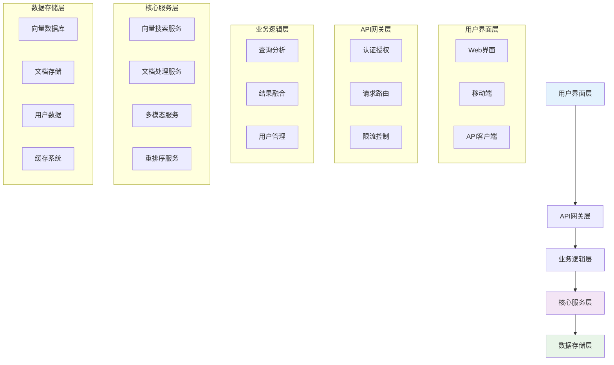
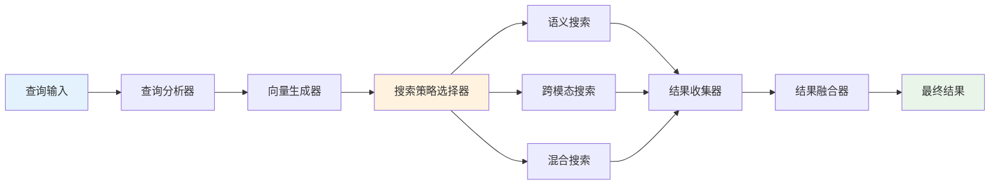
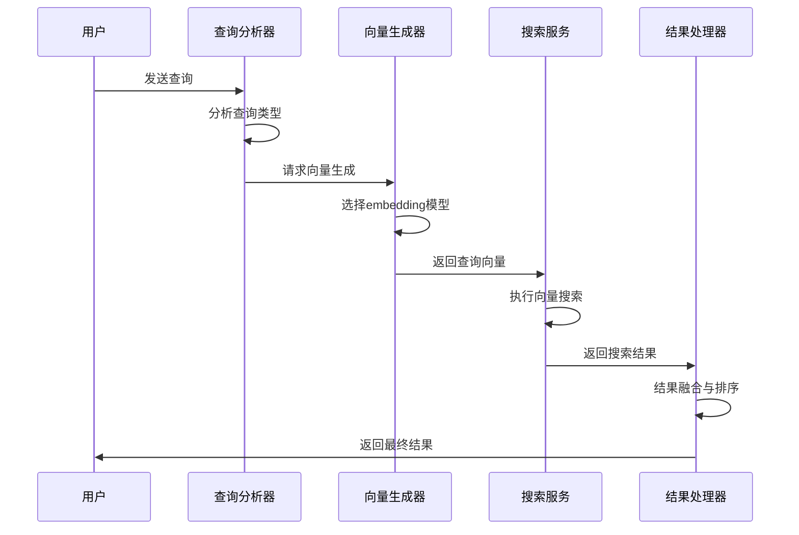
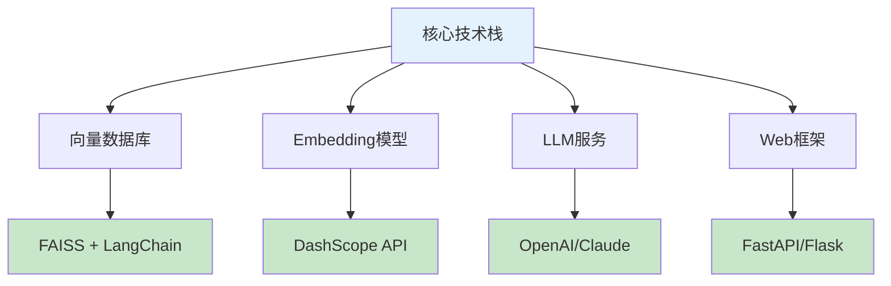
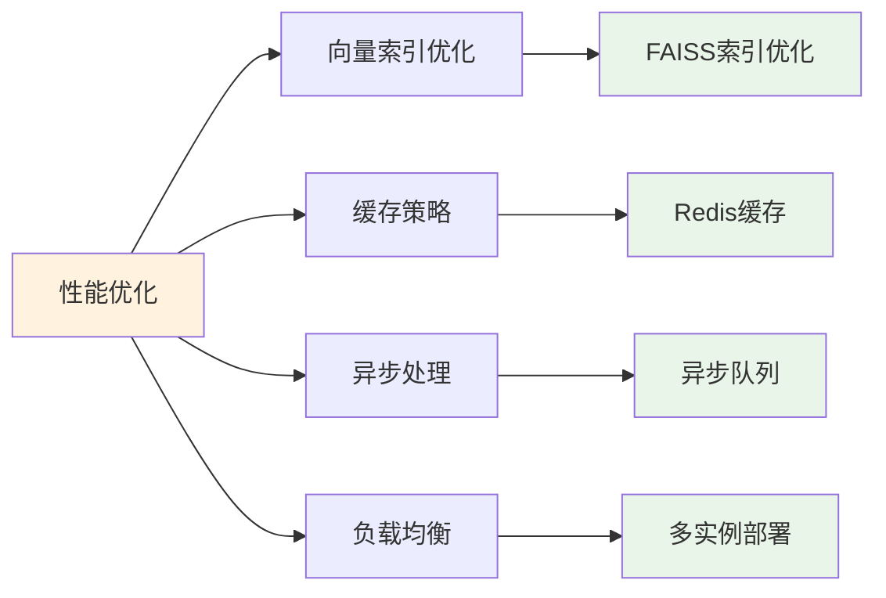
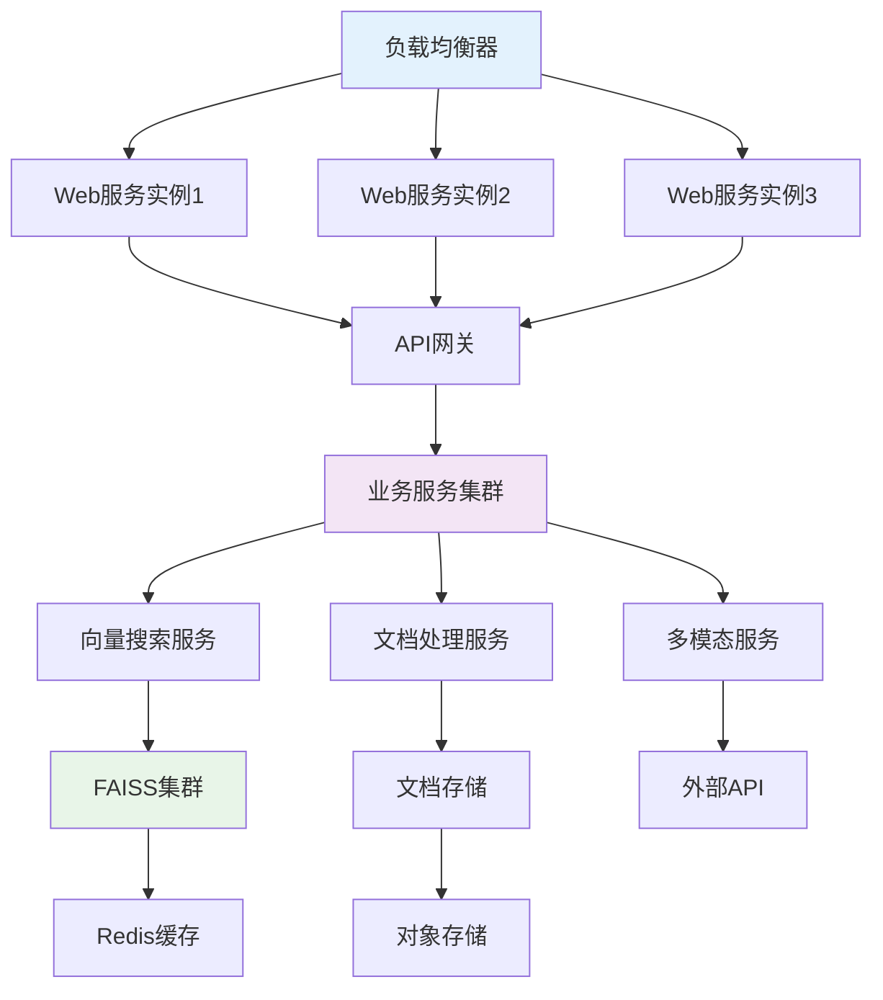
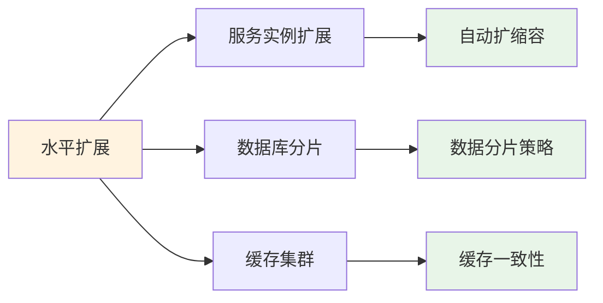
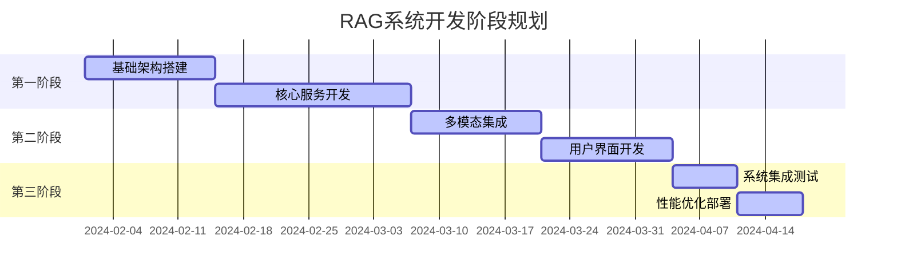
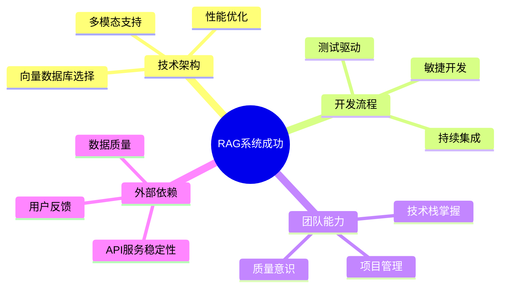

## 📋 **RAG系统实现建议方案**

### **1. RAG系统整体架构设计**

#### **系统架构图**

### **2. 核心服务模块设计**

#### **2.1 向量搜索服务架构**

**核心特点**：
- **智能路由**：根据查询类型自动选择搜索策略
- **策略融合**：多种搜索策略的结果智能融合
- **性能优化**：并行搜索，异步处理

#### **2.2 多模态处理流程**

### **3. 技术选型建议**

#### **3.1 核心技术栈**

#### **3.2 性能优化策略**

### **4. 系统部署架构**

#### **4.1 部署架构图**

#### **4.2 扩展性设计**

### **5. 开发实施建议**

#### **5.1 开发阶段规划**

#### **5.2 关键成功因素**

### **6. 总结与建议**

#### **改造方案优势**
1. **技术成熟**：使用经过验证的框架和组件
2. **开发效率**：大幅减少自开发代码量
3. **维护成本**：降低长期维护负担
4. **功能完整**：保持多模态功能完整性

#### **RAG系统建议**
1. **架构先行**：先设计清晰的系统架构
2. **模块化设计**：便于后续扩展和维护
3. **性能考虑**：从设计阶段就考虑性能优化
4. **用户体验**：注重查询结果的准确性和响应速度

