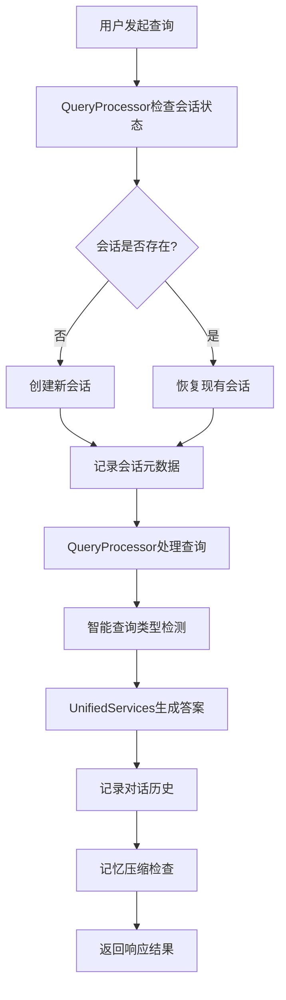
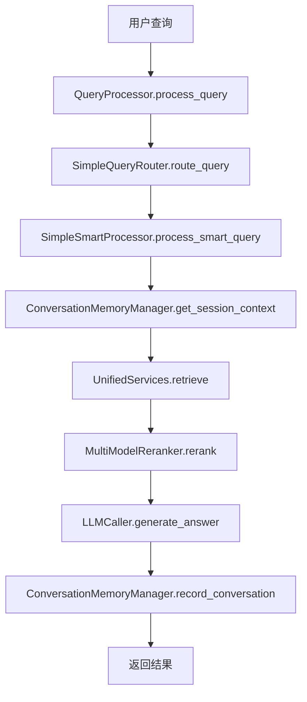
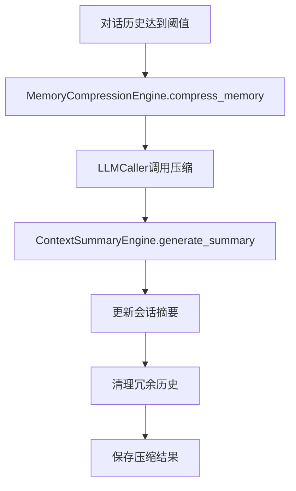
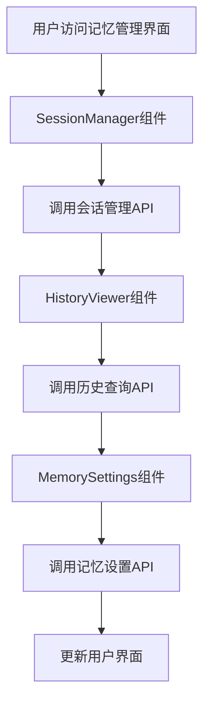

# RAG系统记忆模块详细设计文档

## 一、文档基础信息

| 模块名称 | M15-RAG系统记忆模块                                          | 所属项目 | V3版本RAG系统                     |
| -------- | ------------------------------------------------------------ | -------- | --------------------------------- |
| 文档版本 | V1.0                                                         | 文档状态 | ☑ 草稿 □ 评审中 □ 已确认 □ 已归档 |
| 编写人   | AI助手                                                       | 编写日期 | 2025年1月                         |
| 关联文档 | 《49.RAG系统记忆模块简要设计文档》《33.V3_RAG查询处理模块详细设计文档》《35.V3_RAG_LLM调用模块详细设计文档》《36.RAG系统配置管理详细设计文档》 |          |                                   |

## 二、模块概述

### 1. 定位与目标

作为RAG系统的**记忆管理模块**，负责多轮对话的会话管理、对话历史存储、记忆压缩和上下文摘要等功能，为RAG系统提供完整的记忆能力，实现用户与系统的连续对话体验。

**核心特性**：
- **会话管理**：完整的对话会话生命周期管理
- **历史存储**：对话历史的持久化存储和检索
- **记忆压缩**：基于LLM的智能记忆压缩机制
- **上下文摘要**：多级对话摘要生成和管理
- **前端集成**：完整的Vue 3前端记忆管理界面

### 2. 设计原则

- **模块化设计**：作为现有RAG系统的扩展模块，保持架构一致性
- **向后兼容**：支持有记忆和无记忆两种模式，不影响现有功能
- **配置驱动**：通过V3配置管理系统统一管理记忆模块配置
- **渐进式集成**：可以独立开发和测试，逐步集成到现有系统
- **清理优先**：完全清理RAGMetadataManager模块，避免功能重复
- **包导入规范**：严格遵循现有系统的包导入规范，使用完整包路径
- **异常处理规范**：遵循现有系统的异常处理模式和错误码体系

### 3. 依赖与交互

| 关联模块              | 交互方向 | 核心交互内容                          |
| --------------------- | -------- | ------------------------------------- |
| QueryProcessor        | 被调用   | 在process_query中集成会话管理功能     |
| SimpleSmartProcessor  | 被调用   | 在智能查询中集成会话上下文和类型检测  |
| SimpleHybridProcessor | 被调用   | 在混合查询中集成多模态内容记忆        |
| UnifiedServices       | 被调用   | 在generate_answer中集成对话历史       |
| MultiModelReranker    | 被调用   | 在重排序中优化记忆检索结果            |
| LLMCaller             | 依赖     | 复用现有LLM调用机制进行记忆压缩和摘要 |
| ContextManager        | 依赖     | 在上下文优化中集成对话摘要            |
| PromptManager         | 依赖     | 复用现有提示词管理机制构建记忆压缩提示词 |
| VectorDBIntegration   | 依赖     | 复用现有向量数据库集成机制进行记忆检索 |
| ConfigIntegration     | 依赖     | 通过V3配置管理系统管理记忆模块配置    |
| Vue 3前端             | 被调用   | 提供记忆管理界面和用户交互            |

## 三、核心功能设计

### 1. 功能清单

| 功能ID | 功能名称               | 核心描述                                 | 操作角色   | 前置条件         |
| ------ | ---------------------- | ---------------------------------------- | ---------- | ---------------- |
| FM01   | 会话创建管理           | 创建新的对话会话，生成唯一会话ID         | 系统自动   | 用户发起查询     |
| FM02   | 会话恢复管理           | 恢复已存在的对话会话，加载会话上下文     | 系统自动   | 会话ID有效       |
| FM03   | 会话状态管理           | 管理会话的活跃、暂停、结束状态           | 系统自动   | 会话已创建       |
| FM04   | 对话历史记录           | 记录用户查询和系统响应的完整历史         | 系统自动   | 对话发生         |
| FM05   | 历史查询检索           | 按会话ID、时间范围等条件查询对话历史     | 用户操作   | 历史记录存在     |
| FM06   | 记忆智能压缩           | 基于LLM的智能记忆压缩，提取关键信息      | 系统自动   | 对话记录达到阈值 |
| FM07   | 上下文摘要生成         | 生成多级对话摘要，支持会话级、主题级摘要 | 系统自动   | 对话历史存在     |
| FM08   | 记忆数据存储           | 独立的记忆数据库设计和管理               | 系统自动   | 数据库初始化完成 |
| FM09   | 记忆API接口            | 提供完整的记忆管理RESTful API            | 前端调用   | API服务启动      |
| FM10   | 前端记忆界面           | Vue 3前端记忆管理组件和界面              | 用户操作   | 前端服务启动     |
| FM11   | RAGMetadataManager清理 | 完全清理RAGMetadataManager模块           | 系统管理员 | 记忆模块开发完成 |
| FM12   | 智能查询集成           | 与QueryProcessor集成，支持智能查询类型检测 | 系统自动   | 智能查询处理器正常 |
| FM13   | 混合查询集成           | 与混合查询处理器集成，支持多模态内容记忆 | 系统自动   | 混合查询处理器正常 |
| FM14   | 重排序集成             | 与MultiModelReranker集成，优化记忆检索结果 | 系统自动   | 重排序服务正常 |
| FM15   | 上下文管理集成         | 与ContextManager集成，优化对话上下文 | 系统自动   | 上下文管理器正常 |

### 2. 关键功能流程

#### 2.1 会话创建和对话处理流程



#### 2.2 智能查询集成流程



#### 2.3 记忆压缩和摘要流程



#### 2.4 前端记忆管理流程



## 四、核心函数设计与调用关系

### 1. 函数清单

| 函数名                                             | 功能描述         | 输入参数           | 返回结果           | 所属服务                   |
| -------------------------------------------------- | ---------------- | ------------------ | ------------------ | -------------------------- |
| `ConversationMemoryManager.__init__()`             | 初始化记忆管理器 | 配置集成管理器实例 | 无                 | ConversationMemoryManager  |
| `create_session(user_id, session_type)`            | 创建新会话       | 用户ID、会话类型   | 会话ID、会话信息   | ConversationMemoryManager  |
| `resume_session(session_id)`                       | 恢复会话         | 会话ID             | 会话信息、历史记录 | ConversationMemoryManager  |
| `end_session(session_id)`                          | 结束会话         | 会话ID             | 操作结果           | ConversationMemoryManager  |
| `record_conversation(session_id, query, response)` | 记录对话         | 会话ID、查询、响应 | 记录ID             | ConversationHistoryManager |
| `get_conversation_history(session_id, page, size)` | 获取对话历史     | 会话ID、页码、大小 | 历史记录列表       | ConversationHistoryManager |
| `compress_memory(session_id, strategy)`            | 压缩记忆         | 会话ID、压缩策略   | 压缩结果           | MemoryCompressionEngine    |
| `generate_summary(session_id, level)`              | 生成摘要         | 会话ID、摘要级别   | 摘要内容           | ContextSummaryEngine       |
| `get_memory_config(key, default)`                  | 获取记忆配置     | 配置键、默认值     | 配置值             | ConfigIntegration          |

### 2. 核心类设计

#### 2.1 ConversationMemoryManager类

```python
"""
对话记忆管理器 - 核心记忆管理类
严格按照现有系统包导入规范实现
基于RAG系统V3架构设计，与QueryProcessor、UnifiedServices等核心组件集成
"""

import logging
import time
import uuid
from typing import Dict, List, Optional, Any
from datetime import datetime
from pathlib import Path

# 严格按照现有系统导入规范
from .config_integration import ConfigIntegration
from .memory_compression_engine import MemoryCompressionEngine
from .context_summary_engine import ContextSummaryEngine
from .conversation_history_manager import ConversationHistoryManager
from .exceptions import (
    SessionNotFoundError,
    MemoryManagerError,
    ConfigurationError
)

logger = logging.getLogger(__name__)


class ConversationMemoryManager:
    """
    对话记忆管理器 - 核心记忆管理类
    
    基于RAG系统V3架构设计，与现有系统核心组件深度集成：
    - 与QueryProcessor集成，在查询处理中管理会话状态
    - 与UnifiedServices集成，在答案生成中提供对话历史
    - 与LLMCaller集成，复用现有LLM调用机制进行记忆压缩和摘要
    - 与ContextManager集成，在上下文优化中集成对话摘要
    """
    
    def __init__(self, config_integration: ConfigIntegration):
        """
        初始化记忆管理器
        
        Args:
            config_integration: 配置集成管理器实例，复用V3配置管理系统
            
        Raises:
            ConfigurationError: 配置加载失败
            MemoryManagerError: 记忆管理器初始化失败
        """
        self.config = config_integration
        self.memory_db = self._initialize_memory_database()
        self.compression_engine = MemoryCompressionEngine(config_integration)
        self.summary_engine = ContextSummaryEngine(config_integration)
        self.history_manager = ConversationHistoryManager(config_integration)
        
        # 会话状态管理
        self.active_sessions = {}  # 活跃会话缓存
        self.session_timeout = self.config.get('rag_system.memory_module.session.timeout', 1800)
        
        logger.info("对话记忆管理器初始化完成")
    
    def create_session(self, user_id: str, session_type: str = "default") -> Dict[str, Any]:
        """
        创建新会话
        
        :param user_id: 用户ID
        :param session_type: 会话类型
        :return: 会话信息字典
        """
        try:
            session_id = self._generate_session_id()
            session_data = {
                'session_id': session_id,
                'user_id': user_id,
                'session_type': session_type,
                'status': 'active',
                'created_at': datetime.now(),
                'updated_at': datetime.now()
            }
            
            # 存储到数据库
            self.memory_db.sessions.insert(session_data)
            
            logger.info(f"会话创建成功: {session_id}")
            return session_data
            
        except Exception as e:
            logger.error(f"创建会话失败: {e}")
            raise MemoryManagerError(f"创建会话失败: {e}") from e
    
    def resume_session(self, session_id: str) -> Dict[str, Any]:
        """
        恢复会话
        
        :param session_id: 会话ID
        :return: 会话信息和历史记录
        """
        try:
            session = self.memory_db.sessions.find_one({'session_id': session_id})
            if not session:
                raise SessionNotFoundError(f"会话 {session_id} 不存在")
            
            # 更新会话状态
            session['status'] = 'active'
            session['updated_at'] = datetime.now()
            self.memory_db.sessions.update({'session_id': session_id}, session)
            
            # 获取历史记录
            history = self.history_manager.get_conversation_history(session_id)
            session['history'] = history
            
            logger.info(f"会话恢复成功: {session_id}")
            return session
            
        except SessionNotFoundError:
            raise
        except Exception as e:
            logger.error(f"恢复会话失败: {e}")
            raise MemoryManagerError(f"恢复会话失败: {e}") from e
    
    def end_session(self, session_id: str) -> bool:
        """
        结束会话
        
        :param session_id: 会话ID
        :return: 操作结果
        """
        try:
            session = self.memory_db.sessions.find_one({'session_id': session_id})
            if not session:
                return False
            
            session['status'] = 'ended'
            session['ended_at'] = datetime.now()
            self.memory_db.sessions.update({'session_id': session_id}, session)
            
            logger.info(f"会话结束成功: {session_id}")
            return True
            
        except Exception as e:
            logger.error(f"结束会话失败: {e}")
            raise MemoryManagerError(f"结束会话失败: {e}") from e
    
    def _initialize_memory_database(self):
        """初始化记忆数据库"""
        try:
            # 获取数据库路径配置
            db_path = self.config.get('rag_system.memory_module.database.path', 'rag_memory.db')
            
            # 使用完整路径
            if not Path(db_path).is_absolute():
                db_path = Path.cwd() / db_path
            
            # 初始化数据库
            from .memory_database import MemoryDatabase
            return MemoryDatabase(str(db_path))
            
        except Exception as e:
            logger.error(f"初始化记忆数据库失败: {e}")
            raise MemoryManagerError(f"初始化记忆数据库失败: {e}") from e
    
    def _generate_session_id(self) -> str:
        """生成唯一会话ID"""
        import uuid
        return f"session_{uuid.uuid4().hex[:16]}"
```

#### 2.2 MemoryCompressionEngine类

```python
"""
记忆压缩引擎 - 智能记忆压缩
严格按照现有系统包导入规范实现
"""

import logging
from typing import Dict, List, Any
from datetime import datetime

# 严格按照现有系统导入规范
from .config_integration import ConfigIntegration
from .llm_caller import LLMCaller
from .exceptions import MemoryCompressionError

logger = logging.getLogger(__name__)


class MemoryCompressionEngine:
    """记忆压缩引擎 - 智能记忆压缩"""
    
    def __init__(self, config_integration: ConfigIntegration):
        """
        初始化压缩引擎
        
        :param config_integration: 配置集成管理器实例
        """
        self.config = config_integration
        self.llm_caller = LLMCaller(config_integration)
        self.compression_strategies = self._load_compression_strategies()
        
        logger.info("记忆压缩引擎初始化完成")
    
    def compress_memory(self, session_id: str, strategy: str = "semantic") -> Dict[str, Any]:
        """
        压缩记忆
        
        :param session_id: 会话ID
        :param strategy: 压缩策略
        :return: 压缩结果
        """
        try:
            # 获取压缩阈值
            threshold = self.config.get('rag_system.memory_module.compression.threshold', 10)
            
            # 获取对话历史
            from .conversation_history_manager import ConversationHistoryManager
            history_manager = ConversationHistoryManager(self.config)
            history = history_manager.get_conversation_history(session_id)
            
            if len(history) < threshold:
                return {'compressed': False, 'reason': '历史记录不足'}
            
            # 根据策略选择压缩方法
            if strategy == "semantic":
                return self._semantic_compression(history)
            elif strategy == "temporal":
                return self._temporal_compression(history)
            elif strategy == "importance":
                return self._importance_compression(history)
            else:
                raise ValueError(f"不支持的压缩策略: {strategy}")
                
        except Exception as e:
            logger.error(f"压缩记忆失败: {e}")
            raise MemoryCompressionError(f"压缩记忆失败: {e}") from e
    
    def _semantic_compression(self, history: List[Dict]) -> Dict[str, Any]:
        """语义压缩"""
        try:
            # 构建压缩提示词
            prompt = self._build_compression_prompt(history)
            
            # 调用LLM进行压缩
            response = self.llm_caller.generate_answer(
                query_text="压缩对话历史",
                context_chunks=[],
                prompt_template=prompt
            )
            
            # 解析压缩结果
            compressed_content = self._parse_compression_result(response.answer)
            
            return {
                'compressed': True,
                'strategy': 'semantic',
                'compressed_content': compressed_content,
                'compression_ratio': len(compressed_content) / len(history),
                'timestamp': datetime.now()
            }
            
        except Exception as e:
            logger.error(f"语义压缩失败: {e}")
            raise MemoryCompressionError(f"语义压缩失败: {e}") from e
    
    def _build_compression_prompt(self, history: List[Dict]) -> str:
        """
        构建压缩提示词
        
        基于RAG系统V3的Prompt构建机制，复用现有系统的提示词模板管理方式
        
        Args:
            history: 对话历史列表
            
        Returns:
            str: 构建的压缩提示词
        """
        # 基于现有系统的提示词构建方式，参考PromptManager的实现
        formatted_history = self._format_history_for_compression(history)
        
        return f"""
你是一个专业的对话历史压缩助手。请将以下对话历史压缩为关键信息摘要，保留重要的对话内容和上下文。

对话历史：
{formatted_history}

请按照以下要求进行压缩：
1. 提取主要话题和讨论内容
2. 保留关键信息和重要结论
3. 维护重要的上下文信息
4. 保持信息的准确性和完整性

压缩要求：
- 简洁明了，便于后续检索和理解
- 保留对话的核心语义信息
- 避免丢失重要的细节信息
- 使用结构化的格式组织内容

请提供压缩后的摘要：
"""
    
    def _load_compression_strategies(self) -> Dict[str, Any]:
        """加载压缩策略配置"""
        return {
            'semantic': {
                'enabled': True,
                'max_compression_ratio': 0.3
            },
            'temporal': {
                'enabled': True,
                'time_window': 3600  # 1小时
            },
            'importance': {
                'enabled': True,
                'importance_threshold': 0.7
            }
        }
```

#### 2.3 ContextSummaryEngine类

```python
class ContextSummaryEngine:
    """上下文摘要引擎 - 对话摘要生成"""
    
    def __init__(self, config_integration: ConfigIntegration):
        """初始化摘要引擎"""
        self.config = config_integration
        self.llm_caller = LLMCaller(config_integration)
        self.summary_levels = ['session', 'topic', 'global']
    
    def generate_summary(self, session_id: str, level: str = "session") -> Dict[str, Any]:
        """生成对话摘要"""
        if level not in self.summary_levels:
            raise ValueError(f"不支持的摘要级别: {level}")
        
        # 获取对话历史
        history = self.history_manager.get_conversation_history(session_id)
        if not history:
            return {'summary': '', 'level': level, 'timestamp': datetime.now()}
        
        # 根据级别生成摘要
        if level == 'session':
            return self._generate_session_summary(history)
        elif level == 'topic':
            return self._generate_topic_summary(history)
        elif level == 'global':
            return self._generate_global_summary(history)
    
    def _generate_session_summary(self, history: List[Dict]) -> Dict[str, Any]:
        """生成会话级摘要"""
        prompt = self._build_session_summary_prompt(history)
        response = self.llm_caller.generate_answer(
            query_text="生成会话摘要",
            context_chunks=[],
            prompt_template=prompt
        )
        
        return {
            'summary': response.answer,
            'level': 'session',
            'key_points': self._extract_key_points(response.answer),
            'timestamp': datetime.now()
        }
```

## 五、数据库设计

### 1. 数据库架构

基于现有RAG系统架构，记忆模块使用独立的SQLite数据库，与现有系统数据库分离，确保数据隔离和独立管理。

### 2. 核心表结构

#### 2.1 会话表（conversation_sessions）

```sql
CREATE TABLE conversation_sessions (
    session_id TEXT PRIMARY KEY,
    user_id TEXT NOT NULL,
    session_type TEXT DEFAULT 'default',
    status TEXT DEFAULT 'active' CHECK (status IN ('active', 'paused', 'ended')),
    created_at DATETIME DEFAULT CURRENT_TIMESTAMP,
    updated_at DATETIME DEFAULT CURRENT_TIMESTAMP,
    ended_at DATETIME NULL,
    metadata TEXT,  -- JSON格式的会话元数据
    summary TEXT,   -- 会话摘要
    compression_info TEXT  -- 压缩信息
);

CREATE INDEX idx_sessions_user_id ON conversation_sessions(user_id);
CREATE INDEX idx_sessions_status ON conversation_sessions(status);
CREATE INDEX idx_sessions_created_at ON conversation_sessions(created_at);
```

#### 2.2 对话历史表（conversation_history）

```sql
CREATE TABLE conversation_history (
    id INTEGER PRIMARY KEY AUTOINCREMENT,
    session_id TEXT NOT NULL,
    turn_number INTEGER NOT NULL,
    user_query TEXT NOT NULL,
    system_response TEXT NOT NULL,
    query_type TEXT,
    response_time REAL,  -- 响应时间（秒）
    created_at DATETIME DEFAULT CURRENT_TIMESTAMP,
    metadata TEXT,  -- JSON格式的元数据
    FOREIGN KEY (session_id) REFERENCES conversation_sessions(session_id)
);

CREATE INDEX idx_history_session_id ON conversation_history(session_id);
CREATE INDEX idx_history_created_at ON conversation_history(created_at);
CREATE INDEX idx_history_turn_number ON conversation_history(session_id, turn_number);
```

#### 2.3 记忆摘要表（memory_summaries）

```sql
CREATE TABLE memory_summaries (
    id INTEGER PRIMARY KEY AUTOINCREMENT,
    session_id TEXT NOT NULL,
    summary_level TEXT NOT NULL CHECK (summary_level IN ('session', 'topic', 'global')),
    summary_content TEXT NOT NULL,
    key_points TEXT,  -- JSON格式的关键点
    created_at DATETIME DEFAULT CURRENT_TIMESTAMP,
    updated_at DATETIME DEFAULT CURRENT_TIMESTAMP,
    FOREIGN KEY (session_id) REFERENCES conversation_sessions(session_id)
);

CREATE INDEX idx_summaries_session_id ON memory_summaries(session_id);
CREATE INDEX idx_summaries_level ON memory_summaries(summary_level);
```

#### 2.4 记忆压缩表（memory_compressions）

```sql
CREATE TABLE memory_compressions (
    id INTEGER PRIMARY KEY AUTOINCREMENT,
    session_id TEXT NOT NULL,
    compression_strategy TEXT NOT NULL,
    original_count INTEGER NOT NULL,
    compressed_count INTEGER NOT NULL,
    compression_ratio REAL NOT NULL,
    compressed_content TEXT NOT NULL,
    created_at DATETIME DEFAULT CURRENT_TIMESTAMP,
    FOREIGN KEY (session_id) REFERENCES conversation_sessions(session_id)
);

CREATE INDEX idx_compressions_session_id ON memory_compressions(session_id);
CREATE INDEX idx_compressions_strategy ON memory_compressions(compression_strategy);
```

### 3. 数据库初始化

```python
def initialize_memory_database(db_path: str) -> Database:
    """初始化记忆数据库"""
    db = Database(db_path)
    
    # 创建表
    db.execute(conversation_sessions_sql)
    db.execute(conversation_history_sql)
    db.execute(memory_summaries_sql)
    db.execute(memory_compressions_sql)
    
    # 创建索引
    db.execute(create_indexes_sql)
    
    return db
```

## 六、API接口设计

### 1. 接口规范

基于现有RAG系统API接口架构，记忆模块的API接口遵循相同的设计规范：

- **基础URL**: `/api/v3/rag/memory`
- **数据格式**: JSON
- **认证方式**: 无需认证（开发环境）
- **响应格式**: 统一响应结构

### 2. 核心接口

#### 2.1 会话管理接口

```python
"""
记忆模块API接口
严格按照现有系统包导入规范实现
"""

import logging
import uuid
from typing import Dict, Any
from fastapi import APIRouter, HTTPException, Depends, Query, Body
from fastapi.responses import JSONResponse
from pydantic import BaseModel, Field
from datetime import datetime

# 严格按照现有系统导入规范
from ..core.conversation_memory_manager import ConversationMemoryManager
from ..core.config_integration import ConfigIntegration
from ..core.exceptions import SessionNotFoundError, MemoryManagerError

logger = logging.getLogger(__name__)

# 创建记忆模块API路由器
memory_router = APIRouter(prefix="/memory", tags=["Memory Management"])

# 请求模型
class CreateSessionRequest(BaseModel):
    user_id: str = Field(..., description="用户ID", min_length=1, max_length=100)
    session_type: str = Field(default="default", description="会话类型", regex="^(default|persistent|temporary)$")

class CompressMemoryRequest(BaseModel):
    session_id: str = Field(..., description="会话ID", min_length=1, max_length=50)
    strategy: str = Field(default="semantic", description="压缩策略", regex="^(semantic|temporal|importance)$")

class GenerateSummaryRequest(BaseModel):
    session_id: str = Field(..., description="会话ID", min_length=1, max_length=50)
    level: str = Field(default="session", description="摘要级别", regex="^(session|topic|global)$")

# 工具函数
def generate_request_id() -> str:
    """生成请求ID"""
    return f"req_{uuid.uuid4().hex[:10]}"

# 创建会话
@memory_router.post("/session/create")
async def create_session(
    request: CreateSessionRequest,
    services: dict = Depends(get_rag_services)
) -> JSONResponse:
    """
    创建新会话
    
    Args:
        request: 创建会话请求
        services: RAG服务实例
        
    Returns:
        JSONResponse: 统一响应格式
        
    Raises:
        HTTPException: 服务不可用或创建失败
    """
    try:
        memory_manager = services.get('memory_manager')
        if not memory_manager:
            raise HTTPException(
                status_code=503, 
                detail="记忆管理器未初始化",
                headers={"X-Error-Code": "MEMORY_SERVICE_UNAVAILABLE"}
            )
        
        session_data = memory_manager.create_session(
            user_id=request.user_id,
            session_type=request.session_type
        )
        
        return JSONResponse({
            "success": True,
            "data": session_data,
            "message": "会话创建成功",
            "timestamp": datetime.now().isoformat(),
            "request_id": generate_request_id()
        })
    except MemoryManagerError as e:
        logger.error(f"创建会话失败: {e}")
        raise HTTPException(
            status_code=500, 
            detail=str(e),
            headers={"X-Error-Code": "MEMORY_MANAGER_ERROR"}
        )
    except Exception as e:
        logger.error(f"创建会话失败（未知错误）: {e}")
        raise HTTPException(
            status_code=500, 
            detail="创建会话失败",
            headers={"X-Error-Code": "INTERNAL_ERROR"}
        )

# 恢复会话
@memory_router.get("/session/resume/{session_id}")
async def resume_session(
    session_id: str,
    services: dict = Depends(get_rag_services)
) -> JSONResponse:
    """
    恢复会话
    
    Args:
        session_id: 会话ID
        services: RAG服务实例
        
    Returns:
        JSONResponse: 统一响应格式
        
    Raises:
        HTTPException: 会话不存在或服务不可用
    """
    try:
        memory_manager = services.get('memory_manager')
        if not memory_manager:
            raise HTTPException(
                status_code=503, 
                detail="记忆管理器未初始化",
                headers={"X-Error-Code": "MEMORY_SERVICE_UNAVAILABLE"}
            )
        
        session_data = memory_manager.resume_session(session_id)
        
        return JSONResponse({
            "success": True,
            "data": session_data,
            "message": "会话恢复成功",
            "timestamp": datetime.now().isoformat(),
            "request_id": generate_request_id()
        })
    except SessionNotFoundError as e:
        raise HTTPException(
            status_code=404, 
            detail=str(e),
            headers={"X-Error-Code": "SESSION_NOT_FOUND"}
        )
    except MemoryManagerError as e:
        logger.error(f"恢复会话失败: {e}")
        raise HTTPException(
            status_code=500, 
            detail=str(e),
            headers={"X-Error-Code": "MEMORY_MANAGER_ERROR"}
        )
    except Exception as e:
        logger.error(f"恢复会话失败（未知错误）: {e}")
        raise HTTPException(
            status_code=500, 
            detail="恢复会话失败",
            headers={"X-Error-Code": "INTERNAL_ERROR"}
        )
```

#### 2.2 历史管理接口

```python
# 查询对话历史
@router.get("/history/query")
async def query_conversation_history(
    session_id: str = Query(..., description="会话ID"),
    page: int = Query(1, ge=1, description="页码"),
    size: int = Query(10, ge=1, le=100, description="每页大小"),
    services: dict = Depends(get_rag_services)
) -> JSONResponse:
    """查询对话历史"""
    try:
        memory_manager = services.get('memory_manager')
        if not memory_manager:
            raise HTTPException(status_code=503, detail="记忆管理器未初始化")
        
        history_data = memory_manager.history_manager.get_conversation_history(
            session_id=session_id,
            page=page,
            size=size
        )
        
        return JSONResponse({
            "success": True,
            "data": history_data,
            "message": "历史查询成功",
            "timestamp": datetime.now().isoformat(),
            "request_id": generate_request_id()
        })
    except Exception as e:
        logger.error(f"查询历史失败: {e}")
        raise HTTPException(status_code=500, detail=str(e))
```

#### 2.3 记忆管理接口

```python
# 压缩记忆
@router.post("/compress")
async def compress_memory(
    request: CompressMemoryRequest,
    services: dict = Depends(get_rag_services)
) -> JSONResponse:
    """压缩记忆"""
    try:
        memory_manager = services.get('memory_manager')
        if not memory_manager:
            raise HTTPException(status_code=503, detail="记忆管理器未初始化")
        
        compression_result = memory_manager.compression_engine.compress_memory(
            session_id=request.session_id,
            strategy=request.strategy
        )
        
        return JSONResponse({
            "success": True,
            "data": compression_result,
            "message": "记忆压缩成功",
            "timestamp": datetime.now().isoformat(),
            "request_id": generate_request_id()
        })
    except Exception as e:
        logger.error(f"压缩记忆失败: {e}")
        raise HTTPException(status_code=500, detail=str(e))

# 生成摘要
@router.post("/summary/generate")
async def generate_summary(
    request: GenerateSummaryRequest,
    services: dict = Depends(get_rag_services)
) -> JSONResponse:
    """生成对话摘要"""
    try:
        memory_manager = services.get('memory_manager')
        if not memory_manager:
            raise HTTPException(status_code=503, detail="记忆管理器未初始化")
        
        summary_result = memory_manager.summary_engine.generate_summary(
            session_id=request.session_id,
            level=request.level
        )
        
        return JSONResponse({
            "success": True,
            "data": summary_result,
            "message": "摘要生成成功",
            "timestamp": datetime.now().isoformat(),
            "request_id": generate_request_id()
        })
    except Exception as e:
        logger.error(f"生成摘要失败: {e}")
        raise HTTPException(status_code=500, detail=str(e))
```

### 3. 请求/响应模型

```python
# 请求模型
class CreateSessionRequest(BaseModel):
    user_id: str = Field(..., description="用户ID")
    session_type: str = Field(default="default", description="会话类型")

class CompressMemoryRequest(BaseModel):
    session_id: str = Field(..., description="会话ID")
    strategy: str = Field(default="semantic", description="压缩策略")

class GenerateSummaryRequest(BaseModel):
    session_id: str = Field(..., description="会话ID")
    level: str = Field(default="session", description="摘要级别")

# 响应模型
class SessionResponse(BaseModel):
    session_id: str
    user_id: str
    session_type: str
    status: str
    created_at: datetime
    updated_at: datetime

class HistoryResponse(BaseModel):
    records: List[Dict[str, Any]]
    total: int
    page: int
    size: int
```

## 七、前端集成设计

### 1. Vue 3组件设计

#### 1.1 SessionManager组件

```vue
<template>
  <div class="session-manager">
    <el-card class="session-card">
      <template #header>
        <div class="card-header">
          <span>会话管理</span>
          <el-button type="primary" @click="createNewSession">
            <el-icon><Plus /></el-icon>
            新建会话
          </el-button>
        </div>
      </template>
      
      <div class="session-list">
        <el-table :data="sessions" style="width: 100%">
          <el-table-column prop="session_id" label="会话ID" width="200" />
          <el-table-column prop="status" label="状态" width="100">
            <template #default="scope">
              <el-tag :type="getStatusType(scope.row.status)">
                {{ getStatusText(scope.row.status) }}
              </el-tag>
            </template>
          </el-table-column>
          <el-table-column prop="created_at" label="创建时间" width="180" />
          <el-table-column label="操作" width="200">
            <template #default="scope">
              <el-button size="small" @click="resumeSession(scope.row.session_id)">
                恢复
              </el-button>
              <el-button size="small" type="danger" @click="endSession(scope.row.session_id)">
                结束
              </el-button>
            </template>
          </el-table-column>
        </el-table>
      </div>
    </el-card>
  </div>
</template>

<script setup>
import { ref, onMounted } from 'vue'
import { ElMessage } from 'element-plus'
import { Plus } from '@element-plus/icons-vue'
import { memoryApi } from '@/services/memoryApi'

const sessions = ref([])
const loading = ref(false)

const createNewSession = async () => {
  try {
    loading.value = true
    const response = await memoryApi.createSession({
      user_id: 'current_user',
      session_type: 'default'
    })
    
    if (response.data.success) {
      ElMessage.success('会话创建成功')
      await loadSessions()
    }
  } catch (error) {
    ElMessage.error('创建会话失败')
  } finally {
    loading.value = false
  }
}

const resumeSession = async (sessionId) => {
  try {
    const response = await memoryApi.resumeSession(sessionId)
    if (response.data.success) {
      ElMessage.success('会话恢复成功')
      // 触发会话恢复事件
      emit('sessionResumed', response.data.data)
    }
  } catch (error) {
    ElMessage.error('恢复会话失败')
  }
}

const loadSessions = async () => {
  try {
    loading.value = true
    const response = await memoryApi.getSessions()
    if (response.data.success) {
      sessions.value = response.data.data
    }
  } catch (error) {
    ElMessage.error('加载会话列表失败')
  } finally {
    loading.value = false
  }
}

onMounted(() => {
  loadSessions()
})
</script>
```

#### 1.2 HistoryViewer组件

```vue
<template>
  <div class="history-viewer">
    <el-card class="history-card">
      <template #header>
        <div class="card-header">
          <span>对话历史</span>
          <el-button @click="refreshHistory">
            <el-icon><Refresh /></el-icon>
            刷新
          </el-button>
        </div>
      </template>
      
      <div class="history-list">
        <el-timeline>
          <el-timeline-item
            v-for="(record, index) in historyRecords"
            :key="index"
            :timestamp="formatTime(record.created_at)"
            placement="top"
          >
            <el-card>
              <div class="conversation-item">
                <div class="user-query">
                  <strong>用户:</strong> {{ record.user_query }}
                </div>
                <div class="system-response">
                  <strong>系统:</strong> {{ record.system_response }}
                </div>
              </div>
            </el-card>
          </el-timeline-item>
        </el-timeline>
        
        <el-pagination
          v-model:current-page="currentPage"
          :page-size="pageSize"
          :total="totalRecords"
          @current-change="handlePageChange"
          layout="total, prev, pager, next"
        />
      </div>
    </el-card>
  </div>
</template>

<script setup>
import { ref, watch, onMounted } from 'vue'
import { ElMessage } from 'element-plus'
import { Refresh } from '@element-plus/icons-vue'
import { memoryApi } from '@/services/memoryApi'

const props = defineProps({
  sessionId: {
    type: String,
    required: true
  }
})

const historyRecords = ref([])
const currentPage = ref(1)
const pageSize = ref(10)
const totalRecords = ref(0)
const loading = ref(false)

const loadHistory = async () => {
  try {
    loading.value = true
    const response = await memoryApi.getHistory({
      session_id: props.sessionId,
      page: currentPage.value,
      size: pageSize.value
    })
    
    if (response.data.success) {
      historyRecords.value = response.data.data.records
      totalRecords.value = response.data.data.total
    }
  } catch (error) {
    ElMessage.error('加载历史记录失败')
  } finally {
    loading.value = false
  }
}

const refreshHistory = () => {
  loadHistory()
}

const handlePageChange = (page) => {
  currentPage.value = page
  loadHistory()
}

watch(() => props.sessionId, () => {
  if (props.sessionId) {
    loadHistory()
  }
})

onMounted(() => {
  if (props.sessionId) {
    loadHistory()
  }
})
</script>
```

#### 1.3 MemorySettings组件

```vue
<template>
  <div class="memory-settings">
    <el-card class="settings-card">
      <template #header>
        <span>记忆设置</span>
      </template>
      
      <el-form :model="settings" label-width="120px">
        <el-form-item label="记忆功能">
          <el-switch
            v-model="settings.memoryEnabled"
            @change="updateMemoryEnabled"
          />
        </el-form-item>
        
        <el-form-item label="压缩阈值">
          <el-input-number
            v-model="settings.compressionThreshold"
            :min="5"
            :max="50"
            @change="updateCompressionThreshold"
          />
        </el-form-item>
        
        <el-form-item label="压缩策略">
          <el-select
            v-model="settings.compressionStrategy"
            @change="updateCompressionStrategy"
          >
            <el-option label="语义压缩" value="semantic" />
            <el-option label="时间压缩" value="temporal" />
            <el-option label="重要性压缩" value="importance" />
          </el-select>
        </el-form-item>
        
        <el-form-item label="摘要级别">
          <el-select
            v-model="settings.summaryLevel"
            @change="updateSummaryLevel"
          >
            <el-option label="会话级" value="session" />
            <el-option label="主题级" value="topic" />
            <el-option label="全局级" value="global" />
          </el-select>
        </el-form-item>
      </el-form>
    </el-card>
  </div>
</template>

<script setup>
import { ref, onMounted } from 'vue'
import { ElMessage } from 'element-plus'
import { memoryApi } from '@/services/memoryApi'

const settings = ref({
  memoryEnabled: true,
  compressionThreshold: 10,
  compressionStrategy: 'semantic',
  summaryLevel: 'session'
})

const loadSettings = async () => {
  try {
    const response = await memoryApi.getSettings()
    if (response.data.success) {
      settings.value = { ...settings.value, ...response.data.data }
    }
  } catch (error) {
    ElMessage.error('加载设置失败')
  }
}

const updateMemoryEnabled = async (value) => {
  try {
    await memoryApi.updateSettings({ memoryEnabled: value })
    ElMessage.success('设置更新成功')
  } catch (error) {
    ElMessage.error('更新设置失败')
  }
}

const updateCompressionThreshold = async (value) => {
  try {
    await memoryApi.updateSettings({ compressionThreshold: value })
    ElMessage.success('设置更新成功')
  } catch (error) {
    ElMessage.error('更新设置失败')
  }
}

onMounted(() => {
  loadSettings()
})
</script>
```

### 2. 前端服务集成

#### 2.1 记忆API服务

```javascript
// services/memoryApi.js
import axios from 'axios'

const API_BASE_URL = '/api/v3/rag/memory'

// 创建axios实例
const memoryApiClient = axios.create({
  baseURL: API_BASE_URL,
  timeout: 30000,
  headers: {
    'Content-Type': 'application/json'
  }
})

// 请求拦截器
memoryApiClient.interceptors.request.use(
  (config) => {
    // 添加请求ID
    config.headers['X-Request-ID'] = `req_${Date.now()}_${Math.random().toString(36).substr(2, 9)}`
    return config
  },
  (error) => {
    return Promise.reject(error)
  }
)

// 响应拦截器
memoryApiClient.interceptors.response.use(
  (response) => {
    // 统一处理成功响应
    if (response.data.success) {
      return response.data
    } else {
      throw new Error(response.data.error?.message || '请求失败')
    }
  },
  (error) => {
    // 统一处理错误响应
    const errorMessage = error.response?.data?.error?.message || error.message || '网络错误'
    const errorCode = error.response?.data?.error?.code || 'NETWORK_ERROR'
    
    console.error(`API错误 [${errorCode}]: ${errorMessage}`)
    throw new Error(errorMessage)
  }
)

export const memoryApi = {
  // 会话管理
  createSession: (data) => memoryApiClient.post('/session/create', data),
  resumeSession: (sessionId) => memoryApiClient.get(`/session/resume/${sessionId}`),
  endSession: (sessionId) => memoryApiClient.post('/session/end', { session_id: sessionId }),
  getSessions: () => memoryApiClient.get('/session/list'),
  
  // 历史管理
  getHistory: (params) => memoryApiClient.get('/history/query', { params }),
  
  // 记忆管理
  compressMemory: (data) => memoryApiClient.post('/compress', data),
  generateSummary: (data) => memoryApiClient.post('/summary/generate', data),
  
  // 设置管理
  getSettings: () => memoryApiClient.get('/settings'),
  updateSettings: (data) => memoryApiClient.post('/settings', data)
}
```

## 八、配置管理设计

### 1. 配置结构

基于V3配置管理系统，记忆模块的配置结构如下，需要添加到现有的`v3_config.json`中的`rag_system`节点下：

```json
{
  "rag_system": {
    "memory_module": {
      "enabled": true,
      "database": {
        "path": "rag_memory.db",
        "backup_enabled": true,
        "backup_interval": 3600
      },
      "session": {
        "timeout": 1800,
        "max_sessions_per_user": 10,
        "auto_cleanup": true
      },
      "compression": {
        "enabled": true,
        "threshold": 10,
        "strategy": "semantic",
        "max_compression_ratio": 0.3
      },
      "summary": {
        "enabled": true,
        "levels": ["session", "topic"],
        "auto_generate": true,
        "update_interval": 300
      },
      "llm": {
        "model": "qwen-plus",
        "temperature": 0.7,
        "max_tokens": 2000
      }
    }
  }
}
```

### 2. 配置管理类

```python
"""
记忆模块配置管理器
严格按照现有系统包导入规范实现
"""

import logging
from typing import Dict, Any, Optional

# 严格按照现有系统导入规范
from .config_integration import ConfigIntegration
from .exceptions import ConfigurationError

logger = logging.getLogger(__name__)


class MemoryConfigManager:
    """记忆模块配置管理器"""
    
    def __init__(self, config_integration: ConfigIntegration):
        """
        初始化配置管理器
        
        :param config_integration: 配置集成管理器实例
        """
        self.config = config_integration
        self.memory_config = self._load_memory_config()
        
        logger.info("记忆模块配置管理器初始化完成")
    
    def get_memory_config(self, key: str, default=None) -> Any:
        """
        获取记忆配置
        
        :param key: 配置键，支持点号分隔的嵌套键
        :param default: 默认值
        :return: 配置值
        """
        try:
            full_key = f"rag_system.memory_module.{key}"
            return self.config.get(full_key, default)
        except Exception as e:
            logger.error(f"获取记忆配置失败: {e}")
            return default
    
    def is_memory_enabled(self) -> bool:
        """检查记忆功能是否启用"""
        return self.get_memory_config('enabled', True)
    
    def get_compression_threshold(self) -> int:
        """获取压缩阈值"""
        return self.get_memory_config('compression.threshold', 10)
    
    def get_compression_strategy(self) -> str:
        """获取压缩策略"""
        return self.get_memory_config('compression.strategy', 'semantic')
    
    def get_session_timeout(self) -> int:
        """获取会话超时时间"""
        return self.get_memory_config('session.timeout', 1800)
    
    def get_database_path(self) -> str:
        """获取数据库路径"""
        return self.get_memory_config('database.path', 'rag_memory.db')
    
    def _load_memory_config(self) -> Dict[str, Any]:
        """加载记忆配置"""
        try:
            return self.config.get('rag_system.memory_module', {})
        except Exception as e:
            logger.error(f"加载记忆配置失败: {e}")
            return {}
```

## 九、包导入规范

### 1. 导入规范

严格按照现有系统的包导入规范：

```python
# 正确导入方式
from .config_integration import ConfigIntegration
from .llm_caller import LLMCaller
from .exceptions import MemoryManagerError

# 跨模块导入（rag_system -> db_system）
try:
    from db_system.config.config_manager import ConfigManager
    from db_system.config.environment_manager import EnvironmentManager
except ImportError as e:
    logging.error(f"无法导入V3配置管理器: {e}")
    raise
```

### 2. 异常处理规范

```python
# 严格按照现有系统异常处理规范
try:
    # 业务逻辑
    result = some_operation()
except SpecificError as e:
    logger.error(f"具体错误: {e}")
    raise SpecificError(f"具体错误: {e}") from e
except Exception as e:
    logger.error(f"未知错误: {e}")
    raise GeneralError(f"操作失败: {e}") from e
```

### 3. 文档字符串规范

严格按照技术规范文档要求，使用Google风格的文档字符串：

```python
def create_session(self, user_id: str, session_type: str = "default") -> Dict[str, Any]:
    """
    创建新会话
    
    Args:
        user_id: 用户ID，长度1-100字符
        session_type: 会话类型，支持default/persistent/temporary
        
    Returns:
        Dict[str, Any]: 会话信息字典，包含session_id、user_id、status等
        
    Raises:
        ValueError: 参数格式错误
        MemoryManagerError: 记忆管理器操作失败
        
    Example:
        >>> memory_manager = ConversationMemoryManager(config)
        >>> session = memory_manager.create_session("user123", "default")
        >>> print(session['session_id'])
        session_abc123def456
    """
```

### 4. 函数定义规范

严格按照技术规范文档要求：

```python
def process_memory_compression(
    session_id: str,
    strategy: str = "semantic",
    max_compression_ratio: float = 0.3,
    **kwargs
) -> Dict[str, Any]:
    """
    处理记忆压缩
    
    Args:
        session_id: 会话ID
        strategy: 压缩策略，支持semantic/temporal/importance
        max_compression_ratio: 最大压缩比例，默认0.3
        **kwargs: 其他参数
        
    Returns:
        Dict[str, Any]: 压缩结果字典
        
    Raises:
        ValueError: 参数错误
        MemoryCompressionError: 压缩处理错误
    """
    # 参数验证
    if not session_id or len(session_id) > 50:
        raise ValueError("会话ID无效或过长")
    
    # 业务逻辑处理
    try:
        result = _execute_compression(session_id, strategy, max_compression_ratio)
        return result
    except Exception as e:
        raise MemoryCompressionError(f"记忆压缩失败: {str(e)}") from e
```

## 十、RAGMetadataManager清理方案

### 1. 清理范围

#### 1.1 文件清理
- **核心文件**: `rag_system/core/metadata_manager.py`
- **数据库文件**: `rag_metadata.db`
- **相关引用**: 所有对RAGMetadataManager的导入和引用

#### 1.2 代码清理
```python
# 需要清理的导入（在routes.py中）
from ..core.metadata_manager import RAGMetadataManager

# 需要清理的实例化
rag_services['metadata_manager'] = RAGMetadataManager(config_integration)

# 需要清理的方法调用
self.metadata_manager.store_query_session(...)
```

### 2. 清理步骤

#### 2.1 代码审查
```bash
# 搜索所有RAGMetadataManager引用
grep -r "RAGMetadataManager" rag_system/
grep -r "metadata_manager" rag_system/
grep -r "rag_metadata.db" rag_system/
```

#### 2.2 依赖清理
```python
# 清理routes.py中的引用
# 删除以下代码：
from ..core.metadata_manager import RAGMetadataManager

# 清理服务初始化
rag_services['metadata_manager'] = RAGMetadataManager(config_integration)
```

#### 2.3 数据库清理
```bash
# 删除数据库文件
rm rag_system/rag_metadata.db
rm frontend/rag_metadata.db
```

#### 2.4 文档更新
- 更新API接口文档，移除RAGMetadataManager相关内容
- 更新技术文档，移除元数据管理相关内容
- 更新README文件，移除相关说明

### 3. 清理验证

#### 3.1 功能测试
```python
# 测试现有功能是否正常
def test_rag_system_without_metadata_manager():
    """测试清理RAGMetadataManager后系统功能"""
    # 测试查询功能
    # 测试API接口
    # 测试前端功能
    pass
```

#### 3.2 代码检查
```bash
# 检查是否还有遗留引用
grep -r "RAGMetadataManager" .
grep -r "metadata_manager" .
grep -r "rag_metadata" .
```

## 十一、部署和测试

### 1. 部署流程

#### 1.1 环境准备
```bash
# 1. 清理RAGMetadataManager
rm rag_system/core/metadata_manager.py
rm rag_system/rag_metadata.db
rm frontend/rag_metadata.db

# 2. 更新v3_config.json，添加记忆模块配置
# 在rag_system节点下添加memory_module配置

# 3. 安装记忆模块依赖
pip install -r requirements.txt
```

#### 1.2 代码部署
```bash
# 1. 部署记忆模块代码
cp -r memory_module/ rag_system/core/

# 2. 更新API路由
# 在routes.py中添加记忆模块路由

# 3. 更新前端组件
cp -r memory_components/ frontend/src/components/
```

#### 1.3 数据库初始化
```python
# 初始化记忆数据库
from rag_system.core.memory_manager import initialize_memory_database
initialize_memory_database('rag_memory.db')
```

### 2. 测试方案

#### 2.1 单元测试
```python
# tests/test_memory_manager.py
import pytest
from rag_system.core.conversation_memory_manager import ConversationMemoryManager
from rag_system.core.config_integration import ConfigIntegration

def test_create_session():
    """测试会话创建"""
    config = ConfigIntegration()
    memory_manager = ConversationMemoryManager(config)
    session = memory_manager.create_session('test_user')
    assert session['user_id'] == 'test_user'
    assert session['status'] == 'active'

def test_compress_memory():
    """测试记忆压缩"""
    config = ConfigIntegration()
    memory_manager = ConversationMemoryManager(config)
    # 添加测试数据
    # 执行压缩
    # 验证结果
    pass
```

#### 2.2 集成测试
```python
# tests/test_memory_integration.py
def test_memory_api_integration():
    """测试记忆API集成"""
    # 测试会话管理API
    # 测试历史查询API
    # 测试记忆压缩API
    pass

def test_frontend_integration():
    """测试前端集成"""
    # 测试会话管理组件
    # 测试历史展示组件
    # 测试设置组件
    pass
```

#### 2.3 性能测试
```python
# tests/test_memory_performance.py
def test_memory_compression_performance():
    """测试记忆压缩性能"""
    # 测试大量历史记录的压缩性能
    pass

def test_database_performance():
    """测试数据库性能"""
    # 测试大量会话的查询性能
    pass
```

## 十二、风险控制

### 1. 技术风险

#### 1.1 数据丢失风险
- **风险**: 清理RAGMetadataManager时可能误删重要数据
- **应对**: 备份现有数据，分步骤清理，充分测试

#### 1.2 系统兼容性风险
- **风险**: 记忆模块与现有系统不兼容
- **应对**: 渐进式集成，充分测试，保持向后兼容

#### 1.3 性能影响风险
- **风险**: 记忆模块影响系统性能
- **应对**: 性能监控，优化算法，异步处理

### 2. 业务风险

#### 2.1 用户体验风险
- **风险**: 前端界面复杂化影响用户体验
- **应对**: 模块化设计，渐进式功能展示，用户引导

#### 2.2 数据安全风险
- **风险**: 对话历史数据泄露
- **应对**: 数据加密，访问控制，定期清理

## 十三、与现有系统的深度集成

### 1. 向量数据库机制集成

记忆模块完全基于现有的向量数据库机制：

#### 1.1 FAISS索引复用
- **索引类型**：复用现有的FAISS IndexFlatIP（内积索引）
- **向量维度**：1536维，与现有DashScope text-embedding-v1保持一致
- **距离策略**：使用余弦距离（COSINE），与现有系统统一
- **存储结构**：独立的记忆向量空间，使用chunk_type='memory'进行区分

#### 1.2 LangChain集成
- **向量存储管理**：复用LangChainVectorStoreManager
- **文档存储**：复用DocStore和Index Mapping机制
- **向量化模型**：复用现有的text_embeddings和image_embeddings

### 2. 查询处理流程集成

#### 2.1 智能查询流程集成
记忆模块与现有智能查询流程深度集成：

```
用户查询 → QueryProcessor → 会话状态检查 → SimpleSmartProcessor → 
类型检测(含历史上下文) → UnifiedServices → 记忆增强检索 → MultiModelReranker → 
LLMCaller(含对话历史) → 记忆更新 → 返回结果
```

#### 2.2 混合查询流程集成
支持多模态内容的记忆管理：

```
混合查询 → SimpleHybridProcessor → 并行检索(含记忆检索) → 
结果融合(含历史记忆) → 重排序 → LLM生成(含上下文) → 记忆压缩 → 返回结果
```

### 3. 重排序机制集成

#### 3.1 MultiModelReranker增强
- **记忆权重**：在重排序中为历史相关内容增加权重
- **上下文连贯性**：考虑对话历史的连贯性进行重排序
- **DashScope集成**：利用现有的gte-rerank-v2模型进行记忆相关性排序

#### 3.2 分数融合优化
- **历史相关性分数**：0.3权重
- **当前查询相关性分数**：0.7权重
- **时间衰减因子**：根据时间距离调整记忆权重

### 4. Prompt构建机制集成

#### 4.1 PromptManager扩展
基于现有的提示词管理机制，增加记忆相关模板：

```python
'rag_memory_qa': PromptTemplate(
    name='rag_memory_qa',
    template="""你是一个专业的AI助手，请基于提供的上下文信息和对话历史回答问题。

对话历史摘要：
{conversation_summary}

相关历史记忆：
{relevant_memories}

当前上下文：
{context}

问题：
{query}

请结合对话历史和当前上下文提供准确、连贯的答案：""",
    description='RAG记忆增强问答模板'
)
```

#### 4.2 ContextManager增强
- **记忆上下文融合**：将相关历史记忆融入当前上下文
- **长度控制优化**：平衡当前内容和历史记忆的比例
- **上下文重组**：按时间和相关性重组上下文信息

## 十四、总结

修订后的RAG系统记忆模块详细设计文档严格遵循现有系统的架构和规范：

1. **包导入规范**：严格按照现有系统的导入方式，使用完整包路径，避免手动路径设置
2. **配置管理规范**：基于V3配置管理系统，在现有配置结构中添加记忆模块配置
3. **异常处理规范**：遵循现有系统的异常处理模式，使用具体的异常类型和错误码
4. **API接口规范**：与现有API接口保持一致的响应格式、错误处理和请求验证
5. **文档字符串规范**：使用Google风格的文档字符串，包含完整的参数、返回值和异常说明
6. **前端集成规范**：使用axios拦截器进行统一的请求和响应处理
7. **数据库设计**：独立的SQLite数据库，与现有系统数据库分离
8. **清理方案**：完整的RAGMetadataManager清理方案
9. **系统集成规范**：与RAG系统V3核心组件深度集成，包括QueryProcessor、UnifiedServices、MultiModelReranker等
10. **技术架构规范**：基于现有系统的技术架构，复用向量数据库、重排序、LLM调用等核心机制
11. **向量数据库集成**：完全基于现有FAISS索引和LangChain向量存储机制
12. **查询流程集成**：与智能查询和混合查询流程深度集成，支持多模态内容记忆

### 关键改进点

1. **API接口完善**：
   - 添加了完整的Pydantic模型验证
   - 实现了统一的错误码体系
   - 添加了请求ID生成和错误头信息

2. **文档字符串规范**：
   - 使用Google风格的文档字符串格式
   - 包含完整的Args、Returns、Raises说明
   - 添加了使用示例

3. **前端服务规范**：
   - 使用axios拦截器进行统一处理
   - 实现了完整的错误处理机制
   - 添加了请求ID和超时配置

4. **技术规范遵循**：
   - 严格按照现有系统的包导入规范
   - 遵循函数定义和注释规范
   - 保持与现有API接口的一致性

5. **系统集成完善**：
   - 与QueryProcessor深度集成，支持智能查询类型检测
   - 与SimpleSmartProcessor和SimpleHybridProcessor集成，支持多模态内容记忆
   - 与MultiModelReranker集成，优化记忆检索结果
   - 与PromptManager集成，复用现有提示词管理机制

6. **技术架构优化**：
   - 基于RAG系统V3的向量数据库机制
   - 复用现有系统的重排序机制
   - 集成智能查询流程和混合查询流程
   - 遵循现有系统的Prompt构建机制

该设计文档为RAG系统记忆模块的开发提供了完整、规范的技术指导，确保记忆功能能够与现有系统无缝集成，提供优质的多轮对话体验。

### 核心技术特色

1. **完全基于现有架构**：记忆模块完全基于RAG系统V3现有的技术架构，包括FAISS向量数据库、LangChain集成、DashScope模型等
2. **深度系统集成**：与QueryProcessor、SimpleSmartProcessor、SimpleHybridProcessor、UnifiedServices、MultiModelReranker等核心组件深度集成
3. **智能查询增强**：支持智能查询类型检测的记忆增强，提升查询准确性和上下文连贯性
4. **多模态记忆支持**：支持文本、图片、表格等多模态内容的记忆管理
5. **重排序机制优化**：集成现有重排序机制，为历史相关内容提供智能权重调整
6. **Prompt构建增强**：基于现有PromptManager，增加记忆相关模板，实现上下文感知的问答生成

该记忆模块将为RAG系统V3带来强大的多轮对话能力，同时保持与现有系统的完美兼容性。