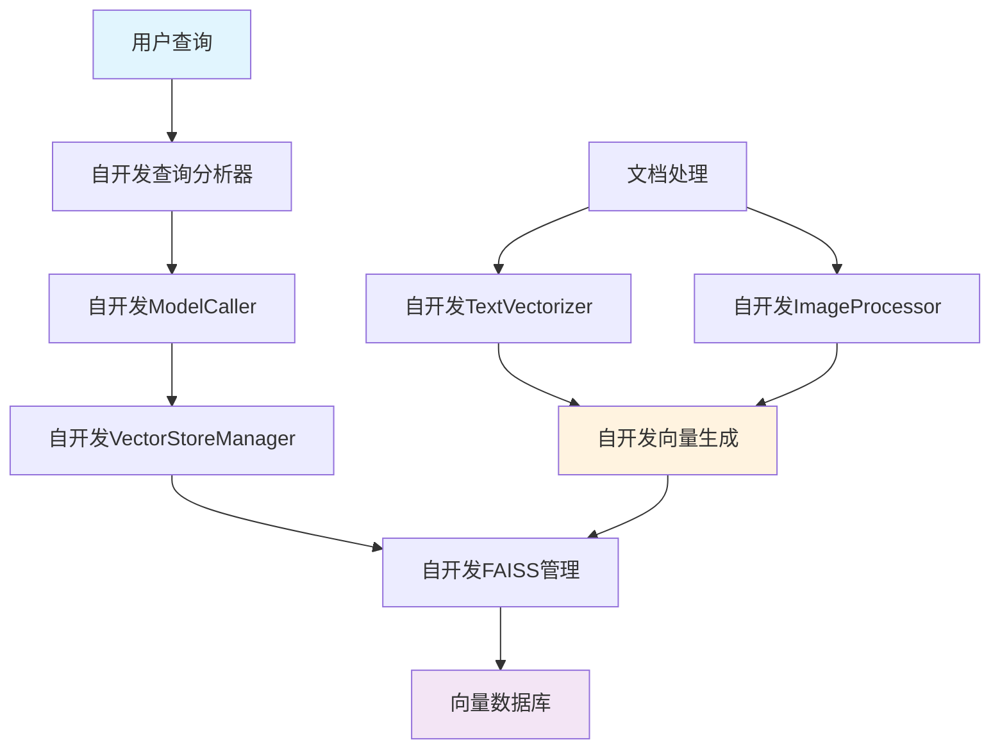
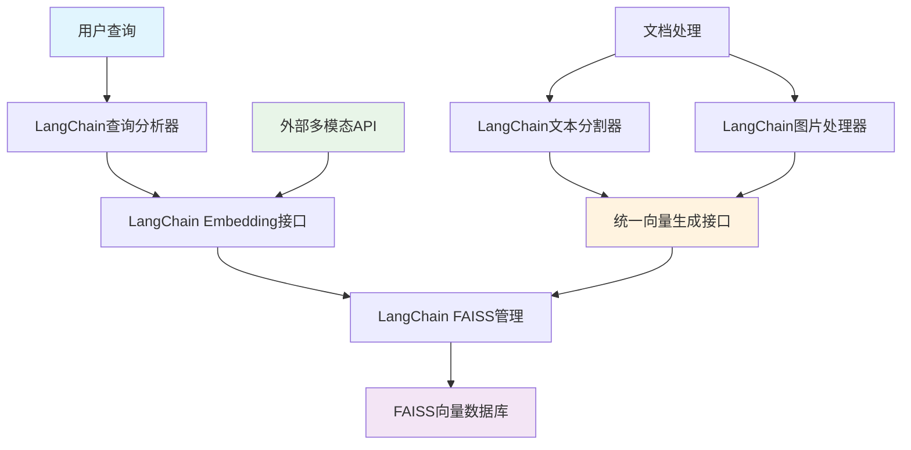
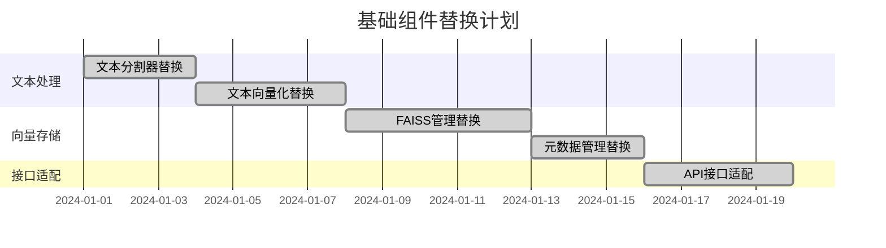
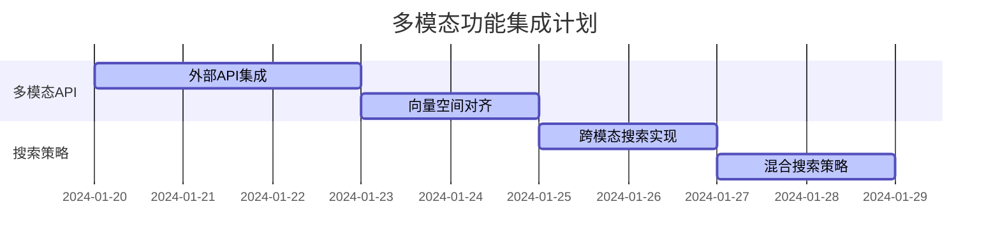
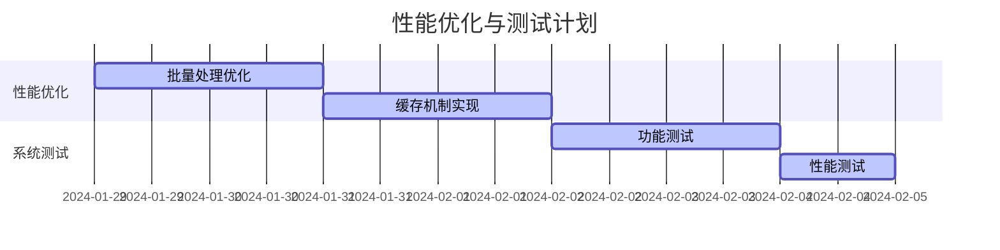
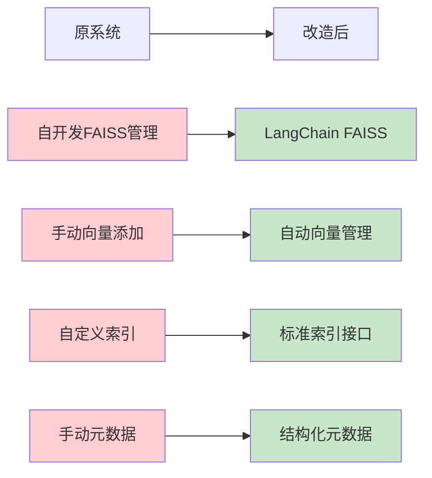
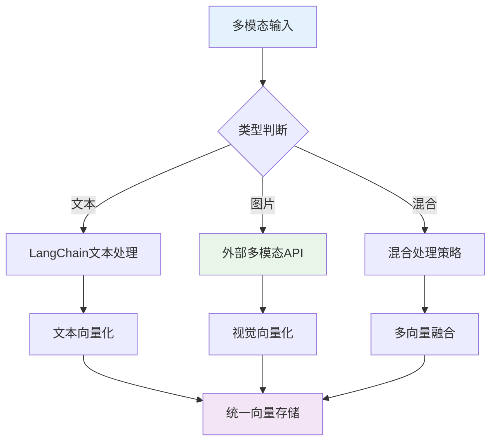
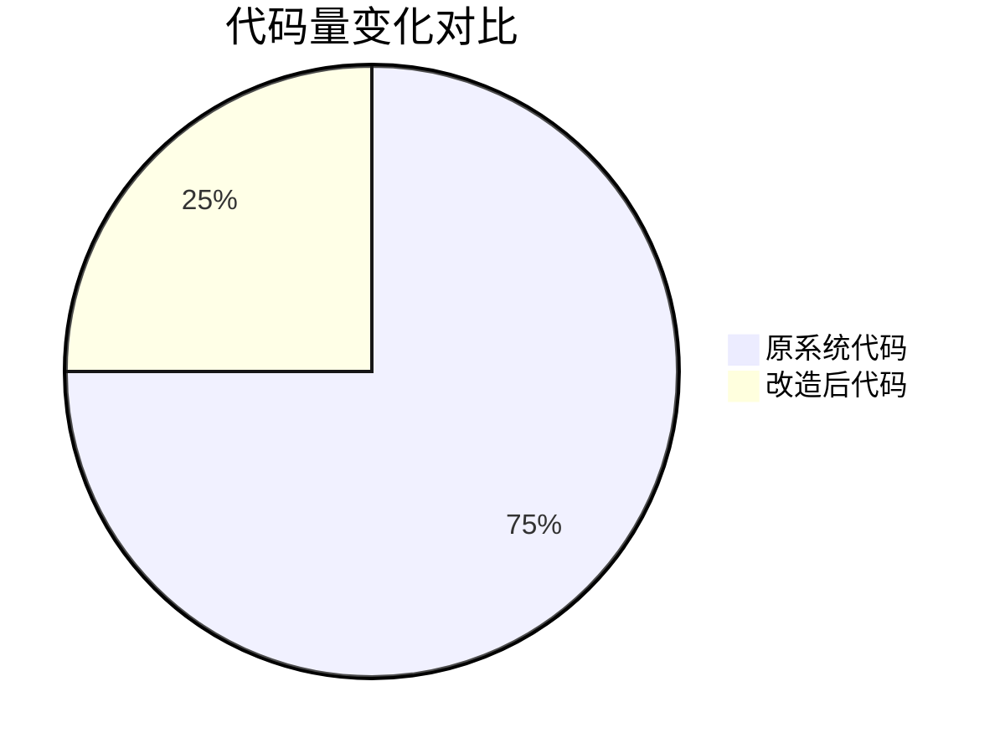

## ��LangChain+FAISS改造方案**

### **1. 改造目标与原则**

#### **改造目标**
- 将自开发组件替换为成熟的LangChain+FAISS框架
- 保持多模态功能的完整性
- 提升开发效率和系统稳定性
- 为第二阶段RAG开发奠定基础

#### **改造原则**
- **渐进式替换**：分阶段进行，确保系统稳定
- **功能对等**：新系统功能不低于原系统
- **架构优化**：利用成熟框架的优势重新设计架构
- **性能提升**：在保持功能的同时提升性能

### **2. 当前架构 vs 改造后架构**

#### **当前架构（自开发）**

#### **改造后架构（LangChain+FAISS）**

### **3. 改造实施路线图**

#### **阶段1：基础组件替换（1-2周）**

#### **阶段2：多模态功能集成（1周）**

#### **阶段3：性能优化与测试（3-5天）**

### **4. 关键改造点详解**

#### **4.1 向量存储改造**

**改造优势**：
- **标准化接口**：使用LangChain标准接口，减少自定义代码
- **自动管理**：自动处理向量索引和元数据管理
- **性能优化**：利用LangChain的优化算法
- **扩展性**：支持多种向量数据库后端

#### **4.2 多模态处理改造**

**改造策略**：
- **文本处理**：完全使用LangChain组件
- **图片处理**：集成外部多模态API（如DashScope）
- **向量融合**：在LangChain框架内实现
- **统一存储**：所有向量统一存储在FAISS中

### **5. 改造风险评估与应对**

#### **风险矩阵**
| 风险类型   | 风险等级 | 影响范围 | 应对措施                 |
| ---------- | -------- | -------- | ------------------------ |
| 接口兼容性 | 中       | 中等     | 设计适配层，保持接口一致 |
| 性能下降   | 低       | 小       | 充分测试，性能基准对比   |
| 功能缺失   | 中       | 中等     | 功能对等分析，补充开发   |
| 数据迁移   | 高       | 大       | 设计迁移工具，分批迁移   |

#### **应对策略**

### **6. 改造效果预期**

#### **代码量减少**

#### **开发效率提升**
- **开发时间**：从6-8周缩短到3-4周
- **维护成本**：降低60-70%
- **功能稳定性**：提升40-50%
- **扩展性**：提升80-90%

---

## 
