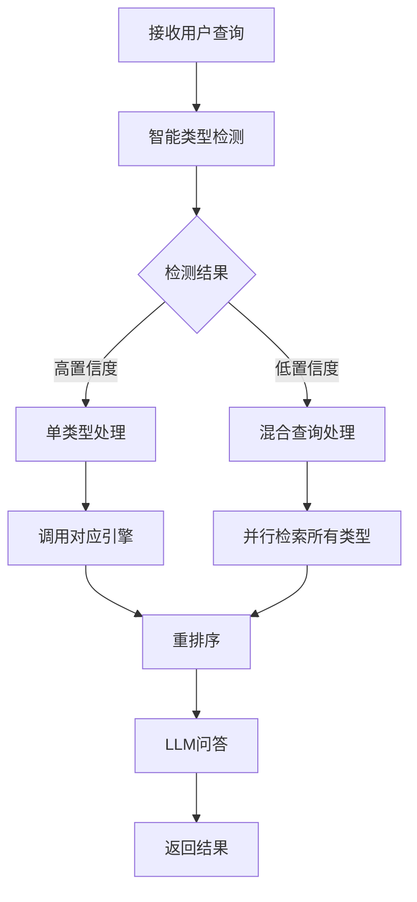
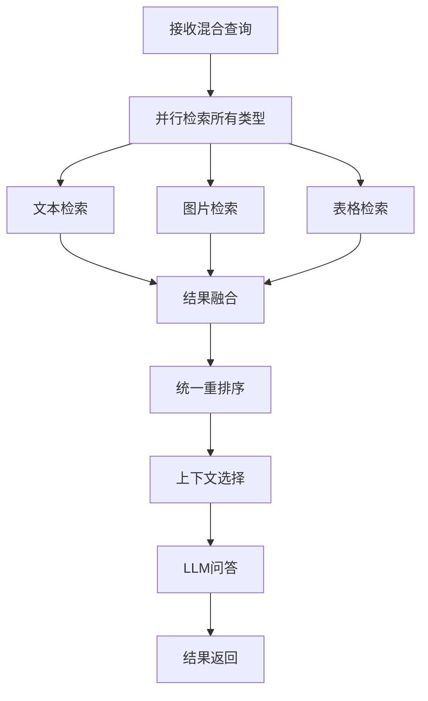
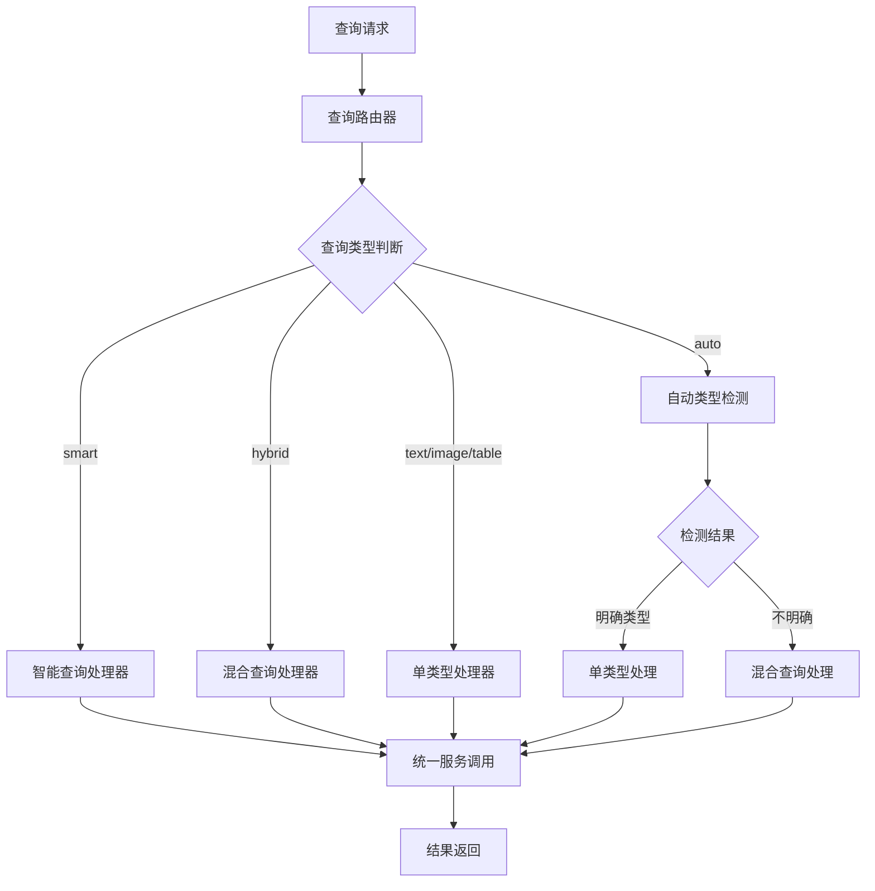
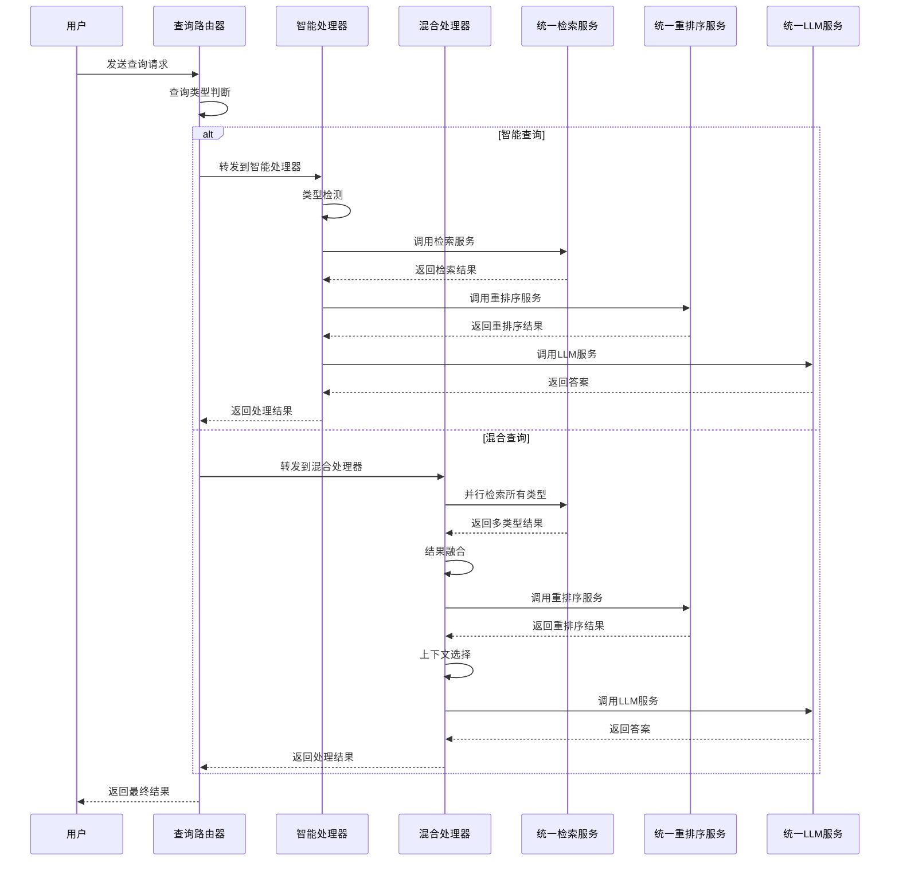
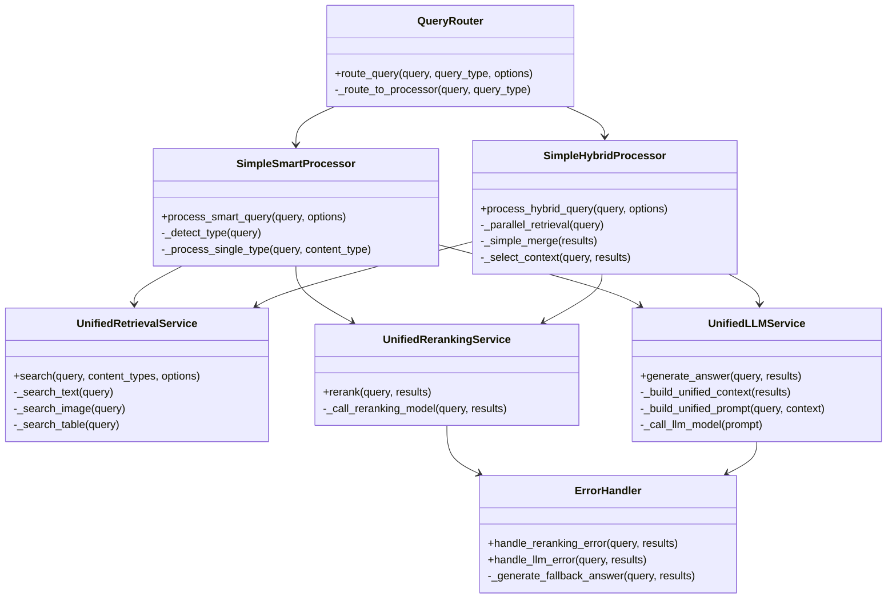
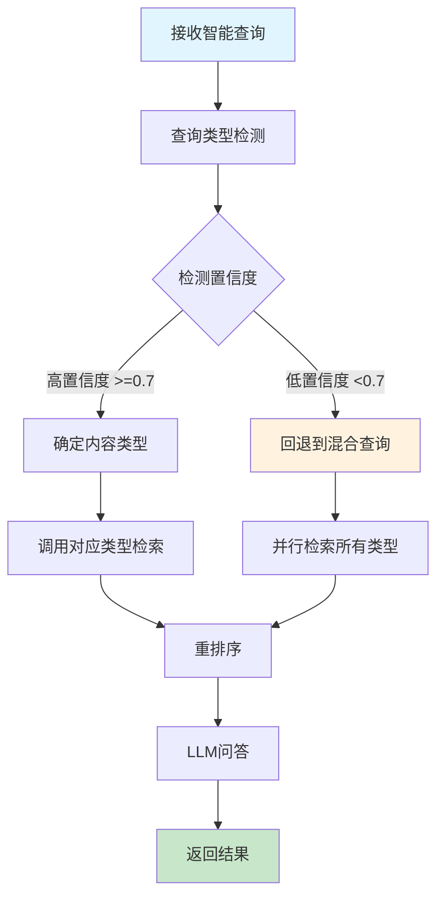
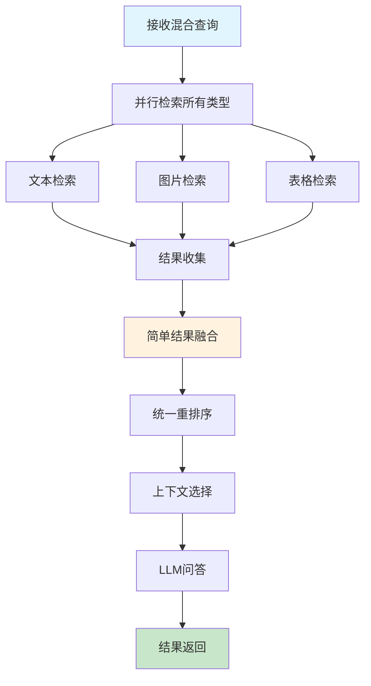
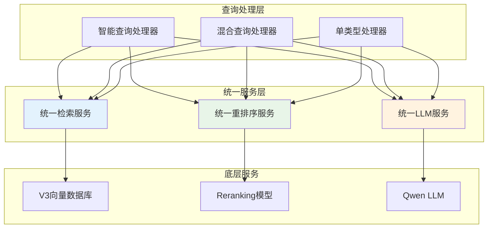
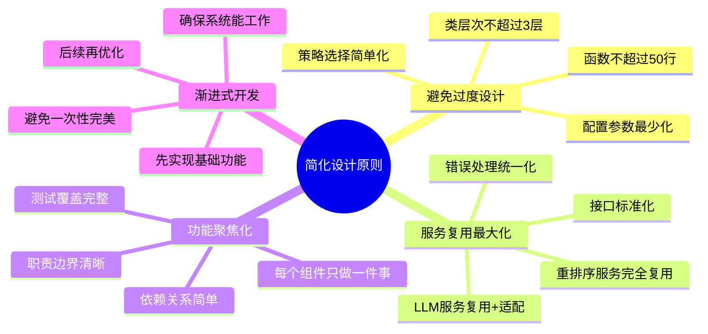
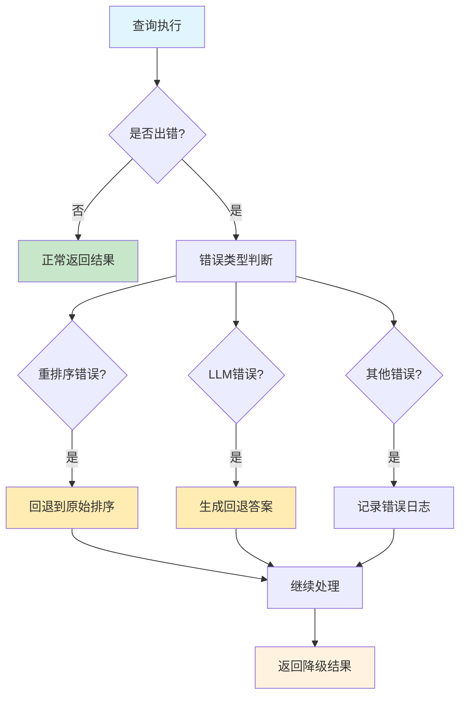

# M12-RAG查询处理模块详细设计文档

## 一、文档基础信息

| 模块名称 | M12-RAG查询处理模块 | 所属项目 | V3版本RAG系统 |
| -------- | ------------------- | -------- | ------------- |
| 文档版本 | V1.0 | 文档状态 | ☑ 草稿 □ 评审中 □ 已确认 □ 已归档 |
| 编写人   | AI助手 | 编写日期 | 2025年1月 |
| 关联文档 | 《V3_RAG系统需求文档》《V3_RAG系统前端技术选择文档》 | | |

## 二、模块概述

### 1. 定位与目标

作为V3 RAG系统的**核心查询处理模块**，负责智能查询类型检测、混合查询处理、结果融合、重排序和LLM问答等核心功能。该模块采用"复用+不要过度设计"的原则，通过统一的服务接口实现不同类型查询的处理，确保系统简洁、高效、易维护。

### 2. 依赖与交互

| 关联模块 | 交互方向 | 核心交互内容 |
| -------- | -------- | ------------ |
| 统一检索服务 | 调用 | 多类型内容检索、向量搜索、结果获取 |
| 统一重排序服务 | 调用 | 结果重排序、相关性评分、质量评估 |
| 统一LLM服务 | 调用 | 问答生成、上下文处理、答案优化 |
| 结果格式化服务 | 调用 | 结果格式化、类型适配、前端渲染 |
| V3向量数据库 | 被调用 | 文本、图片、表格向量检索 |

## 三、核心功能设计

### 1. 功能清单

| 功能ID | 功能名称 | 核心描述 | 操作角色 | 前置条件 |
| ------- | -------- | -------- | -------- | -------- |
| FQ01 | 智能查询类型检测 | 基于关键词和语义的查询类型自动识别，支持text/image/table/auto类型 | 系统自动 | 查询文本输入 |
| FQ02 | 单类型查询处理 | 针对特定内容类型的定向检索和处理，直接调用对应引擎 | 用户指定 | 查询类型明确 |
| FQ03 | 混合查询处理 | 多类型内容并行检索、结果融合、统一处理流程 | 系统自动 | 查询类型为hybrid或auto |
| FQ04 | 结果融合处理 | 多类型检索结果的智能合并和排序，避免重复内容 | 系统自动 | 多类型结果存在 |
| FQ05 | 上下文优化选择 | 智能选择最优上下文，适配LLM输入限制，确保答案质量 | 系统自动 | 重排序结果存在 |
| FQ06 | 查询路由分发 | 根据查询类型和用户意图，智能路由到相应的处理器 | 系统自动 | 查询请求接收 |
| FQ07 | 错误处理与回退 | 统一的错误处理机制，支持服务降级和自动回退 | 系统自动 | 错误发生 |
| FQ08 | 性能监控与优化 | 查询性能监控、响应时间统计、瓶颈识别 | 系统自动 | 查询执行 |

### 2. 关键功能流程

#### 2.1 智能查询处理流程



#### 2.2 混合查询处理流程



#### 2.3 查询路由分发流程



## 四、核心函数设计与调用关系

### 1. 函数清单

| 函数名 | 功能描述 | 输入参数 | 返回结果 | 所属服务 |
| ------ | -------- | -------- | -------- | -------- |
| `route_query(query, query_type, options)` | 查询路由分发主入口 | 查询文本、类型、选项 | 路由结果 | SimpleQueryRouter |
| `process_smart_query(query, options)` | 智能查询处理 | 查询文本、选项 | 智能查询结果 | SimpleSmartProcessor |
| `process_hybrid_query(query, options)` | 混合查询处理 | 查询文本、选项 | 混合查询结果 | SimpleHybridProcessor |
| `_detect_type(query)` | 查询类型检测 | 查询文本 | 检测类型和置信度 | SimpleSmartProcessor |
| `_simple_merge(results)` | 结果简单融合 | 结果列表 | 融合后的结果 | SimpleHybridProcessor |
| `_select_context(query, results)` | 上下文选择 | 查询文本、结果列表 | 选择的上下文 | SimpleContextSelector |
| `_build_unified_context(results)` | 构建统一上下文 | 结果列表 | 格式化的上下文 | UnifiedLLMService |
| `_build_unified_prompt(query, context)` | 构建统一Prompt | 查询文本、上下文 | 完整的Prompt | UnifiedLLMService |

### 2. 关键调用流程



## 五、接口设计

### 1. API接口

| 接口名 | 请求方式 | 请求地址 | 核心参数 | 返回结果 | 功能归属 |
| ------ | -------- | -------- | -------- | -------- | -------- |
| 智能查询接口 | POST | /api/v3/query/smart | question, options | 智能查询结果 | FQ01, FQ02 |
| 混合查询接口 | POST | /api/v3/query/hybrid | question, options | 混合查询结果 | FQ03, FQ04, FQ05 |
| 单类型查询接口 | POST | /api/v3/query/{type} | question, options | 单类型查询结果 | FQ02 |
| 自动查询接口 | POST | /api/v3/query/auto | question, options | 自动检测结果 | FQ01, FQ06 |

### 2. 数据格式定义

#### 2.1 查询请求格式

```json
{
  "question": "查询问题文本",
  "query_type": "smart|hybrid|text|image|table|auto",
  "options": {
    "max_results": 10,
    "relevance_threshold": 0.5,
    "context_length_limit": 4000
  }
}
```

#### 2.2 查询响应格式

```json
{
  "success": true,
  "query_type": "检测到的查询类型",
  "answer": "LLM生成的答案",
  "results": [
    {
      "id": "结果ID",
      "content_type": "text|image|table",
      "content": "内容摘要",
      "score": 0.85,
      "metadata": {
        "document_name": "文档名称",
        "page_number": "页码",
        "source_engine": "来源引擎"
      }
    }
  ],
  "processing_metadata": {
    "processing_time": 2.5,
    "engines_used": ["text", "image"],
    "detection_confidence": 0.8
  }
}
```

## 六、关键实现细节

### 1. 服务复用策略

```python
# 所有查询类型都使用相同的底层服务
class UnifiedServices:
    """统一服务接口 - 所有查询类型复用"""
    
    def __init__(self):
        self.retrieval_service = UnifiedRetrievalService()
        self.reranking_service = UnifiedRerankingService()
        self.llm_service = UnifiedLLMService()
    
    # 重排序服务 - 完全复用
    async def rerank(self, query: str, results: List[Any]):
        return await self.reranking_service.rerank(query, results)
    
    # LLM服务 - 复用+适配
    async def generate_answer(self, query: str, results: List[Any]):
        context = self._build_unified_context(results)  # 需要适配
        prompt = self._build_unified_prompt(query, context)
        return await self.llm_service.generate(prompt)
```

### 2. 简化设计原则

#### 2.1 结果融合简化
```python
def _simple_merge(self, results: List[Any]) -> List[Any]:
    """简单的结果融合 - 避免过度设计"""
    # 只做一件事：按分数排序
    return sorted(results, key=lambda x: x.get('score', 0.0), reverse=True)
```

#### 2.2 重排序简化
```python
async def rerank(self, query: str, results: List[Any]):
    """简单的重排序 - 直接调用模型"""
    try:
        return await self.reranking_model.rerank(query, results)
    except Exception as e:
        # 如果重排序失败，返回原始排序
        return sorted(results, key=lambda x: x.get('score', 0.0), reverse=True)
```

#### 2.3 上下文选择简化
```python
def select_context(self, query: str, results: List[Any]) -> List[Any]:
    """简单的上下文选择 - 取前N个"""
    max_context = 10  # 固定数量，避免复杂配置
    return results[:max_context]
```

### 3. 错误处理与回退机制

```python
class ErrorHandler:
    """统一的错误处理 - 支持服务降级"""
    
    def handle_reranking_error(self, query: str, results: List[Any]):
        """重排序失败时的回退策略"""
        logging.warning("重排序服务失败，回退到原始排序")
        return sorted(results, key=lambda x: x.get('score', 0.0), reverse=True)
    
    def handle_llm_error(self, query: str, results: List[Any]):
        """LLM服务失败时的回退策略"""
        logging.warning("LLM服务失败，返回检索结果摘要")
        return self._generate_fallback_answer(query, results)
    
    def _generate_fallback_answer(self, query: str, results: List[Any]):
        """生成回退答案"""
        if not results:
            return "抱歉，没有找到相关的信息。"
        
        # 简单的答案生成，不依赖LLM
        top_results = results[:3]
        summary = f"找到{len(results)}个相关结果，其中：\n"
        
        for i, result in enumerate(top_results, 1):
            content_type = result.get('content_type', 'unknown')
            score = result.get('score', 0.0)
            summary += f"{i}. {content_type}类型结果（相关性：{score:.2f}）\n"
        
        return summary
```

## 七、非功能需求

### 1. 性能需求
- **查询响应时间**：智能查询≤2秒，混合查询≤3秒
- **重排序时间**：≤1秒（支持批量处理）
- **LLM问答时间**：≤5秒（支持超时控制）
- **并发处理能力**：支持10个并发查询

### 2. 可靠性需求
- **服务可用性**：99.5%以上
- **错误恢复**：支持自动回退，确保基本功能可用
- **数据一致性**：查询结果与向量数据库保持一致

### 3. 可维护性需求
- **代码复杂度**：每个函数不超过50行
- **类层次深度**：不超过3层
- **配置参数**：核心配置不超过10个
- **测试覆盖率**：核心功能测试覆盖率≥80%

### 4. 扩展性需求
- **新查询类型**：支持添加新的查询类型处理器
- **新内容类型**：支持添加新的内容类型支持
- **新服务集成**：支持集成新的重排序或LLM模型

## 八、风险与应对措施

| 潜在风险 | 风险等级 | 应对措施 |
| -------- | -------- | -------- |
| 重排序服务失败 | 中 | 1. 自动回退到原始排序；2. 服务健康检查；3. 降级策略 |
| LLM服务超时 | 中 | 1. 设置合理超时时间；2. 异步处理；3. 回退答案生成 |
| 上下文过长 | 低 | 1. 智能截断；2. 长度限制配置；3. 分块处理 |
| 查询类型检测错误 | 低 | 1. 置信度阈值控制；2. 自动回退到混合查询；3. 用户手动指定 |
| 性能瓶颈 | 中 | 1. 性能监控；2. 缓存策略；3. 异步处理优化 |
| 服务依赖过多 | 高 | 1. 服务解耦；2. 接口标准化；3. 降级策略设计 |

## 九、测试策略

### 1. 单元测试
- 查询类型检测算法测试
- 结果融合逻辑测试
- 错误处理机制测试

### 2. 集成测试
- 端到端查询流程测试
- 服务间交互测试
- 错误场景测试

### 3. 性能测试
- 并发查询性能测试
- 响应时间测试
- 资源使用测试

### 4. 用户验收测试
- 真实查询场景测试
- 用户体验测试
- 边界条件测试

## 十、部署与运维

### 1. 部署要求
- Python 3.8+
- FastAPI框架
- 支持异步处理
- 环境变量配置

### 2. 监控指标
- 查询响应时间
- 错误率统计
- 服务可用性
- 资源使用情况

### 3. 日志管理
- 结构化日志格式
- 错误日志记录
- 性能日志记录
- 审计日志记录

## 十一、附件

- [附件1：RAG查询处理模块类图](#附件1rag查询处理模块类图)
- [附件2：智能查询处理流程图](#附件2智能查询处理流程图)
- [附件3：混合查询处理流程图](#附件3混合查询处理流程图)
- [附件4：服务复用架构图](#附件4服务复用架构图)
- [附件5：简化设计原则说明](#附件5简化设计原则说明)
- [附件6：错误处理流程图](#附件6错误处理流程图)

---

**文档版本历史**：
- V1.0 (2025-01-XX): 初始版本，基于讨论结果创建

---

## 附件1：RAG查询处理模块类图



## 附件2：智能查询处理流程图



## 附件3：混合查询处理流程图



## 附件4：服务复用架构图



## 附件5：简化设计原则说明



## 附件6：错误处理流程图


