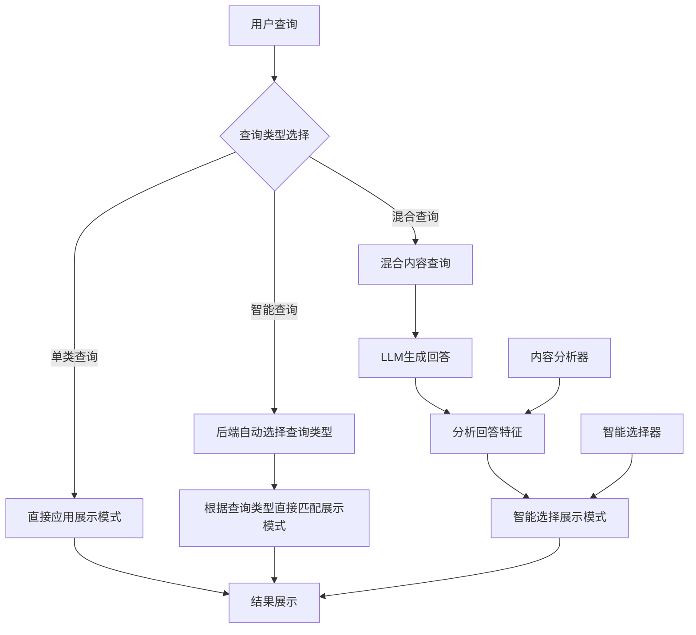

好的！我来写V3 RAG系统前端展示模式选择模块的详细设计文档：

# M20-RAG系统前端展示模式选择模块详细设计文档

## 一、文档基础信息

| 模块名称 | M20-RAG系统前端展示模式选择模块                              | 所属项目 | V3版本RAG系统                     |
| -------- | ------------------------------------------------------------ | -------- | --------------------------------- |
| 文档版本 | V1.0                                                         | 文档状态 | ☑ 草稿 □ 评审中 □ 已确认 □ 已归档 |
| 编写人   | AI助手                                                       | 编写日期 | 2025年8月                         |
| 关联文档 | 《V3_RAG系统前端技术选择》《M19-RAG系统溯源模块详细设计文档》 |          |                                   |

## 二、模块概述

### 1. 定位与目标

作为V3 RAG系统前端的**智能展示模式选择核心模块**，展示模式选择模块承担根据查询类型、内容特征和LLM回答智能选择最佳展示方式的重要职责。本模块采用"三层智能匹配策略"，确保展示模式与内容特征的最佳匹配，为用户提供最优的查询结果展示体验。

**重要说明**：本模块将重构现有的Chat.vue组件，解决当前系统中"问答"和"内容搜索"分离、缺少预设问题、来源信息显示不完整等问题，统一为智能问答系统。

### 2. 设计原则

- **用户控制优先**：单类查询完全由用户控制，智能查询和混合查询提供智能化辅助
- **内容特征匹配**：展示模式与内容类型和特征高度匹配
- **智能程度递增**：从单类到智能到混合，智能程度逐步提升
- **展示效果优化**：确保每种内容类型都能得到最佳的展示效果
- **渐进式实现**：先实现核心功能，复杂功能可适当简化
- **向后兼容**：作为可选功能集成，不替换现有逻辑

### 3. 依赖与交互

| 关联模块         | 交互方向 | 核心交互内容                 |
| ---------------- | -------- | ---------------------------- |
| 查询类型选择模块 | 被调用   | 获取用户选择的查询类型       |
| 内容分析模块     | 依赖     | 分析查询内容和LLM回答特征    |
| 结果展示模块     | 被调用   | 提供展示模式选择结果         |
| 溯源信息模块     | 依赖     | 获取溯源信息用于展示模式判断 |

## 三、核心功能设计

### 1. 功能清单

| 功能ID | 功能名称     | 核心描述                                 | 操作角色       | 前置条件              |
| ------ | ------------ | ---------------------------------------- | -------------- | --------------------- |
| F001   | 查询类型识别 | 识别用户选择的查询类型（单类/智能/混合） | 展示模式选择器 | 用户完成查询类型选择  |
| F002   | 内容特征分析 | 分析查询内容和LLM回答的内容特征          | 内容分析器     | 查询内容和LLM回答可用 |
| F003   | 智能模式选择 | 根据内容特征智能选择最佳展示模式         | 智能选择器     | 内容特征分析完成      |
| F004   | 展示模式应用 | 将选择的展示模式应用到结果展示           | 展示模式选择器 | 展示模式选择完成      |
| F005   | 动态模式调整 | 根据结果内容动态调整展示模式             | 动态调整器     | 结果内容可用          |

### 2. 核心业务流程

#### 2.1 单类查询流程
```
用户选择查询类型 → 直接应用对应展示模式 → 结果展示
```

#### 2.2 智能查询流程
```
用户选择智能查询 → 后端自动选择查询类型 → 根据选择的查询类型直接匹配展示模式 → 结果展示
```

#### 2.3 混合查询流程
```
用户选择混合查询 → 查询多种内容 → LLM生成回答 → 分析回答特征 → 选择最佳展示模式 → 结果展示
```

## 四、详细设计

### 1. 三层智能匹配策略架构

#### 1.1 架构图


#### 1.2 设计特点
- **分层决策**：从用户控制到系统智能，智能程度逐步提升
- **内容驱动**：展示模式选择基于内容特征，而非固定规则
- **动态调整**：支持根据结果内容动态调整展示模式
- **用户友好**：保持用户控制的灵活性，同时提供智能化辅助

### 2. 核心类设计

#### 2.1 DisplayModeSelector类
```vue
<template>
  <div class="display-mode-selector">
    <!-- 查询类型指示器 -->
    <div class="query-type-indicator">
      <span class="type-icon">{{ currentQueryType.icon }}</span>
      <span class="type-name">{{ currentQueryType.name }}</span>
      <span class="type-desc">{{ currentQueryType.description }}</span>
    </div>
    
    <!-- 展示模式状态 -->
    <div class="display-mode-status">
      <span class="mode-label">当前展示模式：</span>
      <span class="mode-value">{{ currentDisplayMode.name }}</span>
      <span class="mode-desc">{{ currentDisplayMode.description }}</span>
    </div>
    
    <!-- 智能分析结果（仅智能和混合查询显示） -->
    <div v-if="showAnalysis" class="intelligence-analysis">
      <h4>🤖 智能分析结果</h4>
      <div class="analysis-content">
        <div class="analysis-item">
          <span class="item-label">检测到的内容类型：</span>
          <span class="item-value">{{ analysisResult.contentTypes.join('、') }}</span>
        </div>
        <div class="analysis-item">
          <span class="item-label">推荐展示模式：</span>
          <span class="item-value">{{ analysisResult.recommendedMode }}</span>
        </div>
        <div class="analysis-item">
          <span class="item-label">置信度：</span>
          <span class="item-value">{{ (analysisResult.confidence * 100).toFixed(0) }}%</span>
        </div>
      </div>
    </div>
  </div>
</template>

<script setup>
import { ref, computed, watch } from 'vue'
import { ContentAnalyzer } from '@/utils/ContentAnalyzer'
import { DisplayModeManager } from '@/utils/DisplayModeManager'

const props = defineProps({
  queryType: String,
  query: String,
  llmAnswer: String,
  allResults: Object,
  actualQueryType: String  // 智能查询时后端返回的实际查询类型
})

const emit = defineEmits(['display-mode-change'])

const contentAnalyzer = new ContentAnalyzer()
const displayModeManager = new DisplayModeManager()

const currentDisplayMode = ref(null)
const analysisResult = ref(null)

// 查询类型配置
const queryTypes = {
  'text': {
    name: '文本查询',
    icon: '��',
    description: '查询文本内容',
    displayMode: 'text-focused'
  },
  'image': {
    name: '图片查询',
    icon: '��️',
    description: '查询图片内容',
    displayMode: 'image-focused'
  },
  'table': {
    name: '表格查询',
    icon: '��',
    description: '查询表格数据',
    displayMode: 'table-focused'
  },
  'smart': {
    name: '智能查询',
    icon: '��',
    description: '系统自动判断查询类型',
    displayMode: 'auto-detect'
  },
  'hybrid': {
    name: '混合查询',
    icon: '��',
    description: '跨类型内容查询',
    displayMode: 'hybrid-layout'
  }
}

// 当前查询类型
const currentQueryType = computed(() => {
  return queryTypes[props.queryType] || queryTypes.smart
})

// 是否显示分析结果
const showAnalysis = computed(() => {
  return props.queryType === 'smart' || props.queryType === 'hybrid'
})

// 监听查询类型变化，自动选择展示模式
watch(() => props.queryType, (newType) => {
  if (newType) {
    selectDisplayModeForQueryType(newType)
  }
}, { immediate: true })

// 监听智能查询结果变化，处理展示模式选择
watch(() => props.actualQueryType, (newType) => {
  if (props.queryType === 'smart' && newType) {
    handleSmartQueryResult(newType)
  }
})

// 监听LLM回答变化，重新分析（混合查询）
watch(() => props.llmAnswer, (newAnswer) => {
  if (props.queryType === 'hybrid' && newAnswer) {
    analyzeLLMAnswer(newAnswer)
  }
})

// 根据查询类型选择展示模式
const selectDisplayModeForQueryType = (queryType) => {
  if (queryType === 'smart') {
    // 智能查询：后端会自动选择查询类型，前端根据后端返回的查询类型直接匹配展示模式
    // 无需前端分析，等待后端返回结果后根据实际查询类型匹配
    currentDisplayMode.value = displayModeManager.getDisplayMode('auto-detect')
  } else if (queryType === 'hybrid') {
    // 混合查询：等待LLM回答后分析
    currentDisplayMode.value = displayModeManager.getDisplayMode('hybrid-layout')
  } else {
    // 单类查询：直接应用对应展示模式
    const displayMode = queryTypes[queryType].displayMode
    currentDisplayMode.value = displayModeManager.getDisplayMode(displayMode)
    emit('display-mode-change', displayMode)
  }
}

// 处理智能查询结果（智能查询）
const handleSmartQueryResult = (actualQueryType) => {
  try {
    // 根据后端返回的实际查询类型直接匹配展示模式
    const modeMap = {
      'text': 'text-focused',
      'image': 'image-focused',
      'table': 'table-focused',
      'hybrid': 'hybrid-layout'
    }
    
    const displayMode = modeMap[actualQueryType] || 'text-focused'
    currentDisplayMode.value = displayModeManager.getDisplayMode(displayMode)
    emit('display-mode-change', displayMode)
    
    // 记录智能查询的实际选择
    analysisResult.value = {
      actualQueryType: actualQueryType,
      selectedDisplayMode: displayMode,
      confidence: 1.0,
      reason: `智能查询自动选择了${actualQueryType}查询类型`
    }
    
  } catch (error) {
    console.error('智能查询结果处理失败:', error)
    // 处理失败时使用默认模式
    currentDisplayMode.value = displayModeManager.getDisplayMode('text-focused')
    emit('display-mode-change', 'text-focused')
  }
}

// 分析LLM回答（混合查询）
const analyzeLLMAnswer = async (answer) => {
  try {
    const analysis = await contentAnalyzer.analyzeLLMAnswer(answer, props.allResults)
    analysisResult.value = analysis
    
    // 根据分析结果选择展示模式
    const displayMode = analysis.recommendedDisplayMode
    currentDisplayMode.value = displayModeManager.getDisplayMode(displayMode)
    emit('display-mode-change', displayMode)
    
  } catch (error) {
    console.error('LLM回答分析失败:', error)
    // 分析失败时使用混合布局模式
    currentDisplayMode.value = displayModeManager.getDisplayMode('hybrid-layout')
    emit('display-mode-change', 'hybrid-layout')
  }
}
</script>
```

#### 2.2 ContentAnalyzer类（简化版本）
**实现策略**：先实现简化版本，复杂功能可后续完善

```javascript
// ContentAnalyzer.js - 内容智能分析器（简化版本）
export class ContentAnalyzer {
  /**
   * 分析查询内容，智能判断查询类型（简化版本）
   */
  async analyzeQueryContent(query) {
    const analysis = {
      contentTypes: [],
      confidence: 0,
      keywords: [],
      recommendedDisplayMode: 'text-focused'
    }
    
    try {
      // 简化版本：使用基础关键词匹配
      const keywords = this.extractKeywordsSimple(query)
      analysis.keywords = keywords
      
      // 简化版本：使用简单的阈值判断
      const scores = this.calculateScoresSimple(query, keywords)
      
      // 简化版本：直接选择最高分类型
      const maxType = Object.keys(scores).reduce((a, b) => scores[a] > scores[b] ? a : b)
      const maxScore = scores[maxType]
      
      if (maxScore > 0.5) {  // 降低阈值，简化判断
        analysis.contentTypes = [maxType]
        analysis.confidence = maxScore
        
        // 根据类型推荐展示模式
        const modeMap = {
          'image': 'image-focused',
          'table': 'table-focused',
          'text': 'text-focused'
        }
        analysis.recommendedDisplayMode = modeMap[maxType]
      } else {
        // 无法确定类型，使用文本模式
        analysis.contentTypes = ['text']
        analysis.confidence = 0.5
        analysis.recommendedDisplayMode = 'text-focused'
      }
      
      return analysis
      
    } catch (error) {
      console.error('查询内容分析失败:', error)
      return {
        contentTypes: ['text'],
        confidence: 0.3,
        keywords: [],
        recommendedDisplayMode: 'text-focused'
      }
    }
  }
  
  /**
   * 简化的关键词提取
   */
  extractKeywordsSimple(query) {
    const keywords = []
    const lowerQuery = query.toLowerCase()
    
    // 简化的关键词匹配
    if (lowerQuery.includes('图片') || lowerQuery.includes('图表') || lowerQuery.includes('图')) {
      keywords.push({ type: 'image', keyword: '图片相关', weight: 0.8 })
    }
    if (lowerQuery.includes('表格') || lowerQuery.includes('数据') || lowerQuery.includes('统计')) {
      keywords.push({ type: 'table', keyword: '表格相关', weight: 0.8 })
    }
    if (lowerQuery.includes('报告') || lowerQuery.includes('分析') || lowerQuery.includes('说明')) {
      keywords.push({ type: 'text', keyword: '文本相关', weight: 0.6 })
    }
    
    return keywords
  }
  
  /**
   * 简化的分数计算
   */
  calculateScoresSimple(query, keywords) {
    const scores = { image: 0, table: 0, text: 0 }
    
    keywords.forEach(kw => {
      scores[kw.type] += kw.weight
    })
    
    // 如果没有关键词，默认为文本
    if (Object.values(scores).every(s => s === 0)) {
      scores.text = 0.5
    }
    
    return scores
  }
  
  /**
   * 分析LLM回答内容，智能选择展示模式
   */
  async analyzeLLMAnswer(answer, allResults) {
    const analysis = {
      contentTypes: [],
      confidence: 0,
      contentFeatures: {},
      recommendedDisplayMode: 'hybrid-layout'
    }
    
    try {
      // 1. 分析LLM回答中的内容引用
      const answerAnalysis = this.analyzeAnswerContent(answer)
      
      // 2. 分析实际返回的结果内容
      const resultsAnalysis = this.analyzeResultsContent(allResults)
      
      // 3. 综合分析，推荐展示模式
      analysis.contentTypes = this.mergeContentTypes(answerAnalysis, resultsAnalysis)
      analysis.contentFeatures = this.mergeContentFeatures(answerAnalysis, resultsAnalysis)
      analysis.confidence = this.calculateConfidence(answerAnalysis, resultsAnalysis)
      
      // 4. 根据内容特征推荐展示模式
      analysis.recommendedDisplayMode = this.recommendDisplayMode(analysis)
      
      return analysis
      
    } catch (error) {
      console.error('LLM回答分析失败:', error)
      return {
        contentTypes: ['text'],
        confidence: 0.3,
        contentFeatures: {},
        recommendedDisplayMode: 'hybrid-layout'
      }
    }
  }
  
  /**
   * 提取查询关键词
   */
  extractKeywords(query) {
    const keywords = []
    
    // 图片相关关键词
    const imageKeywords = ['图片', '照片', '图表', '截图', '图像', 'photo', 'image', 'chart', 'graph']
    imageKeywords.forEach(keyword => {
      if (query.includes(keyword)) {
        keywords.push({ type: 'image', keyword, weight: 0.8 })
      }
    })
    
    // 表格相关关键词
    const tableKeywords = ['表格', '数据', '统计', '报表', 'table', 'data', 'statistics', 'report']
    tableKeywords.forEach(keyword => {
      if (query.includes(keyword)) {
        keywords.push({ type: 'table', keyword, weight: 0.8 })
      }
    })
    
    // 文本相关关键词
    const textKeywords = ['报告', '分析', '说明', '介绍', 'report', 'analysis', 'description']
    textKeywords.forEach(keyword => {
      if (query.includes(keyword)) {
        keywords.push({ type: 'text', keyword, weight: 0.6 })
      }
    })
    
    return keywords
  }
  
  /**
   * 计算图片查询分数
   */
  calculateImageScore(query, keywords) {
    let score = 0
    
    // 关键词分数
    const imageKeywords = keywords.filter(k => k.type === 'image')
    score += imageKeywords.length * 0.3
    
    // 查询模式分数
    if (query.includes('这个图') || query.includes('这张图') || query.includes('图片显示')) {
      score += 0.4
    }
    
    // 视觉描述分数
    if (query.includes('颜色') || query.includes('形状') || query.includes('大小')) {
      score += 0.2
    }
    
    return Math.min(score, 1.0)
  }
  
  /**
   * 计算表格查询分数
   */
  calculateTableScore(query, keywords) {
    let score = 0
    
    // 关键词分数
    const tableKeywords = keywords.filter(k => k.type === 'table')
    score += tableKeywords.length * 0.3
    
    // 查询模式分数
    if (query.includes('数据') || query.includes('数值') || query.includes('统计')) {
      score += 0.4
    }
    
    // 比较查询分数
    if (query.includes('对比') || query.includes('比较') || query.includes('趋势')) {
      score += 0.2
    }
    
    return Math.min(score, 1.0)
  }
  
  /**
   * 计算文本查询分数
   */
  calculateTextScore(query, keywords) {
    let score = 0
    
    // 关键词分数
    const textKeywords = keywords.filter(k => k.type === 'text')
    score += textKeywords.length * 0.3
    
    // 查询模式分数
    if (query.includes('什么') || query.includes('如何') || query.includes('为什么')) {
      score += 0.3
    }
    
    // 内容类型分数
    if (query.includes('报告') || query.includes('分析') || query.includes('说明')) {
      score += 0.2
    }
    
    return Math.min(score, 1.0)
  }
  
  /**
   * 分析LLM回答内容
   */
  analyzeAnswerContent(answer) {
    const analysis = {
      contentTypes: [],
      contentFeatures: {}
    }
    
    // 检测图片引用
    if (answer.includes('图片') || answer.includes('图表') || answer.includes('截图')) {
      analysis.contentTypes.push('image')
      analysis.contentFeatures.hasImageReference = true
    }
    
    // 检测表格引用
    if (answer.includes('表格') || answer.includes('数据') || /\d+\.\d+/.test(answer)) {
      analysis.contentTypes.push('table')
      analysis.contentFeatures.hasTableReference = true
    }
    
    // 检测结构化数据
    if (answer.includes('营收') || answer.includes('净利润') || answer.includes('市场份额')) {
      analysis.contentTypes.push('structured-data')
      analysis.contentFeatures.hasStructuredData = true
    }
    
    // 如果没有检测到特定类型，默认为文本
    if (analysis.contentTypes.length === 0) {
      analysis.contentTypes.push('text')
    }
    
    return analysis
  }
  
  /**
   * 分析结果内容
   */
  analyzeResultsContent(allResults) {
    const analysis = {
      contentTypes: [],
      contentFeatures: {}
    }
    
    if (allResults) {
      if (allResults.image_results && allResults.image_results.length > 0) {
        analysis.contentTypes.push('image')
        analysis.contentFeatures.hasImages = true
        analysis.contentFeatures.imageCount = allResults.image_results.length
      }
      
      if (allResults.table_results && allResults.table_results.length > 0) {
        analysis.contentTypes.push('table')
        analysis.contentFeatures.hasTables = true
        analysis.contentFeatures.tableCount = allResults.table_results.length
      }
      
      if (allResults.text_results && allResults.text_results.length > 0) {
        analysis.contentTypes.push('text')
        analysis.contentFeatures.hasText = true
        analysis.contentFeatures.textCount = allResults.text_results.length
      }
    }
    
    return analysis
  }
  
  /**
   * 合并内容类型
   */
  mergeContentTypes(answerAnalysis, resultsAnalysis) {
    const allTypes = new Set([
      ...answerAnalysis.contentTypes,
      ...resultsAnalysis.contentTypes
    ])
    return Array.from(allTypes)
  }
  
  /**
   * 合并内容特征
   */
  mergeContentFeatures(answerAnalysis, resultsAnalysis) {
    return {
      ...answerAnalysis.contentFeatures,
      ...resultsAnalysis.contentFeatures
    }
  }
  
  /**
   * 计算置信度
   */
  calculateConfidence(answerAnalysis, resultsAnalysis) {
    let confidence = 0.5 // 基础置信度
    
    // 如果LLM回答和实际结果都提到了相同类型，提高置信度
    const commonTypes = answerAnalysis.contentTypes.filter(type => 
      resultsAnalysis.contentTypes.includes(type)
    )
    confidence += commonTypes.length * 0.2
    
    // 如果内容特征丰富，提高置信度
    const featureCount = Object.keys(resultsAnalysis.contentFeatures).length
    confidence += Math.min(featureCount * 0.1, 0.3)
    
    return Math.min(confidence, 1.0)
  }
  
  /**
   * 推荐展示模式
   */
  recommendDisplayMode(analysis) {
    const { contentTypes, contentFeatures } = analysis
    
    // 如果只有一种内容类型，使用对应的专注模式
    if (contentTypes.length === 1) {
      const type = contentTypes[0]
      const modeMap = {
        'image': 'image-focused',
        'table': 'table-focused',
        'text': 'text-focused'
      }
      return modeMap[type] || 'text-focused'
    }
    
    // 如果包含图片和表格，使用混合布局
    if (contentTypes.includes('image') && contentTypes.includes('table')) {
      return 'hybrid-layout'
    }
    
    // 如果包含图片，使用图片优先
    if (contentTypes.includes('image')) {
      return 'image-focused'
    }
    
    // 如果包含表格，使用表格优先
    if (contentTypes.includes('table')) {
      return 'table-focused'
    }
    
    // 默认使用文本模式
    return 'text-focused'
  }
}
```

#### 2.3 DisplayModeManager类
```javascript
// DisplayModeManager.js - 展示模式管理器
export class DisplayModeManager {
  constructor() {
    this.displayModes = this.initializeDisplayModes()
  }
  
  /**
   * 初始化展示模式
   */
  initializeDisplayModes() {
    return {
      'text-focused': {
        id: 'text-focused',
        name: '文本优先',
        icon: '📝',
        description: '适合文本内容为主的查询',
        layout: 'vertical',
        priority: ['text', 'table', 'image']
      },
      'image-focused': {
        id: 'image-focused',
        name: '图片优先',
        icon: '🖼️',
        description: '适合图片内容为主的查询',
        layout: 'horizontal',
        priority: ['image', 'text', 'table']
      },
      'table-focused': {
        id: 'table-focused',
        name: '表格优先',
        icon: '📊',
        description: '适合表格数据为主的查询',
        layout: 'horizontal',
        priority: ['table', 'text', 'image']
      },
      'hybrid-layout': {
        id: 'hybrid-layout',
        name: '混合布局',
        icon: '🔀',
        description: '适合多种内容类型的查询',
        layout: 'grid',
        priority: ['text', 'table', 'image']
      },
      'auto-detect': {
        id: 'auto-detect',
        name: '智能检测',
        icon: '🤖',
        description: '系统自动选择最佳展示模式',
        layout: 'adaptive',
        priority: ['auto']
      }
    }
  }
  
  /**
   * 获取展示模式
   */
  getDisplayMode(modeId) {
    return this.displayModes[modeId] || this.displayModes['text-focused']
  }
  
  /**
   * 获取所有展示模式
   */
  getAllDisplayModes() {
    return Object.values(this.displayModes)
  }
  
  /**
   * 根据内容类型推荐展示模式
   */
  recommendDisplayMode(contentTypes, confidence = 0.5) {
    if (contentTypes.length === 0) {
      return this.displayModes['text-focused']
    }
    
    if (contentTypes.length === 1) {
      const type = contentTypes[0]
      const modeMap = {
        'image': 'image-focused',
        'table': 'table-focused',
        'text': 'text-focused'
      }
      return this.displayModes[modeMap[type] || 'text-focused']
    }
    
    // 多种内容类型，使用混合布局
    return this.displayModes['hybrid-layout']
  }
  
  /**
   * 验证展示模式是否适合内容
   */
  validateDisplayMode(modeId, contentTypes) {
    const mode = this.getDisplayMode(modeId)
    if (!mode) return false
    
    // 检查内容类型是否与模式匹配
    const modePriority = mode.priority
    const hasMatchingContent = contentTypes.some(type => 
      modePriority.includes(type)
    )
    
    return hasMatchingContent
  }
}
```

### 3. 展示模式应用逻辑

#### 3.1 单类查询展示模式应用
```javascript
// 单类查询：直接应用对应展示模式
const applySingleTypeDisplayMode = (queryType) => {
  const modeMap = {
    'text': 'text-focused',
    'image': 'image-focused',
    'table': 'table-focused'
  }
  
  const displayMode = modeMap[queryType]
  if (displayMode) {
    return {
      mode: displayMode,
      confidence: 1.0,
      reason: `用户明确选择${queryType}查询类型`
    }
  }
  
  return {
    mode: 'text-focused',
    confidence: 0.5,
    reason: '未知查询类型，使用默认文本模式'
  }
}
```

#### 3.2 智能查询展示模式应用
```javascript
// 智能查询：根据后端返回的实际查询类型直接匹配展示模式
const applySmartQueryDisplayMode = (actualQueryType) => {
  try {
    // 后端已经自动选择了查询类型，前端直接根据类型匹配展示模式
    const modeMap = {
      'text': 'text-focused',
      'image': 'image-focused',
      'table': 'table-focused',
      'hybrid': 'hybrid-layout'
    }
    
    const displayMode = modeMap[actualQueryType] || 'text-focused'
    
    return {
      mode: displayMode,
      confidence: 1.0,
      reason: `智能查询自动选择了${actualQueryType}查询类型`,
      actualQueryType: actualQueryType
    }
  } catch (error) {
    console.error('智能查询展示模式应用失败:', error)
    return {
      mode: 'text-focused',
      confidence: 0.3,
      reason: '智能查询处理失败，使用默认文本模式'
    }
  }
}
```

#### 3.3 混合查询展示模式应用
```javascript
// 混合查询：分析LLM回答，智能选择
const applyHybridQueryDisplayMode = async (llmAnswer, allResults) => {
  try {
    const contentAnalyzer = new ContentAnalyzer()
    const analysis = await contentAnalyzer.analyzeLLMAnswer(llmAnswer, allResults)
    
    return {
      mode: analysis.recommendedDisplayMode,
      confidence: analysis.confidence,
      reason: `基于LLM回答分析，检测到${analysis.contentTypes.join('、')}内容类型`,
      analysis: analysis
    }
  } catch (error) {
    console.error('混合查询分析失败:', error)
    return {
      mode: 'hybrid-layout',
      confidence: 0.3,
      reason: '混合查询分析失败，使用默认混合布局模式'
    }
  }
}
```

### 4. 配置管理设计

#### 4.1 前端默认配置策略
**设计原则**：前端默认配置 + 后端API支持，优先使用前端配置

**前端默认配置**：
```javascript
// frontend/src/utils/constants.js
export const DISPLAY_MODE_CONFIG = {
  enabled: true,                    // 是否启用展示模式选择功能
  defaultMode: 'auto-detect',       // 默认展示模式
  autoSelectionRules: {             // 自动选择规则（简化版本）
    textThreshold: 0.7,             // 文本内容阈值
    imageThreshold: 0.6,            // 图片内容阈值
    tableThreshold: 0.5             // 表格内容阈值
  },
  fallbackMode: 'text-focused',     // 分析失败时的备用模式
  simplifiedAnalysis: true          // 使用简化的内容分析
}
```

#### 4.2 后端API配置支持
**配置获取接口**：
```javascript
// frontend/src/services/api.js
class RAGAPIService {
  async getDisplayModeConfig() {
    try {
      // 尝试获取后端配置
      const response = await api.get('/api/v3/rag/config/display-mode')
      return response.data
    } catch (error) {
      // 如果失败，使用前端默认配置
      console.warn('使用前端默认配置:', error)
      return DISPLAY_MODE_CONFIG
    }
  }
}
```

#### 4.3 配置结构
```json
{
  "rag_system": {
    "frontend": {
      "display_mode_selection": {
        "enabled": true,
        "default_mode": "auto-detect",
        "confidence_threshold": 0.6,
        "analysis_timeout": 5000,
        "fallback_mode": "text-focused",
        "simplified_analysis": true,
        "user_preference_learning": false
      }
    }
  }
}
```

#### 4.4 配置参数说明

| 参数名称               | 默认值         | 说明                     |
| ---------------------- | -------------- | ------------------------ |
| `enabled`              | true           | 是否启用展示模式选择功能 |
| `default_mode`         | "auto-detect"  | 默认展示模式             |
| `confidence_threshold` | 0.6            | 智能分析置信度阈值       |
| `analysis_timeout`     | 5000           | 内容分析超时时间（毫秒） |
| `fallback_mode`        | "text-focused" | 分析失败时的备用模式     |
| `simplified_analysis`  | true           | 使用简化的内容分析       |
| `user_preference_learning` | false    | 是否启用用户偏好学习     |

## 五、接口设计

### 1. 核心接口

#### 1.1 选择展示模式接口
```javascript
async function selectDisplayMode(queryType, query, llmAnswer, allResults) {
  /**
   * 选择展示模式
   * 
   * @param {string} queryType - 查询类型
   * @param {string} query - 查询内容
   * @param {string} llmAnswer - LLM回答
   * @param {Object} allResults - 所有查询结果
   * @return {Object} 展示模式选择结果
   */
}
```

#### 1.2 返回数据结构
```javascript
{
  mode: 'image-focused',           // 选择的展示模式
  confidence: 0.85,                // 选择置信度
  reason: '智能分析检测到图片内容类型', // 选择原因
  analysis: {                      // 分析结果详情
    contentTypes: ['image'],
    keywords: [...],
    contentFeatures: {...}
  },
  fallback: false                  // 是否使用了备用模式
}
```

## 六、与V3系统集成

### 1. 集成策略
**设计原则**：作为可选功能集成，不替换现有逻辑

**集成方式**：
- **功能开关**：通过配置控制是否启用新功能
- **渐进式集成**：新功能与现有功能并行运行
- **降级机制**：如果新功能出现问题，自动回退到现有展示逻辑
- **向后兼容**：确保现有功能不受影响

### 2. 集成点
- **查询类型选择模块**：获取用户选择的查询类型
- **内容分析模块**：分析查询内容和LLM回答特征（简化版本）
- **结果展示模块**：应用选择的展示模式
- **现有Chat.vue**：作为可选功能集成

### 3. 数据流
```
用户查询 → 查询类型选择 → 展示模式选择 → 内容分析 → 模式应用 → 结果展示
    ↓
现有逻辑（并行运行，作为备用）
```

### 4. Chat.vue重构方案

**重构目标**：解决现有Chat.vue的问题，统一为智能问答系统

**现有问题**：
- 问答和内容搜索的侧重点不明确
- 缺少预设问题功能
- 不同查询的展示匹配不完善
- 来源信息显示不完整（缺少文档名、页码、表格名、图片名等）

**重构方案**：
```vue
<!-- 重构后的Chat.vue - 统一智能问答系统 -->
<template>
  <div class="unified-qa-container">
    <!-- 1. 预设问题区域 -->
    <PresetQuestions 
      :query-type="selectedQueryType"
      @question-selected="handlePresetQuestion"
    />
    
    <!-- 2. 查询输入区域 -->
    <div class="query-input-section">
      <QueryTypeSelector v-model="selectedQueryType" />
      <QueryInput 
        v-model="userQuery"
        :query-type="selectedQueryType"
        @submit="handleQuerySubmit"
      />
    </div>
    
    <!-- 3. 展示模式选择区域 -->
    <DisplayModeSelector 
      v-model="displayMode"
      :query-type="selectedQueryType"
      :query-results="currentResults"
      @mode-change="handleDisplayModeChange"
    />
    
    <!-- 4. 智能问答结果展示区域 -->
    <div class="qa-results-section">
      <!-- 动态展示组件 -->
      <component 
        :is="currentDisplayComponent"
        :results="currentResults"
        :display-mode="displayMode"
        :query-type="selectedQueryType"
        :llm-answer="llmAnswer"
        :sources="detailedSources"
      />
    </div>
  </div>
</template>
```

**来源信息显示要求**：
- **文档信息**：显示文档名称和页码
- **表格信息**：显示表格标题（从元数据获取）
- **图片信息**：显示图片标题/说明（从元数据获取）
- **不显示**：chunk-id等对用户不友好的技术标识
- **元数据来源**：从M15元数据管理模块获取详细信息

<script setup>
import { ref, computed, onMounted } from 'vue'
import { DISPLAY_MODE_CONFIG } from '@/utils/constants'
import DisplayModeSelector from '@/components/DisplayModeSelector.vue'

// 配置管理
const displayModeConfig = ref(DISPLAY_MODE_CONFIG)
const displayMode = ref('auto-detect')

// 加载配置
onMounted(async () => {
  try {
    const config = await apiService.getDisplayModeConfig()
    displayModeConfig.value = { ...DISPLAY_MODE_CONFIG, ...config }
  } catch (error) {
    console.warn('使用前端默认配置')
  }
})

// 展示模式切换处理
const handleDisplayModeChange = (newMode) => {
  displayMode.value = newMode
  // 记录用户偏好，用于后续优化
  apiService.updateDisplayModePreference(newMode).catch(console.warn)
}
</script>
```

### 3. 集成示例
```vue
<!-- 在查询处理组件中的使用 -->
<template>
  <div class="query-processor">
    <!-- 查询类型选择 -->
    <QueryTypeSelector @type-change="handleQueryTypeChange" />
    
    <!-- 展示模式选择器 -->
    <DisplayModeSelector 
      :query-type="currentQueryType"
      :query="currentQuery"
      :llm-answer="llmAnswer"
      :all-results="allResults"
      @display-mode-change="handleDisplayModeChange"
    />
    
    <!-- 结果展示（应用选择的展示模式） -->
    <ResultDisplay 
      :display-mode="selectedDisplayMode"
      :results="allResults"
      :sources="sources"
    />
  </div>
</template>

<script setup>
import { ref } from 'vue'
import QueryTypeSelector from './QueryTypeSelector.vue'
import DisplayModeSelector from './DisplayModeSelector.vue'
import ResultDisplay from './ResultDisplay.vue'

const currentQueryType = ref('text')
const currentQuery = ref('')
const llmAnswer = ref('')
const allResults = ref({})
const selectedDisplayMode = ref('text-focused')

const handleQueryTypeChange = (type) => {
  currentQueryType.value = type
}

const handleDisplayModeChange = (mode) => {
  selectedDisplayMode.value = mode
}
</script>
```

## 七、前端展示模式组件

### 1. 文本优先展示组件
```vue
<!-- TextFocusedDisplay.vue -->
<template>
  <div class="text-focused-display">
    <div class="text-content">
      <div class="llm-answer">{{ llmAnswer }}</div>
      <div class="text-results" v-if="textResults.length > 0">
        <h3>📝 相关文本内容</h3>
        <div v-for="result in textResults" :key="result.id" class="text-result">
          <div class="text-preview">{{ result.content }}</div>
          <div class="text-meta">
            <span class="source">{{ result.document_name }}</span>
            <span class="page">第{{ result.page_number }}页</span>
          </div>
        </div>
      </div>
    </div>
    
    <div class="side-content">
      <SourceAttribution :sources="sources" />
    </div>
  </div>
</template>
```

### 2. 图片优先展示组件
```vue
<!-- ImageFocusedDisplay.vue -->
<template>
  <div class="image-focused-display">
    <div class="image-content">
      <div class="image-gallery">
        <div v-for="image in imageResults" :key="image.id" class="image-item">
          
          <div class="image-info">
            <div class="image-caption">{{ image.caption }}</div>
            <div class="image-meta">
              <span class="source">{{ image.document_name }}</span>
              <span class="page">第{{ image.page_number }}页</span>
            </div>
          </div>
        </div>
      </div>
      
      <div class="llm-answer">{{ llmAnswer }}</div>
    </div>
    
    <div class="side-content">
      <SourceAttribution :sources="sources" />
    </div>
  </div>
</template>
```

### 3. 表格优先展示组件
```vue
<!-- TableFocusedDisplay.vue -->
<template>
  <div class="table-focused-display">
    <div class="table-content">
      <div class="table-results" v-if="tableResults.length > 0">
        <h3>📊 相关表格数据</h3>
        <div v-for="table in tableResults" :key="table.id" class="table-result">
          <div class="table-header">
            <h4>{{ table.title || '表格数据' }}</h4>
            <div class="table-meta">
              <span class="source">{{ table.document_name }}</span>
              <span class="page">第{{ table.page_number }}页</span>
            </div>
          </div>
          <div class="table-body" v-html="table.table_html"></div>
        </div>
      </div>
      
      <div class="llm-answer">{{ llmAnswer }}</div>
    </div>
    
    <div class="side-content">
      <SourceAttribution :sources="sources" />
    </div>
  </div>
</template>
```

### 4. 混合布局展示组件
```vue
<!-- HybridLayoutDisplay.vue -->
<template>
  <div class="hybrid-layout-display">
    <div class="main-content">
      <!-- 根据内容类型动态布局 -->
      <div class="content-grid">
        <div v-if="hasImages" class="image-section">
          <ImageGallery :images="imageResults" />
        </div>
        
        <div v-if="hasTables" class="table-section">
          <TableDisplay :tables="tableResults" />
        </div>
        
        <div v-if="hasText" class="text-section">
          <TextResults :texts="textResults" />
        </div>
      </div>
      
      <div class="llm-answer">{{ llmAnswer }}</div>
    </div>
    
    <div class="side-content">
      <SourceAttribution :sources="sources" />
    </div>
  </div>
</template>
```

## 八、性能优化设计

### 1. 分析性能优化
- **异步分析**：内容分析异步进行，不阻塞用户交互
- **缓存机制**：对相同查询的分析结果进行缓存
- **超时控制**：设置分析超时，避免长时间等待

### 2. 展示性能优化
- **组件懒加载**：按需加载展示组件
- **虚拟滚动**：大量内容时使用虚拟滚动
- **图片懒加载**：图片按需加载，提升页面性能

### 3. 监控指标
- **分析响应时间**：内容分析的响应时间
- **模式选择准确率**：展示模式选择的准确性
- **用户满意度**：用户对展示效果的满意度

## 九、测试策略

### 1. 单元测试
- **内容分析测试**：测试各种查询内容的分析准确性
- **模式选择测试**：测试展示模式选择的逻辑正确性
- **组件渲染测试**：测试各种展示组件的渲染效果

### 2. 集成测试
- **端到端测试**：测试完整的查询到展示流程
- **性能测试**：测试大量内容时的性能表现
- **兼容性测试**：测试不同浏览器的兼容性

### 3. 测试场景
- **单类查询场景**：测试各种单类查询的展示效果
- **智能查询场景**：测试智能查询的自动判断准确性
- **混合查询场景**：测试混合查询的智能布局效果

## 十、部署与运维

### 1. 部署要求
- **前端环境**：Vue 3.x + 现代浏览器支持
- **开发工具**：VS Code + Live Server插件
- **构建工具**：可选使用Vite进行开发构建

### 2. 配置管理
- **配置文件**：v3_config.json中的frontend.display_mode_selection节点
- **运行时配置**：支持动态调整分析参数和阈值
- **环境变量**：支持通过环境变量覆盖配置

### 3. 监控告警
- **性能监控**：展示模式选择的响应时间
- **错误告警**：内容分析失败、模式选择异常等
- **用户行为监控**：用户对不同展示模式的反馈

## 十一、总结

### 1. 设计亮点
- **三层智能匹配**：从用户控制到系统智能，智能程度逐步提升
- **内容特征驱动**：展示模式选择基于内容特征，而非固定规则
- **动态模式调整**：支持根据结果内容动态调整展示模式
- **用户友好设计**：保持用户控制的灵活性，同时提供智能化辅助

### 2. 技术优势
- **智能分析准确**：基于关键词和模式识别的智能内容分析
- **展示模式匹配**：确保展示模式与内容特征的最佳匹配
- **性能表现优秀**：异步分析、缓存机制、懒加载等优化
- **扩展性强**：支持新增展示模式和内容类型

### 3. 应用价值
- **用户体验提升**：智能选择最适合的展示方式
- **内容理解增强**：系统能更好地理解用户意图和内容特征
- **展示效果优化**：确保每种内容类型都能得到最佳展示
- **开发效率提升**：组件化设计，便于维护和扩展

### 4. 与V2的对比
| 方面             | V2系统                 | V3系统               |
| ---------------- | ---------------------- | -------------------- |
| **展示模式选择** | 基于数据结构硬编码判断 | 基于内容特征智能选择 |
| **用户控制**     | 固定展示方式           | 灵活控制+智能辅助    |
| **内容理解**     | 简单类型识别           | 深度内容特征分析     |
| **展示效果**     | 统一布局               | 动态布局+内容适配    |
| **维护成本**     | 高（硬编码逻辑）       | 低（组件化+配置化）  |

这个V3展示模式选择模块设计充分体现了"智能程度递增"和"内容特征匹配"的设计理念，通过三层智能匹配策略，既保持了用户控制的灵活性，又提供了智能化的自动判断，确保展示模式与内容特征的最佳匹配，为用户提供了最优的查询结果展示体验。