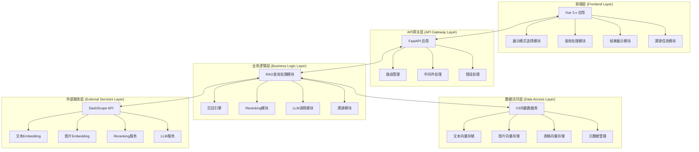

好的！我来写V3 RAG系统的系统集成和架构设计文档：

# M22-RAG系统系统集成与架构设计详细设计文档

## 一、文档基础信息

| 模块名称 | M22-RAG系统系统集成与架构设计                                | 所属项目 | V3版本RAG系统                     |
| -------- | ------------------------------------------------------------ | -------- | --------------------------------- |
| 文档版本 | V1.0                                                         | 文档状态 | ☑ 草稿 □ 评审中 □ 已确认 □ 已归档 |
| 编写人   | AI助手                                                       | 编写日期 | 2025年8月                         |
| 关联文档 | 《M20-RAG系统前端展示模式选择模块详细设计文档》《M21-RAG系统前后端交互详细设计文档》 |          |                                   |

## 二、系统概述

### 1. 系统定位

V3 RAG系统是一个**前后端分离的智能问答系统**，基于V3向量数据库构建，采用现代化的技术架构，为用户提供高效、准确、智能的文档查询和问答服务。

### 2. 系统特点

- **前后端分离**：前端使用Vue 3.x，后端使用FastAPI
- **模块化设计**：各功能模块职责明确，接口清晰
- **智能展示**：支持多种展示模式，自动选择最佳展示方式
- **高性能**：基于V3向量数据库，支持快速检索和智能排序
- **可扩展**：架构设计支持功能扩展和性能优化

### 3. 系统目标

- **用户体验**：提供流畅、直观的查询和展示体验
- **系统性能**：支持高并发查询，响应时间短
- **功能完整**：覆盖文本、图片、表格等多种内容类型的查询
- **维护友好**：代码结构清晰，便于维护和扩展

## 三、整体架构设计

### 1. 系统架构图



### 2. 架构层次说明

#### **前端层 (Frontend Layer)**
- **技术栈**：Vue 3.x + Composition API + 现代CSS
- **主要功能**：用户界面、交互逻辑、数据展示
- **特点**：组件化设计、响应式数据、现代化UI

#### **API网关层 (API Gateway Layer)**
- **技术栈**：FastAPI + 中间件 + 路由管理
- **主要功能**：请求路由、参数验证、错误处理、CORS管理
- **特点**：高性能、类型安全、自动文档生成

#### **业务逻辑层 (Business Logic Layer)**
- **核心模块**：RAG查询处理、召回引擎、重排序、LLM调用、溯源
- **主要功能**：业务逻辑处理、算法实现、服务协调
- **特点**：模块化设计、接口清晰、易于测试

#### **数据访问层 (Data Access Layer)**
- **技术栈**：FAISS + LangChain + SQLite
- **主要功能**：向量存储、相似度搜索、元数据管理
- **特点**：高性能搜索、数据持久化、元数据丰富

#### **外部服务层 (External Services Layer)**
- **服务提供商**：阿里云DashScope
- **主要服务**：文本向量化、图片向量化、重排序、大模型
- **特点**：专业服务、质量保证、持续优化

## 四、模块间接口设计

### 1. 前端模块间接口

#### **展示模式选择模块 ↔ 查询处理模块**
- **接口名称**：`displayModeChange`
- **数据流向**：展示模式选择 → 查询处理
- **传递数据**：展示模式ID、模式配置、选择原因
- **触发时机**：用户选择展示模式或系统自动选择

#### **查询处理模块 ↔ 结果展示模块**
- **接口名称**：`queryResultReady`
- **数据流向**：查询处理 → 结果展示
- **传递数据**：查询结果、展示模式、溯源信息
- **触发时机**：查询完成、结果可用

#### **结果展示模块 ↔ 溯源信息模块**
- **接口名称**：`sourceRequest`
- **数据流向**：结果展示 → 溯源信息
- **传递数据**：文档ID、内容类型、查询上下文
- **触发时机**：用户点击溯源、展开详情

### 2. 前后端接口设计

#### **查询接口**
- **接口地址**：`POST /api/v3/rag/query`
- **请求参数**：查询内容、查询类型、展示模式、查询选项
- **响应数据**：查询结果、LLM答案、溯源信息、元数据
- **错误处理**：统一错误格式、错误分类、错误上下文

#### **流式查询接口**
- **接口地址**：`GET /api/v3/rag/stream/{query_id}`
- **数据格式**：Server-Sent Events (SSE)
- **推送事件**：查询开始、召回完成、重排序完成、LLM生成、查询完成
- **连接管理**：自动重连、错误处理、连接关闭

#### **查询取消接口**
- **接口地址**：`POST /api/v3/rag/cancel/{query_id}`
- **功能说明**：取消正在进行的查询，释放资源
- **响应数据**：取消结果、资源释放状态

### 3. 后端模块间接口

#### **RAG查询处理模块 ↔ 召回引擎**
- **接口名称**：`searchDocuments`
- **调用方式**：同步调用
- **传递数据**：查询文本、查询类型、过滤条件、结果数量
- **返回数据**：候选文档列表、相似度分数、元数据

#### **RAG查询处理模块 ↔ Reranking模块**
- **接口名称**：`rerankDocuments`
- **调用方式**：异步调用
- **传递数据**：查询文本、候选文档、重排序配置
- **返回数据**：重排序后的文档、重排序分数、排名信息

#### **RAG查询处理模块 ↔ LLM调用模块**
- **接口名称**：`generateAnswer`
- **调用方式**：异步调用
- **传递数据**：查询文本、上下文文档、LLM配置
- **返回数据**：生成的答案、生成时间、token使用量

#### **RAG查询处理模块 ↔ 溯源模块**
- **接口名称**：`getSourceAttribution`
- **调用方式**：同步调用
- **传递数据**：查询结果、溯源模式、溯源配置
- **返回数据**：溯源信息列表、相关性分数、格式化文本

## 五、数据流设计

### 1. 完整查询数据流

#### **第一阶段：用户输入和前端处理**
```
用户输入查询 → 前端收集参数 → 展示模式选择 → 参数验证 → 准备发送
```

**数据内容**：
- 用户查询文本
- 选择的查询类型（文本/图片/表格/智能/混合）
- 选择的展示模式（文本优先/图片优先/表格优先/混合布局/智能检测）
- 查询选项（结果数量、功能开关等）

#### **第二阶段：前后端交互**
```
前端发送请求 → API网关接收 → 参数验证 → 路由分发 → 业务逻辑处理
```

**数据流转**：
- 前端将查询参数组织成标准格式
- 通过HTTP POST发送到后端API
- 后端接收并验证参数完整性
- 根据查询类型选择相应的处理策略

#### **第三阶段：后端业务处理**
```
召回引擎搜索 → 重排序处理 → LLM生成答案 → 溯源信息提取 → 结果整合
```

**处理流程**：
1. **召回阶段**：根据查询文本在向量数据库中搜索相关文档
2. **重排序阶段**：使用reranking模型对召回结果进行智能排序
3. **LLM生成阶段**：将排序后的文档作为上下文，生成最终答案
4. **溯源阶段**：提取支持答案的文档信息，生成溯源数据

#### **第四阶段：结果返回和前端展示**
```
后端返回结果 → 前端接收数据 → 数据验证 → 应用展示模式 → 结果展示
```

**展示逻辑**：
- 前端接收完整的查询结果
- 根据选择的展示模式组织显示内容
- 应用相应的UI组件和样式
- 显示LLM答案、相关内容和溯源信息

### 2. 流式响应数据流

#### **建立连接**
```
查询请求 → 获取查询ID → 建立SSE连接 → 开始流式推送
```

#### **实时推送**
```
召回进度 → 重排序进度 → LLM生成进度 → 最终结果 → 连接关闭
```

**推送内容**：
- **查询开始**：后端开始处理查询
- **召回完成**：文档召回阶段完成，显示召回结果数量
- **重排序完成**：reranking阶段完成，显示重排序结果数量
- **LLM生成**：大模型正在生成答案，可能包含部分答案内容
- **查询完成**：整个查询处理完成，返回最终完整结果

### 3. 错误处理数据流

#### **错误发生**
```
处理过程中发生错误 → 错误分类和记录 → 生成错误响应 → 返回错误信息
```

#### **错误处理**
```
前端接收错误 → 错误类型判断 → 用户友好提示 → 错误恢复建议
```

## 六、部署架构设计

### 1. 系统部署架构

#### **单机部署架构**
```
┌─────────────────────────────────────────────────────────────┐
│                       单机部署                              │
├─────────────────────────────────────────────────────────────┤
│  ┌─────────────────┐    ┌─────────────────┐                │
│  │   前端应用      │    │   后端应用      │                │
│  │  (Vue 3.x)     │    │  (FastAPI)      │                │
│  │                 │    │                 │                │
│  │  - 展示模式选择 │    │  - RAG查询处理  │                │
│  │  - 查询处理     │    │  - 召回引擎     │                │
│  │  - 结果展示     │    │  - 重排序模块   │                │
│  │  - 溯源信息     │    │  - LLM调用      │                │
│  └─────────────────┘    │  - 溯源模块     │                │
│                          └─────────────────┘                │
│                                                                 │
│  ┌─────────────────┐    ┌─────────────────┐                │
│  │   V3向量数据库  │    │   外部服务      │                │
│  │                 │    │                 │                │
│  │  - FAISS索引    │    │  - DashScope    │                │
│  │  - 元数据管理   │    │  - API密钥      │                │
│  │  - 数据存储     │    │  - 网络连接     │                │
│  └─────────────────┘    └─────────────────┘                │
└─────────────────────────────────────────────────────────────┘
```

#### **分布式部署架构**
```
┌─────────────────────────────────────────────────────────────┐
│                     分布式部署                              │
├─────────────────────────────────────────────────────────────┤
│  ┌─────────────────┐    ┌─────────────────┐                │
│  │   负载均衡器    │    │   负载均衡器    │                │
│  │   (Nginx)       │    │   (Nginx)       │                │
│  └─────────────────┘    └─────────────────┘                │
│           │                        │                        │
│           ▼                        ▼                        │
│  ┌─────────────────┐    ┌─────────────────┐                │
│  │   前端服务器    │    │   后端服务器    │                │
│  │   (Node.js)     │    │   (FastAPI)     │                │
│  │                 │    │                 │                │
│  │  - 静态文件服务 │    │  - 应用实例1    │                │
│  │  - 缓存管理     │    │  - 应用实例2    │                │
│  │  - 压缩优化     │    │  - 应用实例N    │                │
│  └─────────────────┘    └─────────────────┘                │
│                                                                 │
│  ┌─────────────────┐    ┌─────────────────┐                │
│  │   数据存储层    │    │   外部服务层    │                │
│  │                 │    │                 │                │
│  │  - 向量数据库   │    │  - DashScope    │                │
│  │  - 元数据库     │    │  - 监控服务     │                │
│  │  - 缓存服务     │    │  - 日志服务     │                │
│  └─────────────────┘    └─────────────────┘                │
└─────────────────────────────────────────────────────────────┘
```

### 2. 服务启动流程

#### **系统启动顺序**
```
1. 启动数据存储服务
   ├── 启动V3向量数据库
   ├── 启动元数据管理服务
   └── 验证数据完整性

2. 启动后端服务
   ├── 启动FastAPI应用
   ├── 初始化各业务模块
   ├── 连接外部服务
   └── 健康检查

3. 启动前端服务
   ├── 启动Vue应用
   ├── 连接后端API
   ├── 初始化展示模式
   └── 用户界面就绪

4. 系统就绪检查
   ├── 检查所有服务状态
   ├── 验证功能模块
   ├── 性能测试
   └── 系统就绪
```

#### **服务配置管理**
```
配置文件结构：
├── 系统配置 (system_config.json)
│   ├── 服务端口配置
│   ├── 数据库连接配置
│   └── 外部服务配置
├── 应用配置 (app_config.json)
│   ├── 功能模块开关
│   ├── 性能参数配置
│   └── 错误处理配置
└── 环境配置 (.env)
    ├── API密钥
    ├── 数据库密码
    └── 服务地址
```

### 3. 部署环境要求

#### **硬件要求**
- **CPU**：至少4核心，推荐8核心以上
- **内存**：至少8GB，推荐16GB以上
- **存储**：至少100GB可用空间，推荐SSD
- **网络**：稳定的网络连接，支持HTTPS

#### **软件要求**
- **操作系统**：Windows 10/11, Linux (Ubuntu 20.04+), macOS 10.15+
- **Python**：3.8+版本
- **Node.js**：16+版本（如果使用Node.js前端服务）
- **数据库**：支持SQLite或PostgreSQL
- **Web服务器**：支持FastAPI和Vue应用

#### **网络要求**
- **端口开放**：后端API端口（默认8000）、前端端口（默认3000）
- **HTTPS支持**：生产环境需要SSL证书
- **防火墙配置**：允许必要的网络访问
- **CORS配置**：正确配置跨域访问策略

## 七、性能优化设计

### 1. 系统性能指标

#### **响应时间指标**
- **查询响应时间**：从用户提交查询到获得结果的完整时间
- **召回响应时间**：向量搜索的响应时间
- **重排序响应时间**：reranking处理的响应时间
- **LLM生成时间**：大模型生成答案的时间

#### **吞吐量指标**
- **并发查询数**：系统能同时处理的查询数量
- **查询处理速率**：单位时间内能处理的查询数量
- **系统资源利用率**：CPU、内存、网络等资源的使用率

#### **准确性指标**
- **召回准确率**：召回结果与查询的相关性
- **重排序准确率**：重排序后结果的准确性
- **LLM答案质量**：生成答案的准确性和完整性

### 2. 性能优化策略

#### **前端性能优化**
- **组件懒加载**：按需加载组件，减少初始加载时间
- **虚拟滚动**：大量数据时使用虚拟滚动，提升渲染性能
- **缓存策略**：缓存查询结果和用户设置，减少重复请求
- **代码分割**：将代码分割成多个包，支持按需加载

#### **后端性能优化**
- **异步处理**：使用异步处理提高并发能力
- **连接池**：使用数据库连接池，提高数据库访问效率
- **缓存机制**：缓存中间结果，减少重复计算
- **批量处理**：支持批量查询，提高处理效率

#### **数据库性能优化**
- **索引优化**：优化向量索引，提高搜索速度
- **查询优化**：优化查询语句，减少数据库负载
- **分页处理**：支持分页查询，避免一次性加载大量数据
- **数据压缩**：压缩存储数据，减少存储空间和I/O时间

## 八、监控与运维

### 1. 系统监控

#### **性能监控**
- **响应时间监控**：实时监控各模块的响应时间
- **资源使用监控**：监控CPU、内存、磁盘、网络的使用情况
- **并发数量监控**：监控当前并发查询数量
- **错误率监控**：监控系统错误率和异常情况

#### **业务监控**
- **查询量监控**：监控查询请求的数量和趋势
- **用户行为监控**：监控用户的使用模式和偏好
- **功能使用监控**：监控各功能模块的使用情况
- **质量指标监控**：监控查询结果的准确性指标

### 2. 日志管理

#### **日志分类**
- **系统日志**：记录系统启动、关闭、配置变更等事件
- **访问日志**：记录用户访问和查询请求
- **错误日志**：记录系统错误和异常情况
- **性能日志**：记录性能指标和瓶颈信息

#### **日志管理策略**
- **日志轮转**：定期轮转日志文件，避免文件过大
- **日志压缩**：压缩历史日志，节省存储空间
- **日志分析**：使用日志分析工具，提取有用信息
- **日志告警**：设置日志告警，及时发现和处理问题

### 3. 运维自动化

#### **自动部署**
- **CI/CD流程**：自动化构建、测试、部署流程
- **配置管理**：自动化配置管理和环境部署
- **版本控制**：自动化版本管理和回滚机制
- **健康检查**：自动化健康检查和故障恢复

#### **故障处理**
- **故障检测**：自动检测系统故障和异常
- **故障告警**：及时告警故障信息，通知相关人员
- **故障恢复**：自动故障恢复和系统重启
- **故障分析**：记录故障信息，便于后续分析

## 九、安全设计

### 1. 访问控制

#### **用户认证**
- **身份验证**：验证用户身份和权限
- **会话管理**：管理用户会话和登录状态
- **权限控制**：控制用户对不同功能的访问权限
- **审计日志**：记录用户操作，便于审计

#### **API安全**
- **接口认证**：验证API调用的合法性
- **参数验证**：验证输入参数的安全性和有效性
- **频率限制**：限制API调用频率，防止滥用
- **IP白名单**：限制允许访问的IP地址

### 2. 数据安全

#### **数据传输安全**
- **HTTPS加密**：使用HTTPS协议加密传输数据
- **数据完整性**：验证数据在传输过程中的完整性
- **敏感信息保护**：保护用户敏感信息，避免泄露
- **加密存储**：对敏感数据进行加密存储

#### **数据访问安全**
- **数据库权限**：严格控制数据库访问权限
- **数据备份**：定期备份重要数据，防止数据丢失
- **数据恢复**：支持数据恢复，确保业务连续性
- **数据销毁**：安全销毁不再需要的数据

## 十、扩展性设计

### 1. 功能扩展

#### **模块化设计**
- **接口标准化**：定义标准的模块接口，便于扩展
- **插件机制**：支持插件式扩展，动态加载新功能
- **配置驱动**：通过配置文件控制功能开关和参数
- **版本兼容**：确保新版本与旧版本的兼容性

#### **新功能集成**
- **新查询类型**：支持新的内容类型和查询方式
- **新展示模式**：支持新的结果展示模式
- **新算法集成**：集成新的搜索和排序算法
- **新服务接入**：接入新的外部服务和数据源

### 2. 性能扩展

#### **水平扩展**
- **负载均衡**：支持多实例部署和负载均衡
- **数据库分片**：支持数据库分片，提高存储和查询性能
- **缓存集群**：支持分布式缓存，提高数据访问性能
- **CDN加速**：使用CDN加速静态资源访问

#### **垂直扩展**
- **硬件升级**：支持硬件升级，提高单机性能
- **算法优化**：持续优化算法，提高处理效率
- **代码优化**：优化代码实现，减少资源消耗
- **配置调优**：调优系统配置，发挥最佳性能

## 十一、总结

### 1. 设计亮点

**架构清晰**：
- 采用前后端分离的现代化架构
- 模块化设计，职责明确，接口清晰
- 支持单机和分布式两种部署方式

**性能优秀**：
- 基于V3向量数据库的高性能搜索
- 支持异步处理和并发查询
- 提供多种性能优化策略

**扩展性强**：
- 模块化设计支持功能扩展
- 标准化接口便于集成新服务
- 支持水平和垂直两种扩展方式

### 2. 技术优势

**现代化技术栈**：
- 前端使用Vue 3.x，提供优秀的用户体验
- 后端使用FastAPI，提供高性能的API服务
- 使用FAISS等专业向量数据库，提供高效的相似度搜索

**智能化功能**：
- 支持多种查询类型和展示模式
- 智能选择最佳展示方式
- 基于AI的内容分析和理解

**运维友好**：
- 完善的监控和日志系统
- 支持自动化部署和故障恢复
- 提供详细的性能指标和告警

### 3. 应用价值

**用户体验提升**：
- 流畅的查询和展示体验
- 智能的展示模式选择
- 丰富的溯源信息展示

**系统性能提升**：
- 快速的查询响应
- 高并发处理能力
- 稳定的系统运行

**开发效率提升**：
- 清晰的代码结构
- 完善的开发文档
- 支持快速迭代和部署

这个系统集成和架构设计文档充分体现了"架构清晰"和"扩展性强"的设计理念，通过现代化的技术架构、清晰的模块设计和完善的部署方案，为V3 RAG系统提供了坚实的基础，确保系统能够高效、稳定、安全地运行，为用户提供优质的智能问答服务。