# 26. 混合引擎再造完整方案

## 1. 项目背景与目标

### 1.1 项目背景
- 已完成三个单引擎（Text、Image、Table）的全面改造
- 需要完成混合引擎的再造，实现智能路由和跨模态融合
- 目标是提供统一的查询接口和智能的结果融合

### 1.2 核心目标
1. **智能路由**：根据查询类型自动选择最优引擎
2. **跨模态融合**：融合不同类型内容的结果
3. **统一体验**：所有查询类型使用相同的Pipeline
4. **性能优化**：并行执行，减少响应时间

## 2. 系统架构设计

### 2.1 整体架构

```mermaid
flowchart TD
    A[用户查询] --> B[HybridEngine]
    
    B --> C{查询类型判断}
    C -->|TEXT/IMAGE/TABLE| D[单引擎模式]
    C -->|HYBRID| E[混合引擎模式]
    C -->|未指定| F[智能判断模式]
    
    D --> D1[直接调用指定引擎]
    D1 --> D2[引擎完整流程]
    D2 --> D3[召回 + Reranking + 新Pipeline]
    
    E --> E1[并行执行三引擎recall]
    E1 --> E2[融合recall结果]
    E2 --> E3[混合reranking]
    E3 --> E4[新Pipeline处理]
    
    F --> F1[语义分析选择引擎]
    F1 --> F2[单引擎完整流程]
    
    D3 --> G[构建最终结果]
    E4 --> G
    F2 --> G
    
    G --> H[返回用户]
```



### 2.2 核心组件
1. **HybridEngine**：智能路由和协调器
2. **各引擎recall方法**：专门的召回接口
3. **HybridRerankingService**：混合重排序服务
4. **UnifiedPipeline**：统一的LLM+溯源处理

## 3. 技术实现方案

### 3.1 为各引擎添加recall方法

#### 3.1.1 TextEngine recall方法

```python
def recall(self, query: str, **kwargs) -> List[Any]:
    """
    只执行召回，不执行reranking和pipeline
    
    :param query: 查询文本
    :param kwargs: 其他参数
    :return: 召回结果列表
    """
    try:
        # 确保文档已加载
        self._ensure_docs_loaded()
        
        # 直接调用现有的召回逻辑
        recall_results = self._search_texts(query, **kwargs)
        
        self.logger.info(f"TextEngine recall完成，结果数量: {len(recall_results)}")
        return recall_results
        
    except Exception as e:
        self.logger.error(f"TextEngine recall执行失败: {str(e)}")
        return []
```

#### 3.1.2 ImageEngine recall方法

```python
def recall(self, query: str, **kwargs) -> List[Any]:
    """
    只执行召回，不执行reranking和pipeline
    """
    try:
        # 调用现有的召回逻辑
        recall_results = self._search_images(query, **kwargs)
        
        self.logger.info(f"ImageEngine recall完成，结果数量: {len(recall_results)}")
        return recall_results
        
    except Exception as e:
        self.logger.error(f"ImageEngine recall执行失败: {str(e)}")
        return []
```

#### 3.1.3 TableEngine recall方法

```python
def recall(self, query: str, **kwargs) -> List[Any]:
    """
    只执行召回，不执行reranking和pipeline
    """
    try:
        # 调用现有的召回逻辑
        recall_results = self._search_tables(query, **kwargs)
        
        self.logger.info(f"TableEngine recall完成，结果数量: {len(recall_results)}")
        return recall_results
        
    except Exception as e:
        self.logger.error(f"TableEngine recall执行失败: {str(e)}")
        return []
```

### 3.2 混合引擎核心流程

#### 3.2.1 并行召回执行

```python
def _execute_parallel_recall(self, query: str, **kwargs) -> Dict[str, List[Any]]:
    """并行执行三个引擎的recall"""
    
    recall_results = {'image': [], 'text': [], 'table': []}
    
    with ThreadPoolExecutor(max_workers=3) as executor:
        futures = {}
        
        # 并行提交三个引擎的recall任务
        if self.image_engine:
            futures['image'] = executor.submit(
                self.image_engine.recall, query, **kwargs
            )
        if self.text_engine:
            futures['text'] = executor.submit(
                self.text_engine.recall, query, **kwargs
            )
        if self.table_engine:
            futures['table'] = executor.submit(
                self.table_engine.recall, query, **kwargs
            )
        
        # 收集结果
        for engine_type, future in futures.items():
            try:
                result = future.result(timeout=30)
                recall_results[engine_type] = result
                self.logger.info(f"{engine_type} 引擎recall完成，结果数量: {len(result)}")
            except Exception as e:
                self.logger.error(f"{engine_type} 引擎recall失败: {str(e)}")
                recall_results[engine_type] = []
    
    return recall_results
```

#### 3.2.2 结果融合与标准化

```python
def _merge_recall_results(self, recall_results: Dict[str, List[Any]]) -> List[Any]:
    """融合三个引擎的recall结果"""
    
    combined_results = []
    
    for engine_type, results in recall_results.items():
        if results:
            for result in results:
                # 标准化结果格式
                normalized_result = self._normalize_result(result, engine_type)
                combined_results.append(normalized_result)
    
    self.logger.info(f"融合完成，总结果数量: {len(combined_results)}")
    return combined_results

def _normalize_result(self, result: Any, source_engine: str) -> Dict[str, Any]:
    """标准化单个结果格式"""
    
    if isinstance(result, dict):
        normalized = result.copy()
    else:
        normalized = {'raw_content': str(result)}
    
    # 添加必要字段
    normalized['source_engine'] = source_engine
    normalized['normalized_at'] = time.time()
    
    # 确保关键字段存在
    if 'content' not in normalized and 'page_content' not in normalized:
        normalized['content'] = str(normalized.get('raw_content', ''))
    
    if 'metadata' not in normalized:
        normalized['metadata'] = {}
    
    return normalized
```

### 3.3 混合Reranking策略

#### 3.3.1 内容类型检测与分组

```python
def _group_candidates_by_type(self, candidates: List[Dict[str, Any]]) -> Dict[str, List[Dict[str, Any]]]:
    """按内容类型分组候选结果"""
    
    grouped = {'image': [], 'text': [], 'table': [], 'unknown': []}
    
    for candidate in candidates:
        content_type = self._detect_content_type(candidate)
        grouped[content_type].append(candidate)
    
    logger.info(f"候选结果分组完成: 图片={len(grouped['image'])}, 文本={len(grouped['text'])}, 表格={len(grouped['table'])}")
    return grouped

def _detect_content_type(self, candidate: Dict[str, Any]) -> str:
    """检测候选结果的内容类型"""
    
    # 方法1：检查chunk_type字段
    chunk_type = candidate.get('chunk_type', '').lower()
    if chunk_type:
        if 'image' in chunk_type or 'image_text' in chunk_type:
            return 'image'
        elif 'table' in chunk_type:
            return 'table'
        elif 'text' in chunk_type:
            return 'text'
    
    # 方法2：检查字段特征
    if 'image_path' in candidate or 'enhanced_description' in candidate:
        return 'image'
    elif 'table_type' in candidate or 'table_data' in candidate:
        return 'table'
    
    # 方法3：检查内容特征
    content = candidate.get('content', '')
    if content:
        if any(keyword in content.lower() for keyword in ['<table', '|', 'row', 'column']):
            return 'table'
        elif any(keyword in content.lower() for keyword in ['image', 'photo', 'picture']):
            return 'image'
    
    return 'text'  # 默认为文本类型
```

#### 3.3.2 分类型Reranking执行

```python
def _rerank_by_type(self, query: str, content_type: str, candidates: List[Dict[str, Any]], **kwargs) -> List[Dict[str, Any]]:
    """对特定类型的结果进行reranking"""
    
    try:
        if content_type == 'image' and self.image_reranking_service:
            return self.image_reranking_service.rerank_candidates(query, candidates, **kwargs)
        elif content_type == 'table' and self.table_reranking_service:
            return self.table_reranking_service.rerank_candidates(query, candidates, **kwargs)
        elif content_type == 'text' and self.text_reranking_service:
            return self.text_reranking_service.rerank_candidates(query, candidates, **kwargs)
        else:
            logger.warning(f"内容类型 {content_type} 没有对应的reranking service，返回原始结果")
            return candidates
            
    except Exception as e:
        logger.error(f"内容类型 {content_type} 的reranking执行失败: {str(e)}")
        return candidates
```

#### 3.3.3 混合排序策略

```python
def _apply_hybrid_ranking_strategy(self, query: str, results: List[Dict[str, Any]]) -> List[Dict[str, Any]]:
    """应用混合排序策略"""
    
    try:
        if not results:
            return results
        
        # 1. 计算混合相关性分数
        for result in results:
            result['hybrid_score'] = self._calculate_hybrid_score(query, result)
        
        # 2. 按混合分数排序
        results.sort(key=lambda x: x.get('hybrid_score', 0), reverse=True)
        
        # 3. 应用多样性策略
        diverse_results = self._apply_diversity_strategy(results)
        
        logger.info(f"混合排序策略应用完成，最终结果数量: {len(diverse_results)}")
        return diverse_results
        
    except Exception as e:
        logger.error(f"混合排序策略应用失败: {str(e)}")
        return results

def _calculate_hybrid_score(self, query: str, result: Dict[str, Any]) -> float:
    """计算混合相关性分数"""
    
    try:
        # 基础分数
        base_score = result.get('relevance_score', 0.5)
        
        # 查询类型匹配分数
        query_type_score = self._calculate_query_type_match(query, result)
        
        # 内容质量分数
        quality_score = self._calculate_content_quality(result)
        
        # 类型权重（可配置）
        type_weights = {
            'text': 1.0,
            'table': 0.9, 
            'image': 0.8
        }
        content_type = result.get('content_type', 'text')
        type_weight = type_weights.get(content_type, 1.0)
        
        # 计算最终分数
        final_score = (base_score * 0.4 + 
                       query_type_score * 0.3 + 
                       quality_score * 0.3) * type_weight
        
        return round(final_score, 4)
        
    except Exception as e:
        logger.error(f"混合分数计算失败: {str(e)}")
        return 0.5
```

### 3.4 新Pipeline集成

#### 3.4.1 Pipeline输入准备

```python
def _prepare_pipeline_input(self, reranked_results: List[Any]) -> List[Dict[str, Any]]:
    """准备Pipeline输入格式"""
    
    pipeline_input = []
    
    for result in reranked_results:
        if isinstance(result, dict):
            # 提取内容
            content = (result.get('content') or 
                      result.get('page_content') or 
                      result.get('raw_content') or 
                      str(result))
            
            # 提取元数据
            metadata = result.get('metadata', {})
            if not metadata:
                # 从结果中提取有用的元数据
                metadata = {
                    'source_engine': result.get('source_engine', 'unknown'),
                    'content_type': result.get('content_type', 'text'),
                    'relevance_score': result.get('relevance_score', 0.0),
                    'hybrid_score': result.get('hybrid_score', 0.0)
                }
            
            # 验证内容不为空
            if content and content.strip():
                pipeline_input.append({
                    'content': content.strip(),
                    'metadata': metadata
                })
    
    self.logger.info(f"Pipeline输入准备完成，有效输入数量: {len(pipeline_input)}")
    return pipeline_input
```

#### 3.4.2 Pipeline执行

```python
def _execute_new_pipeline(self, query: str, reranked_results: List[Any], **kwargs) -> Dict[str, Any]:
    """执行新Pipeline（LLM + 溯源）"""
    
    try:
        # 检查必要组件
        if not self.llm_engine or not self.source_filter_engine:
            self.logger.warning("LLM引擎或源过滤引擎不可用，跳过Pipeline执行")
            return self._create_fallback_result(reranked_results)
        
        # 准备Pipeline输入
        pipeline_input = self._prepare_pipeline_input(reranked_results)
        
        # 创建Pipeline实例
        pipeline_config = {
            'enable_llm_generation': True,
            'enable_source_filtering': True,
            'max_context_results': 10,
            'max_content_length': 1000
        }
        
        pipeline = UnifiedPipeline(pipeline_config, self.llm_engine, self.source_filter_engine)
        
        # 执行Pipeline
        pipeline_result = pipeline.process(query, pipeline_input, **kwargs)
        
        self.logger.info(f"新Pipeline执行完成，输出结果: {len(pipeline_result.get('filtered_results', []))}")
        return pipeline_result
        
    except Exception as e:
        self.logger.error(f"新Pipeline执行失败: {str(e)}")
        return self._create_fallback_result(reranked_results)
```

## 4. 前端展示优化

### 4.1 混合结果展示结构

```javascript
// 检测并展示混合结果
function displayHybridResults(data) {
    let displayContent = '';
    
    // 1. 显示LLM生成的答案
    if (data.llm_answer) {
        displayContent += `<div class="llm-answer">${data.llm_answer}</div>`;
    }
    
    // 2. 根据内容类型智能展示
    if (data.image_results && data.image_results.length > 0) {
        displayContent += generateImageGallery(data.image_results);
    }
    
    if (data.table_results && data.table_results.length > 0) {
        displayContent += generateTableDisplay(data.table_results);
    }
    
    if (data.text_results && data.text_results.length > 0) {
        displayContent += generateTextSummary(data.text_results);
    }
    
    return displayContent;
}
```

### 4.2 表格展示实现

```javascript
function generateTableDisplay(tableResults) {
    let tableHTML = `
        <hr class="section-divider">
        <h2 class="section-title">📊 相关表格</h2>
        <div class="tables-section">
    `;
    
    tableResults.forEach((tableResult, index) => {
        tableHTML += `
            <div class="table-card">
                <div class="table-header">
                    <h4>表格 ${index + 1}: ${tableResult.table_type || '数据表格'}</h4>
                    <div class="table-meta">
                        <span class="doc-name">📄 ${tableResult.document_name || '未知文档'}</span>
                        <span class="page-number">📖 第${tableResult.page_number || 'N/A'}页</span>
                        <span class="relevance-score">⭐ ${(tableResult.score || 0).toFixed(2)}</span>
                    </div>
                </div>
                <div class="table-content">
                    <div class="table-preview">
                        ${formatTableContent(tableResult.table_content)}
                    </div>
                    <div class="table-actions">
                        <button class="view-table-btn" onclick="viewFullTable('${tableResult.id}')">
                            查看完整表格
                        </button>
                    </div>
                </div>
            </div>
        `;
    });
    
    tableHTML += `</div>`;
    return tableHTML;
}
```

## 5. 实施计划

### 5.1 阶段1：基础改造（本周完成）
- [ ] 为TextEngine添加recall方法
- [ ] 为ImageEngine添加recall方法
- [ ] 为TableEngine添加recall方法
- [ ] 测试各引擎recall功能

### 5.2 阶段2：混合引擎核心（下周完成）
- [ ] 实现并行recall执行
- [ ] 完善结果融合逻辑
- [ ] 优化混合reranking策略
- [ ] 集成新Pipeline

### 5.3 阶段3：前端优化（下下周完成）
- [ ] 实现表格展示功能
- [ ] 优化混合结果展示
- [ ] 完善响应式设计
- [ ] 全面测试和调优

## 6. 预期效果

### 6.1 性能提升
- 混合查询响应时间减少30-50%
- 并行执行提升整体效率
- 智能路由减少不必要的计算

### 6.2 功能完善
- 混合查询功能完整性达到100%
- 跨模态结果融合更加智能
- 用户体验显著提升

### 6.3 系统稳定性
- 统一的Pipeline确保结果一致性
- 完善的错误处理机制
- 向后兼容现有功能

## 7. 风险评估与应对

### 7.1 主要风险
1. **兼容性问题**：新recall方法可能影响现有功能
2. **性能问题**：并行执行可能增加资源消耗
3. **数据一致性问题**：混合结果格式可能不统一

### 7.2 应对策略
1. **渐进式改造**：逐步添加新功能，保持向后兼容
2. **充分测试**：每个阶段都要进行充分测试
3. **监控机制**：建立性能监控和错误追踪

## 8. 技术架构优势

### 8.1 模块化设计
- 各引擎职责清晰，易于维护
- 混合逻辑与单引擎逻辑分离
- 支持灵活的功能扩展

### 8.2 性能优化
- 并行执行提升响应速度
- 智能路由减少无效计算
- 缓存机制优化重复查询

### 8.3 可扩展性
- 支持新引擎类型的添加
- 支持新的reranking策略
- 支持新的Pipeline组件

## 9. 总结

混合引擎再造是RAG系统V2.0的重要里程碑，通过实现智能路由、跨模态融合和统一Pipeline，可以显著提升系统的整体性能和用户体验。这个方案既保持了现有功能的稳定性，又为未来的功能扩展奠定了坚实的基础。

---

**文档版本**: 1.0  
**创建日期**: 2025年1月27日  
**最后更新**: 2025年1月27日  
**负责人**: AI助手  
**状态**: 待实施  
**优先级**: 高
