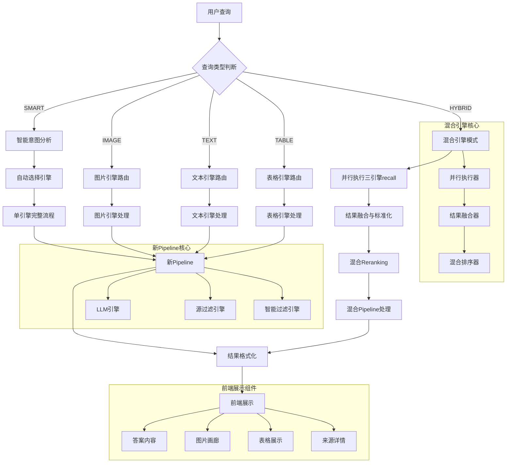

基于对代码的详细分析，我来描述五种查询类型所经历的流程，并画出主要流程节点图。

## �� 五种查询类型流程分析

### 1. 🤖 智能查询 (Smart Query)
**流程路径**: 前端 → 智能意图分析 → 自动选择最优引擎 → 单引擎完整流程

**详细流程**:
1. 前端发送查询请求，`query_type: 'smart'`
2. 后端使用 `QueryIntentAnalyzer` 分析查询意图
3. 根据意图自动选择查询类型（image/text/table）
4. 调用对应的单引擎执行完整流程
5. 返回结果到前端展示

### 2. 📊 图片查询 (Image Query)
**流程路径**: 前端 → 混合引擎 → 图片引擎 → 新Pipeline → 结果处理

**详细流程**:
1. 前端发送查询请求，`query_type: 'image'`
2. 混合引擎接收请求，路由到图片引擎
3. 图片引擎执行向量搜索和召回
4. 调用新Pipeline（LLM生成 + 溯源）
5. 结果格式化，提取图片信息
6. 返回包含图片结果的响应

### 3. �� 文本查询 (Text Query)
**流程路径**: 前端 → 混合引擎 → 文本引擎 → 新Pipeline → 结果处理

**详细流程**:
1. 前端发送查询请求，`query_type: 'text'`
2. 混合引擎接收请求，路由到文本引擎
3. 文本引擎执行向量搜索和召回
4. 调用新Pipeline（LLM生成 + 溯源）
5. 结果格式化，提取文本内容
6. 返回包含文本结果的响应

### 4. 📋 表格查询 (Table Query)
**流程路径**: 前端 → 混合引擎 → 表格引擎 → 新Pipeline → 结果处理

**详细流程**:
1. 前端发送查询请求，`query_type: 'table'`
2. 混合引擎接收请求，路由到表格引擎
3. 表格引擎执行向量搜索和召回
4. 调用新Pipeline（LLM生成 + 溯源）
5. 结果格式化，提取表格HTML内容
6. 返回包含表格结果的响应

### 5. �� 混合查询 (Hybrid Query)
**流程路径**: 前端 → 混合引擎 → 并行执行三引擎 → 结果融合 → 混合Reranking → 新Pipeline

**详细流程**:
1. 前端发送查询请求，`query_type: 'hybrid'`
2. 混合引擎接收请求，启动混合模式
3. **并行执行阶段**:
   - 图片引擎recall
   - 文本引擎recall
   - 表格引擎recall
4. **结果融合阶段**:
   - 合并三个引擎的recall结果
   - 标准化结果格式
5. **混合Reranking阶段**:
   - 按内容类型分组
   - 分类型执行reranking
   - 应用混合排序策略
6. **Pipeline处理阶段**:
   - 准备Pipeline输入
   - 执行LLM生成和溯源
7. **结果构建阶段**:
   - 分离不同类型的结果
   - 构建最终响应
8. 返回包含混合结果的响应

## 🔄 主要流程节点图

## 🔍 关键流程特点

### 1. **智能路由机制**
- 根据查询类型自动选择最优引擎
- 支持智能意图分析，自动判断查询类型
- 向后兼容现有API接口

### 2. **并行执行优化**
- 混合查询使用ThreadPoolExecutor并行执行
- 三个引擎同时执行recall，提升响应速度
- 支持超时控制和错误处理

### 3. **统一Pipeline架构**
- 所有查询类型都使用相同的新Pipeline
- 支持LLM生成、智能过滤、源过滤等功能
- 确保结果一致性和质量

### 4. **结果融合策略**
- 智能检测内容类型（图片/文本/表格）
- 分类型执行reranking，优化排序质量
- 支持跨模态结果关联和展示

### 5. **前端展示优化**
- 响应式设计，支持不同设备
- 智能识别结果类型，自动生成对应展示组件
- 支持图片画廊、表格展示、来源详情等

这个架构设计实现了查询类型的智能分离和统一处理，既保持了单引擎的高效性，又支持混合查询的跨模态融合能力。