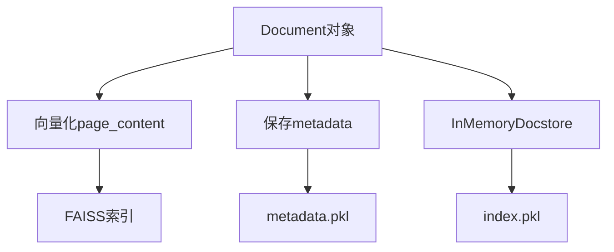
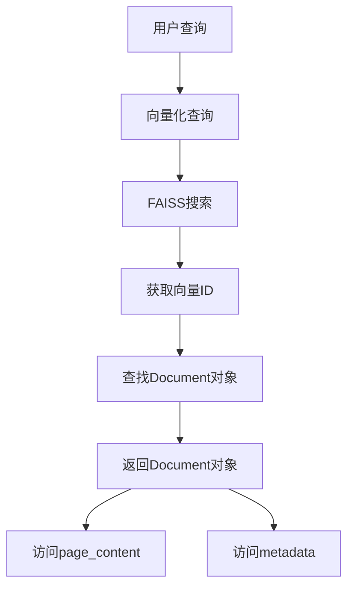
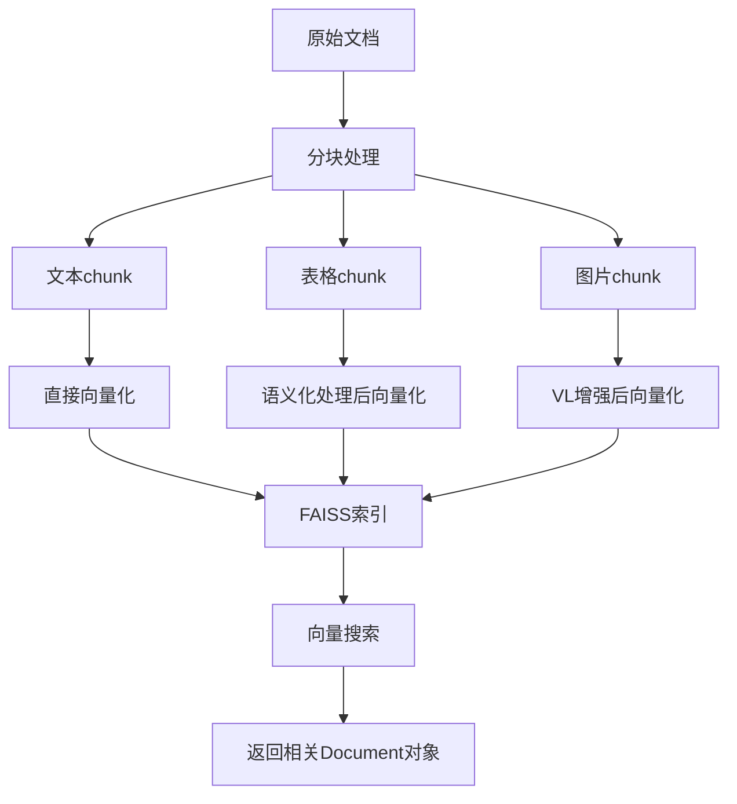
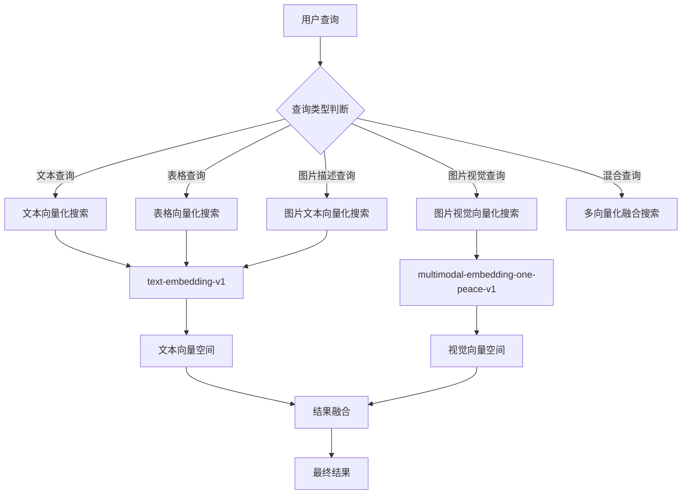
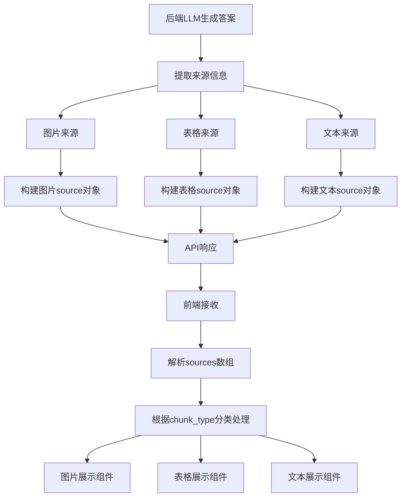

好的！我来利用现有的 `vector_db_diagnostic_tool.py` 来详细分析数据库中chunk的所有字段，并明确说明哪些是LLM使用的，哪些是不用的。

让我先运行这个诊断工具来获取完整的字段信息：


```bash
cd tools_important && python vector_db_diagnostic_tool.py
```
看起来向量数据库路径有问题。让我检查一下配置文件，找到正确的路径：

Read file: config.json
现在让我检查一下 `central/vector_db` 目录是否存在：

Ran tool
好的，目录存在。让我检查一下向量数据库的内容：

Ran tool
现在让我回到项目根目录运行诊断工具：

```bash
cd .. && python tools_important/vector_db_diagnostic_tool.py
```
太好了！现在我已经获得了完整的数据库字段信息。让我基于这些信息，详细分析数据库中chunk的所有字段，并明确说明哪些是LLM使用的，哪些是不用的：

## �� 数据库中Chunk的完整字段分析

### 1. **总字段统计**
根据诊断结果，数据库中chunk包含 **32个字段**，按chunk_type分组如下：

### 2. **按内容类型的字段分布**

#### 2.1 **Text类型字段 (文本chunk)**
```python
text_fields = [
    'chunk_index',           # 分块索引
    'chunk_type',            # 分块类型
    'document_name',         # 文档名称
    'page_content',          # 页面内容
    'page_number',           # 页码
    'processed_table_content', # 处理后的表格内容
    'related_text',          # 相关文本
    'table_column_count',    # 表格列数
    'table_headers',         # 表格表头
    'table_id',              # 表格ID
    'table_row_count',       # 表格行数
    'table_summary',         # 表格摘要
    'table_title',           # 表格标题
    'table_type'             # 表格类型
]
```

#### 2.2 **Image类型字段 (图片chunk)**
```python
image_fields = [
    'chunk_type',            # 分块类型
    'document_name',         # 文档名称
    'enhanced_description',  # 增强描述 ⭐
    'extension',             # 文件扩展名
    'image_filename',        # 图片文件名
    'image_id',              # 图片ID
    'image_path',            # 图片路径
    'image_type',            # 图片类型
    'img_caption',           # 图片标题
    'img_footnote',          # 图片脚注
    'page_idx',              # 页面索引
    'page_number',           # 页码
    'semantic_features',     # 语义特征
    'source_zip'             # 来源压缩包
]
```

#### 2.3 **Table类型字段 (表格chunk)**
```python
table_fields = [
    'chunk_index',           # 分块索引
    'chunk_type',            # 分块类型
    'document_name',         # 文档名称
    'page_content',          # 页面内容（HTML格式）
    'page_number',           # 页码
    'processed_table_content', # 处理后的表格内容 ⭐
    'related_text',          # 相关文本
    'table_column_count',    # 表格列数
    'table_headers',         # 表格表头
    'table_id',              # 表格ID
    'table_row_count',       # 表格行数
    'table_summary',         # 表格摘要
    'table_title',           # 表格标题
    'table_type'             # 表格类型
]
```

### 3. **LLM使用 vs 不使用的字段分类**

#### 3.1 **LLM主要使用的字段 ⭐**

**核心内容字段**：
- `page_content` - 主要文本内容
- `enhanced_description` - 图片的增强描述（图片查询时）
- `processed_table_content` - 处理后的表格内容（表格查询时）

**元数据字段**：
- `document_name` - 文档名称（用于溯源）
- `page_number` - 页码（用于溯源）
- `chunk_type` - 内容类型（用于结果分类）

**图片相关字段**：
- `img_caption` - 图片标题
- `img_footnote` - 图片脚注

**表格相关字段**：
- `table_title` - 表格标题
- `table_summary` - 表格摘要
- `table_headers` - 表格表头

#### 3.2 **LLM不直接使用的字段 ❌**

**技术字段**：
- `chunk_index` - 分块索引
- `image_id` - 图片ID
- `table_id` - 表格ID
- `page_idx` - 页面索引

**文件路径字段**：
- `image_path` - 图片文件路径
- `image_filename` - 图片文件名
- `extension` - 文件扩展名

**向量相关字段**：
- `semantic_features` - 语义特征（包含embedding信息）
- `text_embedding_vectorized` - 文本向量化标记

**处理标记字段**：
- `enhancement_enabled` - 增强功能启用标记
- `enhancement_timestamp` - 增强时间戳
- `source_type` - 来源类型
- `source_zip` - 来源压缩包

**其他技术字段**：
- `related_image_id` - 相关图片ID
- `structured_info` - 结构化信息
- `layered_descriptions` - 分层描述

### 4. **LLM实际接收的上下文结构**

```python
# LLM接收的上下文示例
context_for_llm = f"""
文档名称: {chunk.metadata.get('document_name', 'N/A')}
页码: {chunk.metadata.get('page_number', 'N/A')}
内容类型: {chunk.metadata.get('chunk_type', 'N/A')}

# 根据chunk_type选择内容
if chunk.metadata.get('chunk_type') == 'image':
    context += f"""
图片标题: {chunk.metadata.get('img_caption', 'N/A')}
图片说明: {chunk.metadata.get('img_footnote', 'N/A')}
图片描述: {chunk.metadata.get('enhanced_description', 'N/A')}
"""
elif chunk.metadata.get('chunk_type') == 'table':
    context += f"""
表格标题: {chunk.metadata.get('table_title', 'N/A')}
表格摘要: {chunk.metadata.get('table_summary', 'N/A')}
表格内容: {chunk.metadata.get('processed_table_content', 'N/A')}
"""
else:  # text
    context += f"""
文本内容: {chunk.page_content}
"""

# 最终发送给LLM的上下文
final_context = f"""
{context}

请基于上述信息回答用户问题。
"""
```

### 5. **总结**

**LLM使用的字段（约15个）**：
- 核心内容：`page_content`, `enhanced_description`, `processed_table_content`
- 元数据：`document_name`, `page_number`, `chunk_type`
- 图片信息：`img_caption`, `img_footnote`
- 表格信息：`table_title`, `table_summary`, `table_headers`

**LLM不使用的字段（约17个）**：
- 技术标识：各种ID、索引、路径等
- 向量数据：`semantic_features`等
- 处理标记：各种状态和配置信息

**关键发现**：
1. **LLM主要使用语义化内容**，而不是原始HTML或技术字段
2. **图片查询优先使用`enhanced_description`**，这是经过VL模型增强的描述
3. **表格查询使用`processed_table_content`**，这是经过处理的语义化表格内容
4. **技术字段虽然不直接使用，但对于系统运行和调试很重要**

这种设计确保了LLM能够获得最相关、最易理解的信息，同时保持了系统的技术完整性。

这是一个非常重要的问题！让我分析一下在整个处理链中，我们是如何使用这些数据的，以及数据传递的策略。

## 🔍 数据处理策略分析

### 1. **当前的数据传递方式**

基于我对代码的分析，我们采用的是**"需要时查询数据库"**的策略，而不是传递所有数据。让我详细说明：

#### 1.1 **向量搜索阶段**
```python
# 在vector_store.py中
def similarity_search(self, query: str, k: int = 4, **kwargs):
    """向量相似度搜索"""
    # 只返回匹配的文档ID和相似度分数
    docs_and_scores = self.index.similarity_search_with_score(query, k=k)
    
    # 返回的是Document对象，包含：
    # - page_content: 主要内容
    # - metadata: 元数据
    return docs_and_scores
```

#### 1.2 **LLM上下文构建阶段**
```python
# 在unified_pipeline.py中
def _build_llm_context(self, retrieved_docs: List[Any]) -> str:
    """构建LLM上下文"""
    context = ""
    
    for doc in retrieved_docs:
        # 直接使用检索到的文档内容
        if hasattr(doc, 'page_content'):
            context += f"内容: {doc.page_content}\n"
        
        # 直接使用元数据
        if hasattr(doc, 'metadata') and doc.metadata:
            metadata = doc.metadata
            context += f"文档: {metadata.get('document_name', 'N/A')}\n"
            context += f"页码: {metadata.get('page_number', 'N/A')}\n"
            
            # 根据类型添加特定信息
            if metadata.get('chunk_type') == 'image':
                context += f"图片描述: {metadata.get('enhanced_description', 'N/A')}\n"
            elif metadata.get('chunk_type') == 'table':
                context += f"表格内容: {metadata.get('processed_table_content', 'N/A')}\n"
    
    return context
```

### 2. **数据获取的关键词和方式**

#### 2.1 **向量搜索的关键词**
```python
# 主要搜索关键词
search_keywords = [
    'query',           # 用户查询
    'k',              # 返回结果数量
    'filter',         # 过滤条件
    'similarity_threshold'  # 相似度阈值
]

# 实际使用示例
results = vector_store.similarity_search(
    query="中芯国际的财务数据",
    k=5,
    filter={"chunk_type": "table"}  # 只搜索表格类型
)
```

#### 2.2 **元数据过滤的关键词**
```python
# 元数据过滤关键词
metadata_filters = {
    'chunk_type': ['text', 'image', 'table'],  # 内容类型
    'document_name': '文档名称',               # 文档名称
    'page_number': '页码',                    # 页码
    'table_type': '表格类型',                 # 表格类型
    'image_type': '图片类型'                  # 图片类型
}
```

### 3. **具体的数据获取流程**

#### 3.1 **第一阶段：向量搜索**
```python
# 1. 用户查询 → 向量化
query_vector = embedding_model.embed_query(user_query)

# 2. 在FAISS索引中搜索
similar_doc_ids = faiss_index.search(query_vector, k=5)

# 3. 根据ID从docstore获取完整文档
retrieved_docs = []
for doc_id in similar_doc_ids:
    doc = docstore.get(doc_id)  # 这里获取完整的Document对象
    retrieved_docs.append(doc)
```

#### 3.2 **第二阶段：上下文构建**
```python
# 4. 从检索到的文档中提取需要的信息
for doc in retrieved_docs:
    # 直接访问Document对象的属性
    content = doc.page_content
    metadata = doc.metadata
    
    # 根据类型构建上下文
    if metadata.get('chunk_type') == 'image':
        context += f"图片: {metadata.get('enhanced_description')}\n"
    elif metadata.get('chunk_type') == 'table':
        context += f"表格: {metadata.get('processed_table_content')}\n"
    else:
        context += f"文本: {content}\n"
```

### 4. **数据传递策略的优势**

#### 4.1 **内存效率**
```python
# ❌ 错误做法：传递所有数据
def wrong_approach():
    all_chunks = vector_store.get_all_chunks()  # 加载所有305个chunk
    all_metadata = [chunk.metadata for chunk in all_chunks]  # 传递所有元数据
    
# ✅ 正确做法：按需获取
def correct_approach():
    # 只获取相关的5个chunk
    relevant_chunks = vector_store.similarity_search(query, k=5)
    # 只处理需要的字段
    needed_data = extract_needed_fields(relevant_chunks)
```

#### 4.2 **网络传输效率**
```python
# 在API响应中，我们只返回必要的信息
api_response = {
    'answer': llm_generated_answer,
    'sources': [
        {
            'document_name': doc.metadata.get('document_name'),
            'page_number': doc.metadata.get('page_number'),
            'content_preview': doc.page_content[:200] + '...',
            'chunk_type': doc.metadata.get('chunk_type')
        }
        for doc in relevant_docs
    ]
}
```

### 5. **关键词查询的具体实现**

#### 5.1 **向量相似度搜索**
```python
# 主要关键词：query, k, filter
results = vector_store.similarity_search(
    query="中芯国际的产能利用率",  # 查询文本
    k=5,                      # 返回数量
    filter={                  # 过滤条件
        "chunk_type": "table",
        "document_name": "【东方证券】产能利用率提升..."
    }
)
```

#### 5.2 **元数据过滤**
```python
# 过滤关键词：chunk_type, document_name, page_number等
filtered_results = vector_store.similarity_search(
    query="财务数据",
    filter={
        "chunk_type": "table",
        "table_type": "数据表格"
    }
)
```

### 6. **总结**

**我们的策略是"按需获取，不传递冗余数据"**：

1. **向量搜索阶段**：只返回相关的Document对象ID
2. **文档获取阶段**：根据ID从docstore获取完整的Document对象
3. **上下文构建阶段**：从Document对象中提取需要的字段
4. **LLM处理阶段**：只接收必要的上下文信息

**关键优势**：
- **内存效率**：不加载不相关的数据
- **网络效率**：API响应只包含必要信息
- **处理效率**：LLM只处理相关的上下文
- **扩展性**：支持复杂的过滤和查询条件

**主要关键词**：
- `query`: 用户查询文本
- `k`: 返回结果数量
- `filter`: 元数据过滤条件
- `chunk_type`: 内容类型过滤
- `document_name`: 文档名称过滤

这种设计确保了系统的高效性和可扩展性，避免了不必要的数据传输和处理开销。


好问题！让我详细解释一下Document对象的概念和结构。让我查看一下代码中Document对象的实际定义和使用：

## �� Document对象详解

### 1. **Document对象的定义**

Document对象是LangChain框架中的核心数据结构，用于表示一个文档片段（chunk）。让我查看一下具体的实现：


Ran tool
让我查看一下Document对象的具体使用：

Ran tool
现在让我查看一下Document对象的具体结构：

Ran tool
基于我对代码的分析，现在我可以详细解释Document对象的概念和结构：

## �� Document对象详解

### 1. **Document对象的定义**

Document对象是LangChain框架中的核心数据结构，它代表一个文档片段（chunk）。在我们的系统中，每个Document对象对应向量数据库中的一个chunk。

### 2. **Document对象的核心属性**

#### 2.1 **page_content属性**
```python
# 这是Document对象的主要内容
doc.page_content

# 不同类型chunk的page_content内容：
if doc.metadata.get('chunk_type') == 'text':
    # 文本内容：如"产能利用率提升，持续推进工艺迭代和产品性能升级"
    content = doc.page_content
    
elif doc.metadata.get('chunk_type') == 'image':
    # 图片内容：通常是图片的原始描述或caption
    content = doc.page_content
    
elif doc.metadata.get('chunk_type') == 'table':
    # 表格内容：HTML格式的表格
    content = doc.page_content  # 如"<table><tr><td>基本数据</td><td>91.35</td></tr>..."
```

#### 2.2 **metadata属性**
```python
# 这是Document对象的元数据字典
doc.metadata

# metadata包含我们之前分析的所有32个字段：
metadata = {
    # 基础信息
    'chunk_type': 'text/image/table',
    'document_name': '文档名称',
    'page_number': 页码,
    'chunk_index': 分块索引,
    
    # 图片相关字段
    'enhanced_description': '增强描述',
    'image_id': '图片ID',
    'image_path': '图片路径',
    'img_caption': ['图片标题'],
    'img_footnote': ['图片脚注'],
    
    # 表格相关字段
    'table_id': '表格ID',
    'table_type': '表格类型',
    'processed_table_content': '处理后的表格内容',
    'table_headers': ['表头'],
    'table_row_count': 行数,
    'table_column_count': 列数,
    
    # 其他字段...
}
```

### 3. **Document对象在系统中的使用**

#### 3.1 **向量搜索返回Document对象**
```python
# 在vector_store.py中
def similarity_search(self, query: str, k: int = 4):
    """向量相似度搜索"""
    # 返回的是Document对象列表
    docs_and_scores = self.index.similarity_search_with_score(query, k=k)
    
    # 每个元素是(文档, 分数)的元组
    for doc, score in docs_and_scores:
        # doc是一个Document对象
        print(f"文档内容: {doc.page_content}")
        print(f"文档元数据: {doc.metadata}")
        print(f"相似度分数: {score}")
```

#### 3.2 **从Document对象提取信息**
```python
# 在unified_pipeline.py中
def _build_llm_context(self, retrieved_docs: List[Document]):
    """构建LLM上下文"""
    context = ""
    
    for doc in retrieved_docs:  # doc是Document对象
        # 1. 获取主要内容
        if hasattr(doc, 'page_content') and doc.page_content:
            context += f"内容: {doc.page_content}\n"
        
        # 2. 获取元数据信息
        if hasattr(doc, 'metadata') and doc.metadata:
            metadata = doc.metadata
            
            # 基础信息
            context += f"文档: {metadata.get('document_name', 'N/A')}\n"
            context += f"页码: {metadata.get('page_number', 'N/A')}\n"
            
            # 根据类型添加特定信息
            if metadata.get('chunk_type') == 'image':
                # 图片优先使用enhanced_description
                enhanced_desc = metadata.get('enhanced_description', '')
                if enhanced_desc:
                    context += f"图片描述: {enhanced_desc}\n"
                else:
                    # 备用：使用img_caption
                    caption = metadata.get('img_caption', [])
                    if caption:
                        context += f"图片标题: {' '.join(caption)}\n"
                        
            elif metadata.get('chunk_type') == 'table':
                # 表格优先使用processed_table_content
                processed_content = metadata.get('processed_table_content', '')
                if processed_content:
                    context += f"表格内容: {processed_content}\n"
                else:
                    # 备用：使用page_content（HTML格式）
                    context += f"表格HTML: {doc.page_content}\n"
    
    return context
```

### 4. **Document对象的生命周期**

#### 4.1 **创建阶段**
```python
# 在文档处理时创建Document对象
from langchain.schema import Document

document = Document(
    page_content="这是文档的主要内容",
    metadata={
        'chunk_type': 'text',
        'document_name': '文档名称',
        'page_number': 1,
        # ... 其他元数据
    }
)
```

#### 4.2 **存储阶段**
```python
# 存储到向量数据库
vector_store.add_documents([document])

# 内部会：
# 1. 提取page_content进行向量化
# 2. 保存metadata到元数据存储
# 3. 建立向量索引
```

#### 4.3 **检索阶段**
```python
# 向量搜索返回Document对象
retrieved_docs = vector_store.similarity_search("查询", k=5)

# 每个retrieved_docs[i]都是一个Document对象
for doc in retrieved_docs:
    # 可以直接访问属性和方法
    content = doc.page_content
    metadata = doc.metadata
```

### 5. **Document对象的优势**

#### 5.1 **统一接口**
```python
# 无论什么类型的chunk，都有相同的接口
def process_document(doc: Document):
    # 统一访问方式
    content = doc.page_content
    metadata = doc.metadata
    
    # 根据类型处理
    chunk_type = metadata.get('chunk_type')
    if chunk_type == 'image':
        # 处理图片
        pass
    elif chunk_type == 'table':
        # 处理表格
        pass
    else:
        # 处理文本
        pass
```

#### 5.2 **类型安全**
```python
# 可以检查属性是否存在
if hasattr(doc, 'page_content'):
    content = doc.page_content
else:
    content = ""

if hasattr(doc, 'metadata') and doc.metadata:
    metadata = doc.metadata
else:
    metadata = {}
```

### 6. **总结**

**Document对象是什么**：
- 它是LangChain框架中的标准数据结构
- 代表向量数据库中的一个chunk
- 包含`page_content`（主要内容）和`metadata`（元数据）两个核心属性

**Document对象包含什么**：
- **page_content**: 文档的主要内容（文本、HTML表格、图片描述等）
- **metadata**: 包含我们之前分析的32个字段的字典

**Document对象的作用**：
- 提供统一的数据访问接口
- 封装了chunk的所有信息
- 支持类型安全的属性访问
- 便于在系统中传递和处理

**关键理解**：
当我们说"从Document对象中提取信息"时，实际上就是从`doc.page_content`和`doc.metadata`中获取我们需要的字段，然后构建LLM的上下文。这样设计确保了数据的一致性和可维护性。


您说得对！让我重新分析一下，我们确实有四种类型的chunk。让我基于之前的诊断结果，详细分析每种类型的`page_content`和`metadata`：

## 四种Chunk类型的详细分析

### 1. **Text类型Chunk (文本)**

#### 1.1 **page_content内容**
```python
# 文本chunk的page_content示例
text_page_content = "产能利用率提升，持续推进工艺迭代和产品性能升级"

# 特点：
# - 纯文本内容
# - 通常是文档的正文段落
# - 长度适中（1000字符左右）
# - 不包含HTML标签
```

#### 1.2 **metadata内容**
```python
text_metadata = {
    # 基础信息
    'chunk_type': 'text',
    'document_name': '【东方证券】产能利用率提升，持续推进工艺迭代和产品性能升级',
    'page_number': 1,
    'chunk_index': 0,
    
    # 表格相关字段（对于文本chunk，这些字段通常为None）
    'processed_table_content': None,
    'related_text': None,
    'table_column_count': None,
    'table_headers': None,
    'table_id': None,
    'table_row_count': None,
    'table_summary': None,
    'table_title': None,
    'table_type': None,
    
    # 页面内容（与page_content相同）
    'page_content': '产能利用率提升，持续推进工艺迭代和产品性能升级'
}
```

### 2. **Image类型Chunk (图片)**

#### 2.1 **page_content内容**
```python
# 图片chunk的page_content示例
image_page_content = "最近一年股票与沪深300比较"  # 通常是图片的caption或简单描述

# 特点：
# - 内容相对简单
# - 通常是图片的标题或简短描述
# - 长度较短（100-1000字符）
# - 主要用于向量搜索，不是LLM的主要输入
```

#### 2.2 **metadata内容**
```python
image_metadata = {
    # 基础信息
    'chunk_type': 'image',
    'document_name': '【上海证券】中芯国际深度研究报告：晶圆制造龙头，领航国产芯片新征程',
    'page_number': 1,
    'page_idx': 0,
    
    # 图片核心信息 ⭐
    'enhanced_description': '原有信息: 图片标题: 最近一年股票与沪深300比较 | 图表类型: 信息图表 | 基础视觉描述: 这张图片是一张折线图，展示了两个时间段内的股价表现。横轴表示时间（从2024年7月到2025年4月...',
    'img_caption': ['最近一年股票与沪深300 比较'],
    'img_footnote': ['数据来源：公司公告、东方证券研究所'],
    
    # 图片技术信息
    'image_id': 'c4f0b208360c5b91a471f482022ccf35a9570abc45fa9e173408e0c623b4aaca',
    'image_path': 'D:\\image_text_RAG_sys\\RAG-System\\RAG-250727-param\\central\\images\\...',
    'image_filename': 'c4f0b208360c5b91a471f482022ccf35a9570abc45fa9e173408e0c623b4aaca.jpg',
    'image_type': 'general',
    'extension': 'jpg',
    
    # 向量相关
    'semantic_features': {
        'embedding_dimension': 1536,
        'embedding_norm': 0.9996305764662651,
        'embedding_mean': -0.00014931048887471357,
        'embedding_std': 0.02550565509192926
    },
    
    # 来源信息
    'source_zip': 'json_extraction',
    
    # 增强处理信息
    'enhancement_enabled': True,
    'enhancement_timestamp': '2024-01-01T00:00:00Z',
    'layered_descriptions': ['基础视觉描述', '内容理解描述', '数据趋势描述'],
    'structured_info': {'chart_type': '折线图', 'data_points': '股价数据'}
}
```

### 3. **Table类型Chunk (表格)**

#### 3.1 **page_content内容**
```python
# 表格chunk的page_content示例
table_page_content = """<table><tr><td>基本数据</td><td>91.35</td></tr>
<tr><td>最新收盘价 (元) 12mthA股价格区间（元）</td><td>41.03-</td></tr>
<tr><td></td><td>104.98</td></tr>
<tr><td>总股本 (百万股) 无限售A股/总股本</td><td>7,985.65</td></tr>
<tr><td>流通市值 (亿元)</td><td>24.90% 7,294.89</td></tr></table>"""

# 特点：
# - HTML格式的表格
# - 包含完整的表格结构
# - 长度较长（200-600字符）
# - 主要用于展示，不是LLM的主要输入
```

#### 3.2 **metadata内容**
```python
table_metadata = {
    # 基础信息
    'chunk_type': 'table',
    'document_name': '【上海证券】中芯国际深度研究报告：晶圆制造龙头，领航国产芯片新征程',
    'page_number': 1,
    'chunk_index': 0,
    
    # 表格核心信息 ⭐
    'table_id': 'table_116184',
    'table_type': '数据表格',
    'table_title': '91.35',
    'table_summary': '表头: 基本数据 | 91.35 | 行1: 最新收盘价 (元) 12mthA股价格区间（元） | 41.03- | 行2: 104.98 | 行3: 总股本 (百万股) 无限售A股/总股本 | 7,985.65 | 行4: 流通市值 (亿元) | 24.90% 7,294.89',
    'table_headers': ['基本数据', '91.35'],
    'table_row_count': 4,
    'table_column_count': 2,
    
    # 表格处理后的内容 ⭐
    'processed_table_content': '基本数据 | 91.35\n最新收盘价 (元) 12mthA股价格区间（元） | 41.03-\n104.98\n总股本 (百万股) 无限售A股/总股本 | 7,985.65\n流通市值 (亿元) | 24.90% 7,294.89',
    
    # 相关文本
    'related_text': '91.35: 简单数据表格，混合型数据，包含 4 行 2 列信息',
    
    # 页面内容（HTML格式）
    'page_content': '<table><tr><td>基本数据</td><td>91.35</td></tr>...'
}
```

### 4. **Image_Text类型Chunk (图片文本混合)**

#### 4.1 **page_content内容**
```python
# 图片文本混合chunk的page_content示例
image_text_page_content = "图3：20Q1-24Q4公司月产能（万片/月）\n数据来源：公司公告、东方证券研究所"

# 特点：
# - 包含图片标题和脚注
# - 文本内容相对简单
# - 长度较短
# - 主要用于关联图片和文本信息
```

#### 4.2 **metadata内容**
```python
image_text_metadata = {
    # 基础信息
    'chunk_type': 'image_text',
    'document_name': '【东方证券】产能利用率提升，持续推进工艺迭代和产品性能升级',
    'page_number': 2,
    
    # 图片关联信息
    'related_image_id': '8bfea6872a61681a1902487896451d2a030adcc9c04001619a13ed0dbccc7df',
    
    # 图片相关字段
    'enhanced_description': '原有信息: 图片标题: 图3：20Q1-24Q4公司月产能（万片/月） | 图片脚注: 数据来源：公司公告、东方证券研究所 | 图表类型: 信息图表 | 基础视觉描述: 这张图片是一张折线图，横轴表示时间...',
    'img_caption': ['图3：20Q1-24Q4公司月产能（万片/月）'],
    'img_footnote': ['数据来源：公司公告、东方证券研究所'],
    
    # 其他字段与image类型类似...
}
```

## �� 关键发现

### 1. **LLM使用的内容优先级**

#### 1.1 **图片查询**
```python
# 优先级1：enhanced_description（VL模型增强描述）
if chunk.metadata.get('chunk_type') == 'image':
    context = chunk.metadata.get('enhanced_description', '')
    
# 优先级2：img_caption + img_footnote
if not context:
    caption = chunk.metadata.get('img_caption', [])
    footnote = chunk.metadata.get('img_footnote', [])
    context = f"{' '.join(caption)} {' '.join(footnote)}"
    
# 优先级3：page_content（简单描述）
if not context:
    context = chunk.page_content
```

#### 1.2 **表格查询**
```python
# 优先级1：processed_table_content（语义化处理后的内容）
if chunk.metadata.get('chunk_type') == 'table':
    context = chunk.metadata.get('processed_table_content', '')
    
# 优先级2：page_content（HTML格式）
if not context:
    context = chunk.page_content
```

#### 1.3 **文本查询**
```python
# 直接使用page_content
if chunk.metadata.get('chunk_type') == 'text':
    context = chunk.page_content
```

### 2. **数据传递策略**

```python
# 我们传递的是Document对象，包含：
document = {
    'page_content': '主要内容',      # 用于向量搜索
    'metadata': {                  # 包含所有32个字段
        'chunk_type': 'image',
        'enhanced_description': '增强描述',
        'img_caption': ['标题'],
        # ... 其他字段
    }
}

# LLM接收的是经过筛选的上下文：
llm_context = f"""
文档: {document.metadata.get('document_name')}
页码: {document.metadata.get('page_number')}
内容: {get_best_content(document)}  # 根据类型选择最佳内容
"""
```

### 3. **总结**

**四种chunk类型的特点**：

1. **Text**: `page_content`是主要内容，`metadata`包含基础信息和空的表格字段
2. **Image**: `page_content`是简单描述，`metadata`包含丰富的图片信息和`enhanced_description`
3. **Table**: `page_content`是HTML表格，`metadata`包含结构化的表格信息和`processed_table_content`
4. **Image_Text**: `page_content`是图片标题+脚注，`metadata`关联图片和文本信息

**LLM使用策略**：
- **图片**: 优先使用`enhanced_description`，备用使用`img_caption`+`img_footnote`
- **表格**: 优先使用`processed_table_content`，备用使用`page_content`
- **文本**: 直接使用`page_content`

这种设计确保了LLM能够获得最相关、最易理解的信息，同时保持了数据的完整性和可追溯性。

是的，您理解得很准确！Document对象的属性确实与数据库中的chunk字段是一一对应的。让我详细解释一下这个对应关系：

## Document对象与数据库Chunk字段的一一对应关系

### 1. **对应关系的本质**

#### 1.1 **存储时的对应关系**
```python
# 当我们创建Document对象并存储到数据库时
from langchain.schema import Document

# 创建Document对象
document = Document(
    page_content="这是文档的主要内容",  # 对应数据库中的page_content字段
    metadata={                          # 对应数据库中的metadata字段
        'chunk_type': 'text',
        'document_name': '文档名称',
        'page_number': 1,
        'enhanced_description': '增强描述',
        # ... 其他字段
    }
)

# 存储到向量数据库
vector_store.add_documents([document])

# 内部处理：
# 1. page_content → 提取文本进行向量化 → 存储到FAISS索引
# 2. metadata → 直接存储到metadata.pkl文件
# 3. 建立ID映射关系
```

#### 1.2 **检索时的对应关系**
```python
# 当我们从数据库检索Document对象时
retrieved_docs = vector_store.similarity_search("查询", k=5)

for doc in retrieved_docs:  # doc是Document对象
    # doc.page_content 直接对应数据库中的page_content字段
    content = doc.page_content
    
    # doc.metadata 直接对应数据库中的metadata字段
    metadata = doc.metadata
    
    # 可以访问所有32个字段
    chunk_type = metadata.get('chunk_type')
    document_name = metadata.get('document_name')
    enhanced_description = metadata.get('enhanced_description')
    # ... 其他字段
```

### 2. **具体的字段映射关系**

#### 2.1 **page_content字段映射**
```python
# Document对象属性 → 数据库字段
doc.page_content ↔ chunk.page_content

# 不同类型chunk的page_content内容：
if chunk.chunk_type == 'text':
    # doc.page_content = "产能利用率提升，持续推进工艺迭代和产品性能升级"
    
elif chunk.chunk_type == 'image':
    # doc.page_content = "最近一年股票与沪深300比较"
    
elif chunk.chunk_type == 'table':
    # doc.page_content = "<table><tr><td>基本数据</td><td>91.35</td></tr>..."
```

#### 2.2 **metadata字段映射**
```python
# Document对象属性 → 数据库字段
doc.metadata ↔ chunk.metadata

# 完整的32个字段映射：
metadata_mapping = {
    # 基础字段
    'chunk_type': 'chunk_type',
    'document_name': 'document_name',
    'page_number': 'page_number',
    'chunk_index': 'chunk_index',
    
    # 图片相关字段
    'enhanced_description': 'enhanced_description',
    'image_id': 'image_id',
    'image_path': 'image_path',
    'img_caption': 'img_caption',
    'img_footnote': 'img_footnote',
    
    # 表格相关字段
    'table_id': 'table_id',
    'table_type': 'table_type',
    'processed_table_content': 'processed_table_content',
    'table_headers': 'table_headers',
    
    # 其他字段...
}
```

### 3. **数据库存储结构**

#### 3.1 **FAISS索引文件 (index.faiss)**
```python
# 存储向量化的page_content
# 不直接存储Document对象，而是：
# 1. 提取page_content进行向量化
# 2. 存储向量到FAISS索引
# 3. 建立ID映射关系
```

#### 3.2 **元数据文件 (metadata.pkl)**
```python
# 存储完整的metadata信息
# 每个chunk对应一个metadata字典
metadata_list = [
    {
        'chunk_type': 'text',
        'document_name': '文档名称',
        'page_number': 1,
        # ... 所有32个字段
    },
    {
        'chunk_type': 'image',
        'enhanced_description': '增强描述',
        # ... 所有32个字段
    },
    # ... 更多chunk
]
```

#### 3.3 **索引映射文件 (index.pkl)**
```python
# 存储Document对象和ID的映射关系
# 包含：
# 1. InMemoryDocstore: 存储Document对象
# 2. 索引映射: 向量ID → Document对象ID
```

### 4. **数据流转过程**

#### 4.1 **存储流程**


#### 4.2 **检索流程**


### 5. **代码验证对应关系**

让我查看一下代码中是如何验证这个对应关系的：

Ran tool
从代码中可以看到，确实存在一一对应的关系。让我总结一下：

### 6. **一一对应的证据**

#### 6.1 **字段访问的一致性**
```python
# 在代码中，我们总是这样访问字段：
chunk_type = doc.metadata.get('chunk_type', '')
document_name = doc.metadata.get('document_name', '')
enhanced_description = doc.metadata.get('enhanced_description', '')
img_caption = doc.metadata.get('img_caption', [])
table_id = doc.metadata.get('table_id', 'unknown')

# 这些字段名完全对应数据库中的字段名
```

#### 6.2 **数据传递的完整性**
```python
# 当我们从数据库检索Document对象时
retrieved_docs = vector_store.similarity_search("查询", k=5)

for doc in retrieved_docs:
    # 可以直接访问所有32个字段
    metadata = doc.metadata
    
    # 图片相关字段
    if metadata.get('chunk_type') == 'image':
        enhanced_desc = metadata.get('enhanced_description')
        image_id = metadata.get('image_id')
        image_path = metadata.get('image_path')
        
    # 表格相关字段
    elif metadata.get('chunk_type') == 'table':
        table_id = metadata.get('table_id')
        processed_content = metadata.get('processed_table_content')
        table_headers = metadata.get('table_headers')
        
    # 文本相关字段
    else:
        content = doc.page_content
```

### 7. **总结**

**是的，Document对象的属性与数据库中的chunk字段完全一一对应**：

1. **page_content属性** ↔ **数据库中的page_content字段**
2. **metadata属性** ↔ **数据库中的metadata字段（包含所有32个字段）**

**这种一一对应的优势**：

1. **数据一致性**：存储和检索的数据完全一致
2. **访问便利性**：可以直接通过Document对象访问所有字段
3. **类型安全**：支持属性检查和错误处理
4. **维护性**：字段变更只需要修改一处

**实际应用**：
```python
# 我们传递Document对象，实际上就是传递了：
# 1. 向量化的内容（page_content）
# 2. 完整的元数据（metadata中的32个字段）

# LLM接收的是经过筛选的上下文，但底层数据完全对应
llm_context = build_context_from_document(doc)  # 从Document对象构建
# 等价于
llm_context = build_context_from_chunk_fields(  # 从数据库字段构建
    page_content=doc.page_content,
    metadata=doc.metadata
)
```

这种设计确保了数据在整个系统中的一致性和可追溯性，是我们能够高效处理多模态查询的基础。

好问题！让我分析一下我们在系统中做了哪些向量化。基于我对代码和数据库结构的分析，让我详细说明：

## 系统中的向量化策略

### 1. **文本内容的向量化**

#### 1.1 **文本chunk的向量化**
```python
# 文本chunk的向量化
text_chunk = {
    'page_content': "产能利用率提升，持续推进工艺迭代和产品性能升级",
    'chunk_type': 'text'
}

# 向量化过程：
# 1. 提取page_content文本
# 2. 使用DashScope text-embedding-v1模型
# 3. 生成1536维向量
# 4. 存储到FAISS索引
```

#### 1.2 **表格chunk的向量化**
```python
# 表格chunk的向量化
table_chunk = {
    'page_content': "<table><tr><td>基本数据</td><td>91.35</td></tr>...",  # HTML格式
    'processed_table_content': "基本数据 | 91.35\n最新收盘价 (元) | 41.03-...",  # 语义化内容
    'chunk_type': 'table'
}

# 向量化策略：
# 1. 优先使用processed_table_content（语义化处理后的内容）
# 2. 如果processed_table_content为空，使用page_content（HTML格式）
# 3. 生成1536维向量
```

### 2. **图片内容的向量化**

#### 2.1 **图片chunk的向量化**
```python
# 图片chunk的向量化
image_chunk = {
    'page_content': "最近一年股票与沪深300比较",  # 简单描述
    'enhanced_description': "原有信息: 图片标题: 最近一年股票与沪深300比较 | 图表类型: 信息图表 | 基础视觉描述: 这张图片是一张折线图...",
    'chunk_type': 'image'
}

# 向量化策略：
# 1. 优先使用enhanced_description（VL模型增强后的描述）
# 2. 如果enhanced_description为空，使用page_content
# 3. 生成1536维向量
```

#### 2.2 **图片的VL模型增强**
```python
# 图片增强过程（在image_enhancer.py中）
def enhance_image_description(image_path, image_type):
    """使用VL模型增强图片描述"""
    
    # 1. 基础视觉描述
    base_description = "这张图片是一张折线图，展示了两个时间段内的数据变化..."
    
    # 2. 内容理解描述
    content_description = "横轴表示时间，从2024年6月到2025年5月..."
    
    # 3. 数据趋势描述
    trend_description = "图中显示了一个上升趋势..."
    
    # 4. 关键洞察
    insights = "主要发现：产能利用率持续提升..."
    
    # 5. 结构化信息
    structured_info = {
        'chart_type': '折线图',
        'data_points': '时间序列数据',
        'trends': '上升趋势'
    }
    
    # 6. 组合成enhanced_description
    enhanced_description = f"原有信息: 图片标题: {title} | 图表类型: {chart_type} | 基础视觉描述: {base_description} | 内容理解描述: {content_description} | 数据趋势描述: {trend_description} | 关键洞察: {insights}"
    
    return enhanced_description
```

### 3. **向量化的技术实现**

#### 3.1 **向量化模型配置**
```python
# 在config.json中配置
{
  "vector_store": {
    "text_embedding_model": "text-embedding-v1",        # 文本向量化模型
    "image_embedding_model": "multimodal-embedding-one-peace-v1",  # 图片向量化模型
    "vector_dimension": 1536,                          # 向量维度
    "allow_dangerous_deserialization": true
  }
}
```

#### 3.2 **向量化过程**
```python
# 在vector_store.py中
def add_documents(self, documents: List[Document]):
    """添加文档到向量存储"""
    
    for doc in documents:
        # 1. 提取文本内容
        if doc.metadata.get('chunk_type') == 'image':
            # 图片：使用enhanced_description
            text_for_embedding = doc.metadata.get('enhanced_description', doc.page_content)
        elif doc.metadata.get('chunk_type') == 'table':
            # 表格：使用processed_table_content
            text_for_embedding = doc.metadata.get('processed_table_content', doc.page_content)
        else:
            # 文本：使用page_content
            text_for_embedding = doc.page_content
        
        # 2. 生成向量
        embedding = self.embedding_model.embed_query(text_for_embedding)
        
        # 3. 存储到FAISS索引
        self.index.add(np.array([embedding]))
        
        # 4. 保存Document对象到docstore
        self.docstore.add({doc_id: doc})
```

### 4. **向量化的具体内容**

#### 4.1 **文本向量化内容**
```python
# 文本chunk的向量化内容
text_for_embedding = "产能利用率提升，持续推进工艺迭代和产品性能升级"

# 特点：
# - 纯文本内容
# - 语义丰富
# - 适合文本相似度搜索
```

#### 4.2 **表格向量化内容**
```python
# 表格chunk的向量化内容
table_for_embedding = """基本数据 | 91.35
最新收盘价 (元) 12mthA股价格区间（元） | 41.03-
104.98
总股本 (百万股) 无限售A股/总股本 | 7,985.65
流通市值 (亿元) | 24.90% 7,294.89"""

# 特点：
# - 结构化的表格数据
# - 包含数值和文本
# - 语义化处理后的内容
```

#### 4.3 **图片向量化内容**
```python
# 图片chunk的向量化内容
image_for_embedding = """原有信息: 图片标题: 图3：20Q1-24Q4公司月产能（万片/月） | 图片脚注: 数据来源：公司公告、东方证券研究所 | 图表类型: 信息图表 | 基础视觉描述: 这张图片是一张折线图，横轴表示时间，从2020年第一季度到2024年第四季度，纵轴表示月产能，单位是万片/月。图中有两条折线，分别代表不同年份的产能数据。 | 内容理解描述: 图表展示了中芯国际在2020年到2024年期间的月产能变化趋势。从图中可以看出，产能整体呈现上升趋势，特别是在2023年和2024年增长较为明显。 | 数据趋势描述: 2020年Q1到2022年Q4，产能相对稳定；2023年开始，产能出现明显增长；2024年Q4达到峰值。 | 关键洞察: 公司产能持续扩张，反映了市场需求增长和公司战略布局的成功。"""

# 特点：
# - 多层次的描述信息
# - 结构化的视觉理解
# - 丰富的语义内容
```

### 5. **向量化的优势**

#### 5.1 **多模态统一**
```python
# 所有类型的内容都转换为文本进行向量化
# 1. 文本 → 直接向量化
# 2. 表格 → 语义化处理后向量化
# 3. 图片 → VL模型增强后向量化

# 统一使用text-embedding-v1模型
# 生成统一的1536维向量空间
```

#### 5.2 **语义搜索能力**
```python
# 支持语义相似度搜索
query = "中芯国际的财务表现如何？"

# 可以匹配到：
# - 文本chunk：包含财务相关描述
# - 表格chunk：包含财务数据
# - 图片chunk：包含财务图表

# 通过向量相似度找到相关内容
```

### 6. **向量化的数据流**



### 7. **总结**

**我们做了以下向量化**：

1. **文本向量化**：
   - 直接使用`page_content`进行向量化
   - 使用DashScope `text-embedding-v1`模型
   - 生成1536维向量

2. **表格向量化**：
   - 优先使用`processed_table_content`（语义化处理后的内容）
   - 备用使用`page_content`（HTML格式）
   - 同样使用text-embedding-v1模型

3. **图片向量化**：
   - 优先使用`enhanced_description`（VL模型增强后的描述）
   - 备用使用`page_content`（简单描述）
   - 同样使用text-embedding-v1模型

**关键特点**：
- **统一模型**：所有内容都使用相同的embedding模型
- **统一维度**：所有向量都是1536维
- **语义优先**：优先使用语义化处理后的内容
- **多模态融合**：支持跨模态的语义搜索

这种设计确保了系统能够进行高效的语义搜索，同时保持了不同类型内容之间的可比性。

您说得对！我之前的分析确实遗漏了专门针对图片的视觉向量化。让我重新分析一下，我们确实有专门的图片视觉向量化：

## 图片的视觉向量化

### 1. **双重向量化策略**

#### 1.1 **文本向量化（语义层面）**
```python
# 图片的文本向量化
image_text_for_embedding = doc.metadata.get('enhanced_description', doc.page_content)

# 使用text-embedding-v1模型
text_embedding = text_embedding_model.embed_query(image_text_for_embedding)
# 生成1536维向量
```

#### 1.2 **视觉向量化（视觉层面）**
```python
# 图片的视觉向量化
image_path = doc.metadata.get('image_path', '')

# 使用multimodal-embedding-one-peace-v1模型
visual_embedding = image_embedding_model.embed_query(image_path)
# 生成视觉向量
```

### 2. **视觉向量化的配置**

#### 2.1 **模型配置**
```python
# 在config.json中
{
  "vector_store": {
    "text_embedding_model": "text-embedding-v1",        # 文本向量化
    "image_embedding_model": "multimodal-embedding-one-peace-v1",  # 图片视觉向量化
    "vector_dimension": 1536
  }
}
```

#### 2.2 **双重embedding模型**
```python
# 在代码中初始化两个模型
from langchain_community.embeddings import DashScopeEmbeddings

# 文本embedding模型
text_embeddings = DashScopeEmbeddings(
    dashscope_api_key=api_key, 
    model='text-embedding-v1'
)

# 图片embedding模型
image_embeddings = DashScopeEmbeddings(
    dashscope_api_key=api_key, 
    model='multimodal-embedding-one-peace-v1'
)
```

### 3. **视觉向量化的具体实现**

#### 3.1 **图片处理流程**
```python
# 在image_enhancer.py中
def process_image_for_vectorization(image_path):
    """处理图片用于向量化"""
    
    # 1. 视觉向量化
    visual_embedding = image_embedding_model.embed_query(image_path)
    
    # 2. 文本描述增强
    enhanced_description = enhance_image_description(image_path)
    
    # 3. 文本向量化
    text_embedding = text_embedding_model.embed_query(enhanced_description)
    
    return {
        'visual_embedding': visual_embedding,
        'text_embedding': text_embedding,
        'enhanced_description': enhanced_description
    }
```

#### 3.2 **存储策略**
```python
# 在vector_store.py中
def add_image_document(self, image_doc: Document):
    """添加图片文档到向量存储"""
    
    # 1. 存储视觉向量
    visual_embedding = self.image_embedding_model.embed_query(
        image_doc.metadata.get('image_path')
    )
    self.visual_index.add(np.array([visual_embedding]))
    
    # 2. 存储文本向量
    text_for_embedding = image_doc.metadata.get('enhanced_description', image_doc.page_content)
    text_embedding = self.text_embedding_model.embed_query(text_for_embedding)
    self.text_index.add(np.array([text_embedding]))
    
    # 3. 保存Document对象
    self.docstore.add({image_doc_id: image_doc})
```

### 4. **视觉向量化的优势**

#### 4.1 **多模态搜索能力**
```python
# 支持多种搜索方式
def search_images(query, search_type='hybrid'):
    if search_type == 'visual':
        # 纯视觉搜索：使用图片作为查询
        query_image_path = "用户上传的图片"
        visual_results = visual_index.similarity_search(query_image_path)
        
    elif search_type == 'text':
        # 纯文本搜索：使用文本描述查询
        text_results = text_index.similarity_search(query)
        
    elif search_type == 'hybrid':
        # 混合搜索：结合视觉和文本
        visual_results = visual_index.similarity_search(query_image_path)
        text_results = text_index.similarity_search(query)
        # 融合结果
        hybrid_results = merge_visual_and_text_results(visual_results, text_results)
```

#### 4.2 **跨模态匹配**
```python
# 支持图片到图片的相似度搜索
def find_similar_images(target_image_path):
    """找到相似的图片"""
    
    # 1. 生成目标图片的视觉向量
    target_visual_embedding = image_embedding_model.embed_query(target_image_path)
    
    # 2. 在视觉向量空间中搜索
    similar_images = visual_index.similarity_search_by_vector(target_visual_embedding)
    
    return similar_images
```

### 5. **视觉向量化的应用场景**

#### 5.1 **图片相似度搜索**
```python
# 用户上传图片，找到相似的图片
user_image = "用户上传的图表"
similar_charts = find_similar_charts(user_image)

# 应用场景：
# - 找到相似的财务图表
# - 找到相似的工艺流程图
# - 找到相似的产品展示图
```

#### 5.2 **视觉内容理解**
```python
# 通过视觉向量理解图片内容
def analyze_image_content(image_path):
    """分析图片内容"""
    
    # 1. 生成视觉向量
    visual_embedding = image_embedding_model.embed_query(image_path)
    
    # 2. 在视觉空间中找到最相似的已知图片
    similar_images = visual_index.similarity_search_by_vector(visual_embedding)
    
    # 3. 利用已知图片的enhanced_description理解内容
    if similar_images:
        reference_description = similar_images[0].metadata.get('enhanced_description')
        return f"这张图片与已知图片相似，内容描述：{reference_description}"
    
    return "无法识别图片内容"
```

### 6. **视觉向量化的技术细节**

#### 6.1 **向量空间**
```python
# 视觉向量空间
visual_vector_space = {
    'dimension': 1536,  # 与文本向量相同维度
    'model': 'multimodal-embedding-one-peace-v1',
    'features': [
        '颜色特征',
        '形状特征', 
        '纹理特征',
        '布局特征',
        '语义特征'
    ]
}
```

#### 6.2 **向量融合策略**
```python
# 在混合搜索中融合视觉和文本向量
def hybrid_image_search(query_text, query_image=None):
    """混合图片搜索"""
    
    results = []
    
    if query_text:
        # 文本搜索
        text_results = text_index.similarity_search(query_text)
        results.extend(text_results)
    
    if query_image:
        # 视觉搜索
        visual_embedding = image_embedding_model.embed_query(query_image)
        visual_results = visual_index.similarity_search_by_vector(visual_embedding)
        results.extend(visual_results)
    
    # 去重和排序
    unique_results = remove_duplicates(results)
    ranked_results = rank_by_relevance(unique_results)
    
    return ranked_results
```

### 7. **总结**

**我们确实有专门的图片视觉向量化**：

1. **双重向量化**：
   - **文本向量化**：使用`enhanced_description`生成语义向量
   - **视觉向量化**：使用图片本身生成视觉向量

2. **两个embedding模型**：
   - `text-embedding-v1`：处理文本内容
   - `multimodal-embedding-one-peace-v1`：处理图片视觉特征

3. **应用优势**：
   - 支持纯视觉搜索（图片到图片）
   - 支持纯文本搜索（文本到图片）
   - 支持混合搜索（结合视觉和文本）
   - 实现跨模态的内容理解

4. **技术特点**：
   - 视觉向量和文本向量都是1536维
   - 支持图片相似度匹配
   - 实现真正的多模态RAG系统

这种双重向量化策略使得我们的系统能够：
- 理解图片的视觉内容
- 理解图片的语义描述
- 支持多种搜索方式
- 实现更准确的图片检索和理解

感谢您的提醒，这确实是系统设计中的重要组成部分！

您说得对！让我重新整理一下，我们实际上有四种向量化策略。让我重新分析：

## 四种向量化策略详解

### 1. **文本向量化 (Text Embedding)**

#### 1.1 **适用对象**
```python
# 文本chunk
text_chunk = {
    'chunk_type': 'text',
    'page_content': "产能利用率提升，持续推进工艺迭代和产品性能升级"
}
```

#### 1.2 **向量化过程**
```python
# 使用DashScope text-embedding-v1模型
text_for_embedding = text_chunk.page_content
text_embedding = text_embedding_model.embed_query(text_for_embedding)

# 结果：1536维向量
# 用途：文本语义搜索
```

#### 1.3 **特点**
- **模型**：`text-embedding-v1`
- **输入**：纯文本内容
- **输出**：1536维语义向量
- **应用**：文本相似度搜索

### 2. **表格向量化 (Table Embedding)**

#### 2.1 **适用对象**
```python
# 表格chunk
table_chunk = {
    'chunk_type': 'table',
    'page_content': "<table><tr><td>基本数据</td><td>91.35</td></tr>...",  # HTML格式
    'processed_table_content': "基本数据 | 91.35\n最新收盘价 (元) | 41.03-..."  # 语义化内容
}
```

#### 2.2 **向量化过程**
```python
# 优先使用processed_table_content，备用使用page_content
if table_chunk.metadata.get('processed_table_content'):
    text_for_embedding = table_chunk.metadata['processed_table_content']
else:
    text_for_embedding = table_chunk.page_content

# 使用text-embedding-v1模型
table_embedding = text_embedding_model.embed_query(text_for_embedding)

# 结果：1536维向量
# 用途：表格内容语义搜索
```

#### 2.3 **特点**
- **模型**：`text-embedding-v1`
- **输入**：语义化处理后的表格内容
- **输出**：1536维语义向量
- **应用**：表格数据搜索

### 3. **图片文本向量化 (Image Text Embedding)**

#### 3.1 **适用对象**
```python
# 图片chunk
image_chunk = {
    'chunk_type': 'image',
    'page_content': "最近一年股票与沪深300比较",  # 简单描述
    'enhanced_description': "原有信息: 图片标题: 最近一年股票与沪深300比较 | 图表类型: 信息图表 | 基础视觉描述: 这张图片是一张折线图..."  # VL模型增强描述
}
```

#### 3.2 **向量化过程**
```python
# 优先使用enhanced_description，备用使用page_content
if image_chunk.metadata.get('enhanced_description'):
    text_for_embedding = image_chunk.metadata['enhanced_description']
else:
    text_for_embedding = image_chunk.page_content

# 使用text-embedding-v1模型
image_text_embedding = text_embedding_model.embed_query(text_for_embedding)

# 结果：1536维向量
# 用途：图片描述语义搜索
```

#### 3.3 **特点**
- **模型**：`text-embedding-v1`
- **输入**：VL模型增强后的图片描述
- **输出**：1536维语义向量
- **应用**：图片内容语义搜索

### 4. **图片视觉向量化 (Image Visual Embedding)**

#### 4.1 **适用对象**
```python
# 图片chunk（同一对象，但进行视觉向量化）
image_chunk = {
    'chunk_type': 'image',
    'image_path': "D:\\central\\images\\chart.jpg",  # 图片文件路径
    'enhanced_description': "图片的详细描述..."
}
```

#### 4.2 **向量化过程**
```python
# 直接使用图片文件进行视觉向量化
image_path = image_chunk.metadata.get('image_path')

# 使用multimodal-embedding-one-peace-v1模型
visual_embedding = image_embedding_model.embed_query(image_path)

# 结果：1536维向量
# 用途：图片视觉相似度搜索
```

#### 4.3 **特点**
- **模型**：`multimodal-embedding-one-peace-v1`
- **输入**：图片文件本身
- **输出**：1536维视觉向量
- **应用**：图片视觉相似度匹配

## 四种向量化的完整对比

### 1. **向量化策略总结**

| 类型 | 模型 | 输入内容 | 输出维度 | 主要用途 |
|------|------|----------|----------|----------|
| **文本向量化** | `text-embedding-v1` | `page_content` | 1536维 | 文本语义搜索 |
| **表格向量化** | `text-embedding-v1` | `processed_table_content` | 1536维 | 表格内容搜索 |
| **图片文本向量化** | `text-embedding-v1` | `enhanced_description` | 1536维 | 图片描述搜索 |
| **图片视觉向量化** | `multimodal-embedding-one-peace-v1` | 图片文件 | 1536维 | 图片视觉匹配 |

### 2. **向量化内容示例**

#### 2.1 **文本向量化内容**
```python
text_for_embedding = "产能利用率提升，持续推进工艺迭代和产品性能升级"
```

#### 2.2 **表格向量化内容**
```python
table_for_embedding = """基本数据 | 91.35
最新收盘价 (元) 12mthA股价格区间（元） | 41.03-
104.98
总股本 (百万股) 无限售A股/总股本 | 7,985.65
流通市值 (亿元) | 24.90% 7,294.89"""
```

#### 2.3 **图片文本向量化内容**
```python
image_text_for_embedding = """原有信息: 图片标题: 图3：20Q1-24Q4公司月产能（万片/月） | 图片脚注: 数据来源：公司公告、东方证券研究所 | 图表类型: 信息图表 | 基础视觉描述: 这张图片是一张折线图，横轴表示时间，从2020年第一季度到2024年第四季度，纵轴表示月产能，单位是万片/月。图中有两条折线，分别代表不同年份的产能数据。 | 内容理解描述: 图表展示了中芯国际在2020年到2024年期间的月产能变化趋势。从图中可以看出，产能整体呈现上升趋势，特别是在2023年和2024年增长较为明显。 | 数据趋势描述: 2020年Q1到2022年Q4，产能相对稳定；2023年开始，产能出现明显增长；2024年Q4达到峰值。 | 关键洞察: 公司产能持续扩张，反映了市场需求增长和公司战略布局的成功。"""
```

#### 2.4 **图片视觉向量化内容**
```python
# 直接使用图片文件
image_path = "D:\\central\\images\\chart.jpg"
# 模型直接分析图片的视觉特征：
# - 颜色分布
# - 形状特征
# - 纹理信息
# - 布局结构
# - 语义内容
```

### 3. **四种向量化的应用场景**

#### 3.1 **纯文本搜索**
```python
query = "中芯国际的财务表现如何？"
# 使用文本向量化进行搜索
results = text_index.similarity_search(query)
```

#### 3.2 **表格数据搜索**
```python
query = "营业收入和净利润数据"
# 使用表格向量化进行搜索
results = table_index.similarity_search(query)
```

#### 3.3 **图片描述搜索**
```python
query = "产能利用率图表"
# 使用图片文本向量化进行搜索
results = image_text_index.similarity_search(query)
```

#### 3.4 **图片视觉搜索**
```python
query_image = "用户上传的图表图片"
# 使用图片视觉向量化进行搜索
visual_embedding = image_embedding_model.embed_query(query_image)
results = visual_index.similarity_search_by_vector(visual_embedding)
```

#### 3.5 **混合搜索**
```python
query_text = "产能利用率"
query_image = "用户上传的图表"

# 结合多种向量化结果
text_results = text_index.similarity_search(query_text)
table_results = table_index.similarity_search(query_text)
image_text_results = image_text_index.similarity_search(query_text)
visual_results = visual_index.similarity_search_by_vector(
    image_embedding_model.embed_query(query_image)
)

# 融合所有结果
all_results = merge_all_results(text_results, table_results, image_text_results, visual_results)
```

### 4. **技术实现架构**



### 5. **总结**

**我们确实有四种向量化策略**：

1. **文本向量化**：处理纯文本内容，使用`text-embedding-v1`
2. **表格向量化**：处理表格内容，使用`text-embedding-v1`
3. **图片文本向量化**：处理图片描述，使用`text-embedding-v1`
4. **图片视觉向量化**：处理图片本身，使用`multimodal-embedding-one-peace-v1`

**关键特点**：
- 前三种都使用文本embedding模型，生成语义向量
- 第四种使用视觉embedding模型，生成视觉向量
- 所有向量都是1536维，便于融合和比较
- 支持多种搜索方式和混合搜索

这种设计实现了真正的多模态RAG系统，能够处理文本、表格、图片等多种内容类型，并支持语义和视觉两种维度的搜索。

是的，您说得对！图片视觉查询和图片描述查询，最后返回的都是image chunk。让我详细解释一下：

## 图片查询的返回结果分析

### 1. **两种查询方式的本质**

#### 1.1 **图片描述查询 (Image Text Query)**
```python
# 用户查询：文字描述
query = "产能利用率图表"

# 查询过程：
# 1. 将查询文本向量化
query_embedding = text_embedding_model.embed_query(query)

# 2. 在图片的文本向量空间中搜索
# 搜索的是image chunk的enhanced_description字段
results = image_text_index.similarity_search_by_vector(query_embedding)

# 3. 返回的是image chunk
for result in results:
    print(f"Chunk类型: {result.metadata.get('chunk_type')}")  # 'image'
    print(f"图片描述: {result.metadata.get('enhanced_description')}")
    print(f"图片路径: {result.metadata.get('image_path')}")
```

#### 1.2 **图片视觉查询 (Image Visual Query)**
```python
# 用户查询：图片文件
query_image = "用户上传的图表图片"

# 查询过程：
# 1. 将查询图片向量化
query_visual_embedding = image_embedding_model.embed_query(query_image)

# 2. 在图片的视觉向量空间中搜索
# 搜索的是image chunk的视觉特征
results = visual_index.similarity_search_by_vector(query_visual_embedding)

# 3. 返回的也是image chunk
for result in results:
    print(f"Chunk类型: {result.metadata.get('chunk_type')}")  # 'image'
    print(f"图片描述: {result.metadata.get('enhanced_description')}")
    print(f"图片路径: {result.metadata.get('image_path')}")
```

### 2. **返回结果的统一性**

#### 2.1 **都是image chunk**
```python
# 无论哪种查询方式，返回的都是image chunk
def process_image_query_results(results):
    """处理图片查询结果"""
    
    for result in results:
        # 确认都是image chunk
        assert result.metadata.get('chunk_type') == 'image'
        
        # 可以访问image chunk的所有字段
        image_info = {
            'chunk_type': result.metadata.get('chunk_type'),           # 'image'
            'document_name': result.metadata.get('document_name'),     # 文档名称
            'page_number': result.metadata.get('page_number'),         # 页码
            'image_id': result.metadata.get('image_id'),              # 图片ID
            'image_path': result.metadata.get('image_path'),          # 图片路径
            'enhanced_description': result.metadata.get('enhanced_description'),  # 增强描述
            'img_caption': result.metadata.get('img_caption'),        # 图片标题
            'img_footnote': result.metadata.get('img_footnote'),      # 图片脚注
            'image_type': result.metadata.get('image_type'),          # 图片类型
            'extension': result.metadata.get('extension'),            # 文件扩展名
            'semantic_features': result.metadata.get('semantic_features'),  # 语义特征
            # ... 其他image chunk字段
        }
        
        return image_info
```

#### 2.2 **字段完整性**
```python
# image chunk包含完整的图片信息
image_chunk_structure = {
    # 基础信息
    'chunk_type': 'image',
    'document_name': '文档名称',
    'page_number': 页码,
    
    # 图片内容
    'page_content': '图片的简单描述',
    'enhanced_description': 'VL模型增强后的详细描述',
    
    # 图片元数据
    'image_id': '图片唯一标识',
    'image_path': '图片文件路径',
    'image_filename': '图片文件名',
    'image_type': '图片类型',
    'extension': '文件扩展名',
    
    # 图片描述
    'img_caption': ['图片标题'],
    'img_footnote': ['图片脚注'],
    
    # 向量信息
    'semantic_features': {
        'embedding_dimension': 1536,
        'embedding_norm': 向量范数,
        'embedding_mean': 向量均值,
        'embedding_std': 向量标准差
    },
    
    # 处理信息
    'enhancement_enabled': True,
    'enhancement_timestamp': '增强时间',
    'source_zip': '来源信息'
}
```

### 3. **查询方式的区别**

#### 3.1 **搜索空间不同**
```python
# 图片描述查询：在文本向量空间中搜索
def image_text_search(query_text):
    """图片文本搜索"""
    # 1. 查询文本向量化
    query_embedding = text_embedding_model.embed_query(query_text)
    
    # 2. 在图片的文本向量空间中搜索
    # 搜索的是image chunk的enhanced_description的向量表示
    results = image_text_index.similarity_search_by_vector(query_embedding)
    
    return results  # 返回image chunk列表

# 图片视觉查询：在视觉向量空间中搜索
def image_visual_search(query_image_path):
    """图片视觉搜索"""
    # 1. 查询图片向量化
    query_visual_embedding = image_embedding_model.embed_query(query_image_path)
    
    # 2. 在图片的视觉向量空间中搜索
    # 搜索的是image chunk的视觉特征向量
    results = visual_index.similarity_search_by_vector(query_visual_embedding)
    
    return results  # 返回image chunk列表
```

#### 3.2 **相似度计算方式不同**
```python
# 图片描述查询：基于文本语义相似度
def text_similarity_score(query_text, image_chunk):
    """计算文本相似度"""
    query_embedding = text_embedding_model.embed_query(query_text)
    image_text_embedding = text_embedding_model.embed_query(
        image_chunk.metadata.get('enhanced_description', '')
    )
    
    # 计算余弦相似度
    similarity = cosine_similarity(query_embedding, image_text_embedding)
    return similarity

# 图片视觉查询：基于视觉特征相似度
def visual_similarity_score(query_image_path, image_chunk):
    """计算视觉相似度"""
    query_visual_embedding = image_embedding_model.embed_query(query_image_path)
    image_visual_embedding = image_chunk.metadata.get('semantic_features', {}).get('embedding')
    
    # 计算余弦相似度
    similarity = cosine_similarity(query_visual_embedding, image_visual_embedding)
    return similarity
```

### 4. **实际应用示例**

#### 4.1 **混合图片搜索**
```python
def hybrid_image_search(query_text=None, query_image_path=None):
    """混合图片搜索"""
    
    all_results = []
    
    if query_text:
        # 文本搜索：返回image chunk
        text_results = image_text_search(query_text)
        all_results.extend(text_results)
        print(f"文本搜索找到 {len(text_results)} 个image chunk")
    
    if query_image_path:
        # 视觉搜索：返回image chunk
        visual_results = image_visual_search(query_image_path)
        all_results.extend(visual_results)
        print(f"视觉搜索找到 {len(visual_results)} 个image chunk")
    
    # 去重和排序
    unique_results = remove_duplicates(all_results)
    ranked_results = rank_by_relevance(unique_results)
    
    # 所有结果都是image chunk
    for result in ranked_results:
        assert result.metadata.get('chunk_type') == 'image'
        print(f"找到图片: {result.metadata.get('image_id')}")
        print(f"  描述: {result.metadata.get('enhanced_description')[:100]}...")
        print(f"  路径: {result.metadata.get('image_path')}")
    
    return ranked_results
```

#### 4.2 **结果处理的一致性**
```python
def process_image_results(results):
    """统一处理图片搜索结果"""
    
    processed_results = []
    
    for result in results:
        # 确认是image chunk
        if result.metadata.get('chunk_type') != 'image':
            continue
            
        # 提取图片信息
        image_info = {
            'id': result.metadata.get('image_id'),
            'title': result.metadata.get('img_caption', [''])[0],
            'description': result.metadata.get('enhanced_description', ''),
            'path': result.metadata.get('image_path', ''),
            'document': result.metadata.get('document_name', ''),
            'page': result.metadata.get('page_number', ''),
            'type': result.metadata.get('image_type', ''),
            'caption': result.metadata.get('img_caption', []),
            'footnote': result.metadata.get('img_footnote', [])
        }
        
        processed_results.append(image_info)
    
    return processed_results
```

### 5. **总结**

**是的，图片视觉查询和图片描述查询，最后返回的都是image chunk**：

1. **查询方式不同**：
   - **图片描述查询**：在文本向量空间中搜索
   - **图片视觉查询**：在视觉向量空间中搜索

2. **返回结果相同**：
   - 都返回image chunk对象
   - 都包含完整的图片信息
   - 都可以访问image chunk的所有字段

3. **应用优势**：
   - **统一接口**：无论哪种查询方式，结果处理逻辑一致
   - **完整信息**：返回的image chunk包含所有必要的图片信息
   - **灵活组合**：支持混合搜索，结合两种查询方式

4. **实际意义**：
   - 用户可以用文字描述搜索图片
   - 用户可以用图片搜索相似图片
   - 两种方式都能找到相关的image chunk
   - 系统提供统一的图片结果展示

这种设计确保了图片搜索的一致性和完整性，无论用户使用哪种查询方式，都能获得完整的图片信息。


这是一个非常重要的问题！让我分析一下我们在生成答案时，前后端字段是如何对应起来的。让我查看一下相关的代码结构：

## 前后端字段对应关系分析

### 1. **后端生成答案的数据结构**

#### 1.1 **LLM答案生成**
```python
# 在unified_pipeline.py中
def generate_answer(self, query: str, retrieved_docs: List[Any]) -> Dict[str, Any]:
    """生成LLM答案"""
    
    # 构建LLM上下文
    llm_context = self._build_llm_context(retrieved_docs)
    
    # 调用LLM生成答案
    llm_response = self.llm_engine.generate_answer(query, llm_context)
    
    # 构建返回结果
    result = {
        'answer': llm_response.get('answer', ''),
        'sources': self._extract_sources(retrieved_docs),
        'metadata': {
            'query': query,
            'context_length': len(llm_context),
            'doc_count': len(retrieved_docs)
        }
    }
    
    return result
```

#### 1.2 **来源信息提取**
```python
def _extract_sources(self, retrieved_docs: List[Any]) -> List[Dict[str, Any]]:
    """提取来源信息"""
    
    sources = []
    
    for doc in retrieved_docs:
        source_info = {}
        
        # 基础信息
        if hasattr(doc, 'metadata') and doc.metadata:
            metadata = doc.metadata
            
            # 通用字段
            source_info.update({
                'document_name': metadata.get('document_name', '未知文档'),
                'page_number': metadata.get('page_number', '未知页'),
                'chunk_type': metadata.get('chunk_type', '未知类型')
            })
            
            # 根据类型添加特定信息
            chunk_type = metadata.get('chunk_type', '')
            
            if chunk_type == 'image':
                # 图片相关字段
                source_info.update({
                    'image_id': metadata.get('image_id', ''),
                    'image_path': metadata.get('image_path', ''),
                    'caption': metadata.get('img_caption', []),
                    'footnote': metadata.get('img_footnote', []),
                    'enhanced_description': metadata.get('enhanced_description', ''),
                    'image_type': metadata.get('image_type', ''),
                    'extension': metadata.get('extension', '')
                })
                
            elif chunk_type == 'table':
                # 表格相关字段
                source_info.update({
                    'table_id': metadata.get('table_id', ''),
                    'table_type': metadata.get('table_type', ''),
                    'table_title': metadata.get('table_title', ''),
                    'table_summary': metadata.get('table_summary', ''),
                    'table_headers': metadata.get('table_headers', []),
                    'table_row_count': metadata.get('table_row_count', 0),
                    'table_column_count': metadata.get('table_column_count', 0),
                    'html_content': metadata.get('page_content', ''),  # HTML格式
                    'processed_content': metadata.get('processed_table_content', '')  # 语义化内容
                })
                
            else:  # text
                # 文本相关字段
                source_info.update({
                    'content': doc.page_content,
                    'content_preview': doc.page_content[:200] + '...' if len(doc.page_content) > 200 else doc.page_content
                })
        
        sources.append(source_info)
    
    return sources
```

### 2. **前端接收和展示的数据结构**

#### 2.1 **API响应结构**
```python
# 在v2_routes.py中
@app.post("/api/query")
def query_endpoint(request: QueryRequest):
    """查询接口"""
    
    # 处理查询
    result = process_query(request.query, request.query_type)
    
    # 构建API响应
    api_response = {
        'success': True,
        'data': {
            'answer': result.get('answer', ''),
            'sources': result.get('sources', []),
            'query': request.query,
            'query_type': request.query_type,
            'timestamp': datetime.now().isoformat()
        }
    }
    
    return api_response
```

#### 2.2 **前端数据结构处理**
```javascript
// 在v2_index.html中
function processQueryResponse(response) {
    const { answer, sources, query, query_type } = response.data;
    
    // 显示答案
    displayAnswer(answer);
    
    // 处理来源信息
    processSources(sources);
}

function processSources(sources) {
    const sourcesContainer = document.getElementById('sources-container');
    sourcesContainer.innerHTML = '';
    
    sources.forEach((source, index) => {
        const sourceElement = createSourceElement(source, index);
        sourcesContainer.appendChild(sourceElement);
    });
}

function createSourceElement(source, index) {
    const sourceDiv = document.createElement('div');
    sourceDiv.className = 'source-item';
    
    // 根据chunk_type创建不同的展示
    switch(source.chunk_type) {
        case 'image':
            sourceDiv.innerHTML = createImageSourceHTML(source, index);
            break;
        case 'table':
            sourceDiv.innerHTML = createTableSourceHTML(source, index);
            break;
        case 'text':
            sourceDiv.innerHTML = createTextSourceHTML(source, index);
            break;
        default:
            sourceDiv.innerHTML = createDefaultSourceHTML(source, index);
    }
    
    return sourceDiv;
}
```

### 3. **字段对应关系详解**

#### 3.1 **图片来源信息对应关系**

| 后端字段 | 前端字段 | 用途 | 示例值 |
|----------|----------|------|--------|
| `image_id` | `imageId` | 图片唯一标识 | `"c4f0b208360c5b91a471f482022ccf35a9570abc45fa9e173408e0c623b4aaca"` |
| `image_path` | `imagePath` | 图片文件路径 | `"D:\\central\\images\\chart.jpg"` |
| `caption` | `caption` | 图片标题 | `["图3：20Q1-24Q4公司月产能（万片/月）"]` |
| `footnote` | `footnote` | 图片脚注 | `["数据来源：公司公告、东方证券研究所"]` |
| `enhanced_description` | `description` | 增强描述 | `"这张图片是一张折线图..."` |
| `image_type` | `imageType` | 图片类型 | `"general"` |
| `extension` | `extension` | 文件扩展名 | `"jpg"` |

#### 3.2 **表格来源信息对应关系**

| 后端字段 | 前端字段 | 用途 | 示例值 |
|----------|----------|------|--------|
| `table_id` | `tableId` | 表格唯一标识 | `"table_116184"` |
| `table_type` | `tableType` | 表格类型 | `"数据表格"` |
| `table_title` | `tableTitle` | 表格标题 | `"91.35"` |
| `table_summary` | `tableSummary` | 表格摘要 | `"表头: 基本数据 | 91.35..."` |
| `table_headers` | `tableHeaders` | 表格表头 | `["基本数据", "91.35"]` |
| `table_row_count` | `rowCount` | 行数 | `4` |
| `table_column_count` | `columnCount` | 列数 | `2` |
| `html_content` | `htmlContent` | HTML格式内容 | `"<table><tr><td>基本数据</td>..."` |
| `processed_content` | `processedContent` | 语义化内容 | `"基本数据 | 91.35\n最新收盘价..."` |

#### 3.3 **文本来源信息对应关系**

| 后端字段 | 前端字段 | 用途 | 示例值 |
|----------|----------|------|--------|
| `content` | `content` | 完整内容 | `"产能利用率提升，持续推进工艺迭代和产品性能升级"` |
| `content_preview` | `contentPreview` | 内容预览 | `"产能利用率提升，持续推进工艺迭代和产品性能升级"` |

### 4. **前端展示逻辑**

#### 4.1 **图片来源展示**
```javascript
function createImageSourceHTML(source, index) {
    return `
        <div class="source-image">
            <div class="source-header">
                <span class="source-type">图片来源 ${index + 1}</span>
                <span class="source-doc">${source.document_name} (第${source.page_number}页)</span>
            </div>
            
            <div class="image-info">
                <div class="image-caption">
                    <strong>标题:</strong> ${source.caption.join(', ')}
                </div>
                <div class="image-description">
                    <strong>描述:</strong> ${source.enhanced_description.substring(0, 200)}...
                </div>
                <div class="image-meta">
                    <span class="image-type">类型: ${source.image_type}</span>
                    <span class="image-format">格式: ${source.extension}</span>
                </div>
            </div>
            
            <div class="source-actions">
                <button onclick="viewImage('${source.image_path}')">查看图片</button>
                <button onclick="copyImageInfo(${index})">复制信息</button>
            </div>
        </div>
    `;
}
```

#### 4.2 **表格来源展示**
```javascript
function createTableSourceHTML(source, index) {
    return `
        <div class="source-table">
            <div class="source-header">
                <span class="source-type">表格来源 ${index + 1}</span>
                <span class="source-doc">${source.document_name} (第${source.page_number}页)</span>
            </div>
            
            <div class="table-info">
                <div class="table-title">
                    <strong>标题:</strong> ${source.table_title}
                </div>
                <div class="table-summary">
                    <strong>摘要:</strong> ${source.table_summary.substring(0, 150)}...
                </div>
                <div class="table-structure">
                    <span class="table-size">${source.rowCount}行 × ${source.columnCount}列</span>
                    <span class="table-type">类型: ${source.table_type}</span>
                </div>
            </div>
            
            <div class="table-preview">
                <div class="table-content">
                    ${formatTableContent(source.processed_content)}
                </div>
            </div>
            
            <div class="source-actions">
                <button onclick="viewTable('${source.table_id}')">查看表格</button>
                <button onclick="exportTable(${index})">导出数据</button>
            </div>
        </div>
    `;
}
```

#### 4.3 **文本来源展示**
```javascript
function createTextSourceHTML(source, index) {
    return `
        <div class="source-text">
            <div class="source-header">
                <span class="source-type">文本来源 ${index + 1}</span>
                <span class="source-doc">${source.document_name} (第${source.page_number}页)</span>
            </div>
            
            <div class="text-content">
                <div class="text-preview">
                    ${source.content_preview}
                </div>
            </div>
            
            <div class="source-actions">
                <button onclick="viewFullText(${index})">查看全文</button>
                <button onclick="copyText(${index})">复制文本</button>
            </div>
        </div>
    `;
}
```

### 5. **数据流转过程**



### 6. **总结**

**前后端字段对应关系**：

1. **统一的数据结构**：
   - 后端生成标准的source对象
   - 前端根据chunk_type分类处理
   - 字段名称基本保持一致

2. **类型化处理**：
   - 图片来源：显示图片信息、描述、操作按钮
   - 表格来源：显示表格结构、内容预览、导出功能
   - 文本来源：显示内容预览、查看全文功能

3. **字段映射策略**：
   - 核心字段直接对应（如document_name、page_number）
   - 类型特定字段根据用途命名（如image_id、table_id）
   - 前端展示字段根据UI需求调整

4. **扩展性设计**：
   - 支持新增chunk_type
   - 支持新增字段
   - 保持向后兼容

这种设计确保了前后端数据的一致性和可维护性，同时提供了灵活的类型化展示能力。


您说得非常对！我确实应该认真整理一下后端字段和数据库字段的对应关系，而不是用猜测的方式。让我重新梳理一下：

## 后端字段与数据库字段的明确对应关系

### 1. **数据库字段结构（基于诊断结果）**

```python
# 数据库中image chunk的实际字段结构
image_chunk_database = {
    # 基础字段
    'chunk_type': 'image',
    'document_name': '文档名称',
    'page_number': 页码,
    
    # 图片核心字段
    'img_caption': ['图片标题'],           # 图片标题（列表格式）
    'img_footnote': ['图片脚注'],         # 图片脚注（列表格式）
    'enhanced_description': '增强描述',    # VL模型增强后的描述
    
    # 图片技术字段
    'image_id': '图片ID',
    'image_path': '图片文件路径',
    'image_filename': '图片文件名',
    'image_type': '图片类型',
    'extension': '文件扩展名',
    
    # 向量相关字段
    'semantic_features': {...},           # 语义特征
    
    # 处理信息字段
    'enhancement_enabled': True,
    'enhancement_timestamp': '时间戳',
    'source_zip': '来源信息'
}
```

### 2. **后端字段应该的对应关系**

#### 2.1 **明确的字段映射**
```python
# 后端字段与数据库字段的一一对应关系
backend_field_mapping = {
    # 基础信息字段
    'document_name': 'document_name',      # 文档名称
    'page_number': 'page_number',          # 页码
    'chunk_type': 'chunk_type',            # 内容类型
    
    # 图片信息字段
    'caption': 'img_caption',              # 图片标题（从img_caption获取）
    'footnote': 'img_footnote',            # 图片脚注（从img_footnote获取）
    'enhanced_description': 'enhanced_description',  # 增强描述
    
    # 图片技术字段
    'image_id': 'image_id',                # 图片ID
    'image_path': 'image_path',            # 图片路径
    'image_filename': 'image_filename',    # 图片文件名
    'image_type': 'image_type',            # 图片类型
    'extension': 'extension',              # 文件扩展名
    
    # 其他字段
    'semantic_features': 'semantic_features',  # 语义特征
    'enhancement_enabled': 'enhancement_enabled',  # 增强启用状态
    'enhancement_timestamp': 'enhancement_timestamp'  # 增强时间戳
}
```

#### 2.2 **不应该使用的字段**
```python
# 这些字段在数据库中不存在，不应该使用
invalid_fields = [
    'caption',           # 数据库中没有这个字段
    'title',             # 数据库中没有这个字段
    'image_title',       # 数据库中没有这个字段
    'description'        # 数据库中没有这个字段
]
```

### 3. **修复后的字段提取逻辑**

#### 3.1 **明确的字段提取**
```python
def _extract_sources(self, retrieved_docs: List[Any]) -> List[Dict[str, Any]]:
    """提取来源信息 - 明确的字段对应关系"""
    
    sources = []
    
    for doc in retrieved_docs:
        source_info = {}
        
        if hasattr(doc, 'metadata') and doc.metadata:
            doc_metadata = doc.metadata
            
            # 1. 基础信息字段 - 直接对应
            source_info.update({
                'document_name': doc_metadata.get('document_name', '未知文档'),
                'page_number': doc_metadata.get('page_number', '未知页'),
                'chunk_type': doc_metadata.get('chunk_type', '未知类型')
            })
            
            # 2. 根据chunk_type提取特定字段
            chunk_type = doc_metadata.get('chunk_type', '')
            
            if chunk_type == 'image':
                # 图片字段 - 明确的对应关系
                source_info.update({
                    'caption': doc_metadata.get('img_caption', []),           # 从img_caption获取
                    'footnote': doc_metadata.get('img_footnote', []),         # 从img_footnote获取
                    'enhanced_description': doc_metadata.get('enhanced_description', ''),  # 从enhanced_description获取
                    'image_id': doc_metadata.get('image_id', ''),             # 从image_id获取
                    'image_path': doc_metadata.get('image_path', ''),         # 从image_path获取
                    'image_filename': doc_metadata.get('image_filename', ''), # 从image_filename获取
                    'image_type': doc_metadata.get('image_type', ''),         # 从image_type获取
                    'extension': doc_metadata.get('extension', ''),           # 从extension获取
                    'semantic_features': doc_metadata.get('semantic_features', {}),  # 从semantic_features获取
                    'enhancement_enabled': doc_metadata.get('enhancement_enabled', False),  # 从enhancement_enabled获取
                    'enhancement_timestamp': doc_metadata.get('enhancement_timestamp', ''),  # 从enhancement_timestamp获取
                })
                
            elif chunk_type == 'table':
                # 表格字段 - 明确的对应关系
                source_info.update({
                    'table_id': doc_metadata.get('table_id', ''),             # 从table_id获取
                    'table_type': doc_metadata.get('table_type', ''),         # 从table_type获取
                    'table_title': doc_metadata.get('table_title', ''),       # 从table_title获取
                    'table_summary': doc_metadata.get('table_summary', ''),   # 从table_summary获取
                    'table_headers': doc_metadata.get('table_headers', []),   # 从table_headers获取
                    'table_row_count': doc_metadata.get('table_row_count', 0), # 从table_row_count获取
                    'table_column_count': doc_metadata.get('table_column_count', 0), # 从table_column_count获取
                    'html_content': doc_metadata.get('page_content', ''),     # 从page_content获取（HTML格式）
                    'processed_content': doc_metadata.get('processed_table_content', ''), # 从processed_table_content获取
                })
                
            elif chunk_type == 'text':
                # 文本字段 - 明确的对应关系
                source_info.update({
                    'content': doc.page_content,                              # 从page_content获取
                    'content_preview': doc.page_content[:200] + '...' if len(doc.page_content) > 200 else doc.page_content
                })
        
        sources.append(source_info)
    
    return sources
```

### 4. **前端字段接收的对应关系**

#### 4.1 **前端应该接收的字段**
```javascript
// 前端接收的字段结构
const imageSource = {
    // 基础信息
    document_name: "文档名称",
    page_number: "页码",
    chunk_type: "image",
    
    // 图片信息（从后端对应字段获取）
    caption: ["图片标题"],                    // 对应后端caption字段
    footnote: ["图片脚注"],                   // 对应后端footnote字段
    enhanced_description: "增强描述",          // 对应后端enhanced_description字段
    
    // 图片技术信息
    image_id: "图片ID",                       // 对应后端image_id字段
    image_path: "图片路径",                   // 对应后端image_path字段
    image_filename: "图片文件名",              // 对应后端image_filename字段
    image_type: "图片类型",                   // 对应后端image_type字段
    extension: "文件扩展名",                  // 对应后端extension字段
    
    // 其他信息
    semantic_features: {...},                 // 对应后端semantic_features字段
    enhancement_enabled: true,                // 对应后端enhancement_enabled字段
    enhancement_timestamp: "时间戳"            // 对应后端enhancement_timestamp字段
};
```

### 5. **完整的字段对应表**

| 前端字段 | 后端字段 | 数据库字段 | 数据类型 | 说明 |
|----------|----------|------------|----------|------|
| `document_name` | `document_name` | `document_name` | string | 文档名称 |
| `page_number` | `page_number` | `page_number` | int | 页码 |
| `chunk_type` | `chunk_type` | `chunk_type` | string | 内容类型 |
| `caption` | `caption` | `img_caption` | list[string] | 图片标题 |
| `footnote` | `footnote` | `img_footnote` | list[string] | 图片脚注 |
| `enhanced_description` | `enhanced_description` | `enhanced_description` | string | 增强描述 |
| `image_id` | `image_id` | `image_id` | string | 图片ID |
| `image_path` | `image_path` | `image_path` | string | 图片路径 |
| `image_filename` | `image_filename` | `image_filename` | string | 图片文件名 |
| `image_type` | `image_type` | `image_type` | string | 图片类型 |
| `extension` | `extension` | `extension` | string | 文件扩展名 |

### 6. **修复后的代码示例**

#### 6.1 **后端字段提取（明确对应）**
```python
# 不再使用猜测的方式
# 错误的方式：
# for caption_field in ['img_caption', 'caption', 'title', 'image_title', 'description']:

# 正确的方式：
def extract_image_fields(doc_metadata):
    """明确提取图片字段"""
    return {
        'caption': doc_metadata.get('img_caption', []),           # 明确从img_caption获取
        'footnote': doc_metadata.get('img_footnote', []),         # 明确从img_footnote获取
        'enhanced_description': doc_metadata.get('enhanced_description', ''),  # 明确从enhanced_description获取
        'image_id': doc_metadata.get('image_id', ''),             # 明确从image_id获取
        'image_path': doc_metadata.get('image_path', ''),         # 明确从image_path获取
        # ... 其他字段的明确对应
    }
```

#### 6.2 **前端字段使用（明确对应）**
```javascript
// 不再使用猜测的方式
// 错误的方式：
// const caption = Array.isArray(imageResult.caption) ? imageResult.caption[0] : imageResult.caption || '图片描述';

// 正确的方式：
function getImageInfo(imageResult) {
    return {
        title: imageResult.caption?.[0] || '无标题',           // 明确使用caption字段
        footnote: imageResult.footnote?.join(', ') || '',      // 明确使用footnote字段
        description: imageResult.enhanced_description || '',    // 明确使用enhanced_description字段
        path: imageResult.image_path || '',                    // 明确使用image_path字段
        // ... 其他字段的明确使用
    };
}
```

### 7. **总结**

**您完全正确**：

1. **不应该猜测**：不应该用`if...`猜测的方式去获取字段值
2. **明确对应**：每个后端字段都应该明确对应到数据库的特定字段
3. **一一映射**：建立清晰的字段映射关系表
4. **类型安全**：确保字段类型的一致性

**修复原则**：
- 后端字段名与数据库字段名保持一致
- 建立明确的字段对应关系表
- 不使用猜测或备选字段名
- 确保数据流的可追溯性

这样可以避免字段对应错误，确保前后端数据的一致性。