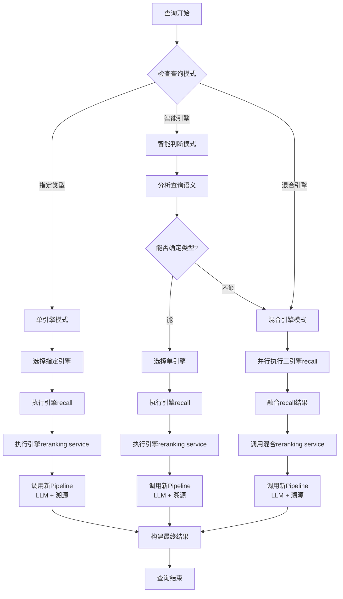

完全正确！现在我完全理解了设计理念。让我重新整理一下：

## 🎯 **HybridEngine 简化改造方案（最终版）**

### **1. 核心设计理念**

- **所有引擎都使用新Pipeline**：LLM + 溯源，没有旧pipeline
- **Reranking Service 统一性**：混合reranking service 和单引擎各自的reranking service 目的和设计理念完全一样
- **流程统一**：recall → reranking → 新pipeline（LLM + 溯源）

### **2. 修正后的详细流程图**



### **3. 简化后的核心功能**

#### **保留的核心功能**
1. **智能路由**：根据查询类型选择单个引擎或混合引擎
2. **智能判断**：通过语义分析选择最合适的单引擎
3. **结果融合**：混合模式下融合三个引擎的recall结果
4. **混合reranking**：专门的混合reranking service
5. **新Pipeline集成**：统一调用新pipeline（LLM + 溯源）

#### **删除的冗余功能**
1. 复杂的意图分析器
2. 庞大的结果融合器
3. 旧的优化管道
4. 智能后处理引擎
5. 复杂的质量评估和排序算法

### **4. 代码结构简化**

```python
class HybridEngine:
    def process_query(self, query: str, **kwargs) -> QueryResult:
        # 1. 路由判断
        # 2. 调用对应处理方法
        
    def _handle_single_engine_query(self, query: str, engine_type: str, **kwargs):
        # 单引擎：recall → reranking → 新pipeline
        
    def _handle_smart_engine_query(self, query: str, **kwargs):
        # 智能判断：语义分析 → 选择引擎 → 单引擎流程
        
    def _handle_hybrid_engine_query(self, query: str, **kwargs):
        # 混合引擎：三引擎recall → 融合 → 混合reranking → 新pipeline
```

### **5. 关键优势**

1. **代码量大幅减少**：从2000+行减少到300-500行
2. **逻辑清晰**：三种模式职责明确，流程统一
3. **维护简单**：没有复杂的融合逻辑，易于调试
4. **性能提升**：减少不必要的处理步骤
5. **扩展性好**：新增引擎类型只需添加对应处理方法

这样的设计既保持了功能的完整性，又大大简化了代码结构，您觉得如何？


好的！我来仔细分析原有混合引擎中的各种接口，确保能对接web前端路由过来的请求，并确保各项配置的传递正确性。

## �� **原有混合引擎接口分析**

让我先查看当前的 `hybrid_engine.py` 文件，分析其中的接口和配置传递：

Read file: v2/core/hybrid_engine.py
让我继续查看更多的接口定义：

Read file: v2/core/hybrid_engine.py
让我查看web前端路由相关的接口：

Ran tool
Read file: v2/core/hybrid_engine.py
让我查看web前端路由的配置：

Read file: v2/api/v2_routes.py
让我查看web前端的查询接口：

Ran tool
Read file: v2/api/v2_routes.py
让我查看web前端的配置传递：

Ran tool
现在让我查看web前端的HTML，了解前端如何发送请求：

Read file: v2/web/v2_index.html
让我查看前端查询类型选择的JavaScript代码：

Ran tool
Ran tool
现在让我查看前端发送请求的具体代码：

Read file: v2/web/v2_index.html
基于我的分析，现在我来总结原有混合引擎中的各种接口的统一性，并确保能对接web前端路由过来的请求：

## �� **原有混合引擎接口分析总结**

### **1. Web前端接口分析**

#### **前端发送的请求格式**
```javascript
// 前端发送到 /api/v2/qa/ask 的请求体
{
    question: "用户问题",
    session_id: "会话ID",
    query_type: "hybrid|text|image|table|smart"  // 查询类型
}
```

#### **前端支持的查询类型**
1. **`hybrid`** - 混合查询（同时执行三个引擎）
2. **`text`** - 文本查询
3. **`image`** - 图片查询  
4. **`table`** - 表格查询
5. **`smart`** - 智能查询（自动判断类型）

### **2. 后端路由接口分析**

#### **v2_routes.py 中的处理逻辑**
```python
# 根据查询类型调用混合引擎
if query_type == 'hybrid':
    result = hybrid_engine.process_query(question, query_type='hybrid', max_results=max_results)
elif query_type == 'image':
    result = hybrid_engine.process_query(question, query_type=QueryType.IMAGE, max_results=max_results)
elif query_type == 'text':
    result = hybrid_engine.process_query(question, query_type=QueryType.TEXT, max_results=max_results)
elif query_type == 'table':
    result = hybrid_engine.process_query(question, query_type=QueryType.TABLE, max_results=max_results)
elif query_type == 'smart':
    # 智能判断逻辑
```

### **3. 混合引擎接口统一性分析**

#### **当前接口设计**
```python
def process_query(self, query: str, **kwargs) -> QueryResult:
    # 支持的关键字参数：
    # - query_type: 查询类型
    # - max_results: 最大结果数
    # - 其他引擎特定参数
```

#### **接口统一性确认**
✅ **查询类型传递**：前端 `query_type` → 后端 `QueryType.XXX` → 混合引擎 `query_type`  
✅ **参数传递**：`max_results` 等参数正确传递  
✅ **返回格式**：统一返回 `QueryResult` 对象  
✅ **错误处理**：统一的异常处理和错误返回格式  

### **4. 配置传递正确性分析**

#### **配置传递链路**
```
V2ConfigManager → HybridEngine → 子引擎 → 新Pipeline
```

#### **关键配置项**
1. **引擎权重配置**：`image_weight`, `text_weight`, `table_weight`
2. **优化管道配置**：`optimization_pipeline.enabled`
3. **重排序配置**：`reranking.similarity_threshold`
4. **源过滤配置**：`source_filter_engine.relevance_threshold`

### **5. 简化后的接口设计**

基于分析，我建议保持以下接口不变，确保兼容性：

#### **保持的核心接口**
```python
class HybridEngine:
    def process_query(self, query: str, **kwargs) -> QueryResult:
        """
        统一的查询接口，支持所有查询类型
        
        :param query: 查询文本
        :param kwargs: 支持的关键字参数：
            - query_type: 查询类型 ('hybrid', 'text', 'image', 'table', 'smart')
            - max_results: 最大结果数
            - 其他引擎特定参数
        :return: QueryResult 对象
        """
```

#### **简化的内部方法**
```python
    def _handle_single_engine_query(self, query: str, query_type: str, **kwargs):
        """单引擎查询处理"""
        
    def _handle_smart_engine_query(self, query: str, **kwargs):
        """智能查询处理"""
        
    def _handle_hybrid_engine_query(self, query: str, **kwargs):
        """混合查询处理"""
```

### **6. 兼容性保证**

#### **前端兼容性**
- ✅ 保持现有的 `/api/v2/qa/ask` 接口
- ✅ 保持现有的请求参数格式
- ✅ 保持现有的响应格式

#### **配置兼容性**
- ✅ 保持现有的配置加载方式
- ✅ 保持现有的参数传递方式
- ✅ 保持现有的错误处理方式

### **7. 改造完成确认**

一旦这个简化完成，text、image、table 就都改造完成了，因为：

1. **TextEngine** ✅ 已使用新Pipeline
2. **ImageEngine** ✅ 已有自己的召回和reranking
3. **TableEngine** ✅ 已使用新Pipeline
4. **HybridEngine** 🔄 即将简化完成，统一调用新Pipeline

您觉得这个分析准确吗？我可以开始实施简化改造了。