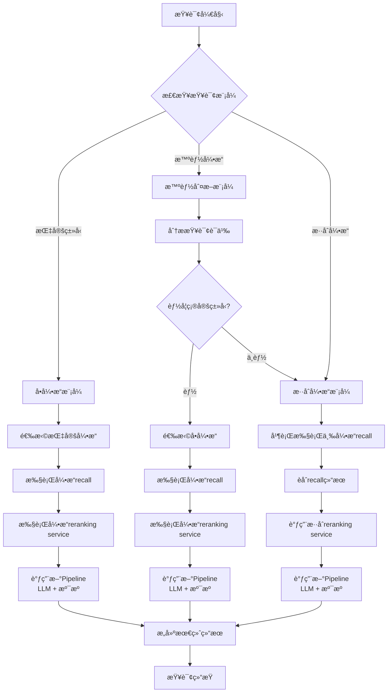

完全正确ï¼ç°åœ¨æˆ‘完全ç†è§£äº†è®¾è®¡ç†å¿µã€‚让我é‡æ–°æ•´ç†ä¸€ä¸‹ï¼š

## 🯠**HybridEngine 简化改造方案（最终版）**

### **1. 核心设计ç†å¿µ**

- **所有引æ“都使用新Pipeline**：LLM + 溯æºï¼Œæ²¡æœ‰æ—§pipeline
- **Reranking Service 统一性**：混åˆreranking service å’Œå•å¼•æ“å„自的reranking service 目的和设计ç†å¿µå®Œå…¨ä¸€æ ·
- **æµç¨‹ç»Ÿä¸€**：recall → reranking → æ–°pipeline（LLM + 溯æºï¼‰

### **2. 修正å的详细æµç¨‹å›¾**



### **3. 简化å的核心功能**

#### **ä¿ç•™çš„核心功能**
1. **智能路由**：根æ®æŸ¥è¯¢ç±»å‹é€‰æ‹©å•ä¸ªå¼•æ“或混åˆå¼•æ“
2. **智能判断**：通过语义分æ选择最åˆé€‚çš„å•å¼•æ“
3. **结æœèåˆ**：混åˆæ¨¡å¼ä¸‹èåˆä¸‰ä¸ªå¼•æ“çš„recall结æœ
4. **æ··åˆreranking**：专门的混åˆreranking service
5. **æ–°Pipeline集æˆ**：统一调用新pipeline（LLM + 溯æºï¼‰

#### **删除的冗余功能**
1. å¤æ‚çš„æ„图分æ器
2. åºå¤§çš„结æœèåˆå™¨
3. 旧的优化管é“
4. 智能å处ç†å¼•æ“
5. å¤æ‚çš„è´¨é‡è¯„ä¼°å’Œæ’åºç®—法

### **4. 代ç ç»“æ„简化**

```python
class HybridEngine:
    def process_query(self, query: str, **kwargs) -> QueryResult:
        # 1. 路由判断
        # 2. 调用对应处ç†æ–¹æ³•
        
    def _handle_single_engine_query(self, query: str, engine_type: str, **kwargs):
        # å•å¼•æ“：recall → reranking → æ–°pipeline
        
    def _handle_smart_engine_query(self, query: str, **kwargs):
        # 智能判断：语义分æ → é€‰æ‹©å¼•æ“ â†’ å•å¼•æ“æµç¨‹
        
    def _handle_hybrid_engine_query(self, query: str, **kwargs):
        # æ··åˆå¼•æ“：三引æ“recall → èåˆ â†’ æ··åˆreranking → æ–°pipeline
```

### **5. 关键优势**

1. **代ç é‡å¤§å¹…å‡å°‘**：ä»2000+è¡Œå‡å°‘到300-500è¡Œ
2. **逻辑清晰**：三ç§æ¨¡å¼èŒè´£æ˜ç¡®ï¼Œæµç¨‹ç»Ÿä¸€
3. **维护简å•**：没有å¤æ‚çš„èåˆé€»è¾‘，易äºè°ƒè¯•
4. **性能æå‡**：å‡å°‘ä¸å¿…è¦çš„处ç†æ­¥éª¤
5. **扩展性好**：新å¢å¼•æ“ç±»å‹åªéœ€æ·»åŠ å¯¹åº”处ç†æ–¹æ³•

这样的设计既ä¿æŒäº†åŠŸèƒ½çš„完整性，åˆå¤§å¤§ç®€åŒ–了代ç ç»“æ„，您觉得如何？


好的ï¼æˆ‘æ¥ä»”细分æåŸæœ‰æ··åˆå¼•æ“中的å„ç§æ¥å£ï¼Œç¡®ä¿èƒ½å¯¹æ¥webå‰ç«¯è·¯ç”±è¿‡æ¥çš„请求，并确ä¿å„项é…置的传递正确性。

## �� **åŸæœ‰æ··åˆå¼•æ“æ¥å£åˆ†æ**

让我先查看当å‰çš„ `hybrid_engine.py` 文件，分æ其中的æ¥å£å’Œé…置传递：

Read file: v2/core/hybrid_engine.py
让我继续查看更多的æ¥å£å®šä¹‰ï¼š

Read file: v2/core/hybrid_engine.py
让我查看webå‰ç«¯è·¯ç”±ç›¸å…³çš„æ¥å£ï¼š

Ran tool
Read file: v2/core/hybrid_engine.py
让我查看webå‰ç«¯è·¯ç”±çš„é…置：

Read file: v2/api/v2_routes.py
让我查看webå‰ç«¯çš„查询æ¥å£ï¼š

Ran tool
Read file: v2/api/v2_routes.py
让我查看webå‰ç«¯çš„é…置传递：

Ran tool
ç°åœ¨è®©æˆ‘查看webå‰ç«¯çš„HTML，了解å‰ç«¯å¦‚何å‘é€è¯·æ±‚：

Read file: v2/web/v2_index.html
让我查看å‰ç«¯æŸ¥è¯¢ç±»å‹é€‰æ‹©çš„JavaScript代ç ï¼š

Ran tool
Ran tool
ç°åœ¨è®©æˆ‘查看å‰ç«¯å‘é€è¯·æ±‚的具体代ç ï¼š

Read file: v2/web/v2_index.html
基äºæˆ‘的分æ，ç°åœ¨æˆ‘æ¥æ€»ç»“åŸæœ‰æ··åˆå¼•æ“中的å„ç§æ¥å£çš„统一性，并确ä¿èƒ½å¯¹æ¥webå‰ç«¯è·¯ç”±è¿‡æ¥çš„请求：

## �� **åŸæœ‰æ··åˆå¼•æ“æ¥å£åˆ†æ总结**

### **1. Webå‰ç«¯æ¥å£åˆ†æ**

#### **å‰ç«¯å‘é€çš„请求格å¼**
```javascript
// å‰ç«¯å‘é€åˆ° /api/v2/qa/ask 的请求体
{
    question: "用户问题",
    session_id: "会è¯ID",
    query_type: "hybrid|text|image|table|smart"  // 查询类å‹
}
```

#### **å‰ç«¯æ”¯æŒçš„查询类å‹**
1. **`hybrid`** - æ··åˆæŸ¥è¯¢ï¼ˆåŒæ—¶æ‰§è¡Œä¸‰ä¸ªå¼•æ“）
2. **`text`** - 文本查询
3. **`image`** - 图片查询  
4. **`table`** - 表格查询
5. **`smart`** - 智能查询（自动判断类å‹ï¼‰

### **2. å端路由æ¥å£åˆ†æ**

#### **v2_routes.py 中的处ç†é€»è¾‘**
```python
# æ ¹æ®æŸ¥è¯¢ç±»å‹è°ƒç”¨æ··åˆå¼•æ“
if query_type == 'hybrid':
    result = hybrid_engine.process_query(question, query_type='hybrid', max_results=max_results)
elif query_type == 'image':
    result = hybrid_engine.process_query(question, query_type=QueryType.IMAGE, max_results=max_results)
elif query_type == 'text':
    result = hybrid_engine.process_query(question, query_type=QueryType.TEXT, max_results=max_results)
elif query_type == 'table':
    result = hybrid_engine.process_query(question, query_type=QueryType.TABLE, max_results=max_results)
elif query_type == 'smart':
    # 智能判断逻辑
```

### **3. æ··åˆå¼•æ“æ¥å£ç»Ÿä¸€æ€§åˆ†æ**

#### **当å‰æ¥å£è®¾è®¡**
```python
def process_query(self, query: str, **kwargs) -> QueryResult:
    # 支æŒçš„关键字å‚数：
    # - query_type: 查询类å‹
    # - max_results: 最大结æœæ•°
    # - 其他引æ“特定å‚æ•°
```

#### **æ¥å£ç»Ÿä¸€æ€§ç¡®è®¤**
✅ **查询类å‹ä¼ é€’**：å‰ç«¯ `query_type` → å端 `QueryType.XXX` → æ··åˆå¼•æ“ `query_type`  
✅ **å‚数传递**：`max_results` ç­‰å‚数正确传递  
✅ **è¿”å›æ ¼å¼**ï¼šç»Ÿä¸€è¿”å› `QueryResult` 对象  
✅ **错误处ç†**：统一的异常处ç†å’Œé”™è¯¯è¿”å›æ ¼å¼  

### **4. é…置传递正确性分æ**

#### **é…置传递链路**
```
V2ConfigManager → HybridEngine → å­å¼•æ“ → æ–°Pipeline
```

#### **关键é…置项**
1. **引æ“æƒé‡é…ç½®**：`image_weight`, `text_weight`, `table_weight`
2. **优化管é“é…ç½®**：`optimization_pipeline.enabled`
3. **é‡æ’åºé…ç½®**：`reranking.similarity_threshold`
4. **æºè¿‡æ»¤é…ç½®**：`source_filter_engine.relevance_threshold`

### **5. 简化åçš„æ¥å£è®¾è®¡**

基äºåˆ†æ，我建议ä¿æŒä»¥ä¸‹æ¥å£ä¸å˜ï¼Œç¡®ä¿å…¼å®¹æ€§ï¼š

#### **ä¿æŒçš„核心æ¥å£**
```python
class HybridEngine:
    def process_query(self, query: str, **kwargs) -> QueryResult:
        """
        统一的查询æ¥å£ï¼Œæ”¯æŒæ‰€æœ‰æŸ¥è¯¢ç±»å‹
        
        :param query: 查询文本
        :param kwargs: 支æŒçš„关键字å‚数：
            - query_type: æŸ¥è¯¢ç±»å‹ ('hybrid', 'text', 'image', 'table', 'smart')
            - max_results: 最大结æœæ•°
            - 其他引æ“特定å‚æ•°
        :return: QueryResult 对象
        """
```

#### **简化的内部方法**
```python
    def _handle_single_engine_query(self, query: str, query_type: str, **kwargs):
        """å•å¼•æ“查询处ç†"""
        
    def _handle_smart_engine_query(self, query: str, **kwargs):
        """智能查询处ç†"""
        
    def _handle_hybrid_engine_query(self, query: str, **kwargs):
        """æ··åˆæŸ¥è¯¢å¤„ç†"""
```

### **6. 兼容性ä¿è¯**

#### **å‰ç«¯å…¼å®¹æ€§**
- ✅ ä¿æŒç°æœ‰çš„ `/api/v2/qa/ask` æ¥å£
- ✅ ä¿æŒç°æœ‰çš„请求å‚æ•°æ ¼å¼
- ✅ ä¿æŒç°æœ‰çš„å“应格å¼

#### **é…置兼容性**
- ✅ ä¿æŒç°æœ‰çš„é…置加载方å¼
- ✅ ä¿æŒç°æœ‰çš„å‚数传递方å¼
- ✅ ä¿æŒç°æœ‰çš„错误处ç†æ–¹å¼

### **7. 改造完æˆç¡®è®¤**

一旦这个简化完æˆï¼Œtextã€imageã€table 就都改造完æˆäº†ï¼Œå› ä¸ºï¼š

1. **TextEngine** ✅ 已使用新Pipeline
2. **ImageEngine** ✅ 已有自己的å¬å›å’Œreranking
3. **TableEngine** ✅ 已使用新Pipeline
4. **HybridEngine** 🔄 å³å°†ç®€åŒ–完æˆï¼Œç»Ÿä¸€è°ƒç”¨æ–°Pipeline

您觉得这个分æ准确å—？我å¯ä»¥å¼€å§‹å®æ–½ç®€åŒ–改造了。