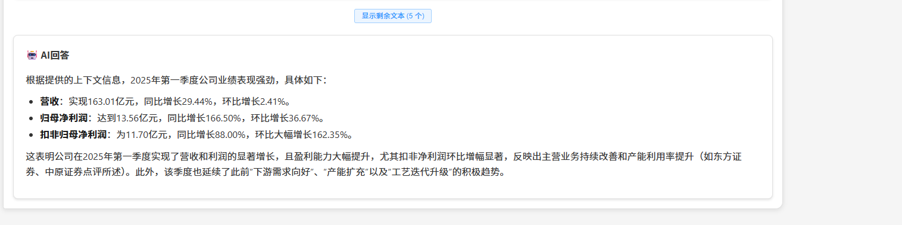

# RAG系统V3 - 智能检索增强生成系统


## 📋 项目概述

RAG系统V3是一个基于检索增强生成（Retrieval-Augmented Generation）的智能问答系统，由两个核心模块和前端模块组成：

1. **RAG查询系统**（`rag_system/`）：提供智能问答、多模态检索、记忆管理等核心功能
2. **向量数据库构建系统**（`db_system/`）：负责从原始文档提取数据、生成向量数据库
3. **前端模块**（frontend/ ）： 负责web和前端显示

系统支持文本、图像和表格的多模态检索，具备完整的配置管理、性能优化、记忆模块和现代化前端界面。

## 🧠功能示例：

**上海公积金2025新政智能问答系统示例：**


**中芯国际研报信息智能查询系统示例:**





## ✨ 核心特性


### 🧠 智能问答

- **多模态查询**：支持文本、图片、表格、智能、混合查询模式
- **智能问答**：集成预设问题，支持实时聊天交互
- **答案溯源**：提供完整的答案来源追踪和置信度评估

### 🎯 记忆管理
- **智能记忆存储**：基于SQLite的轻量级记忆数据库
- **多轮对话支持**：自动记录和检索历史对话内容
- **智能查询重写**：基于spaCy的代词解析和查询增强
- **上下文增强**：将历史记忆集成到LLM提示中

### 📊 向量数据库构建
- **文档解析**：支持PDF文档的智能解析（基于minerU API）
- **双重向量化**：实现视觉向量（One_Peace）和语义向量（text-embedding-v1）策略
- **增量更新**：支持向量数据库的增量更新和维护
- **数据库诊断**：提供完整的数据库诊断和修复工具

### 🎨 现代化界面
- **响应式设计**：适配桌面和移动设备
- **现代化UI**：基于Element Plus的优雅界面设计
- **实时交互**：支持实时查询和结果展示

## 🏗️ 系统架构

```
RAG系统V3
├── rag_system/                    # RAG查询系统
│   ├── core/                      # 核心模块
│   │   ├── query_processor.py     # 查询处理器
│   │   ├── memory_manager.py      # 记忆管理器
│   │   ├── unified_services.py    # 统一服务
│   │   └── ...
│   ├── api/                       # API接口
│   ├── config/                    # 配置管理
│   └── ...
├── db_system/                     # 向量数据库构建系统
│   ├── core/                      # 核心模块
│   │   ├── v3_main_processor.py   # 主控制器
│   │   ├── content_processor.py   # 内容处理器
│   │   ├── vectorization_manager.py # 向量化管理
│   │   └── ...
│   ├── processors/                # 内容处理器
│   ├── vectorization/             # 向量化模块
│   └── ...
├── frontend/                      # 前端界面
│   ├── src/                       # 源代码
│   ├── public/                    # 静态资源
│   └── ...
└── central/                       # 数据存储
    ├── vector_db/                 # 向量数据库
    ├── memory_db/                 # 记忆数据库
    └── ...
```

## 🚀 快速开始

### 环境要求
- **Python**: 3.8+
- **Node.js**: 16.0+
- **内存**: 至少 4GB RAM
- **存储**: 至少 2GB 可用空间

### 安装步骤

1. **克隆项目**
```bash
git clone git@github.com:alvaxu/RAG-system.git
cd rag-system-v3
```

2. **安装Python依赖**
```bash
pip install -r requirements.txt
python -m spacy download zh_core_web_sm
```

3. **配置环境变量**
```bash
# 创建.env文件
echo "DASHSCOPE_API_KEY=your_dashscope_api_key_here" > .env
echo "MINERU_API_KEY=your_mineru_api_key_here" >> .env
```

4. **构建向量数据库**
```bash
cd db_system
# 先将PDF知识库原始文档放入`db_system/document/orig_pdf/
python main.py --input-type pdf
```

5. **启动后端RAG查询服务和前端界面**
```bash
cd ..
python start_rag_system.py
```

或者直接运行start_rag.bat ,选择启动方式：
```powershell
请选择操作:
1. 启动后端API服务
2. 启动前端界面
3. 启动完整系统 (后端+前端)
4. 运行API接口测试
5. 运行后端功能测试
6. 查看系统状态
7. 退出
```


### 访问地址
- **前端界面**: http://localhost:3000
- **API服务**: http://localhost:8000
- **API文档**: http://localhost:8000/docs

## 📖 使用指南

### 基本使用流程

1. **准备文档**：将PDF文档放入`db_system/document/orig_pdf/`
2. **构建数据库**：运行向量数据库构建系统处理文档
3. **启动服务**：启动RAG查询系统和前端界面
4. **开始查询**：通过前端界面或API进行智能问答

### 主要功能

#### 向量数据库构建系统

- **文档处理**：`python main.py --input-type pdf`
- **数据库诊断**：`python main.py --diagnose-db`
- **补做处理**：`python main.py --check-completion`

#### RAG查询系统
- **智能查询**：`POST /api/v3/rag/query`
- **内容搜索**：`POST /api/v3/rag/search`
- **记忆管理**：`GET /api/v3/rag/memory/stats`
- **健康检查**：`GET /api/v3/rag/health`


## 🔧 配置说明

### 环境变量
```bash
# AI模型配置（必需）
DASHSCOPE_API_KEY=your_dashscope_api_key_here
MINERU_API_KEY=your_mineru_api_key_here

```

### 配置文件
`db_system/config/v3_config.json`

## 📊 技术栈

### 后端技术
- **Python**: 3.8+
- **FastAPI**: Web框架
- **FAISS**: 向量数据库
- **SQLite**: 记忆数据库
- **spaCy**: 中文NLP处理
- **DashScope**: AI模型服务

### 前端技术
- **Vue.js 3**: 前端框架
- **Vite**: 构建工具
- **Element Plus**: UI组件库
- **SCSS**: 样式预处理器

### AI模型
- **通义千问**: 大语言模型
- **text-embedding-v1**: 文本向量化
- **multimodal-embedding-one-peace-v1**: 图像向量化


## 🔍 故障排除

### 常见问题

1. **API无响应**
   - 检查服务是否启动：`curl http://localhost:8000/api/v3/rag/health`
   - 检查端口占用：`netstat -ano | findstr :8000`

2. **向量数据库问题**
   - 检查数据库完整性：`cd db_system && python main.py --diagnose-db`
   - 重新构建数据库：`python main.py --input-type pdf`

3. **记忆模块问题**
   - 检查SQLite数据库：`sqlite3 rag_memory.db ".schema"`
   - 清理过期记忆：`curl -X POST http://localhost:8000/api/v3/rag/memory/cleanup`

### 日志查看
```bash
# RAG查询系统日志
tail -f logs/rag_system.log

# 向量数据库构建系统日志
tail -f logs/v3_processing.log

# 记忆模块日志
grep "memory" logs/rag_system.log
```

## 📚 文档

- **部署指南**: [guideline/发布相关/部署指南.md](guideline/发布相关/部署指南.md)

- **使用手册**: [guideline/发布相关/RAG系统V3使用手册.md](guideline/发布相关/RAG系统V3使用手册.md)

- **快速启动**: [guideline/发布相关/快速启动指南.md](guideline/发布相关/快速启动指南.md)

  

## 📞 支持

如有问题或建议，请通过以下方式联系：

- **邮箱**:  alva_xu@sina.com

## 🌟 自由推广

如果您觉得这个RAG系统好用，不妨分享给您的同事和朋友。您的推荐是我们最大的动力！

*让更多企业享受到智能检索增强系统带来的便利*

## ❤️ 支持我们

作为独立开发者，我们致力于不断改进系统，为您提供更好的使用体验。如果您愿意，可以通过扫码支持我们继续前行。


*您的每一份支持，都是对我们持续改进的鼓励*

💡 **感谢您的使用！** 您的反馈和支持是我们前进的动力。


---

**版本**: RAG系统V3.0.0  
**最后更新**: 2025年10月16日  
**维护团队**: RAG系统开发团队
