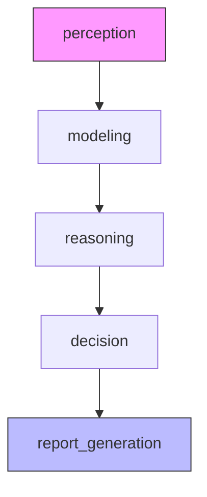

# 深思熟虑智能体（Deliberative Agent）- 智能投研助手 程序架构说明

## 一、整体功能简介

本程序基于 LangGraph 框架实现了一个"深思熟虑型"智能投研助手，适用于投资研究、行业分析等场景。它能够自动收集市场数据、构建市场模型、生成多种投资分析方案、智能决策并输出完整的研究报告。整个流程高度自动化，支持多阶段推理和决策，适合需要系统性分析和报告输出的金融、投资等领域。

---

## 二、主要流程节点说明

### 1. 感知（Perception）
- **功能**：收集并整理与研究主题相关的市场数据、经济指标、新闻和行业趋势。
- **实现**：调用大模型（如通义千问）根据用户输入的研究主题、行业焦点和时间范围，生成结构化的市场感知信息。
- **输出**：市场概况、关键指标、新闻列表、行业趋势等。

### 2. 建模（Modeling）
- **功能**：基于感知阶段数据，构建市场的内部世界模型。
- **实现**：分析市场状态、经济周期、主要风险、机会领域和市场情绪，为后续推理提供基础。
- **输出**：市场状态、经济周期、风险因素、机会领域、市场情绪等。

### 3. 推理（Reasoning）
- **功能**：生成多个候选投资分析方案。
- **实现**：基于市场模型，自动生成3个具有不同假设、分析方法和预期结果的投资方案，并评估其优缺点和置信度。
- **输出**：候选方案列表，每个方案包含ID、假设、方法、预期、置信度、优缺点等。

### 4. 决策（Decision）
- **功能**：评估并选择最优投资方案。
- **实现**：对所有候选方案进行综合评估，选择最优方案，输出投资论点、支持证据、风险评估、建议和时间框架。
- **输出**：最终选定的投资方案及详细理由。

### 5. 报告（Report）
- **功能**：生成完整的投资研究报告。
- **实现**：基于前述所有阶段的输出，自动撰写结构化、专业的研究报告，包含摘要、背景、观点、分析、风险、建议等。
- **输出**：完整的研究报告文本，可保存为文件。

---

## 三、状态结构体说明

### ResearchAgentState
- 贯穿所有流程节点的全局状态，包含：
    - `research_topic`：研究主题
    - `industry_focus`：行业焦点
    - `time_horizon`：时间范围（短期/中期/长期）
    - `perception_data`：感知阶段收集的数据
    - `world_model`：建模阶段生成的市场模型
    - `reasoning_plans`：推理阶段生成的候选方案
    - `selected_plan`：决策阶段选定的方案
    - `final_report`：最终研究报告
    - `current_phase`：当前流程阶段
    - `error`：错误信息（如有）

---

## 四、LangGraph工作流架构与运行机制

- **节点定义**：每个阶段（感知、建模、推理、决策、报告）为一个节点函数，输入和输出均为 ResearchAgentState。
- **状态流转**：通过 router 函数和 StateGraph，自动根据当前阶段和错误状态跳转到下一个节点。
- **自动推进**：主流程自动推进，遇到错误时可停留在当前阶段，便于调试和容错。
- **可视化**：支持输出Mermaid流程图，便于理解和展示整体流程。
- **主入口**：run_research_agent 函数负责初始化状态、运行流程、输出最终报告。

---

## 五、适用场景与扩展建议

### 适用场景
- 金融投资研究、行业分析、策略制定、自动化报告生成等。
- 需要多阶段推理、决策和结构化输出的复杂业务流程。

### 扩展建议
- 可扩展更多感知数据源（如实时行情、外部API等）。
- 可增加更多推理和决策逻辑（如多轮方案对比、专家投票等）。
- 可对报告模板和输出格式进行定制，适配不同业务需求。
- 可与知识图谱、数据库等系统集成，实现更强大的智能投研能力。

---

如需进一步定制或集成，建议结合实际业务场景调整各阶段的提示模板和数据结构。 


```python
# 第一阶段：感知 - 收集市场数据和信息
def perception(state: ResearchAgentState) -> ResearchAgentState:
    """
    :function: perception
    :param state: 当前研究智能体状态（ResearchAgentState）
    :return: 更新后的研究智能体状态（ResearchAgentState）
    :说明: 感知阶段，收集和整理市场数据和信息。调用大模型生成结构化市场感知信息，推进到建模阶段。
    """
    
    print("1. 感知阶段：收集市场数据和信息...")
    
    try:
        # 准备提示
        prompt = ChatPromptTemplate.from_template(PERCEPTION_PROMPT)
        
        # 构建输入
        input_data = {
            "research_topic": state["research_topic"],
            "industry_focus": state["industry_focus"],
            "time_horizon": state["time_horizon"]
        }
        
        # 调用LLM
        chain = prompt | llm | JsonOutputParser()
        result = chain.invoke(input_data)
        
        # 更新状态
        return {
            **state,
            "perception_data": result,
            "current_phase": "modeling"
        }
    except Exception as e:
        return {
            **state,
            "error": f"感知阶段出错: {str(e)}",
            "current_phase": "perception"  # 保持在当前阶段
        }

# 第二阶段：建模 - 构建内部世界模型
def modeling(state: ResearchAgentState) -> ResearchAgentState:
    """
    :function: modeling
    :param state: 当前研究智能体状态（ResearchAgentState）
    :return: 更新后的研究智能体状态（ResearchAgentState）
    :说明: 建模阶段，根据感知数据构建市场内部世界模型，推进到推理阶段。
    """
    
    print("2. 建模阶段：构建内部世界模型...")
    
    try:
        # 确保感知数据已存在
        if not state.get("perception_data"):
            return {
                **state,
                "error": "建模阶段缺少感知数据",
                "current_phase": "perception"  # 回到感知阶段
            }
        
        # 准备提示
        prompt = ChatPromptTemplate.from_template(MODELING_PROMPT)
        
        # 构建输入
        input_data = {
            "research_topic": state["research_topic"],
            "industry_focus": state["industry_focus"],
            "time_horizon": state["time_horizon"],
            "perception_data": json.dumps(state["perception_data"], ensure_ascii=False, indent=2)
        }
        
        # 调用LLM
        chain = prompt | llm | JsonOutputParser()
        result = chain.invoke(input_data)
        
        # 更新状态
        return {
            **state,
            "world_model": result,
            "current_phase": "reasoning"
        }
    except Exception as e:
        return {
            **state,
            "error": f"建模阶段出错: {str(e)}",
            "current_phase": "modeling"  # 保持在当前阶段
        }

# 第三阶段：推理 - 生成候选分析方案
def reasoning(state: ResearchAgentState) -> ResearchAgentState:
    """
    :function: reasoning
    :param state: 当前研究智能体状态（ResearchAgentState）
    :return: 更新后的研究智能体状态（ResearchAgentState）
    :说明: 推理阶段，基于市场模型生成多个候选分析方案，推进到决策阶段。
    """
    
    print("3. 推理阶段：生成候选分析方案...")
    
    try:
        # 确保世界模型已存在
        if not state.get("world_model"):
            return {
                **state,
                "error": "推理阶段缺少世界模型",
                "current_phase": "modeling"  # 回到建模阶段
            }
        
        # 准备提示
        prompt = ChatPromptTemplate.from_template(REASONING_PROMPT)
        
        # 构建输入
        input_data = {
            "research_topic": state["research_topic"],
            "industry_focus": state["industry_focus"],
            "time_horizon": state["time_horizon"],
            "world_model": json.dumps(state["world_model"], ensure_ascii=False, indent=2)
        }
        
        # 调用LLM
        chain = prompt | llm | JsonOutputParser()
        result = chain.invoke(input_data)
        
        # 更新状态
        return {
            **state,
            "reasoning_plans": result,
            "current_phase": "decision"
        }
    except Exception as e:
        return {
            **state,
            "error": f"推理阶段出错: {str(e)}",
            "current_phase": "reasoning"  # 保持在当前阶段
        }

# 第四阶段：决策 - 选择最优方案
def decision(state: ResearchAgentState) -> ResearchAgentState:
    """
    :function: decision
    :param state: 当前研究智能体状态（ResearchAgentState）
    :return: 更新后的研究智能体状态（ResearchAgentState）
    :说明: 决策阶段，评估候选方案，选择最优投资观点，推进到报告阶段。
    """
    
    print("4. 决策阶段：选择最优投资观点...")
    
    try:
        # 确保候选方案已存在
        if not state.get("reasoning_plans"):
            return {
                **state,
                "error": "决策阶段缺少候选方案",
                "current_phase": "reasoning"  # 回到推理阶段
            }
        
        # 准备提示
        prompt = ChatPromptTemplate.from_template(DECISION_PROMPT)
        
        # 构建输入
        input_data = {
            "research_topic": state["research_topic"],
            "industry_focus": state["industry_focus"],
            "time_horizon": state["time_horizon"],
            "world_model": json.dumps(state["world_model"], ensure_ascii=False, indent=2),
            "reasoning_plans": json.dumps(state["reasoning_plans"], ensure_ascii=False, indent=2)
        }
        
        # 调用LLM
        chain = prompt | llm | JsonOutputParser()
        result = chain.invoke(input_data)
        
        # 更新状态
        return {
            **state,
            "selected_plan": result,
            "current_phase": "report"
        }
    except Exception as e:
        return {
            **state,
            "error": f"决策阶段出错: {str(e)}",
            "current_phase": "decision"  # 保持在当前阶段
        }

# 第五阶段：报告 - 生成完整研究报告
def report_generation(state: ResearchAgentState) -> ResearchAgentState:
    """
    :function: report_generation
    :param state: 当前研究智能体状态（ResearchAgentState）
    :return: 更新后的研究智能体状态（ResearchAgentState）
    :说明: 报告阶段，生成完整的投资研究报告，流程结束。
    """
    
    print("5. 报告阶段：生成完整研究报告...")
    
    try:
        # 确保选定方案已存在
        if not state.get("selected_plan"):
            return {
                **state,
                "error": "报告阶段缺少选定方案",
                "current_phase": "decision"  # 回到决策阶段
            }
        
        # 准备提示
        prompt = ChatPromptTemplate.from_template(REPORT_PROMPT)
        
        # 构建输入
        input_data = {
            "research_topic": state["research_topic"],
            "industry_focus": state["industry_focus"],
            "time_horizon": state["time_horizon"],
            "perception_data": json.dumps(state["perception_data"], ensure_ascii=False, indent=2),
            "world_model": json.dumps(state["world_model"], ensure_ascii=False, indent=2),
            "selected_plan": json.dumps(state["selected_plan"], ensure_ascii=False, indent=2)
        }
        
        # 调用LLM
        chain = prompt | llm | StrOutputParser()
        result = chain.invoke(input_data)
        
        # 更新状态
        return {
            **state,
            "final_report": result,
            "current_phase": "completed"
        }
    except Exception as e:
        return {
            **state,
            "error": f"报告生成阶段出错: {str(e)}",
            "current_phase": "report"  # 保持在当前阶段
        }
```
## 六、5个研究智能体函数的横向对比表格：

| 功能/特性          | perception (感知)                          | modeling (建模)                          | reasoning (推理)                          | decision (决策)                          | report_generation (报告)                  |
|--------------------|--------------------------------------------|------------------------------------------|--------------------------------------------|------------------------------------------|------------------------------------------|
| **主要目的**       | 收集市场数据和信息                         | 构建内部世界模型                         | 生成候选分析方案                           | 选择最优投资观点                         | 生成完整研究报告                         |
| **输入依赖**       | research_topic<br>industry_focus<br>time_horizon | perception_data                         | world_model                               | reasoning_plans                         | selected_plan                           |
| **处理模式**       | 标准LLM链式调用                            | 标准LLM链式调用                          | 标准LLM链式调用                            | 标准LLM链式调用                          | 标准LLM链式调用                          |
| **提示模板**       | PERCEPTION_PROMPT                          | MODELING_PROMPT                          | REASONING_PROMPT                          | DECISION_PROMPT                          | REPORT_PROMPT                            |
| **Chain定义方式**  | `prompt \| llm \| JsonOutputParser()`       | `prompt \| llm \| JsonOutputParser()`    | `prompt \| llm \| JsonOutputParser()`      | `prompt \| llm \| JsonOutputParser()`     | `prompt \| llm \| StrOutputParser()`      |
| **LLM调用方式**    | chain.invoke(input_data)                    | chain.invoke(input_data)                  | chain.invoke(input_data)                   | chain.invoke(input_data)                 | chain.invoke(input_data)                 |
| **输出解析器**     | JsonOutputParser                           | JsonOutputParser                         | JsonOutputParser                           | JsonOutputParser                         | StrOutputParser                          |
| **关键输出**       | perception_data                            | world_model                              | reasoning_plans                           | selected_plan                            | final_report                             |
| **错误处理**       | 保持在当前阶段                             | 返回感知阶段                             | 返回建模阶段                               | 返回推理阶段                             | 返回决策阶段                             |
| **状态更新字段**   | perception_data<br>current_phase           | world_model<br>current_phase             | reasoning_plans<br>current_phase           | selected_plan<br>current_phase           | final_report<br>current_phase            |
| **阶段控制**       | 设置下一阶段为"modeling"                   | 设置下一阶段为"reasoning"                | 设置下一阶段为"decision"                   | 设置下一阶段为"report"                   | 设置下一阶段为"completed"                |
| **数据验证**       | 无                                         | 检查perception_data是否存在              | 检查world_model是否存在                    | 检查reasoning_plans是否存在               | 检查selected_plan是否存在                 |
| **JSON处理**       | 无                                         | 对perception_data进行JSON序列化          | 对world_model进行JSON序列化                | 对world_model和reasoning_plans序列化     | 对所有输入数据进行JSON序列化              |
| **调试信息**       | 输出阶段开始日志                           | 输出阶段开始日志                         | 输出阶段开始日志                           | 输出阶段开始日志                         | 输出阶段开始日志                         |
| **默认值设置**     | 无                                         | 无                                       | 无                                         | 无                                       | 无                                       |
| **扩展性**         | 需修改提示模板                             | 需修改提示模板                           | 需修改提示模板                             | 需修改提示模板                           | 需修改提示模板                           |

### 流程可视化


### 关键差异说明：
1. **输出类型**：前4个阶段使用`JsonOutputParser`，最终报告阶段使用`StrOutputParser`
2. **数据依赖**：每个阶段严格验证前一阶段的输出数据是否存在
3. **错误恢复**：出错时自动回退到上一阶段（除感知阶段外）
4. **序列化要求**：越往后阶段需要序列化的输入数据越多
5. **阶段推进**：每个阶段明确指定下一阶段标识，形成严格的工作流


## 

