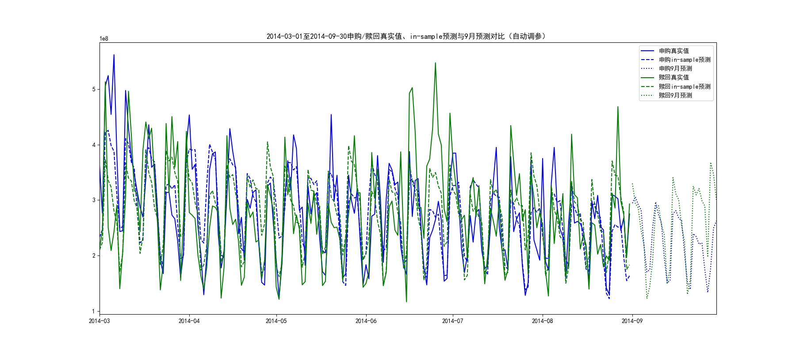
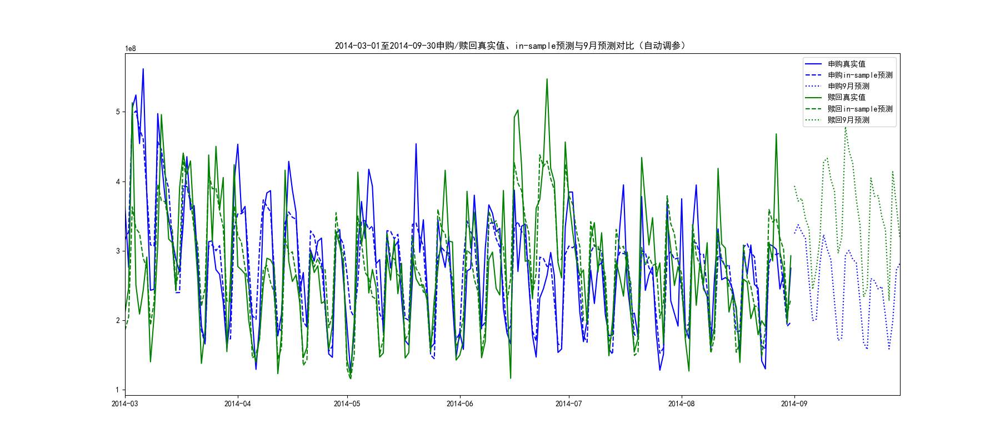

## 在`3.1_prophet_model.py`中，Prophet模型的参数设置如下（申购和赎回完全一致）：

```python
def prophet_predict(train_df, holidays, all_dates, label):
    m = Prophet(
        holidays=holidays,
        yearly_seasonality=True,
        weekly_seasonality=True,
        daily_seasonality=False,
        seasonality_mode='additive',
        changepoint_prior_scale=0.2
    )
    m.add_seasonality(name='monthly', period=30.5, fourier_order=5)
    m.fit(train_df)
    future = pd.DataFrame({'ds': all_dates})
    forecast = m.predict(future)
    return forecast
```

### 申购和赎回参数（实际设置）

- 申购参数:  
```python
{
    'changepoint_prior_scale': 0.2,
    'seasonality_prior_scale': Prophet默认值（10.0）,
    'holidays_prior_scale': Prophet默认值（10.0）,
    'seasonality_mode': 'additive',
    'yearly_seasonality': True,
    'weekly_seasonality': True,
    'daily_seasonality': False
}
```

- 赎回参数:  
```python
{
    'changepoint_prior_scale': 0.2,
    'seasonality_prior_scale': Prophet默认值（10.0）,
    'holidays_prior_scale': Prophet默认值（10.0）,
    'seasonality_mode': 'additive',
    'yearly_seasonality': True,
    'weekly_seasonality': True,
    'daily_seasonality': False
}
```

### Prophet未显式指定参数时的默认值

- `seasonality_prior_scale`: **10.0**
- `holidays_prior_scale`: **10.0**
- `seasonality_mode`: **'additive'**
- `changepoint_prior_scale`: **0.05**
- `yearly_seasonality`: **auto**（但此处被强制设为True）
- `weekly_seasonality`: **auto**（但此处被强制设为True）
- `daily_seasonality`: **auto**（但此处被强制设为False）

**本程序中唯一显式设置的参数是：**
- `changepoint_prior_scale=0.2`
- `seasonality_mode='additive'`
- 其余参数均为Prophet默认值。

---
## 3.2 参数

申购最优参数: {'changepoint_prior_scale': 0.01, 'seasonality_prior_scale': 5.0, 'holidays_prior_scale': 5.0, 'seasonality_mode': 'multiplicative'}, 最优验证集RMSE: 92057040.43
赎回最优参数: {'changepoint_prior_scale': 0.01, 'seasonality_prior_scale': 5.0, 'holidays_prior_scale': 20.0, 'seasonality_mode': 'additive'}, 最优验证集RMSE: 67659354.34


- **changepoint_prior_scale=0.01**：模型对趋势变化极为保守，适合趋势平稳但不适合突变。
- **seasonality_prior_scale=5.0**：季节性分量适中，既不过拟合也不欠拟合。
- **holidays_prior_scale=5.0/20.0**：申购对节假日敏感度适中，赎回极高，需警惕过拟合。
- **seasonality_mode**：申购为乘法型，赎回为加法型，说明申购的季节性波动随趋势变化而变化，赎回则为固定幅度。

## 3.4
- 申购参数：changepoint_prior_scale=0.01, seasonality_prior_scale=5.0, holidays_prior_scale=5.0, seasonality_mode='multiplicative'
- 赎回参数：changepoint_prior_scale=0.01, seasonality_prior_scale=5.0, holidays_prior_scale=10.0, seasonality_mode='additive'

成绩：82.9780

## 3.5参数

申购最优参数: {'changepoint_prior_scale': 0.01, 'seasonality_prior_scale': 5.0, 'holidays_prior_scale': 5.0, 'seasonality_mode': 'multiplicative'}, 最优验证集RMSE: 92057040.43
赎回最优参数: {'changepoint_prior_scale': 0.01, 'seasonality_prior_scale': 5.0, 'holidays_prior_scale': 20.0, 'seasonality_mode': 'additive'}, 最优验证集RMSE: 67659354.34
成绩：82.0209


## 3.6 用默认参数
changepoint_prior_scale=0.05
seasonality_prior_scale=10.0
holidays_prior_scale=10.0
seasonality_mode='additive'
yearly_seasonality=True
weekly_seasonality=True
daily_seasonality=False
成绩：51.6182

## 3.7 显式定义节假日和周末
申购最优参数: {'changepoint_prior_scale': 0.01, 'seasonality_prior_scale': 5.0, 'holidays_prior_scale': 5.0, 'seasonality_mode': 'multiplicative'}, 最优验证集RMSE: 92057040.43
赎回最优参数: {'changepoint_prior_scale': 0.01, 'seasonality_prior_scale': 5.0, 'holidays_prior_scale': 20.0, 'seasonality_mode': 'additive'}, 最优验证集RMSE: 67659354.34
成绩:82.0209
数据与3.5完全一样。

## 3.4.1 与3.4相同，但不考虑年周期
            holidays=holidays,
            yearly_seasonality=False,
            weekly_seasonality=True,
            daily_seasonality=False,

- 申购参数：changepoint_prior_scale=0.01, seasonality_prior_scale=5.0, holidays_prior_scale=5.0, seasonality_mode='multiplicative'
- 赎回参数：changepoint_prior_scale=0.01, seasonality_prior_scale=5.0, holidays_prior_scale=10.0, seasonality_mode='additive'

## 3.2.1 与3.2相同，但不考虑年周期（目前orophet成绩最好104.3057）
            holidays=holidays,
            yearly_seasonality=False,
            weekly_seasonality=True,
            daily_seasonality=False,
申购最优参数: {'changepoint_prior_scale': 0.01, 'seasonality_prior_scale': 10.0, 'holidays_prior_scale': 20.0, 'seasonality_mode': 'multiplicative'}, 最优验证集RMSE: 56287319.47
赎回最优参数: {'changepoint_prior_scale': 0.01, 'seasonality_prior_scale': 20.0, 'holidays_prior_scale': 1.0, 'seasonality_mode': 'additive'}, 最优验证集RMSE: 60216807.95

分数:104.3057

和3.2的参数相比,差别很大：
以下是3.2的参数：
申购最优参数: {'changepoint_prior_scale': 0.01, 'seasonality_prior_scale': 5.0, 'holidays_prior_scale': 5.0, 'seasonality_mode': 'multiplicative'}, 最优验证集RMSE: 92057040.43
赎回最优参数: {'changepoint_prior_scale': 0.01, 'seasonality_prior_scale': 5.0, 'holidays_prior_scale': 20.0, 'seasonality_mode': 'additive'}, 最优验证集RMSE: 67659354.34




## 3.7.1 与3.7相同，但不考虑年周期

申购最优参数: {'changepoint_prior_scale': 0.01, 'seasonality_prior_scale': 10.0, 'holidays_prior_scale': 20.0, 'seasonality_mode': 'multiplicative'}, 最优验证集RMSE: 56287319.47
赎回最优参数: {'changepoint_prior_scale': 0.01, 'seasonality_prior_scale': 20.0, 'holidays_prior_scale': 1.0, 'seasonality_mode': 'additive'}, 最优验证集RMSE: 60216807.95

最优参数与3.7大不同
申购最优参数: {'changepoint_prior_scale': 0.01, 'seasonality_prior_scale': 5.0, 'holidays_prior_scale': 5.0, 'seasonality_mode': 'multiplicative'}, 最优验证集RMSE: 92057040.43
赎回最优参数: {'changepoint_prior_scale': 0.01, 'seasonality_prior_scale': 5.0, 'holidays_prior_scale': 20.0, 'seasonality_mode': 'additive'}, 最优验证集RMSE: 67659354.34

3.7.1的结果和3.2.1完全相同，