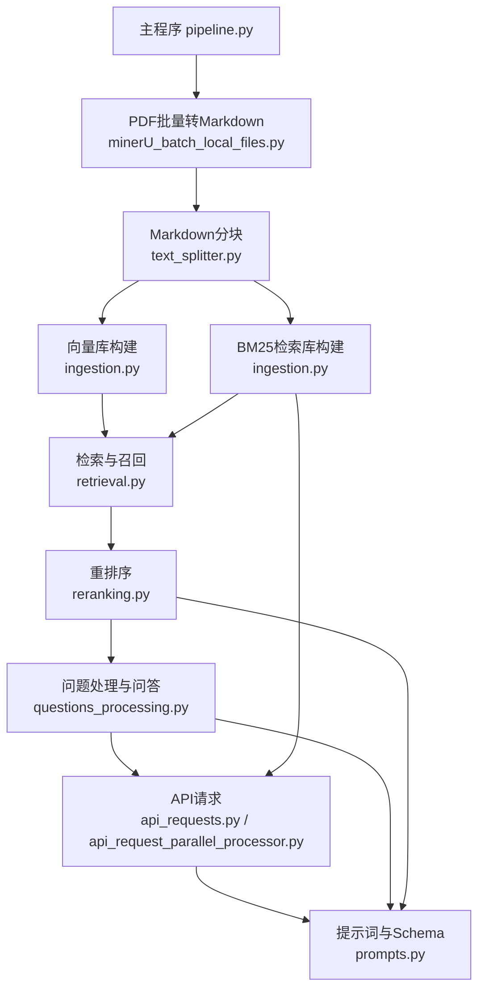

# 项目架构与主流程说明（基于 pipeline.py 最新主流程）

---

## 目录
- [项目概述](#项目概述)
- [主流程与阶段说明](#主流程与阶段说明)
- [关键数据文件与目录结构](#关键数据文件与目录结构)
- [核心模块与详细调用关系](#核心模块与详细调用关系)
- [运行方式与建议](#运行方式与建议)

---

## 项目概述

本项目是一个面向PDF报告的智能问答系统，采用RAG（检索增强生成）技术路线。系统支持PDF批量解析、结构化处理、文本分块、向量数据库构建、检索与问答等完整流程。主流程高度模块化，便于扩展和维护，适合大规模文档的智能分析与问答应用。

---

## 主流程与阶段说明

主流程入口为 `src/pipeline.py`，以 `Pipeline` 类为核心，串联各阶段任务。**当前主流程已简化为如下关键步骤**：

### 1. PDF转Markdown（minerU批量解析）

- **方法**：`pipeline.export_reports_to_markdown_mineru(api_key, language)`
- **调用**：`run_mineru_batch_export`（src/minerU_batch_local_files.py）
- **参数**：
  - `pdf_dir`：PDF目录（如 `data/test_set/pdf_reports`）
  - `output_dir`：Markdown输出目录（如 `data/test_set/debug_data/03_reports_markdown/`）
  - `api_key`：minerU平台API密钥
  - `language`：解析语言
- **输入**：PDF目录
- **输出**：Markdown文件（每个PDF对应一个md，存于output_dir）

#### 详细流程
- 遍历pdf_dir下所有PDF，批量上传到minerU平台。
- 轮询等待解析完成，下载解析后的zip包。
- 只解压其中的md文件，重命名为与原PDF前缀一致，输出到output_dir。

---

### 2. Markdown分块

- **方法**：`pipeline.chunk_reports()`
- **调用**：`TextSplitter.split_markdown_reports`（src/text_splitter.py）
- **参数**：
  - `all_md_dir`：Markdown目录（如 `03_reports_markdown`）
  - `output_dir`：分块JSON输出目录（如 `databases/chunked_reports/`）
  - `subset_csv`：元数据文件（如 `subset.csv`）
- **输入**：Markdown目录、subset.csv
- **输出**：分块JSON（每个md分块后生成一个json，含chunks、sha1、company_name等）

#### 详细流程
- 遍历all_md_dir下所有md文件，按页或逻辑块分割为多个chunk。
- 通过subset.csv补充每个chunk的公司名、sha1等元数据。
- 输出json文件到output_dir。

---

### 3. 向量数据库构建

- **方法**：`pipeline.create_vector_dbs()`
- **调用**：`VectorDBIngestor.process_reports`（src/ingestion.py）
- **参数**：
  - `all_reports_dir`：分块JSON目录（如 `chunked_reports`）
  - `output_dir`：FAISS向量库输出目录（如 `vector_dbs/`）
- **输入**：分块JSON
- **输出**：FAISS向量库（每个报告一个faiss文件，文件名为sha1）

#### 详细流程
- 遍历all_reports_dir下所有json，读取chunks。
- 对每个chunk调用embedding API（如DashScope/OpenAI）获取向量。
- 构建FAISS索引，保存到output_dir。

---

### 4. 问题处理与问答

- **方法**：`pipeline.process_questions()`
- **调用**：`QuestionsProcessor.process_all_questions`（src/questions_processing.py）
- **参数**：
  - `vector_db_dir`：向量库目录
  - `documents_dir`：分块JSON目录
  - `questions_file_path`：问题文件
  - `subset_path`：元数据文件
  - 其他检索、重排序、并发等参数
- **输入**：问题文件、向量库、分块JSON、元数据
- **输出**：答案文件（如 `answers.json`）

#### 详细流程
- 读取questions_file_path，遍历每个问题。
- 对每个问题，检索相关文本块（向量库检索）。
- 构建RAG上下文，调用LLM生成结构化答案。
- 输出所有答案到output_path。

---

## 关键数据文件与目录结构

```
RAG-Challenge-2-main/
├── main.py                  # 入口脚本（可选，通常以src/pipeline.py为主）
├── requirements.txt         # 依赖包列表
├── README.md                # 项目说明
├── setup.py                 # 安装脚本
├── 运行情况.txt             # 运行日志或说明
├── docs/
│   └── project_architecture.md  # 项目架构与实现细节说明书（本文件）
├── data/
│   ├── erc2_set/            # 训练/开发集
│   └── test_set/            # 测试集
│       ├── pdf_reports/     # PDF原始报告
│       ├── questions.json   # 问题文件
│       ├── subset.csv       # 公司元数据
│       └── ...
├── src/
│   ├── __init__.py
│   ├── pipeline.py              # 主流程调度与配置
│   ├── pdf_parsing.py           # PDF解析
│   ├── tables_serialization.py  # 表格序列化
│   ├── parsed_reports_merging.py# 报告规整与合并
│   ├── text_splitter.py         # 文本分块
│   ├── ingestion.py             # 向量库/BM25构建
│   ├── questions_processing.py  # 问题处理与问答
│   ├── retrieval.py             # 检索与召回
│   ├── reranking.py             # 重排序
│   ├── api_requests.py          # LLM/API请求封装
│   ├── api_request_parallel_processor.py # 并发API请求
│   ├── prompts.py               # 提示词与Schema定义
│   └── ...
└── ...
```

**说明：**
- `src/` 目录为核心代码，所有主流程与功能模块均在此目录下。
- `data/` 目录为数据集，包含原始PDF、问题、元数据等。
- `docs/` 目录为文档说明。
- 其他为依赖、配置、入口脚本等。

---

## 主流程与各模块调用关系（基于 pipeline.py 最新主流程）

---

### 1. 主流程极简化说明

当前 pipeline.py 的主流程已极度简化，仅保留如下四大核心步骤：

1. **PDF批量转Markdown**  
   - 调用：`export_reports_to_markdown_mineru(api_key, language)`
   - 实现：`run_mineru_batch_export`（src/minerU_batch_local_files.py）

2. **Markdown分块**  
   - 调用：`chunk_reports()`
   - 实现：`TextSplitter.split_markdown_reports`（src/text_splitter.py）

3. **向量数据库构建**  
   - 调用：`create_vector_dbs()`
   - 实现：`VectorDBIngestor.process_reports`（src/ingestion.py）

4. **问题处理与问答**  
   - 调用：`process_questions()`
   - 实现：`QuestionsProcessor.process_all_questions`（src/questions_processing.py）

---

### 2. 详细调用链与数据流

| 步骤 | 输入 | 输出 | 主要参数 | 主要实现模块 |
|------|------|------|----------|--------------|
| PDF转Markdown | pdf_reports_dir | 03_reports_markdown | api_key, language | minerU_batch_local_files.py |
| Markdown分块 | 03_reports_markdown | chunked_reports | chunk_size, chunk_overlap, subset.csv | text_splitter.py |
| 向量库构建 | chunked_reports | vector_dbs | embedding模型参数 | ingestion.py |
| 问题处理 | questions.json, vector_dbs, chunked_reports | answers.json | 检索/重排/LLM参数 | questions_processing.py |

---

### 3. 各模块调用关系与职责

- **minerU_batch_local_files.py**：批量上传PDF到minerU平台，下载并解压出Markdown文件。被 pipeline.py 的 `export_reports_to_markdown_mineru` 调用。
- **text_splitter.py**：将Markdown文件分块，补充元数据，输出结构化JSON。被 pipeline.py 的 `chunk_reports` 调用。
- **ingestion.py**：对分块JSON生成embedding，构建FAISS向量库。被 pipeline.py 的 `create_vector_dbs` 调用。
- **questions_processing.py**：对每个问题进行检索、重排序、RAG上下文构建、LLM推理，输出答案。被 pipeline.py 的 `process_questions` 调用。内部调用 retrieval.py、reranking.py、api_requests.py、api_request_parallel_processor.py。

---

### 4. 真实调用链图（极简主流程）



---

### 5. 说明

- 主流程已极简化，只保留PDF转Markdown、分块、向量化、问答四大核心步骤。
- 绝大部分自定义解析、规整、表格结构化等功能已不在主流程直接调用，但相关模块依然可用于扩展。
- 数据流转清晰，输入输出文件有明确规范，便于维护和二次开发。
- 如需扩展，可在 pipeline.py 中按需插入自定义处理环节。

---

> **本章节已完全基于 pipeline.py 的真实主流程和调用链，去除了历史遗留的全流程描述，确保文档与代码保持一致，便于团队理解和维护。**

---

## 运行方式与建议

1. **准备数据**：将PDF、questions.json、subset.csv等文件放入对应目录。
2. **配置参数**：根据需求修改 pipeline.py 中的 root_path、API Key、并发数等参数。
3. **运行主流程**：命令行执行 `python -m src.pipeline`，按需取消注释各阶段方法，逐步调试。
4. **查看输出**：各阶段输出保存在 debug_data、databases 等目录，最终答案输出为 answers.json。

---

## 总结

- **主流程已极简化**，只保留PDF转Markdown、分块、向量化、问答四大核心步骤。
- 绝大部分自定义解析、规整、表格结构化等功能已不在主流程直接调用，但相关模块依然可用于扩展。
- 数据流转清晰，输入输出文件有明确规范，便于维护和二次开发。

