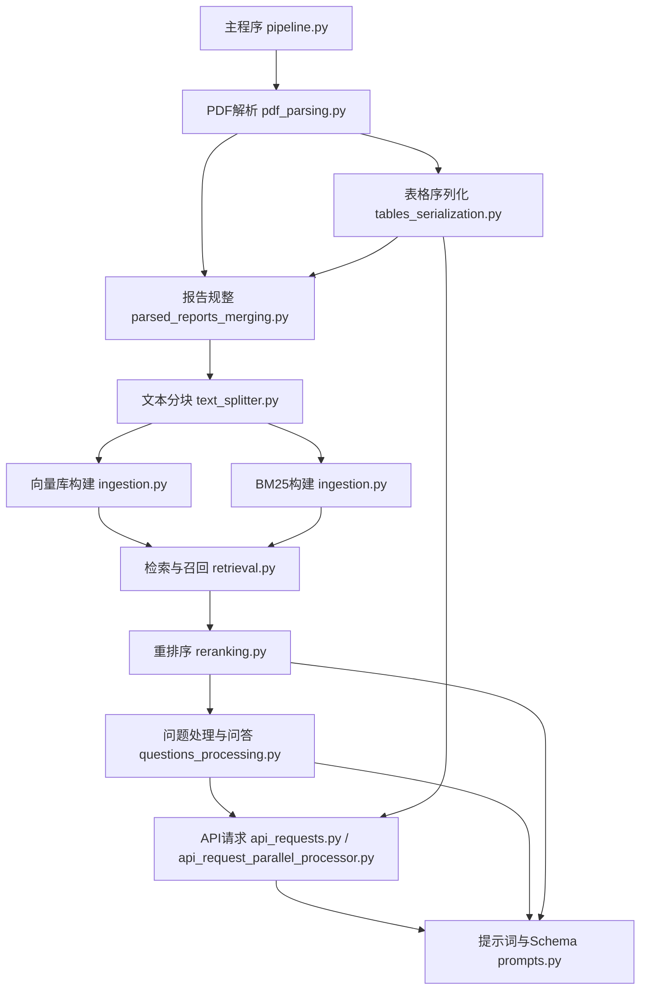

# 项目架构与实现细节说明书

## 目录
- [项目概述](#项目概述)
- [主流程说明](#主流程说明)
- [核心模块与功能](#核心模块与功能)
- [关键类与方法](#关键类与方法)
- [数据流转与目录结构](#数据流转与目录结构)
- [配置与参数说明](#配置与参数说明)
- [运行方式与建议](#运行方式与建议)

---

## 项目概述

本项目为一个基于RAG（Retrieval-Augmented Generation）思想的文档解析与问答系统，支持PDF报告的结构化解析、表格序列化、文本分块、向量数据库构建、检索与问答等完整流程。主流程高度模块化，便于扩展和维护。

---

## 主流程说明

主流程入口为 `src/pipeline.py`，通过 `Pipeline` 类组织各阶段任务。典型流程如下：

1. **PDF报告解析**：将PDF批量解析为结构化JSON。
2. **表格序列化（可选）**：对报告中的表格进行结构化序列化。
3. **报告规整**：将复杂JSON规整为每页结构化文本，便于后续处理。
4. **导出Markdown**：将规整后的报告导出为Markdown文本，便于人工复核。
5. **文本分块**：将规整后的报告分块，便于向量化和检索。
6. **向量数据库构建**：基于分块文本构建向量数据库。
7. **问题处理与问答**：对输入问题进行检索、重排序、调用LLM生成答案。

---

## 核心模块与功能

### 1. PDF解析模块（`pdf_parsing.py`）

**主要功能**：
- 批量解析PDF文件为结构化JSON，提取文本、表格、图片等内容。
- 支持顺序与多进程并行解析。
- 解析结果可直接用于后续表格序列化、规整、分块等流程。

**关键类与方法**：
- `PDFParser`：主解析类。
  - `parse_and_export(input_doc_paths, doc_dir)`：顺序解析PDF，输出JSON。
  - `parse_and_export_parallel(input_doc_paths, doc_dir, optimal_workers, chunk_size)`：多进程并行解析。
  - `process_documents(conv_results)`：处理解析结果，调用`JsonReportProcessor`规整并保存。
- `JsonReportProcessor`：负责将解析结果规整为标准结构，处理元信息、表格、图片等。

**数据流与格式**：
- 输入：PDF文件列表或目录。
- 输出：每个PDF对应一个结构化JSON，包含`content`（每页内容）、`tables`、`pictures`等字段。

**注意事项**：
- 支持OCR（easyocr），首次运行需下载模型。
- 支持表格结构化、页码补齐、元数据补全。
- 并行处理时自动分块分配任务。

### 2. 表格序列化模块（`tables_serialization.py`）

**主要功能**：
- 对解析报告中的表格进行结构化序列化，调用LLM将表格转为结构化信息块。
- 支持同步与异步（并发）序列化，适合大规模表格处理。

**关键类与方法**：
- `TableSerializer`：主处理类，继承自`BaseOpenaiProcessor`。
  - `serialize_tables(json_report)`：同步批量序列化所有表格。
  - `async_serialize_tables(json_report, ...)`：异步批量序列化。
  - `process_directory_parallel(input_dir, max_workers)`：并行处理目录下所有报告。
- 内部方法如`_get_table_context`、`_send_serialization_request`用于提取表格上下文并构造LLM请求。

**数据流与格式**：
- 输入：结构化JSON报告（含`tables`字段，每个表格含HTML内容）。
- 输出：在每个表格对象中新增`serialized`字段，存储LLM结构化结果。

**注意事项**：
- 支持多线程并发，提升处理效率。
- LLM调用需配置API Key，支持OpenAI/gpt-4o-mini等。
- 上下文拼接策略可自定义，提升表格理解能力。

### 3. 报告规整与合并模块（`parsed_reports_merging.py`）

**主要功能**：
- 将复杂的结构化JSON报告规整为每页结构化文本，便于后续分块和人工复核。
- 支持插入序列化表格内容。
- 支持导出为Markdown格式。

**关键类与方法**：
- `PageTextPreparation`：主处理类。
  - `process_reports(reports_dir, output_dir)`：批量规整目录下所有报告。
  - `process_report(report_data)`：规整单份报告，处理每页文本。
  - `prepare_page_text(page_number)`：组装页面文本，合并块、清洗内容。
  - `export_to_markdown(reports_dir, output_dir)`：批量导出为Markdown。

**数据流与格式**：
- 输入：结构化JSON报告（含`content`、`tables`等）。
- 输出：规整后JSON（每页`text`），或Markdown文本。

**注意事项**：
- 支持表格、列表、脚注等连续分组处理。
- 可选插入序列化表格内容，提升下游分块与检索效果。
- 内置多种清洗与格式化规则。

### 4. 文本分块模块（`text_splitter.py`）

**主要功能**：
- 对规整后的报告进行分块，便于向量化和检索。
- 支持按页分块、插入表格块、token统计等。

**关键类与方法**：
- `TextSplitter`：主处理类。
  - `split_all_reports(all_report_dir, output_dir, serialized_tables_dir)`：批量分块处理。
  - `_split_report(file_content, serialized_tables_report_path)`：分块单份报告，插入表格块。
  - `_split_page(page, chunk_size, chunk_overlap)`：单页分块，支持自定义chunk大小与重叠。
  - `count_tokens(string, encoding_name)`：统计token数。

**数据流与格式**：
- 输入：规整后JSON报告（含每页`text`），可选序列化表格。
- 输出：每个报告新增`chunks`字段，存储所有分块内容。

**注意事项**：
- 支持LangChain分块策略，兼容多种模型tokenizer。
- 分块后内容便于后续向量化、检索。

### 5. 向量数据库与BM25模块（`ingestion.py`）

**主要功能**：
- 基于分块文本构建向量数据库（如FAISS）和BM25倒排索引。
- 支持批量处理，自动保存索引文件。

**关键类与方法**：
- `VectorDBIngestor`：向量库构建类。
  - `process_reports(all_reports_dir, output_dir)`：批量处理，生成FAISS索引。
  - `_get_embeddings(text)`：调用DashScope/OpenAI获取文本嵌入。
  - `_create_vector_db(embeddings)`：用faiss构建向量库。
- `BM25Ingestor`：BM25索引构建类。
  - `process_reports(all_reports_dir, output_dir)`：批量处理，生成BM25索引。
  - `create_bm25_index(chunks)`：构建BM25索引。

**数据流与格式**：
- 输入：分块后的JSON报告（含`chunks`）。
- 输出：每个报告对应一个`.faiss`（向量库）或`.pkl`（BM25索引）文件。

**注意事项**：
- 支持API重试、批量嵌入。
- 需配置API Key。
- 输出文件名与报告sha1对应，便于检索。

### 6. 问题处理与问答模块（`questions_processing.py`）

**主要功能**：
- 对输入问题进行检索、重排序、上下文构建，最终调用LLM生成答案。
- 支持多公司比较、引用页码校验、批量并发处理。

**关键类与方法**：
- `QuestionsProcessor`：主处理类。
  - `process_all_questions(output_path, ...)`：批量处理所有问题，生成答案。
  - `get_answer_for_company(company_name, question, schema)`：检索上下文并生成答案。
  - `_format_retrieval_results(retrieval_results)`：格式化RAG上下文。
  - `_validate_page_references(claimed_pages, retrieval_results)`：校验引用页码。
  - 支持多线程并发处理。

**数据流与格式**：
- 输入：问题文件（JSON），向量库/BM25索引，分块报告。
- 输出：每个问题的答案JSON，含引用页码、上下文等。

**注意事项**：
- 支持多种检索与重排序策略（见下文）。
- 支持多公司问题自动拆分。
- 支持断点续跑与进度保存。

### 7. 召回与重排序模块（`retrieval.py`, `reranking.py`）

**主要功能**：
- 支持向量检索、BM25检索、混合检索、LLM重排序等多种召回方式。
- 支持Jina API与大模型重排序。

**关键类与方法**：
- `VectorRetriever`：向量检索器。
  - `retrieve_by_company_name(company_name, query, ...)`：按公司名检索文本块。
  - `retrieve_all(company_name)`：检索公司所有文本块。
- `BM25Retriever`：BM25检索器。
  - `retrieve_by_company_name(company_name, query, ...)`：按公司名检索。
- `HybridRetriever`：混合检索器，融合多种召回方式。
- `LLMReranker`：大模型重排序器。
  - `rerank_documents(query, documents, ...)`：批量重排，融合向量分数与LLM分数。
- `JinaReranker`：Jina API重排器。

**数据流与格式**：
- 输入：检索请求（公司名、问题、top_n等），向量库/BM25索引。
- 输出：召回的文本块列表，含分数、页码、文本等。

**注意事项**：
- 支持多种embedding provider（OpenAI/DashScope）。
- LLM重排序可自定义权重，支持多线程。
- 检索结果可直接用于RAG上下文拼接。

### 8. API请求并发处理模块（`api_request_parallel_processor.py`, `api_requests.py`）

**主要功能**：
- 支持对外API（如LLM、embedding等）的并发请求、限流、重试。
- 封装OpenAI、DashScope等多种API调用方式。

**关键类与方法**：
- `BaseOpenaiProcessor`/`AsyncOpenaiProcessor`/`APIProcessor`：统一API调用接口。
  - `send_message(...)`、`process_structured_ouputs_requests(...)`：同步/异步请求。
  - 支持结构化输出、token统计、异常处理。
- 支持多线程/多进程并发，自动限流。

**数据流与格式**：
- 输入：API请求参数（prompt、模型名、上下文等）。
- 输出：API响应结果（结构化/非结构化）。

**注意事项**：
- 支持多种API Key配置。
- 支持断点续跑、日志记录。
- 适配多种大模型API。

### 9. 提示词与Schema定义模块（`prompts.py`）

**主要功能**：
- 统一管理和生成大模型调用所需的系统提示词（system prompt）、用户提示词（user prompt）及Pydantic结构化Schema。
- 提供多种问答、重写、重排序等场景下的标准化Prompt模板和数据结构定义，确保LLM输出的可控性和一致性。

**关键类与方法**：
- `build_system_prompt`：根据指令、示例、Schema自动拼接完整的system prompt。
- 各类Prompt类（如`RephrasedQuestionsPrompt`、`AnswerWithRAGContextNamePrompt`、`AnswerWithRAGContextNumberPrompt`等）：
  - 内含详细的指令（instruction）、示例（example）、Pydantic Schema（pydantic_schema）、用户提示词（user_prompt）和最终拼接的system prompt。
  - 每个Prompt类都定义了对应的结构化输出Schema，便于后续解析和校验LLM输出。
- `RerankingPrompt`、`RetrievalRankingSingleBlock`、`RetrievalRankingMultipleBlocks`：用于检索重排序场景的评分与结构化输出。

**在项目中的作用**：
- 作为所有LLM调用的"提示词中心"，为表格序列化、RAG问答、问题重写、检索重排序等模块提供标准化的Prompt和Schema。
- 保证不同模块调用LLM时的输出格式统一、易于解析，极大提升了系统的健壮性和可维护性。
- 通过Pydantic Schema约束，便于自动化校验和后处理。

**与其他模块的调用关系**：
- `tables_serialization.py`：调用表格序列化相关Prompt和Schema，生成结构化表格信息块。
- `questions_processing.py`：调用RAG问答相关Prompt和Schema，生成结构化答案。
- `reranking.py`：调用重排序相关Prompt和Schema，获得相关性评分。
- `api_requests.py`等API调用模块：统一引用Prompt和Schema，确保请求内容和返回结构标准化。

**数据流与格式**：
- 输入：指令、示例、Schema定义、用户问题/上下文等。
- 输出：拼接好的system prompt、user prompt，以及Pydantic结构化Schema。
- LLM输出经Schema校验后，作为下游模块的标准输入。

**注意事项**：
- 所有Prompt和Schema均可灵活扩展，便于适配新场景。
- 示例和Schema紧密结合，便于LLM理解和输出。
- 结构化输出极大降低了后处理难度。

---

## 关键类与方法

### Pipeline（`pipeline.py`）
- 项目主流程调度类，负责各阶段任务的串联。
- 主要方法：
  - `parse_pdf_reports_sequential/parallel`

---

## 目录结构及其说明

```
RAG-Challenge-2-main/
├── main.py                  # 入口脚本（可选，通常以src/pipeline.py为主）
├── requirements.txt         # 依赖包列表
├── README.md                # 项目说明
├── setup.py                 # 安装脚本
├── 运行情况.txt             # 运行日志或说明
├── docs/
│   └── project_architecture.md  # 项目架构与实现细节说明书（本文件）
├── data/
│   ├── erc2_set/            # 训练/开发集
│   └── test_set/            # 测试集
│       ├── pdf_reports/     # PDF原始报告
│       ├── questions.json   # 问题文件
│       ├── subset.csv       # 公司元数据
│       └── ...
├── src/
│   ├── __init__.py
│   ├── pipeline.py              # 主流程调度与配置
│   ├── pdf_parsing.py           # PDF解析
│   ├── tables_serialization.py  # 表格序列化
│   ├── parsed_reports_merging.py# 报告规整与合并
│   ├── text_splitter.py         # 文本分块
│   ├── ingestion.py             # 向量库/BM25构建
│   ├── questions_processing.py  # 问题处理与问答
│   ├── retrieval.py             # 检索与召回
│   ├── reranking.py             # 重排序
│   ├── api_requests.py          # LLM/API请求封装
│   ├── api_request_parallel_processor.py # 并发API请求
│   ├── prompts.py               # 提示词与Schema定义
│   └── ...
└── ...
```

**说明：**
- `src/` 目录为核心代码，所有主流程与功能模块均在此目录下。
- `data/` 目录为数据集，包含原始PDF、问题、元数据等。
- `docs/` 目录为文档说明。
- 其他为依赖、配置、入口脚本等。

---

## 主程序与各模块调用关系

### 总体调用链路



### 详细说明
- **pipeline.py**：主流程调度，串联各阶段任务。
    - 调用`PDFParser`（pdf_parsing.py）进行PDF解析。
    - 可选调用`TableSerializer`（tables_serialization.py）对表格序列化。
    - 调用`PageTextPreparation`（parsed_reports_merging.py）规整报告。
    - 调用`TextSplitter`（text_splitter.py）分块。
    - 调用`VectorDBIngestor`/`BM25Ingestor`（ingestion.py）构建索引。
    - 调用`QuestionsProcessor`（questions_processing.py）处理问题。
- **questions_processing.py**：
    - 调用`retrieval.py`进行向量/BM25/混合检索。
    - 调用`reranking.py`进行LLM重排序。
    - 调用`api_requests.py`统一封装LLM调用。
    - 调用`prompts.py`获取标准化Prompt和Schema。
- **tables_serialization.py**：
    - 调用`api_requests.py`与LLM交互，使用`prompts.py`定义的表格序列化Prompt和Schema。
- **reranking.py**：
    - 调用`prompts.py`定义的重排序Prompt和Schema。
    - 调用`api_requests.py`与LLM交互。
- **retrieval.py**：
    - 直接操作向量库/BM25索引。
    - 可调用`reranking.py`进行召回结果重排序。
- **api_requests.py / api_request_parallel_processor.py**：
    - 统一封装所有LLM/API请求，引用`prompts.py`的Prompt和Schema。
- **prompts.py**：
    - 仅被其他模块调用，不主动调用其他模块。

---

**调用链路总结**：
- 主流程以`pipeline.py`为核心，逐步调用各功能模块。
- 数据流自PDF解析、表格序列化、规整、分块、索引、检索、重排序、问答，层层递进。
- LLM相关调用均通过`api_requests.py`统一封装，所有Prompt和Schema均由`prompts.py`集中管理。

# 四个文件（`questions-1.json`、`questions.json`、`subset.csv`，：

---

## 1. `questions.json`

### 产生方式
- 这个文件一般是**手动编写**或由数据整理脚本生成的，内容为一组针对某一主题（如“中芯国际”）的问答题目。
- 每个问题包含 `text`（问题内容）和 `kind`（问题类型，如 string/boolean/number/name）。

### 作用
- 作为**主流程的输入问题集**，用于RAG（检索增强生成）流程的问答推理。
- 在 `pipeline.py` 的 `process_questions` 方法中会被读取，作为待解答的问题列表，驱动后续的检索与生成。

---

## 2. `questions-1.json`

### 产生方式
- 这个文件和 `questions.json` 类似，通常是**不同版本或实验用的问答集**，可能是针对不同实验、不同评测标准或不同问题类型的变体。
- 也可能是手动编辑或脚本生成。

### 作用
- 用于**对比实验**或**多轮评测**，比如测试不同问题类型（如 boolean/number/name）对模型表现的影响。
- 你可以在 pipeline 配置中切换不同的问题文件，观察结果差异。

---

## 3. `subset.csv`

### 产生方式
- 这个文件一般由**原始数据集（如 subset.json）自动转换**而来，或者由数据整理脚本生成。
- 在 pipeline 初始化时，如果发现有 `subset.json` 但没有 `subset.csv`，会自动进行转换（见 pipeline.py 的 `_convert_json_to_csv_if_needed` 方法）。

### 作用
- 作为**PDF报告的元数据索引**，通常包含每个报告的唯一标识（如 sha1）、文件名、公司名等信息。
- 在 PDF 解析、分块、向量化等流程中，用于**补充元数据**，如将 company_name 字段补充到 markdown 分块结果中，便于后续检索和分析。

---

## 4. 关系与流程说明

- `questions.json`/`questions-1.json`：**输入问题**，驱动RAG问答流程。
- `subset.csv`：**报告元数据索引**，为每个PDF/markdown分块补充公司名等信息。
- 这两个类型的文件都是**主流程的关键输入**，缺一不可。

---

## 典型流程举例

1. **准备数据**：人工或脚本生成 `questions.json`、`subset.csv`。
2. **解析PDF**：用 subset.csv 作为元数据索引，解析 PDF 并补充公司名等信息。
3. **RAG问答**：用 questions.json 作为输入，检索并生成答案，输出到 answers.json。

---

## 总结

- `questions.json`/`questions-1.json`：**问答任务的输入问题集**，决定了模型要回答哪些问题。
- `subset.csv`：**PDF报告的元数据表**，为检索和分块等流程提供基础信息。
- 这些文件都是**项目主流程的输入文件**，由人工或脚本生成，贯穿数据处理和问答全流程。

如需详细了解某个文件的生成脚本或具体用法，可进一步指定！


