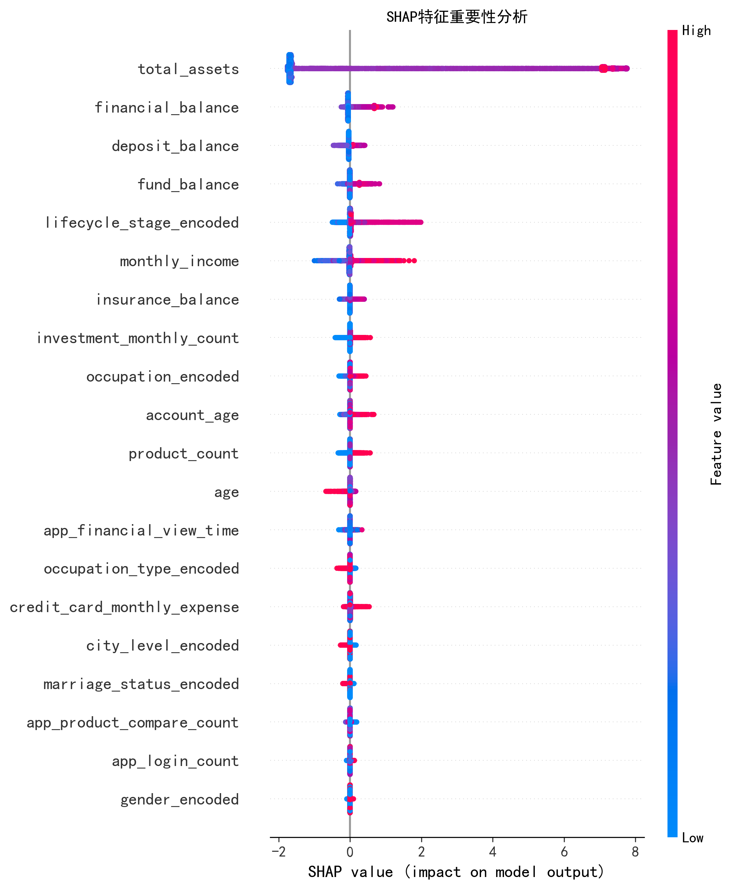
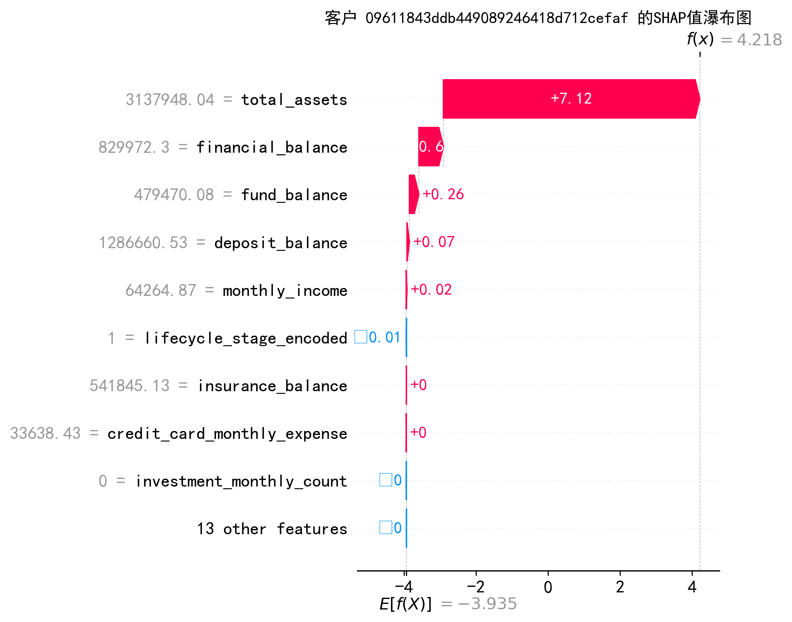
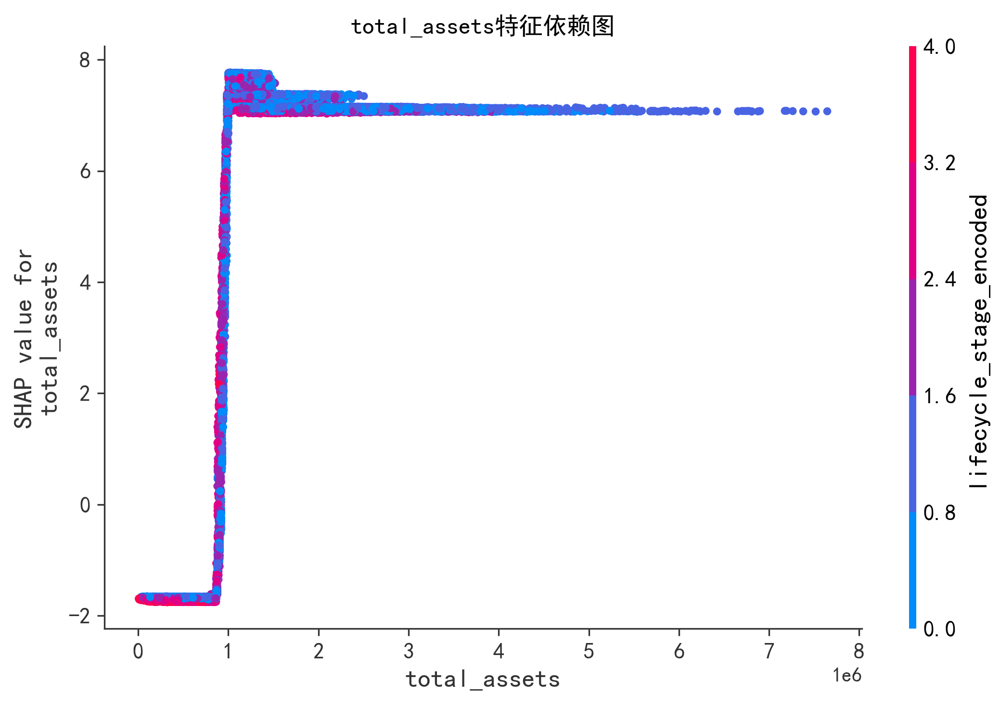

# SHAP分析结果解读说明

## 1. SHAP全局特征重要性图

这张图展示了所有特征对模型预测结果的整体影响程度:
- 横轴表示SHAP值的大小(特征对预测的影响程度)
- 纵轴是所有特征名称
- 每个点代表一个样本,颜色从蓝(低值)到红(高值)表示该特征的取值
- 点的分布越分散,说明该特征的SHAP值变化越大

从图中可以看出:
1. `total_assets`(总资产)是最重要的特征,SHAP值分布最广
2. `financial_balance`(金融余额)和`deposit_balance`(存款余额)次之
3. 最下方的特征如`gender_encoded`(性别)等影响较小

## 2. SHAP局部瀑布图解读

这是针对特定客户的具体预测解释:

- 图中显示 f(x) = 4.218,这是模型对该客户的预测输出
- E[f(X)] = -3.935 是所有样本的平均预测值
- 每个特征旁边的数值是该特征的实际取值
- 红色条表示正向影响(增加预测值),蓝色条表示负向影响(降低预测值)
- 条的长度表示影响大小

对这位客户来说:
1. 总资产(total_assets = 3137948.04)贡献了+7.12的正向影响,是最主要的影响因素
2. 金融余额(financial_balance = 829972.3)贡献了+0.6的正向影响
3. 基金余额(fund_balance = 479470.08)贡献了+0.26的正向影响
4. 其他特征影响相对较小

## 3. SHAP依赖图解读

这种图展示了特征值与其SHAP值之间的关系:
- 横轴是特征的实际值
- 纵轴是该特征的SHAP值
- 每个点代表一个样本
- 颜色表示另一个特征的值(与该特征有交互作用)

从total_assets的依赖图可以看出:
1. 总体呈现正相关趋势:总资产越高,SHAP值越大(对预测结果的正向影响越大)
2. 在总资产较低区域(0-2M),SHAP值变化较大
3. 在总资产较高区域(>4M),SHAP值趋于稳定

## 总结解读要点

### 1. 全局重要性图
- 用于查看特征的整体重要程度排序
- 帮助识别最具影响力的特征
- 展示特征值分布对预测的影响

### 2. 局部瀑布图
- 理解模型对单个客户预测的具体原因
- 量化每个特征的贡献度
- 区分正向和负向影响

### 3. 依赖图
- 了解特征值变化如何影响预测结果
- 发现特征间的非线性关系
- 识别特征交互作用

这些图表共同帮助我们:
- 识别关键影响因素
- 理解模型的决策逻辑
- 发现特征间的交互关系
- 解释单个预测结果的原因

## 补充说明

1. SHAP值的含义:
   - 正值表示该特征增加预测概率
   - 负值表示该特征降低预测概率
   - 绝对值大小表示影响程度

2. 实际应用建议:
   - 先看全局重要性,了解整体特征影响
   - 再看依赖图,理解重要特征的作用机制
   - 最后看瀑布图,解释具体案例 